# Lab 32: Generate images with AI

### Estimated Duration : 30 Minutes

## Lab Overview

In this lab, you’ll build an end-to-end solution using **Microsoft Foundry** to generate images with AI. You’ll start by creating a Foundry project, deploying an image generation model, and testing it in the playground using different prompts to understand how image generation works.

You’ll then set up your development environment in **Visual Studio Code**, clone a sample repository, and configure it using environment variables. Using Python and the **OpenAI SDK**, you’ll implement a client application that generates images based on user prompts, decodes the output, and saves it locally. Finally, you’ll authenticate with Azure, run the application, and verify the generated images in your project directory.

## Lab Objectives

In this lab, you'll perform the following tasks:

* Task 1: Create a Microsoft Foundry project
* Task 2: Deploy a model
* Task 3: Test the model in the playground
* Task 4: Create a client application

## Task 1: Create a Microsoft Foundry project

In this task, you'll sign in to the Microsoft Foundry portal and create a new project with the required Azure resources.

1. Open a new tab in the browser, right-click on the following link [Foundry portal](https://ai.azure.com), then **Copy link** and paste it in a browser tab to log in to **Microsoft Foundry portal**.

1. Click on **Sign in**.

    

1. If prompted, provide the credentials below:

   - **Email/Username:** <inject key="AzureAdUserEmail"></inject>

   - **Password:** <inject key="AzureAdUserPassword"></inject>

      >**Note:** Close any tips or quick start panes that are opened the first time you sign in, and if necessary, use the **Foundry** logo at the top left to navigate to the home page.

1. At the top of the **Microsoft Foundry** portal, enable the **New Foundry toggle (1)** to switch to the latest Foundry user interface.   

1. From the **Select a project to continue** dialog, click the drop-down under **Select or search for a project**, and then select **Create a new project (2)**.

     

1. In the **Create a project** window, enter **Myproject<inject key="DeploymentID" enableCopy="false"/> (1)** as the project name. Open the **Advanced options (2)** drop-down, fill in the following details, and then click **Create (6)**:

    * Subscription: **Choose Default Subscription (3)**
    * Resource group: **AI-102-RG31 (4)**
    * Microsoft Foundry resource: **Keep as Default**
    * Region: **<inject key="Region"></inject> (5)**

      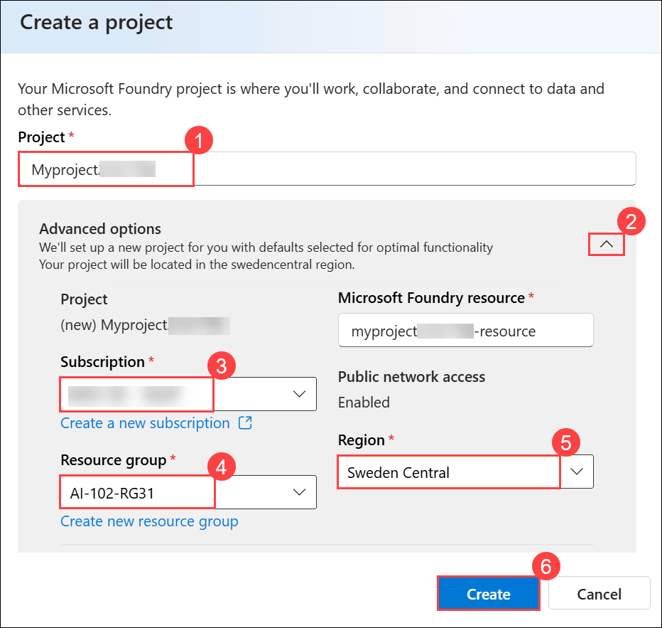 

1. Wait for your project to be created. It may take around 1-2 minutes.

1. If you see the **“Welcome to the new Microsoft Foundry”** window, you can either explore the information using **Next**, or close it by selecting the **X** in the top-right corner to continue.

    

1. On the home page for your project, note the project endpoint, key, and OpenAI endpoint.

    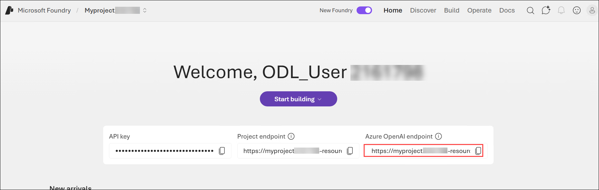

    > **Note:** <span style="color:red"> You're going to need the Azure OpenAI endpoint later!

> **Congratulations** on completing the task! Now, it's time to validate it. Here are the steps:
>
> - Hit the Validate button for the corresponding task. If you receive a success message, you can proceed to the next task.
> - If not, carefully read the error message and retry the step, following the instructions in the lab guide.
> - If you need any assistance, please contact us at cloudlabs-support@spektrasystems.com. We are available 24/7 to help.
 
<validation step="45811d69-91ca-4c7d-8c01-61977ae4422f" />

## Task 2: Deploy a model

In this task, you'll explore the model catalog, select an image generation model, and deploy it using default settings.

1. Now you're ready to **Start building (1)**. Select **Find models (2)** (or on the **Discover** page, select the **Models** tab) to view the Microsoft Foundry model catalog.

    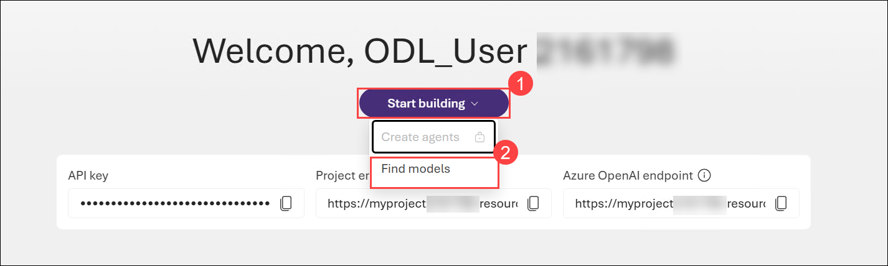

1. Search for **(1)** and select the `FLUX.1-Kontext-pro` **(2)** model.

    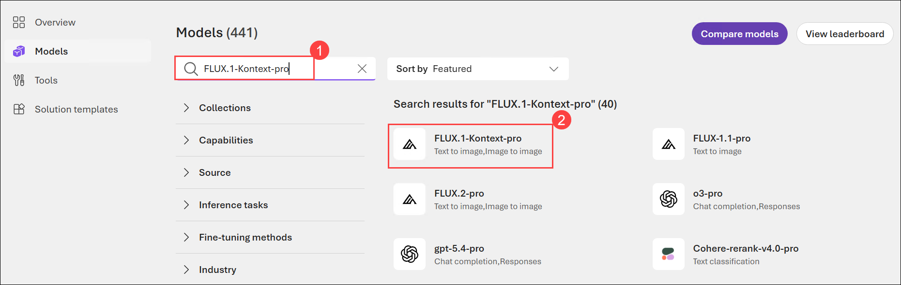

1. Click **Deploy (1)**, select **Default settings (2)**, and proceed with the deployment. This may take a minute or so to complete.

    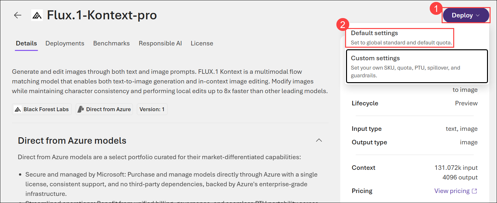

1. After the model is deployed, the playground for the model is displayed.

    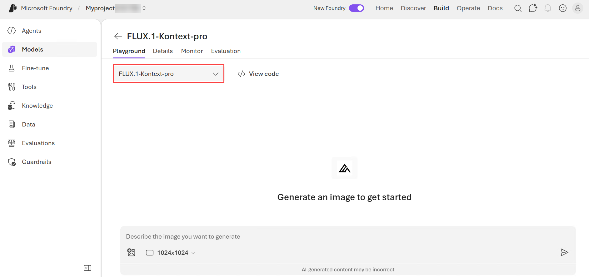

    > **Note:** <span style="color:red"> Note the model deployment name (which by default should be *FLUX.1-Kontext-pro*) - you'll need this later!

> **Congratulations** on completing the task! Now, it's time to validate it. Here are the steps:
>
> - Hit the Validate button for the corresponding task. If you receive a success message, you can proceed to the next task.
> - If not, carefully read the error message and retry the step, following the instructions in the lab guide.
> - If you need any assistance, please contact us at cloudlabs-support@spektrasystems.com. We are available 24/7 to help.
 
<validation step="8cce1325-a58f-4750-a788-c13679f57fff" />

## Task 3: Test the model in the playground

In this task, you'll use the playground to generate images from prompts and experiment with different inputs to observe the model’s behavior.

1. In the playground, ensure your **FLUX.1-Kontext-pro (1)** deployment is selected. Then, click on the size dropdown **(2)** near the prompt box, choose **1024×1024 (3)** (the smallest available size).

    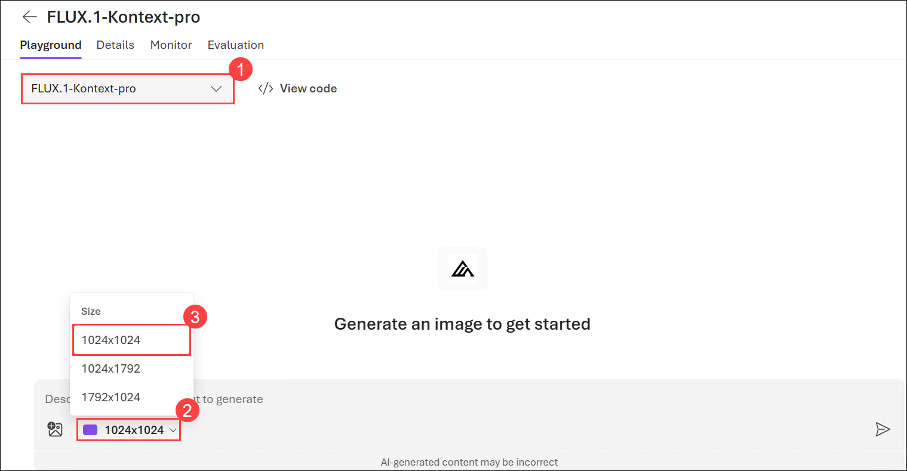

1. Enter a prompt such as `A robot eating spaghetti` **1**, then click the generate (send) button **(2)** to create the image.

    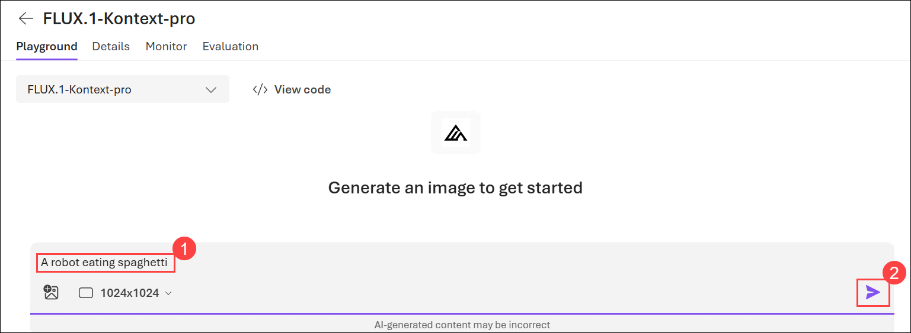

1. Review the resulting image in the playground:

    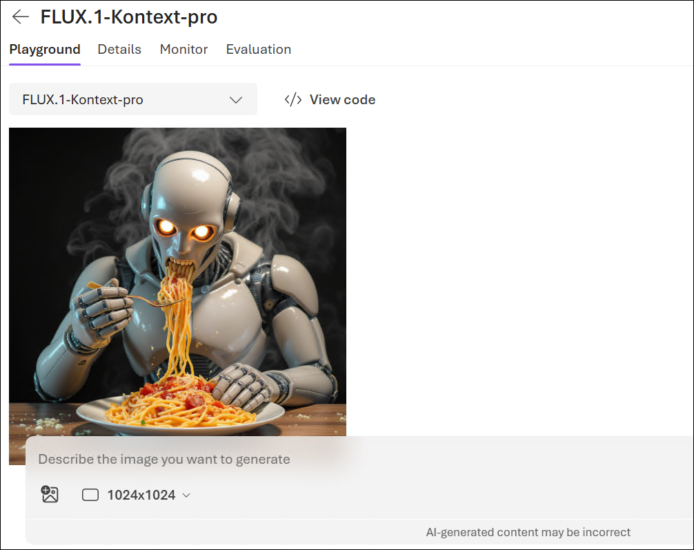

1. Enter a follow-up prompt, such as `Show the robot in a restaurant` and review the resulting image.

    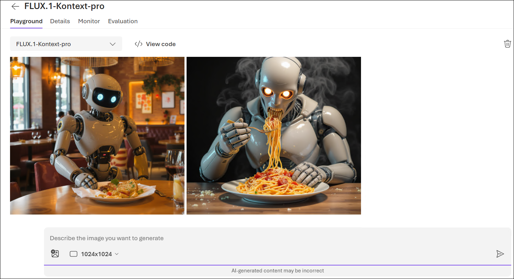

1. Continue testing with new prompts to refine the image until you are happy with it.

## Task 4: Create a client application

In this task, you'll set up a development environment, configure the application, and use the OpenAI Python SDK to generate and save images based on user prompts.

### Get application files from GitHub

The initial application files you'll need to develop the translation application are provided in a GitHub repo.

1. On the desktop, locate **Visual Studio Code**, and then double-click the icon to open it.

    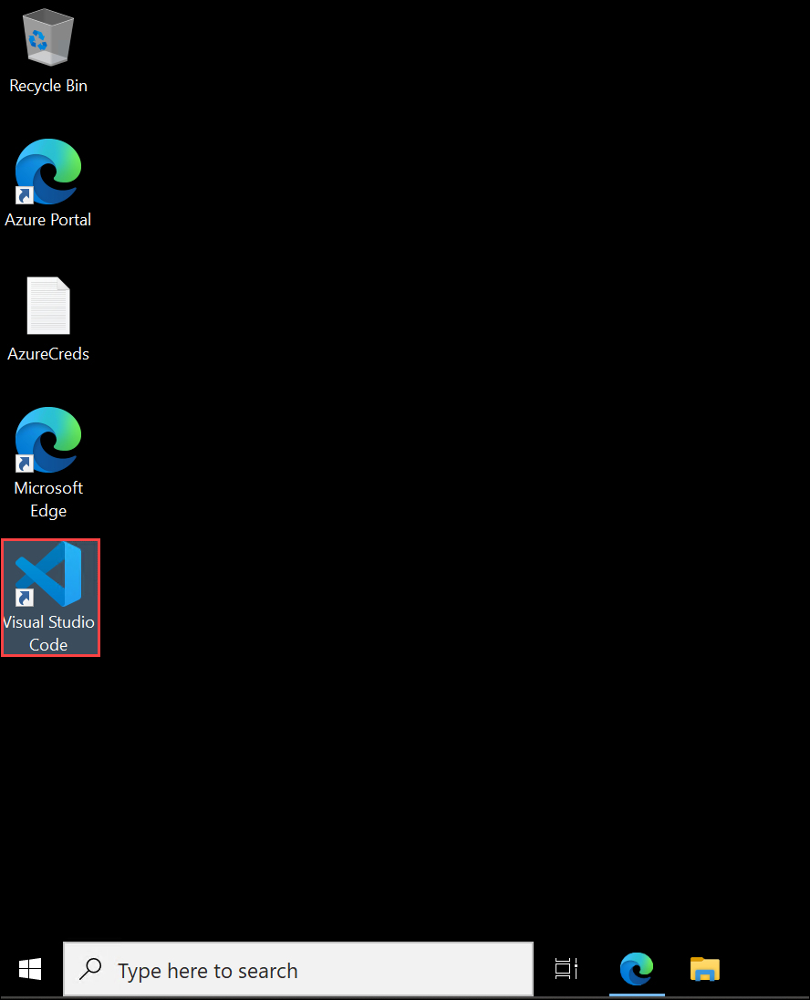

1. Open the Command Palette by pressing **Ctrl+Shift+P** , type **`Git: Clone`** **(1)**, and then select **Git: Clone** (2) from the list.

    

1. In the Command Palette, enter the repository URL `https://github.com/microsoftlearning/mslearn-ai-vision` **(1)**, and then select **Clone from URL** **(2)** to clone the repository to a local folder.

    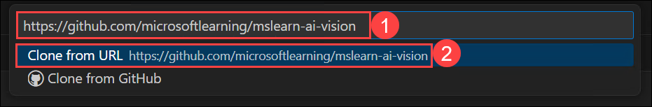
 
1. In the folder selection window, choose the **Downloads** folder **(1)**, and then select **Select as Repository Destination** **(2)**.

    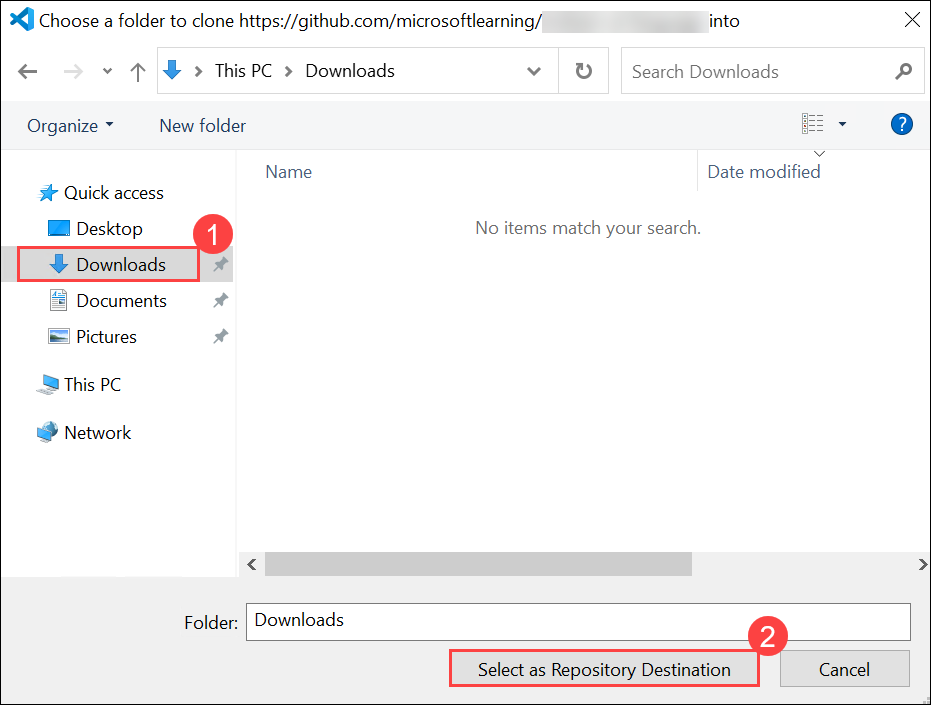

1. When prompted, select **Open** to open the cloned repository in Visual Studio Code.

    

1. When prompted, select **Yes, I trust the authors** to trust the folder and enable all features.

    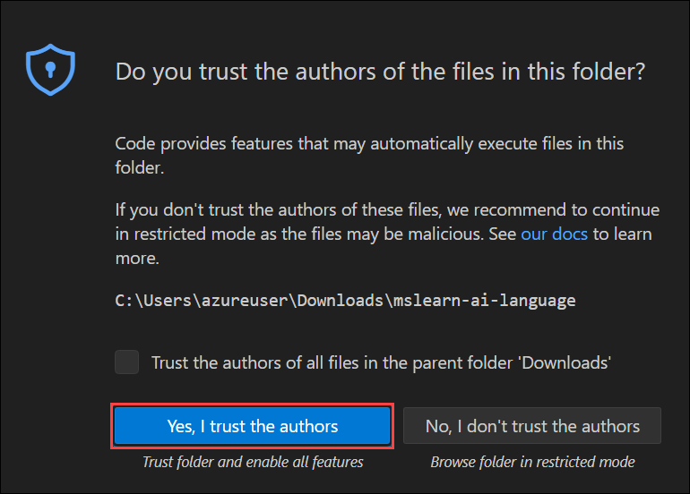

1. In Visual Studio Code, open the **Extensions** pane **(1)**, search for **Python** **(2)**, select the **Python** extension by Microsoft **(3)**, and then click **Install** **(4)** if it is not already installed.

    

### Prepare the application configuration

1. After cloning the repository, in the **Explorer** pane expand the **Labfiles** folder **(1)**, navigate to **image-client > python (2)**.

    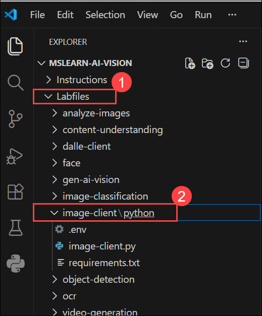

1. In the VS Code Explorer pane, review the files in the folder:

    * `.env` - A configuration file for application settings.
    * `image-client.py` - The Python code file for the image application.
    * `requirements.txt` - A file listing the package dependencies.

        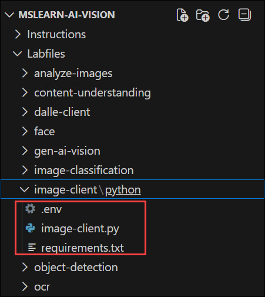

1. In the **Explorer** pane, right-click the **requirements.txt** file **(1)**, and then select **Open in Integrated Terminal** **(2)**.

    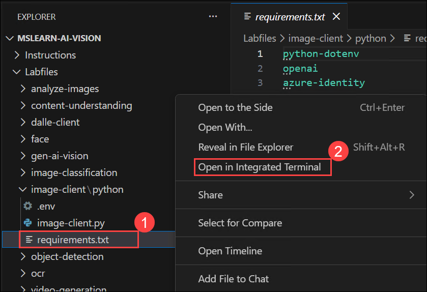

1. In the terminal, enter the following command to install the required Python packages in a virtual environment:

    ```
    python -m venv labenv
    .\labenv\Scripts\Activate.ps1
    pip install -r requirements.txt
    ```
    >**Note:** This will create a virtual environment and install the SDK package and other required packages.

1. Ensure the terminal is open in the **Labfiles/image-client/python** folder, and verify that the prompt shows **(.labenv)**, indicating that the Python virtual environment is active.

    

1. In the **Explorer** pane, in the **python** folder, select the **.env** file to open it. 

    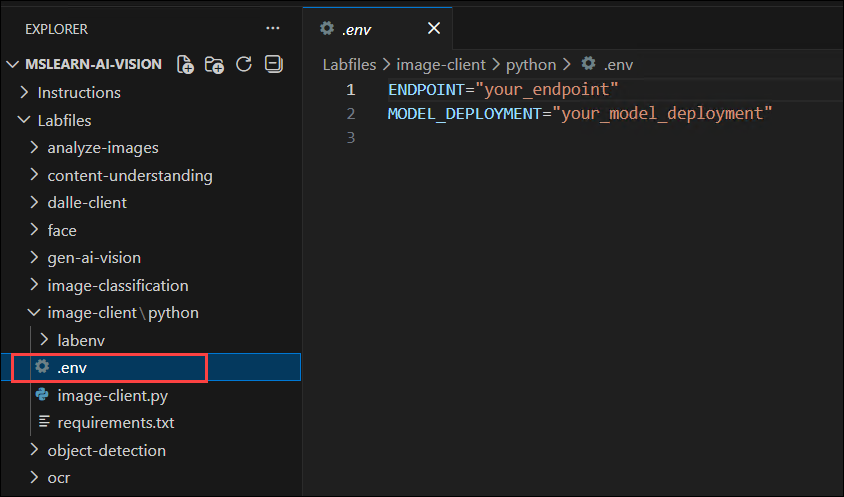

1. Open the **.env** file and update the configuration values by setting the **ENDPOINT** with your Azure OpenAI Foundry resource endpoint **(1)**, and the **MODEL_DEPLOYMENT** with your image-generation model deployment name (for example, *Flux.1-Kontext-pro*) **(2)**.

    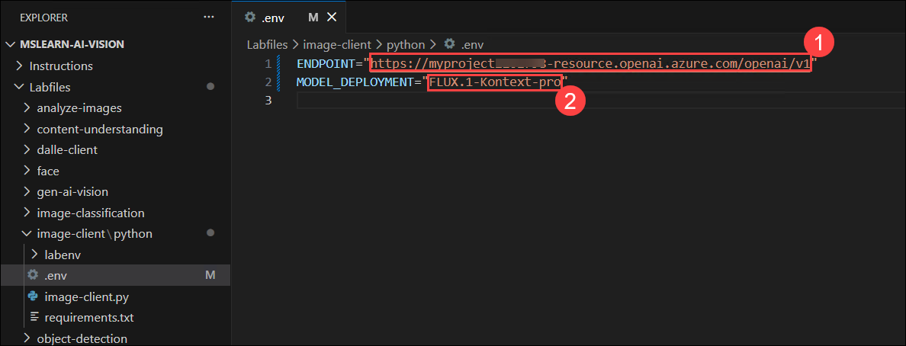

    > **Note:** Be sure to add the `https://{foundry-resource-name}.openai.azure.com/openai/v1/` Azure openAI endpoint, <u>not</u> the project endpoint!

1. Save the modified configuration file by pressing **Ctrl+S**.

### Write code to connect to your project and chat with your model

> **Tip**: As you add code, be sure to maintain the correct indentation.

1. In VS Code, open the `image-client.py` file.

    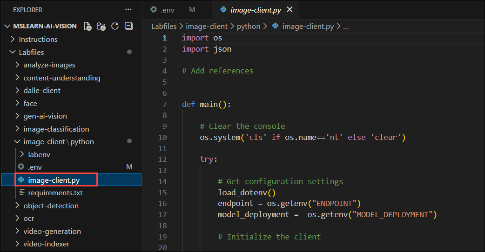

1. In the code file, note the existing statements that have been added at the top of the file to import the necessary SDK namespaces. Then, under the comment **Add references**, add the following code to reference the namespaces in the libraries you installed previously:

    ```python
   # Add references
   from dotenv import load_dotenv
   from azure.identity import DefaultAzureCredential, get_bearer_token_provider
   from openai import OpenAI
   import requests
   import base64
    ```

    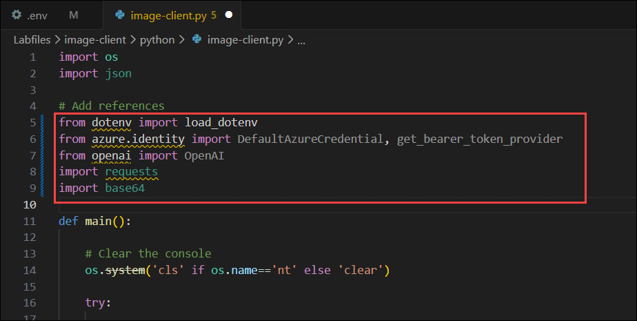

1. In the **main** function, under the comment **Get configuration settings**, note that the code loads the endpoint and model deployment name values you defined in the configuration file.

1. Under the comment **Initialize the client**, add the following code to connect to your model using the Azure credentials you are currently signed in with:

    ```python
   # Initialize the client
   token_provider = get_bearer_token_provider(
       DefaultAzureCredential(exclude_environment_credential=True,
           exclude_managed_identity_credential=True), 
       "https://cognitiveservices.azure.com/.default"
   )
    
   client = OpenAI(
        base_url=endpoint,
        api_key=token_provider(),
    )
    ```

    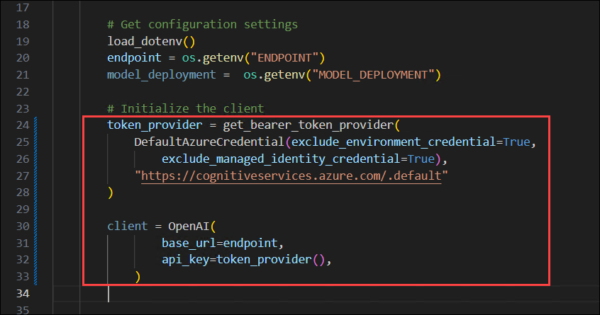

1. Note that the code includes a loop to allow a user to input a prompt until they enter "quit". Then in the loop section, under the comment **Generate an image**, add the following code to submit the prompt and retrieve the data for the generated image from your model:

    **Python**

    ```python
   # Generate an image
   img = client.images.generate(
        model=model_deployment,
        prompt=input_text,
        n=1
    )

   json_response = json.loads(img.model_dump_json())
   image_data = json_response["data"][0].get("b64_json")
   image_data_in_bytes = base64.b64decode(image_data)
    ```

    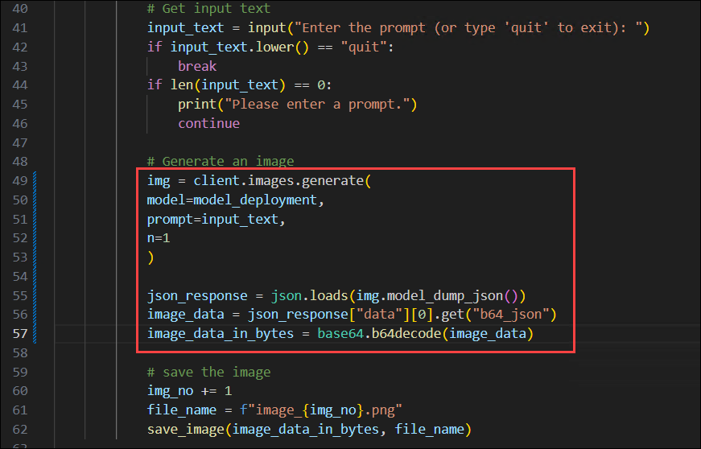

    > **Note:** The FLUX model returns the generated image as base64-encoded data in `b64_json`.

1. Note that the code in the remainder of the **main** function passes the image data and a filename to a provided function, which decodes and saves the generated image as a .png file.

1. Save your changes to the code file by using **Ctrl+S**.

### Run the client application

1. In the Visual Studio Code terminal, enter the following command to sign into Azure

     ```powershell
     az login
     ```

     > **Note:** Minimize the VS Code to see the **Sign in** window.

1. In the **Sign in** window, select **Work or school account** **(1)**, and then select **Continue** **(2)**.

    

1. On the **Sign in** page, provide the credentials below:
 
    - **Email/Username:** <inject key="AzureAdUserEmail"></inject>
    
      

    - **Password:** <inject key="AzureAdUserPassword"></inject>
    
      

1. When prompted, select **Yes** to sign in to all apps and websites on this device.

    

1. On the **Account added to this device** window, select **Done** to complete the sign-in process.

    

1. In the Visual Studio Code terminal, press **Enter** to select the default subscription.

    

1. After you have signed in, enter the following command to run the application:

    ```
   python image-client.py
    ```

1. When prompted, enter a request for an image, such as `Create an image of a robot eating pizza`.

    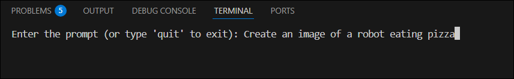

1. After a moment, the terminal confirms that the image has been saved **(1)**, and you can verify it in the **images** folder **(2)** within your project directory as `image_1.png`.

    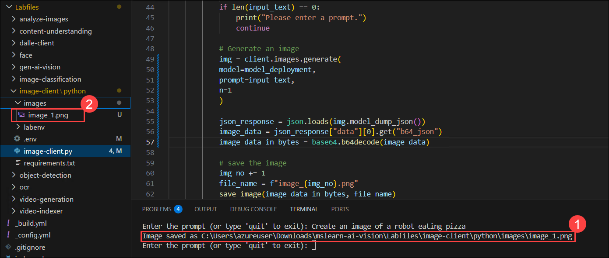

1. Review the generated image in the `images` folder.

    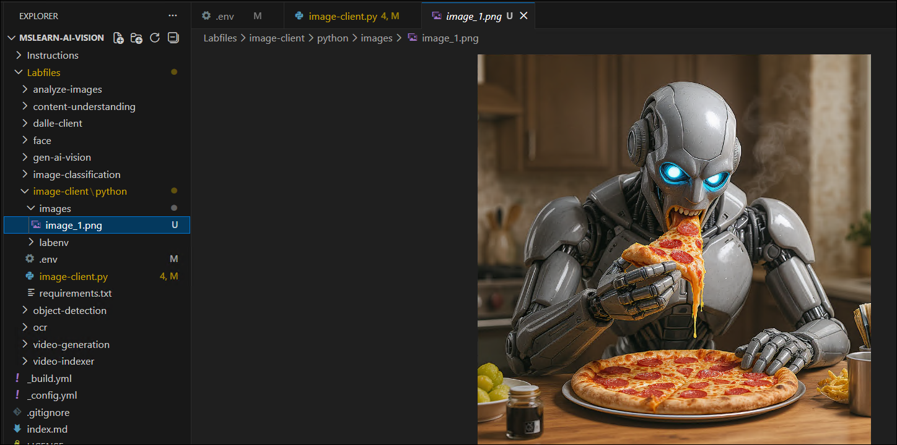

1. Try a few more prompts. When you're finished, enter `quit` to exit the program.

    > **Note**: In this simple app, we haven't implemented logic to retain conversation history; so the model will treat each prompt as a new request with no context of the previous prompt.

## Summary

In this exercise, you generated images using Microsoft Foundry by deploying and testing an image generation model in the portal. You explored the playground to create images from prompts, built a Python-based client application using the OpenAI SDK, and configured it with your Azure resources. You then authenticated with Azure, ran the application, and generated images that were saved locally. Great work!

### You have successfully completed the Hands-on Lab!