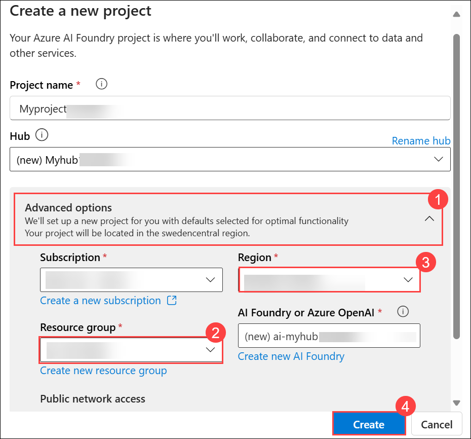

# Lab 32: Extract information from multimodal content

In this lab, you use Azure Content Understanding to extract information from a variety of content types; including an invoice, an images of a slide containing charts, an audio recording of a voice messages, and a video recording of a conference call.

### Task 1: Create an Azure AI Foundry hub and project

1. Open a new tab in the browser, right-click on the following link [Azure AI Foundry portal](https://ai.azure.com), then **Copy link** and paste it in a browser tab to log in to **Azure AI Foundry portal**.

1. Click on **Sign in**.

    

1. If prompted, provide the credentials below:

   - **Email/Username:** <inject key="AzureAdUserEmail"></inject>

   - **Password:** <inject key="AzureAdUserPassword"></inject>

1. In the LabVM browser tab, copy and paste the following link  https://ai.azure.com/managementCenter/allResources and select **Create new**.  

    

1. In the Create a project wizard, select **AI hub resource**.

   

1. Enter the project name as **Myproject<inject key="DeploymentID" enableCopy="false"/> (1)**, then select **Rename hub (2)**. Then rename the hub as  **Myhub<inject key="DeploymentID" enableCopy="false"/> (3)** and then **Next (4)**.

   

1. Expand **Advanced options (1)**, and specify the following settings for your project and leave the rest as their defaults:

    - Resuorce group: Select **AI-102-RG32 (2)**
    - Region: Select **<inject key="Region" enableCopy="false" /> (3)**
    - Select **Create (4)**

          

1. Wait for your project to be created. It may take around 3-5 minutes.

### Task 2: Download content

The content you're going to analyze is in a .zip archive. Download it and extract it in a local folder.

1. In a new browser tab, copy and paste the [content.zip](https://github.com/microsoftlearning/mslearn-ai-information-extraction/raw/main/Labfiles/content/content.zip) from `https://github.com/microsoftlearning/mslearn-ai-information-extraction/raw/main/Labfiles/content/content.zip`.

1. Click on the **folder** icon.

    

1. Right click on **Content** folder **(1)** and then select **Extract All (2)** to extract the downloaded *content.zip* file.

      

1. Enter `C:\LabFiles` **(1)** as destination folder and then select **Extract (2)**.

      

1. View the files it contains. You'll use these files to build various Content Understanding analyzers in this lab.

