# Lab 32: Extract information from multimodal content

In this lab, you use Azure Content Understanding to extract information from a variety of content types; including an invoice, an images of a slide containing charts, an audio recording of a voice messages, and a video recording of a conference call.

### Task 1: Create an Azure AI Foundry hub and project

1. Open a new tab in the browser, right-click on the following link [Azure AI Foundry portal](https://ai.azure.com), then **Copy link** and paste it in a browser tab to log in to **Azure AI Foundry portal**.

1. Click on **Sign in**.

    

1. If prompted, provide the credentials below:

   - **Email/Username:** <inject key="AzureAdUserEmail"></inject>

   - **Password:** <inject key="AzureAdUserPassword"></inject>

1. In the LabVM browser tab, copy and paste the following link  https://ai.azure.com/managementCenter/allResources and select **Create new**.  

    

1. In the Create a project wizard, select **AI hub resource**.

   

1. Enter the project name as **Myproject<inject key="DeploymentID" enableCopy="false"/> (1)**, then select **Rename hub (2)**. Then rename the hub as  **Myhub<inject key="DeploymentID" enableCopy="false"/> (3)** and then **Next (4)**.

   

1. Expand **Advanced options (1)**, and specify the following settings for your project and leave the rest as their defaults:

    - Resuorce group: Select **AI-102-RG32 (2)**
    - Region: Select **<inject key="Region" enableCopy="false" /> (3)**
    - Select **Create (4)**

          

1. Wait for your project to be created. It may take around 3-5 minutes.

### Task 2: Download content

The content you're going to analyze is in a .zip archive. Download it and extract it in a local folder.

1. In a new browser tab, copy and paste the [content.zip](https://github.com/microsoftlearning/mslearn-ai-information-extraction/raw/main/Labfiles/content/content.zip) from `https://github.com/microsoftlearning/mslearn-ai-information-extraction/raw/main/Labfiles/content/content.zip`.

1. Click on the **folder** icon.

    

1. Right click on **Content** folder **(1)** and then select **Extract All (2)** to extract the downloaded *content.zip* file.

      

1. Enter `C:\LabFiles` **(1)** as destination folder and then select **Extract (2)**.

      

1. View the files it contains. You'll use these files to build various Content Understanding analyzers in this lab.

### Task 3: Extract information from invoice documents

You are going to build an Azure AI Content Understanding analyzer that can extract information from invoices. You'll start by defining a schema based on a sample invoice.

### Task 3.1: Define a schema for invoice analysis

1. In the browser tab containing the home page for your Azure AI Foundry project; in the navigation pane on the left, select **Content Understanding (1)**.

   - On the **Content Understanding** page, select the **Custom task (2)** tab at the top.
   - On the Content Understanding custom task page, select **+ Create (3)**

     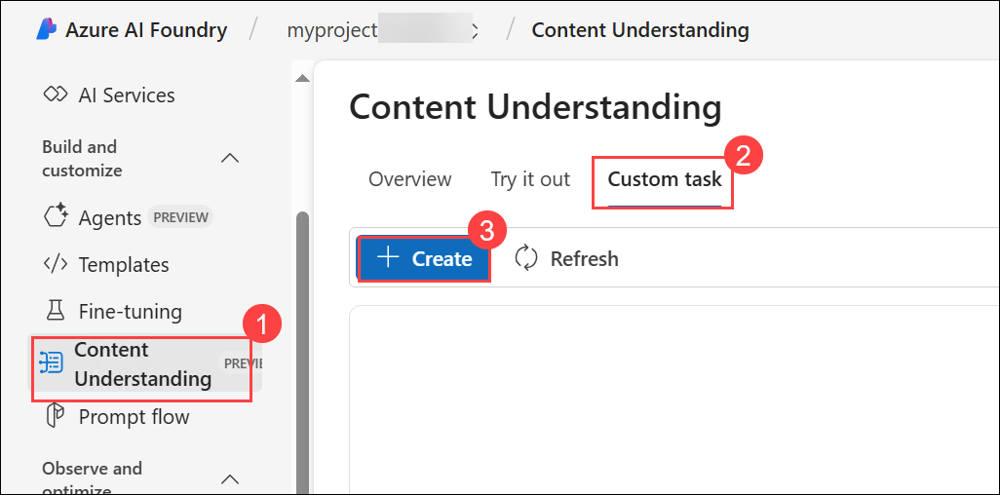   

1. Create a task with the following settings:
    - Task name: `Invoice analysis` **(1)**
    - Description: `Extract data from an invoice` **(2)**
    - Single file content analysis: *Selected* **(3)**
    - Advanced settings:
        - **Azure AI services connection**: *The Azure AI Services resource in your Azure AI Foundry hub* **(4)**
        - **Azure Blob Storage account**: *The default storage account in your Azure AI Foundry hub* **(5)**
        - Select **Create (6)**

          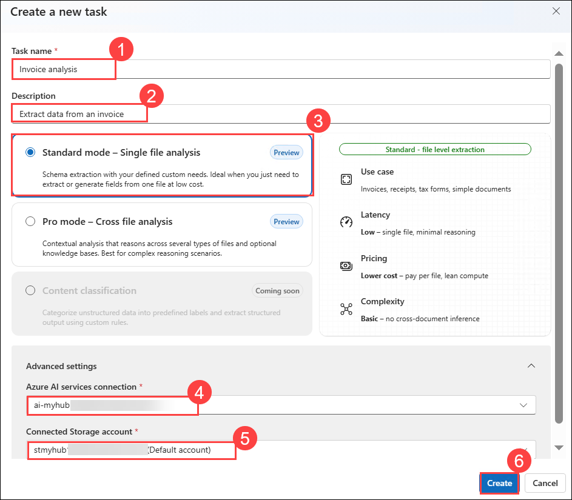 

1. Wait for the task to be created.

    >**Note**: **If an error accessing storage occurs, wait a minute and try again. Permissions for a new hub may take a few minutes to propagate**.

1. On the **Define schema** page, select **Browse file**.

      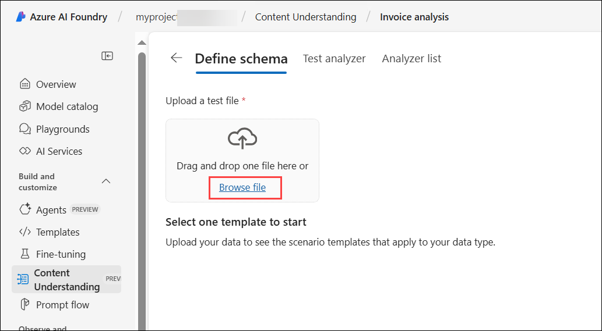

1. Navigate to `C:\LabFiles` **(1)** then select **invoice-1234.pdf (2)** file from the folder where you extracted content files and then **Open (3)**.

      

1. This file contains the following invoice:

    

1. After uploading the invoice file, select the **Invoice data extraction (1)** template and select **Create (2)**.

    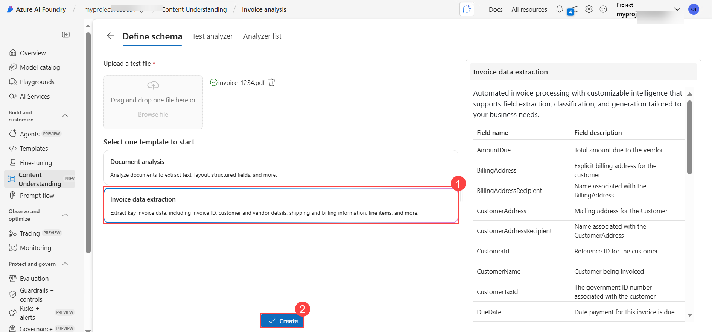

    The **Invoice analysis** template includes common fields that are found in invoices. You can use the schema editor to delete any of the suggested fields that you don't need, and add any custom fields that you do.

1. In the list of suggested fields, select **BillingAddress**. This field is not needed for the invoice format you have uploaded, so use the **Delete field** (**&#128465;**) icon that appears in the selected field row to delete it.

    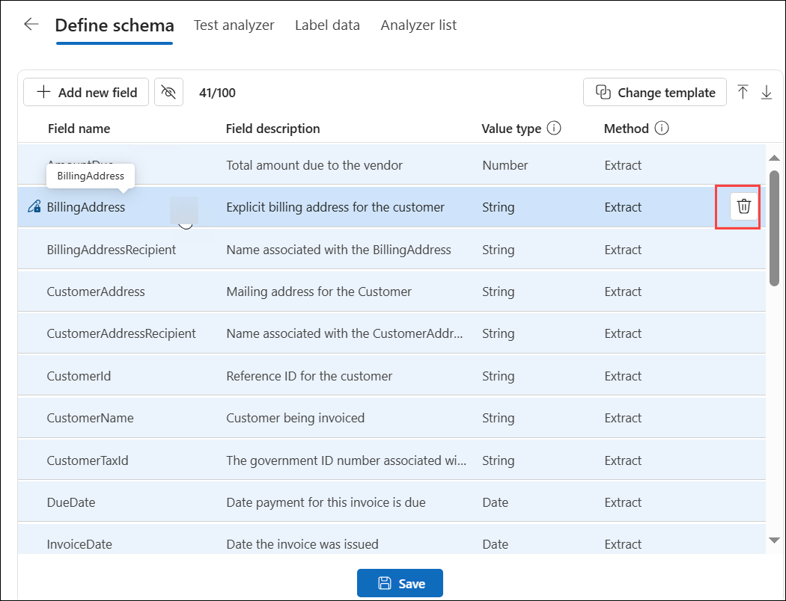

1. Now delete the following suggested fields, which aren't needed for your invoice schema:
    - BillingAddressRecipient
    - CustomerAddressRecipient
    - CustomerId
    - CustomerTaxId
    - DueDate
    - InvoiceTotal
    - PaymentTerm
    - PreviousUnpaidBalance
    - PurchaseOrder
    - RemittanceAddress
    - RemittanceAddressRecipient
    - ServiceAddress
    - ServiceAddressRecipient
    - ShippingAddress
    - ShippingAddressRecipient
    - TotalDiscount
    - VendorAddressRecipient
    - VendorTaxId
    - TaxDetails

1. Select **+ Add new field**.

    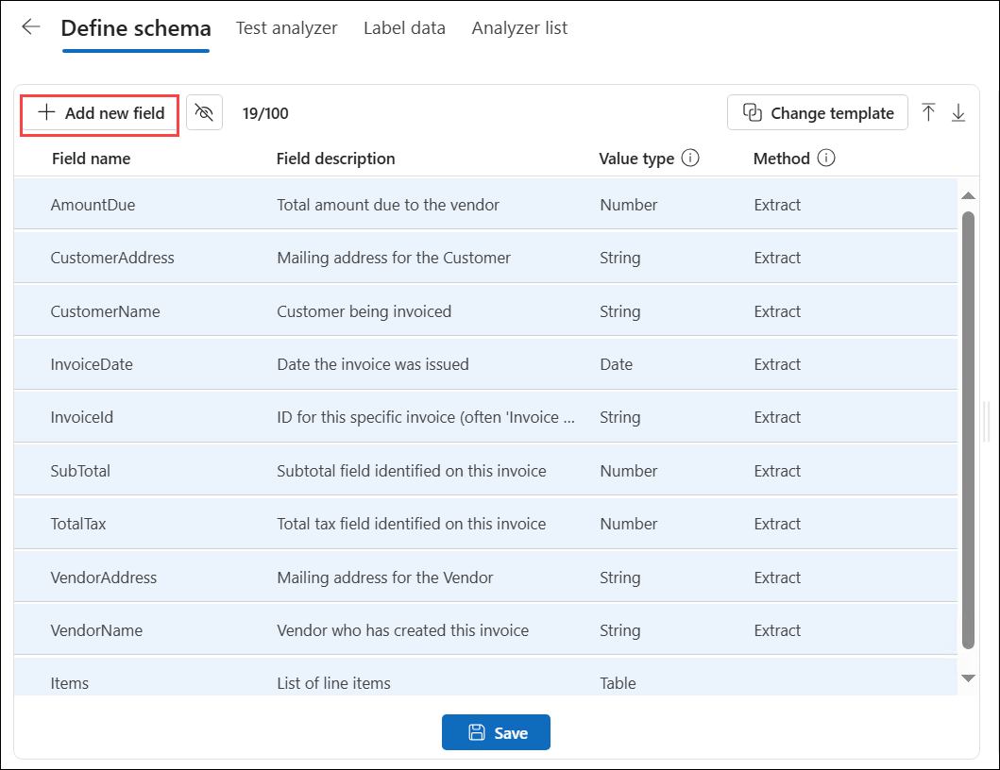

1. Use **+ Add new field** button to add the following fields, selecting **Save changes** (**&#10003;**) for each new field:

    | Field name | Field description | Value type | Method |
    |--|--|--|--|
    | `VendorPhone` | `Vendor telephone number` | String | Extract |
    | `ShippingFee` | `Fee for shipping` | Number | Extract |

    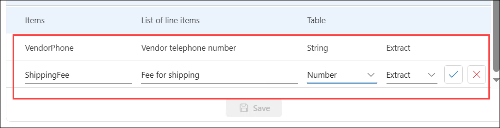    

1. In the row for the **Items (1)** field, note that this field is a *table* (it contains the collection of items in the invoice). Select it's **Edit** (&#9638;) **(2)** icon to open a new page with its subfields.

    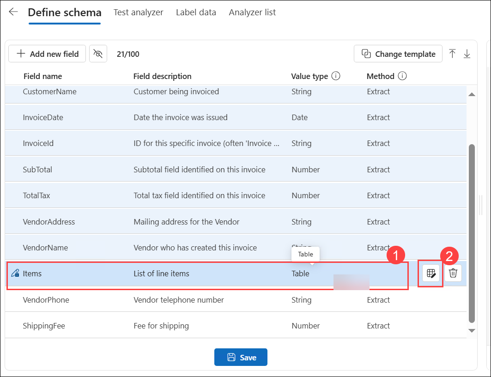

1. Remove the following subfields from the **Items** table:
    - Date
    - ProductCode
    - Unit
    - TaxAmount
    - TaxRate

1. Use the **OK** button to confirm the changes and return to the top-level of the invoice schema.

    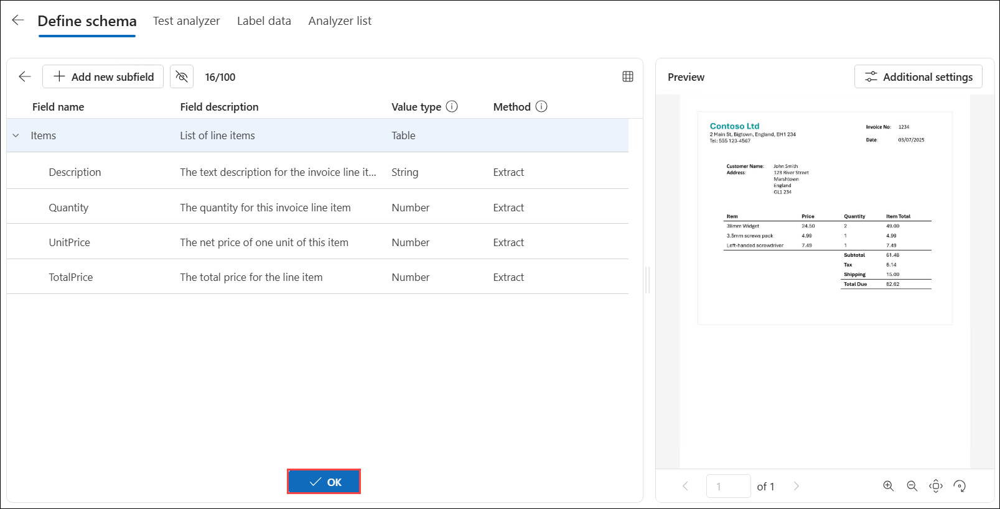

1. Verify that your completed schema looks like this, and select **Save**.

    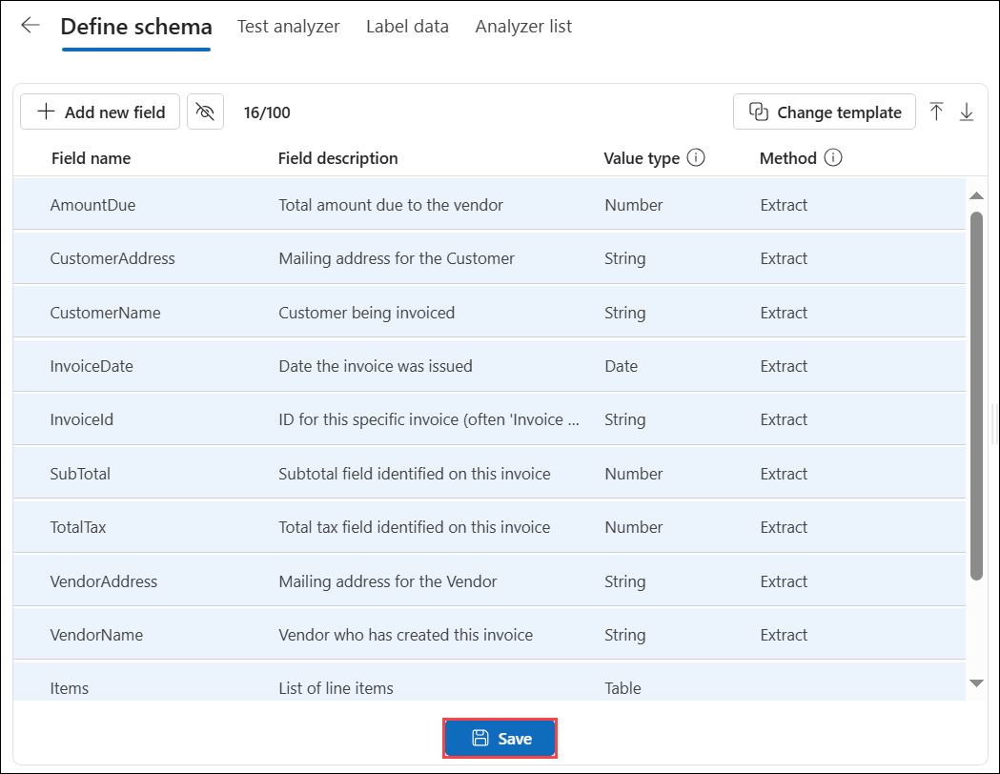

1. On the **Test Analyzer** page, if analysis does not begin automatically, select **Run analysis**. Then wait for analysis to complete. Review the analysis results, which should look similar to this.

    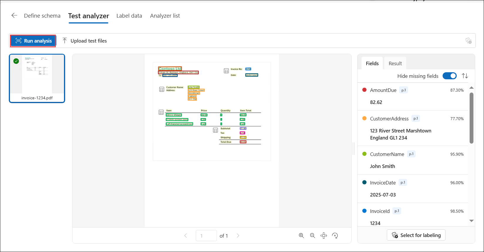

1. View the details of the fields that were identified in the **Fields** pane.

### Task 3.2: Task  Build and test an analyzer for invoices

Now that you have trained a model to extract fields from invoices, you can build an analyzer to use with similar documents.

1. Select the **Analyzer list** page, and then select **+ Build analyzer**.

    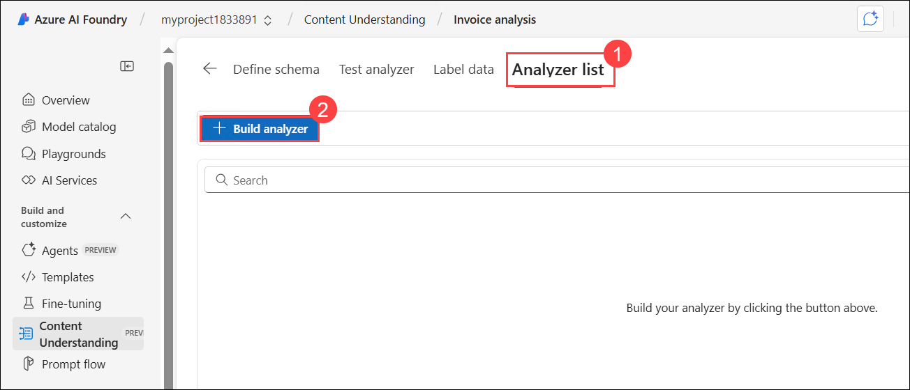

1. Build a new analyzer with the following properties (typed exactly as shown here):
    - **Name**: `invoice-analyzer` **(1)**
    - **Description**: `Invoice analyzer` **(2)**
    - Select **Build (3)**

      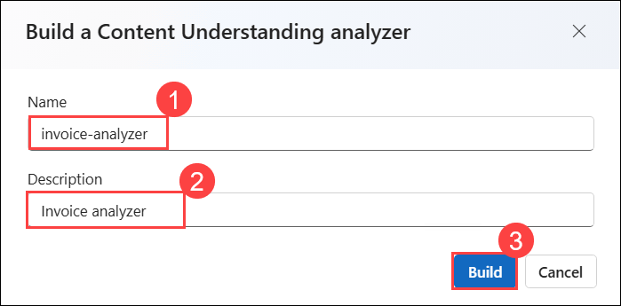   

1. Wait for the new analyzer to be ready (use the **Refresh** button to check).

1. When the analyzer has been built, select the **invoice-analyzer** link. The fields defined in the analyzer's schema will be displayed.

    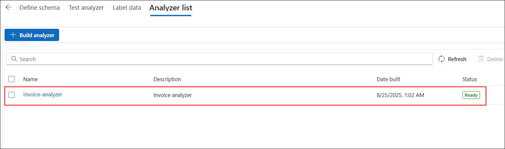

1. In the **invoice-analyzer** page, select the **Test (1)** tab and then use the **+ Upload test files (2)** button to upload files.

    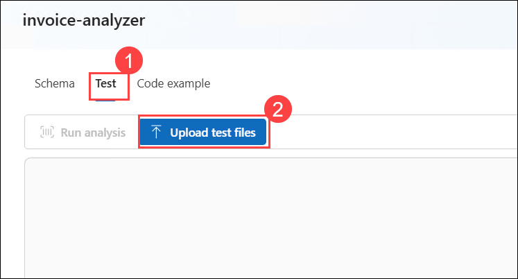

1. Navigate to `C:\LabFiles` **(1)** then select the **invoice-1235.pdf (2)** from the folder where you extracted the content files and then **Open (3)**.

    

1. Click on **Run analysis** to extract field data from the invoice.

    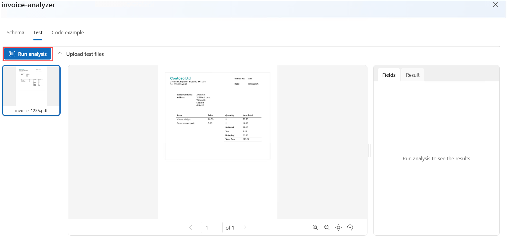

    The invoice being analyzed looks like this:

    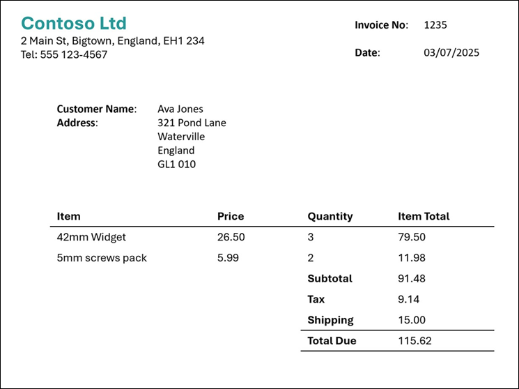

1. Review the **Fields** pane, and verify that the analyzer extracted the correct fields from the test invoice.

    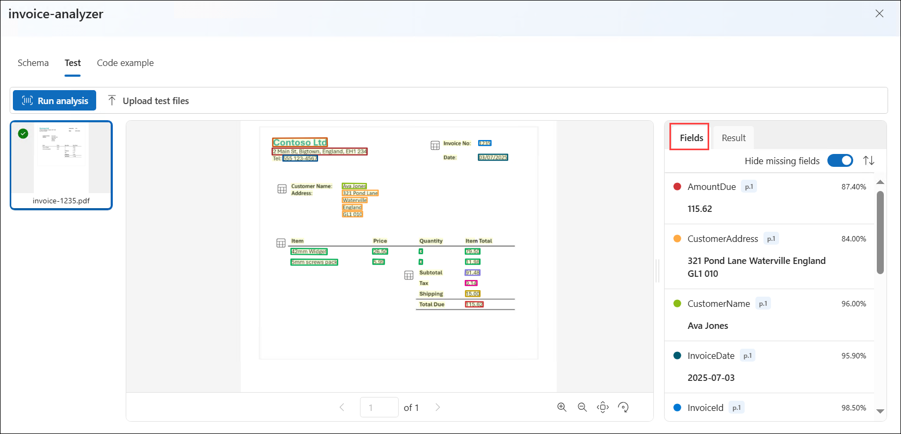

1. Review the **Results** pane to see the JSON response that the analyzer would return to a client application.

    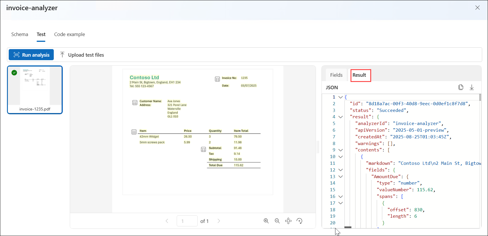

1. On the **Code example** tab, view the sample code that you could use to develop a client application that uses the Content Understanding REST interface to call your analyzer.

    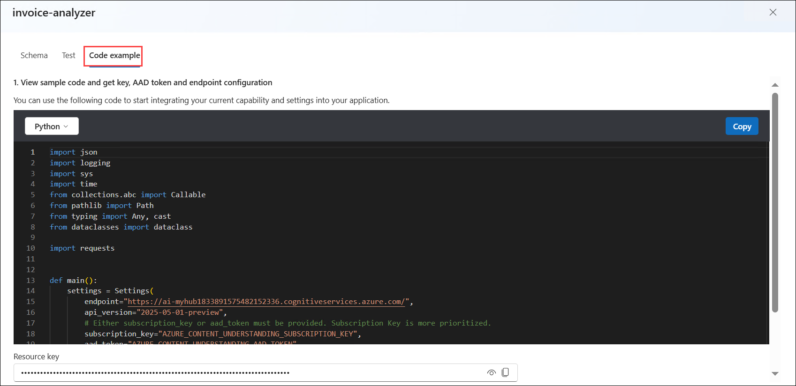

1. Close the **invoice-analyzer** page.

### Task 4: Extract information from a slide image

You are going to build an Azure AI Content Understanding analyzer that can extract information from a slide containing charts.

### Task 4.1: Define a schema for image analysis

1. In the browser tab containing the home page for your Azure AI Foundry project; in the navigation pane on the left, select **Content Understanding (1)**.
   - On the **Content Understanding** page, select the **Custom task (2)** tab at the top.
   - On the Content Understanding custom task page, select **+ Create (3)**.

     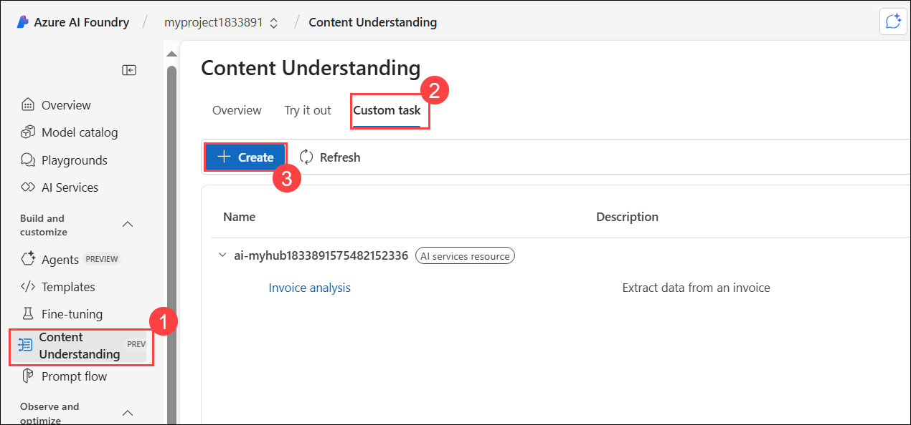

1. Create a task with the following settings:
    - **Task name**: `Slide analysis` **(1)**
    - **Description**: `Extract data from an image of a slide` **(2)**
    - **Single file content analysis**: *Selected* **(3)**
    - **Advanced settings**:
        - **Azure AI services connection**: *The Azure AI Services resource in your Azure AI Foundry hub* **(4)**
        - **Azure Blob Storage account**: *The default storage account in your Azure AI Foundry hub* **(5)**

          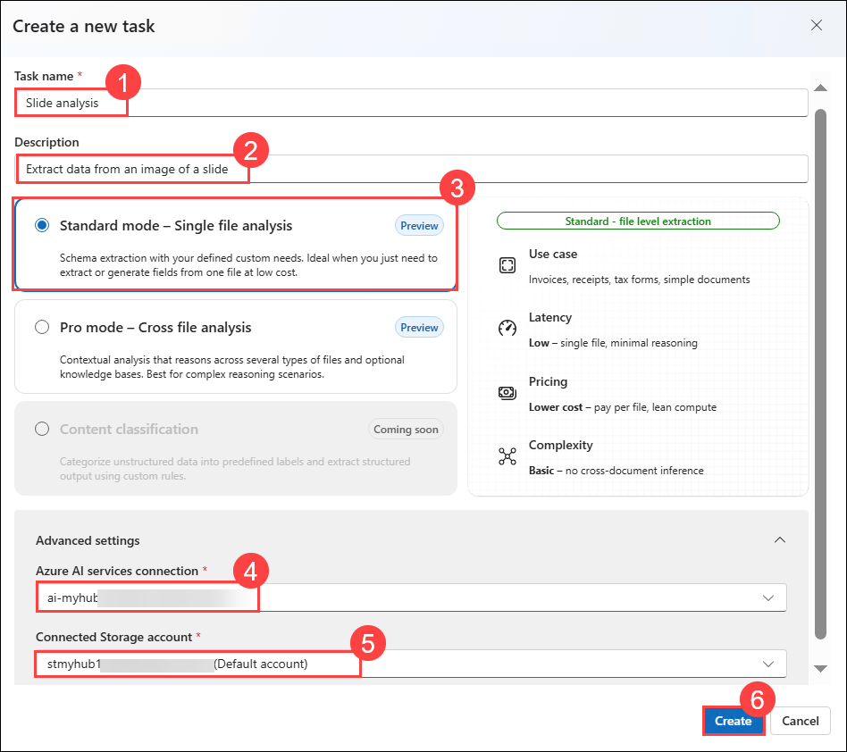

1. Wait for the task to be created.

    >**Note**: If an error accessing storage occurs, wait a minute and try again. Permissions for a new hub may take a few minutes to propagate.

1. On the **Define schema** page, select **Browse file**.

    

1. Navigate to `C:\LabFiles` **(1)**, upload the **slide-1.jpg (2)** file from the folder where you extracted content files and then **Open (3)**.

    

1. Then select the **Image analysis (1)** template and select **Create (2)**.

    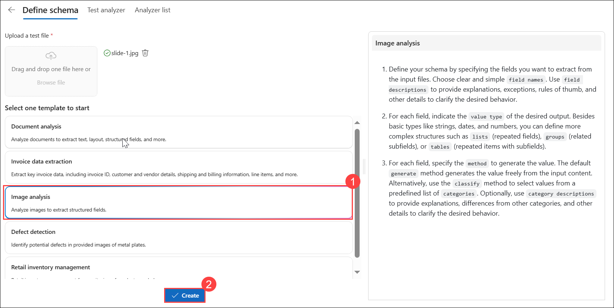

    The *Image analysis* template doesn't include any predefined fields. You must define fields to describe the information you want to extract.

1. Use **+ Add new field** button to add the following fields, selecting **Save changes** (**&#10003;**) for each new field:

    | Field name | Field description | Value type | Method |
    |--|--|--|--|
    | `Title` | `Slide title` | String | Generate |
    | `Summary` | `Summary of the slide` | String | Generate |
    | `Charts` | `Number of charts on the slide` | Integer | Generate |

1. Use **+ Add new field** button to add a new field named `QuarterlyRevenue` with the description `Revenue per quarter` with the value type **Table** **(1)**, and save the new field (**&#10003; (2)**).

    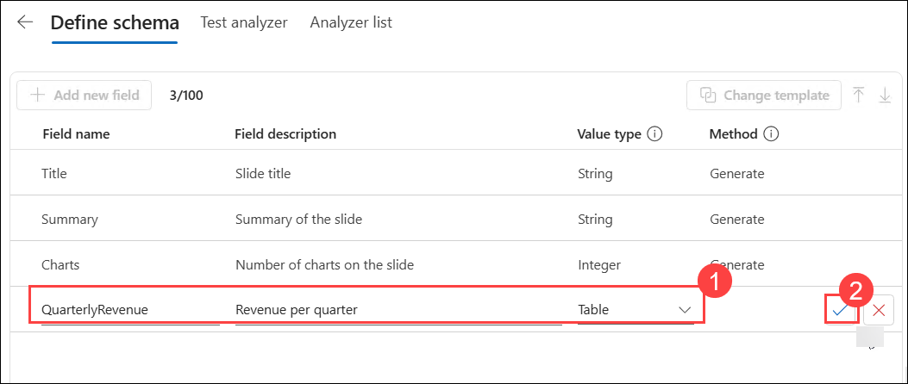

1. Then, in the new page for the table subfields that opens, add the following **subfields (1)** and then **Ok (2)**:

    | Field name | Field description | Value type | Method |
    |--|--|--|--|
    | `Quarter` | `Which quarter?` | String | Generate |
    | `Revenue` | `Revenue for the quarter` | Number | Generate |

    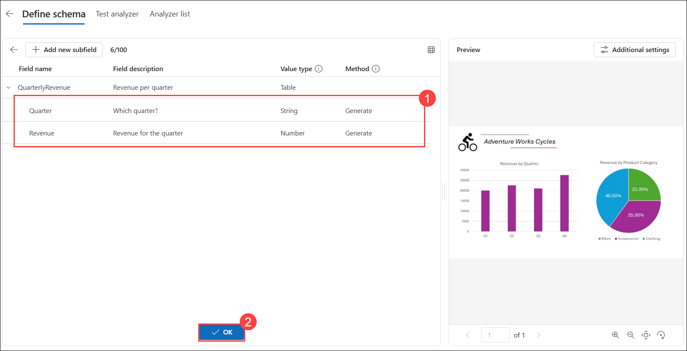 

1. Use **+ Add new field** button to add a new field named `ProductCategories` with the description `Product categories` with the value type **Table**, and save the new field (**&#10003;**).

1. Then, in the new page for the table subfields that opens, add the following subfields **(1)** and then **Ok (2)** to return to the top level of your schema:

    | Field name | Field description | Value type | Method |
    |--|--|--|--|
    | `ProductCategory` | `Product category name` | String | Generate |
    | `RevenuePercentage` | `Percentage of revenue` | Number | Generate |

    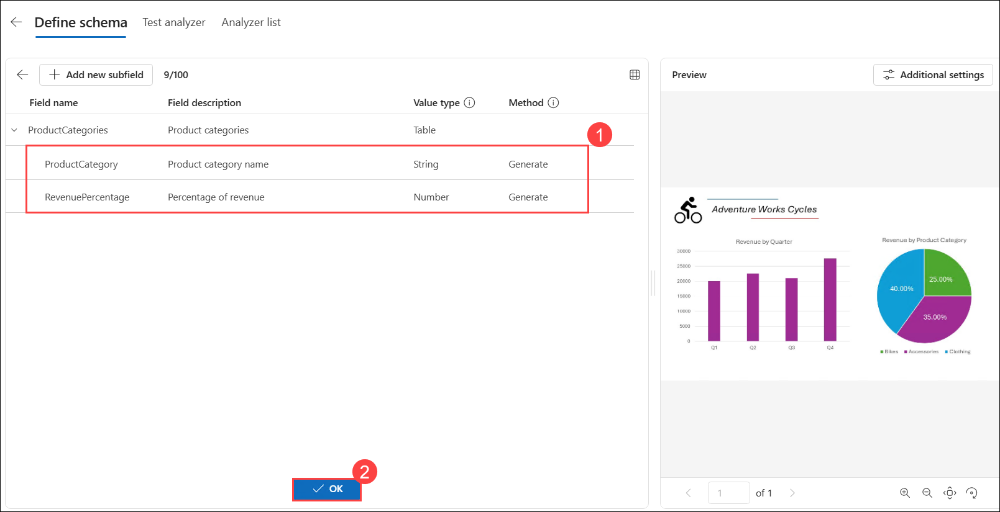     

1. Verify that it looks like this. Then select **Save**.

    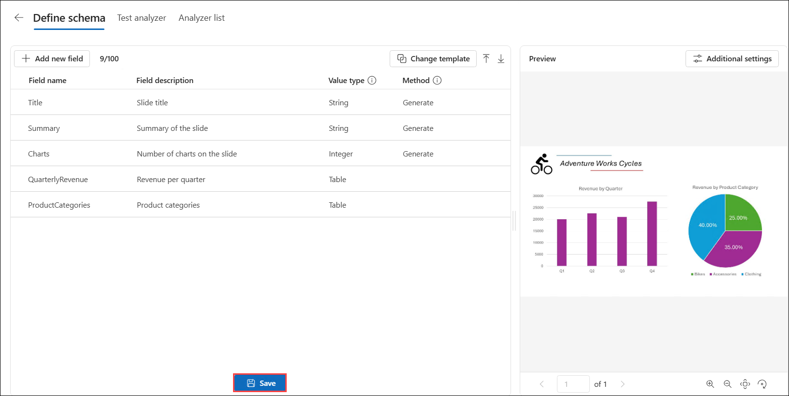 

1. On the **Test Analyzer** page, if analysis does not begin automatically, select **Run analysis**. Then wait for analysis to complete. Review the analysis results, which should look similar to this.

    The slide being analyzed looks like this:

    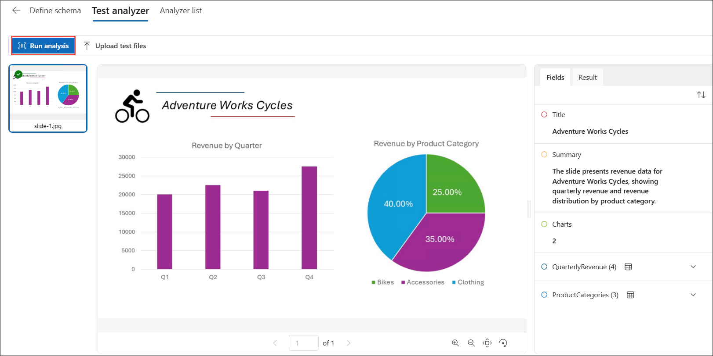 

1. View the details of the fields that were identified in the **Fields** pane, expanding the **QuarterlyRevenue** and **ProductCategories** fields to see the subfield values.

    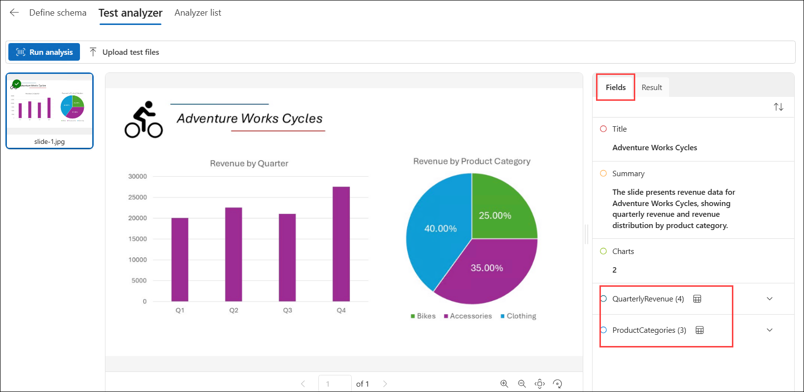 

### Task 4.2: Build and test an analyzer

Now that you have trained a model to extract fields from slides, you can build an analyzer to use with similar slide images.

1. Select the **Analyzer list (1)** page, and then select **+ Build analyzer (2)** and build a new analyzer with the following properties (typed exactly as shown here):
    - **Name**: `slide-analyzer` **(3)**
    - **Description**: `Slide image analyzer` **(4)**
    - Select **Build (5)**

      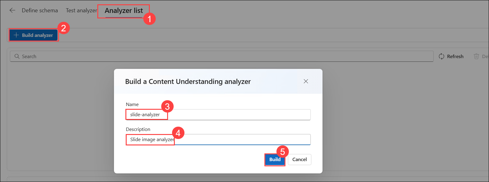 

1. Wait for the new analyzer to be ready (use the **Refresh** button to check).

1. When the analyzer has been built, select the **slide-analyzer** link. The fields defined in the analyzer's schema will be displayed.

    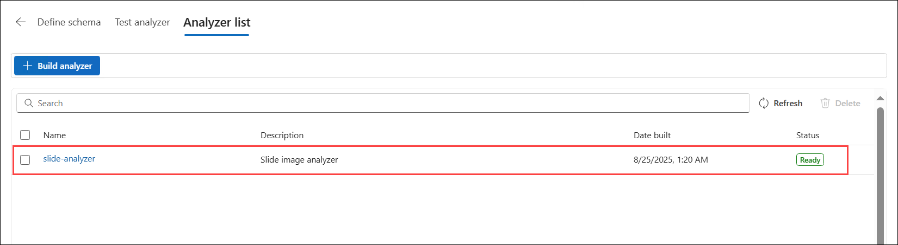 

1. In the **slide-analyzer** page, select the **Test (1)** tab and then use **+ Upload test files (2)** button.

    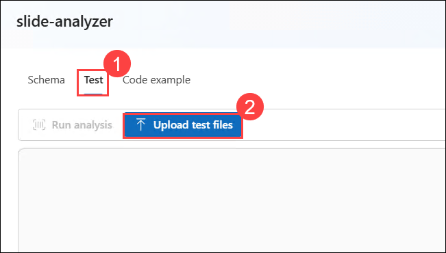 

1. Navigate to `C:\LabFiles` **(1)** then select the **slide-2.jpg (2)** from the folder where you extracted the content files and the **Open (3)**.

     

1. Click on **Run analysis** to extract field data from the image.

    The slide being analyzed looks like this:

    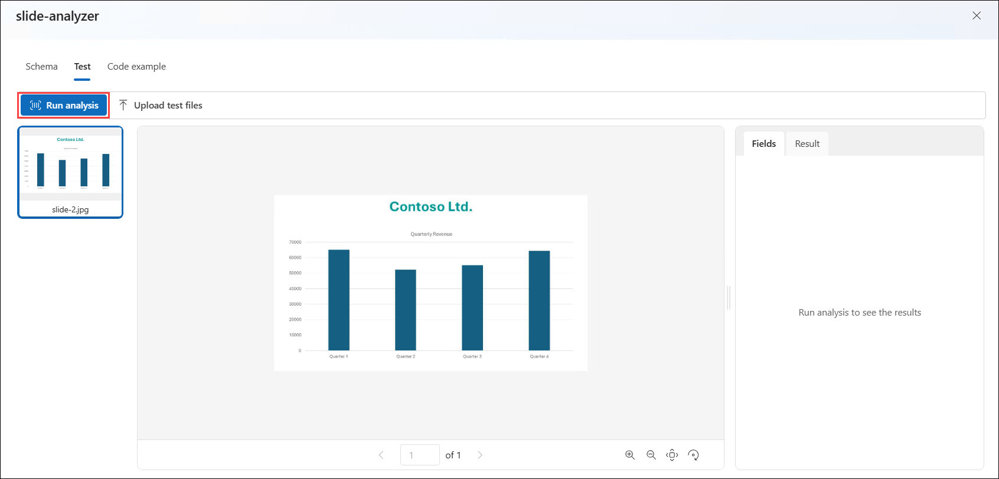 

1. Review the **Fields** pane, and verify that the analyzer extracted the correct fields from the slide image.

    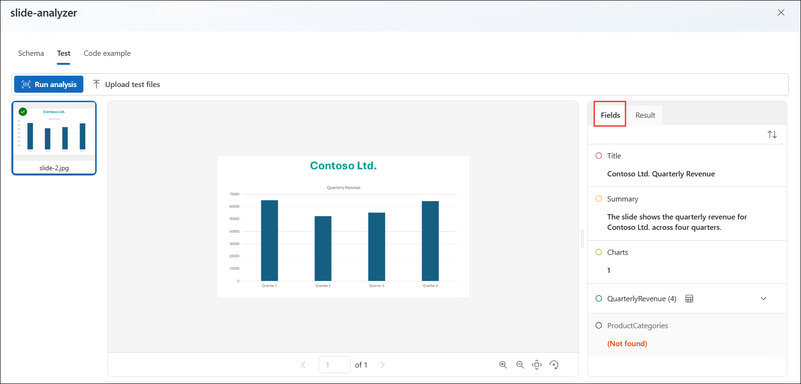 

     >**Note**: Slide 2 doesn't include a breakfown by product category, so the product category revenue data is not found.

1. Review the **Results** pane to see the JSON response that the analyzer would return to a client application.

    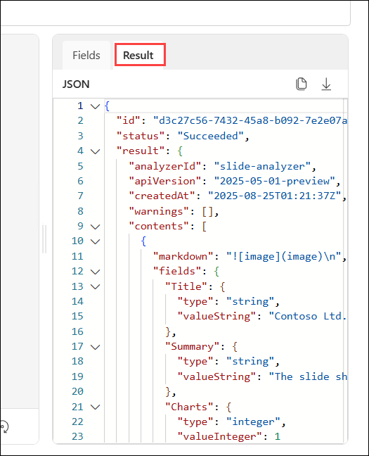 

1. On the **Code example** tab, view the sample code that you could use to develop a client application that uses the Content understanding REST interface to call your analyzer.

    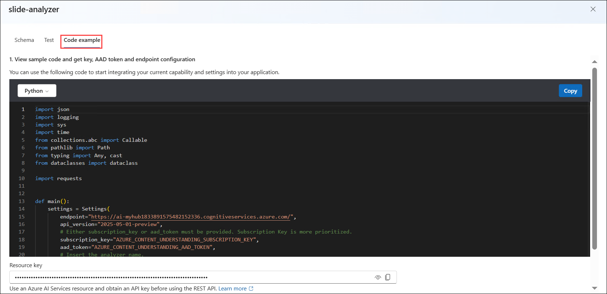 

1. Close the **slide-analyzer** page.

### Task 5: Extract information from a voicemail audio recording

You are going to build an Azure AI Content Understanding analyzer that can extract information from an audio recording of a voicemail message.

### Task 5.1: Define a schema for audio analysis

1. In the browser tab containing the home page for your Azure AI Foundry project; in the navigation pane on the left, select **Content Understanding (1)**.
    - On the **Content Understanding** page, select the **Custom task (2)** tab at the top.
    - On the Content Understanding custom task page, select **+ Create (3)**
    
         
    
1. Create a task with the following settings:
    - **Task name**: `Voicemail analysis` **(1)**
    - **Description**: `Extract data from a voicemail recording` **(2)**
    - **Single file content analysis**: *Selected* **(3)**
    - **Advanced settings**:
        - **Azure AI services connection**: *The Azure AI Services resource in your Azure AI Foundry hub* **(4)**
        - **Azure Blob Storage account**: *The default storage account in your Azure AI Foundry hub* **(5)**
        - Then **Create (6)**

          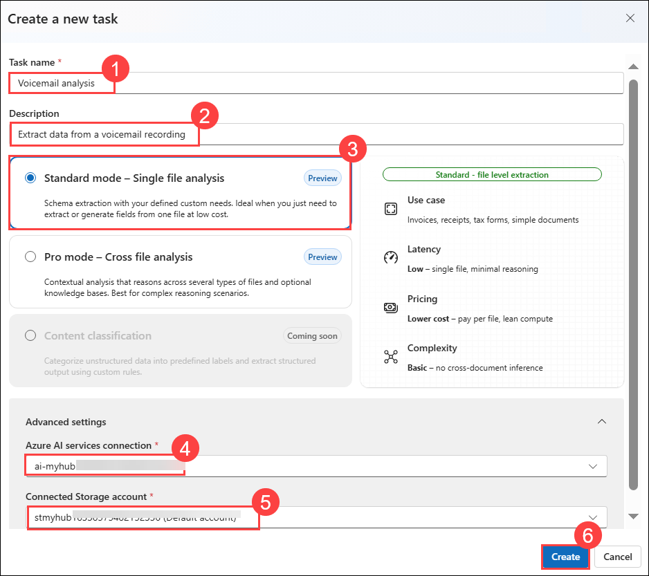 

1. Wait for the task to be created.

    >**Note**: If an error accessing storage occurs, wait a minute and try again. Permissions for a new hub may take a few minutes to propagate.

1. On the **Define schema** page, select **Browse file**.

    

1. Navigate to `C:\LabFiles` **(1)**, upload the **call-1.mp3 (2)** file from the folder where you extracted content files and then **Open (3)**.

        

1. Then select the **Speech transcript analysis (1)** template and select **Create (2)**.

    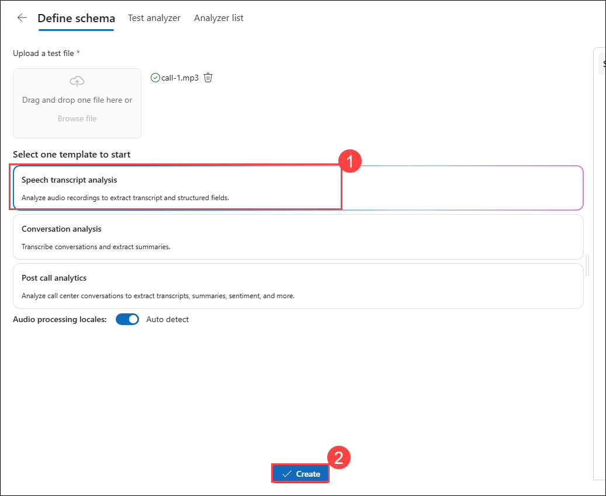 

1. In the **Content** pane on the right, select **Get transcription preview** to see a transcription of the recorded message.

    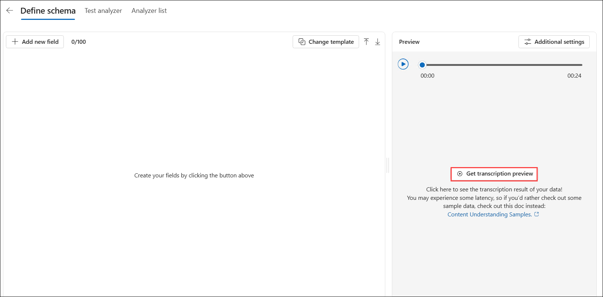 

    The *Speech transcript analysis* template doesn't include any predefined fields. You must define fields to describe the information you want to extract.

1. Use **+ Add new field** button to add the following fields, selecting **Save changes** (**&#10003;**) for each new field:

    | Field name | Field description | Value type | Method |
    |--|--|--|--|
    | `Caller` | `Person who left the message` | String | Generate |
    | `Summary` | `Summary of the message` | String | Generate |
    | `Actions` | `Requested actions` | String | Generate |
    | `CallbackNumber` | `Telephone number to return the call` | String | Generate |
    | `AlternativeContacts` | `Alternative contact details` | List of Strings | Generate |

1. Verify that your schema looks like this. Then select **Save**.

    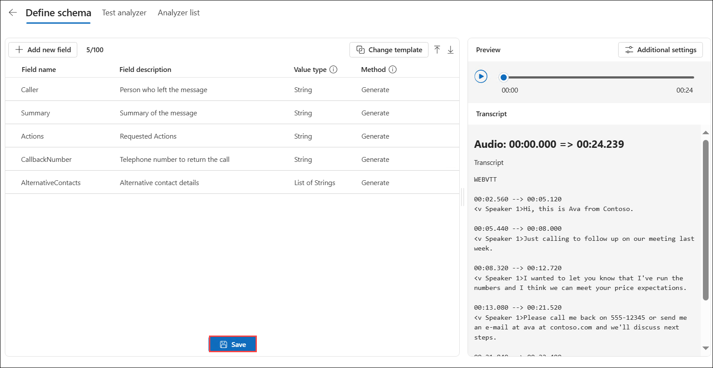

1. On the **Test Analyzer** page, if analysis does not begin automatically, select **Run analysis**. Then wait for analysis to complete. 

    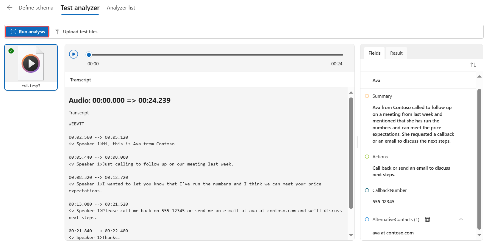

1. Review the analysis results.

1. View the details of the fields that were identified in the **Fields** pane, expanding the **AlternativeContacts** field to see the listed values.

### Task 5.2: Build and test an analyzer

Now that you have trained a model to extract fields from voice messages, you can build an analyzer to use with similar audio recordings.

1. Select the **Analyzer list (1)** page, and then select **+ Build analyzer (2)** and build a new analyzer with the following properties (typed exactly as shown here):
    - **Name**: `voicemail-analyzer` **(3)**
    - **Description**: `Voicemail audio analyzer` **(4)**
    - Then select **Build (6)**

      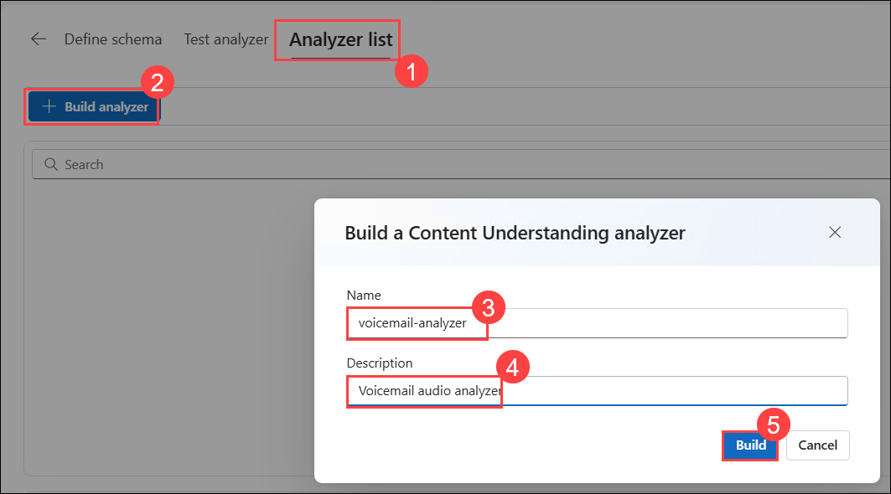

1. Wait for the new analyzer to be ready (use the **Refresh** button to check).

1. When the analyzer has been built, select the **voicemail-analyzer** link. The fields defined in the analyzer's schema will be displayed.

    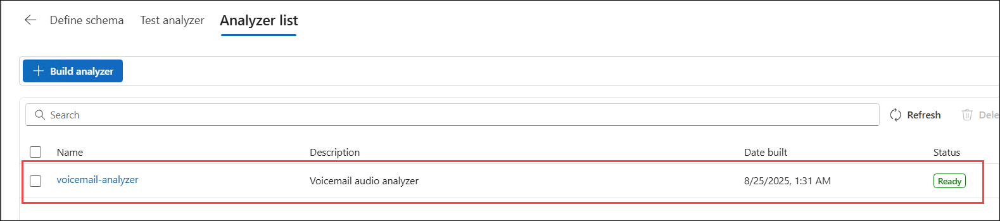

1. In the **voicemail-analyzer** page, select the **Test (1)** tab and then use **+ Upload test files (2)** button.

    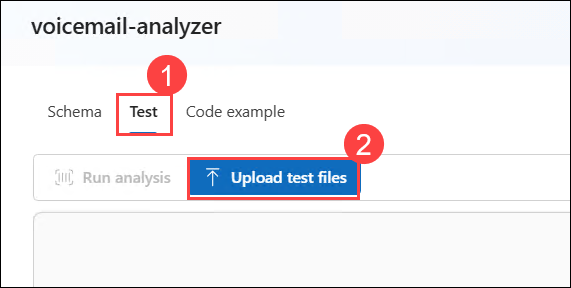

1. Navigate to `C:\LabFiles` **(1)** then select the **call-2.mp3 (2)** from the folder where you extracted the content files and the **Open (3)**.

    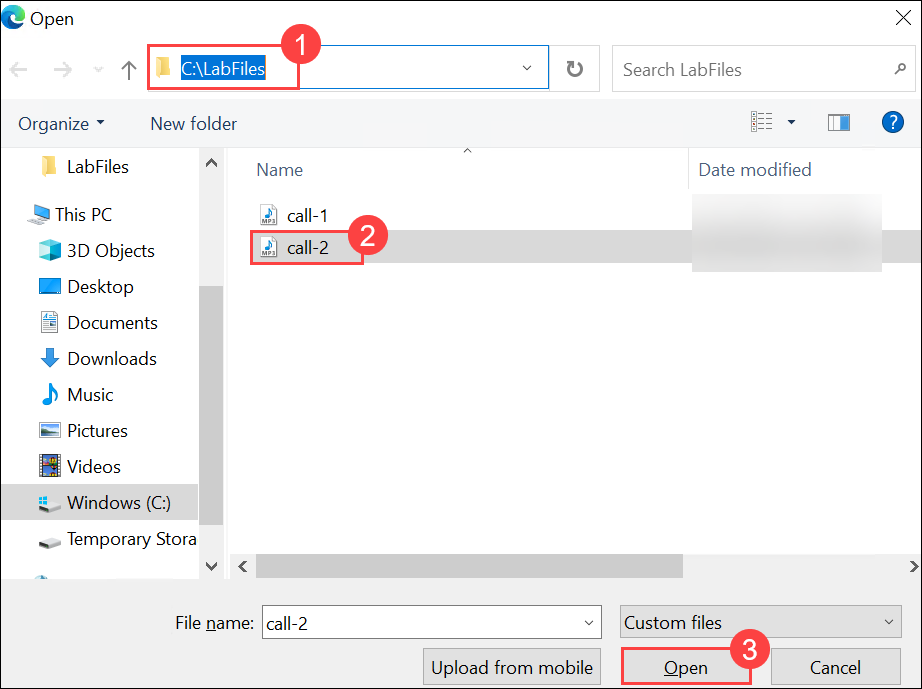

1. Click on **Run analysis** to extract field data from the audio file.

    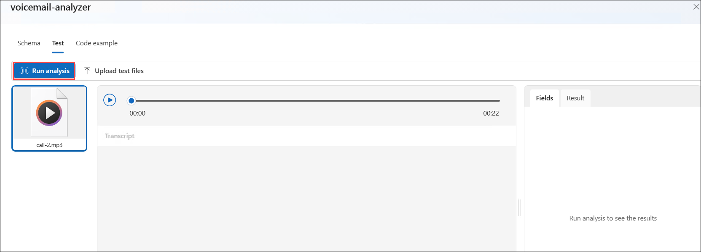

    Audio analysis can take some time. While you're waiting, you can play the audio file below:

1. Review the **Fields** pane, and verify that the analyzer extracted the correct fields from the voice message.

    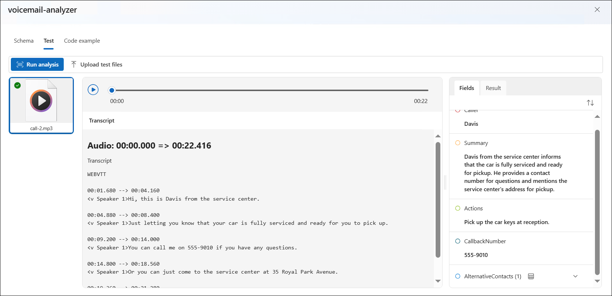

1. Review the **Results** pane to see the JSON response that the analyzer would return to a client application.

1. On the **Code example** tab, view the sample code that you could use to develop a client application that uses the Content understanding REST interface to call your analyzer.

1. Close the **voicemail-analyzer** page.

### Task 6: Extract information from a video conference recording

You are going to build an Azure AI Content Understanding analyzer that can extract information from an video recording of a conference call.

### Task 6.1: Define a schema for video analysis

1. In the browser tab containing the home page for your Azure AI Foundry project; in the navigation pane on the left, select **Content Understanding (1)**.
    - On the **Content Understanding** page, select the **Custom task** tab at the top.
    - On the Content Understanding custom task page, select **+ Create (3)**
    
      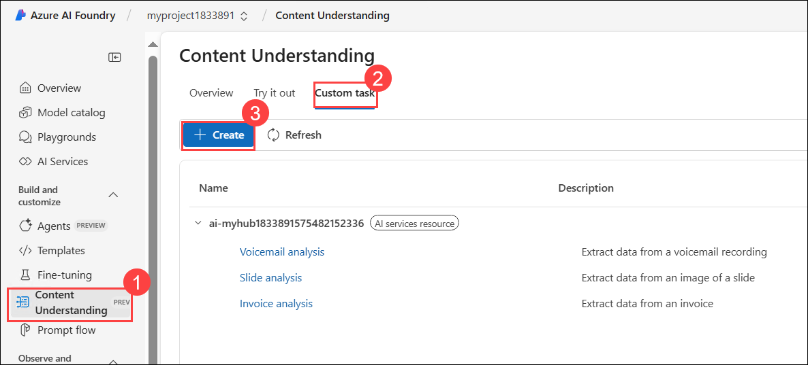    
    
1. Create a task with the following settings:
    - **Task name**: `Conference call video analysis` **(1)**
    - **Description**: `Extract data from a video conference recording` **(2)**
    - **Single file content analysis**: *Selected* **(3)**
    - **Advanced settings**:
        - **Azure AI services connection**: *The Azure AI Services resource in your Azure AI Foundry hub* **(4)**
        - **Azure Blob Storage account**: *The default storage account in your Azure AI Foundry hub* **(5)**
        - Select **Create (6)**

          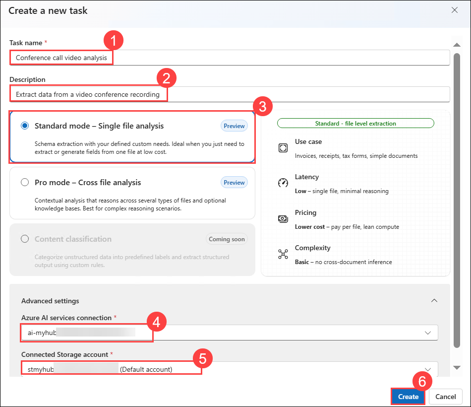 

1. Wait for the task to be created.

    > **Note**:If an error accessing storage occurs, wait a minute and try again. Permissions for a new hub may take a few minutes to propagate.

1. On the **Define schema** page, select **Browse for files**.

    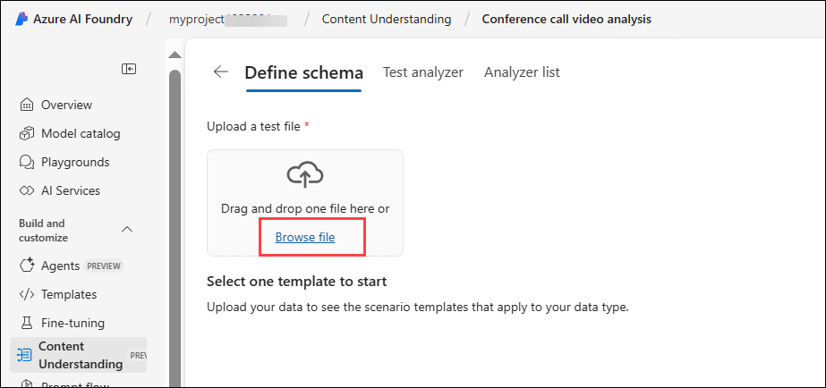

1. Navigate to `C:\LabFiles` **(1)** then select the **meeting-1.mp4 (2)** file from the folder where you extracted content files and then **Open (3)**.

1. Then select the **Video analysis** template and select **Create**.
1. In the **Content** pane on the right, select **Get transcription preview** to see a transcription of the recorded message.

    The *Video analysis* template extracts data for the video. It doesn't include any predefined fields. You must define fields to describe the information you want to extract.

1. Use **+ Add new field** button to add the following fields, selecting **Save changes** (**&#10003;**) for each new field:

    | Field name | Field description | Value type | Method |
    |--|--|--|--|
    | `Summary` | `Summary of the discussion` | String | Generate |
    | `Participants` | `Count of meeting participants` | Integer | Generate |
    | `ParticipantNames` | `Names of meeting participants` | List of Strings | Generate |
    | `SharedSlides` | `Descriptions of any PowerPoint slides presented` | List of Strings | Generate |
    | `AssignedActions` | `Tasks assigned to participants` | Table |  |

1. When you enter the **AssignedActions** field, in the table of subfields that appears, create the following subfields:

    | Field name | Field description | Value type | Method |
    |--|--|--|--|
    | `Task` | `Description of the task` | String | Generate |
    | `AssignedTo` | `Who the task is assigned to` | String | Generate |

