# Lab 32: Develop a Content Understanding client application

### Estimated Duration : 30 Minutes

## Overview

In this lab, you’ll learn how to set up and use Azure AI Foundry to create, deploy, and interact with multimodal AI models that handle both text and image inputs. You’ll start by creating an **Azure AI Foundry hub and project**, then create a **Content Understanding analyzer** via the REST API, and finally build a **Python client application** to consume the analyzer and process business card images.

The lab demonstrates how to configure the environment, authenticate with Azure, submit image-based requests, handle responses, and extract structured information from analyzed content. While the steps use **Python in Azure Cloud Shell**, the concepts and workflow can be applied with other SDKs or environments to integrate AI services into custom applications.

## Lab Objectives

- **Task 1:** Create an Azure AI Foundry hub and project

- **Task 2:** Use the REST API to create a Content Understanding analyzer

- **Task 3:** Use the REST API to analyze content

## Task 1: Create an Azure AI Foundry hub and project

In this task, you’ll create an Azure AI Foundry hub and project. You’ll sign in to the Azure AI Foundry portal, configure a new AI hub and project with the appropriate subscription, resource group, and region, and then copy the Azure AI Services endpoint and API key for use in later tasks.


1. Open a new tab in the browser, right-click on the following link [Azure AI Foundry portal](https://ai.azure.com), then **Copy link** and paste it in a browser tab to log in to **Azure AI Foundry portal**.

1. Click on **Sign in**.
 
    

1. If prompted, provide the credentials below:
 
   - **Email/Username:** <inject key="AzureAdUserEmail"></inject>
    
        

   - **Password:** <inject key="AzureAdUserPassword"></inject>
    
        

1. When the **Stay signed in?** window appears, select **No**.

    

1. Click on **X** to close the **Chat with Foundry Agent** popup window.

    

    >**Note:** Close the **Help** pane if it's open

1. In the browser, navigate to `https://ai.azure.com/managementCenter/allResources` and select **Create new**. 

    

1. In the **Create Project** window, select the option to create a new **AI hub resource (1)**, then click **Next (2)**.

    

1. In the **Create a project** wizard, enter **Myproject<inject key="DeploymentID"></inject> (1)** in the Project name field. Under the Hub field, click **Rename hub (2)** and specify **Myhub<inject key="DeploymentID"></inject> (3)** as the hub name. Then, expand the **Advanced options (4)** drop-down.

    

1. In the Advanced options specify the following settings for your project and the  click **Create (9)**.

    * Subscription: **Choose Default Subscription (5)**
    * Resource group: **AI-102-RG33 (6)**
    * Azure AI Foundry resource: **Keep as Default (7)**
    * Region: **<inject key="Region"></inject> (8)**

        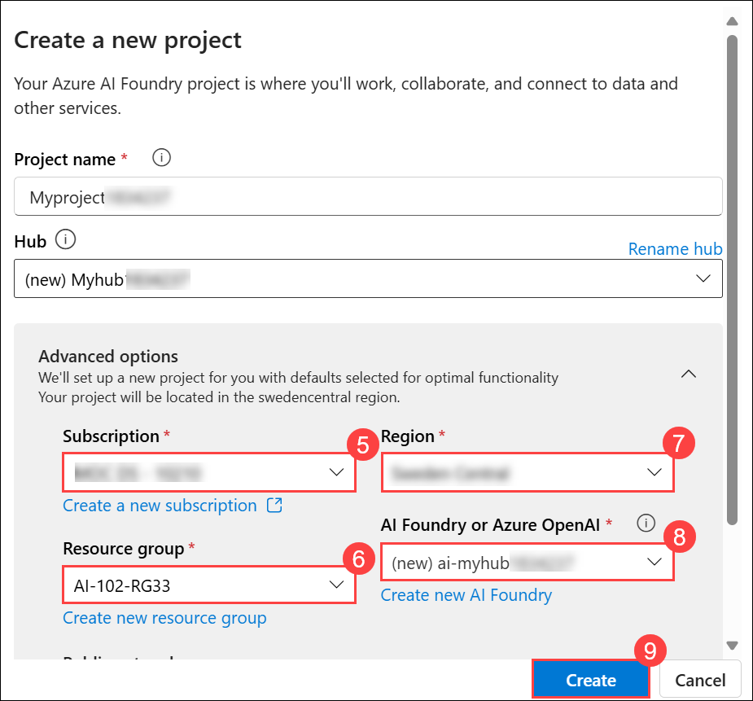

1. Wait for your project to be created, and then navigate to **Overview (1)** in the left navigation pane, select **Azure AI Services (2)** under **Included capabilities**, then copy the endpoint using **Copy Azure AI Services endpoint (3)** and the key using **Copy API key (4)**, and save both for the next task.

    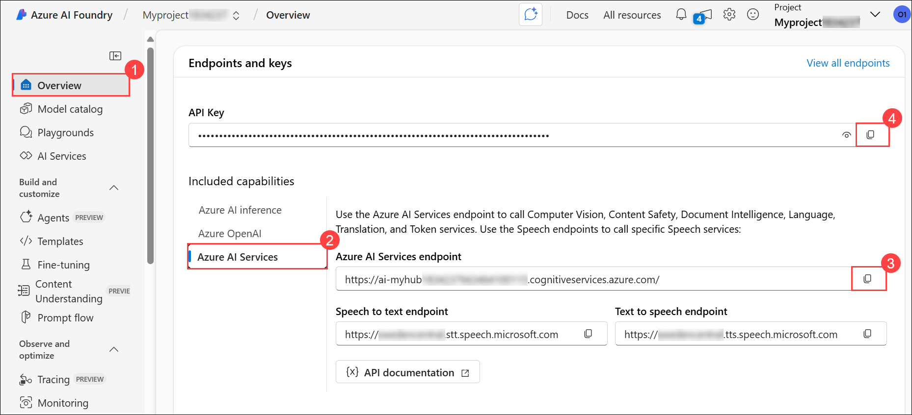

> **Congratulations** on completing the task! Now, it's time to validate it. Here are the steps:
>
> - Hit the Validate button for the corresponding task. If you receive a success message, you can proceed to the next task.
> - If not, carefully read the error message and retry the step, following the instructions in the lab guide.
> - If you need any assistance, please contact us at cloudlabs-support@spektrasystems.com. We are available 24/7 to help.
 
<validation step="a65ef465-6237-4acc-bb65-c8a8430bab16" />

## Task 2: Use the REST API to create a Content Understanding analyzer

In this task, you’ll use the Content Understanding REST API to create a business card analyzer. You’ll configure your environment in Cloud Shell, edit the provided Python code to implement the `create_analyzer` function, and submit REST requests to delete any existing analyzer and create a new one. Finally, you’ll run the script and verify that the analyzer is successfully created and ready for use.

1. On the **[Azure portal](https://portal.azure.com/)** [`https://portal.azure.com`] homepage, click the **\[>\_] Cloud Shell (1)** button located to the right of the **Copilot** tab at the top. This opens a new Cloud Shell session. In the **Welcome to Azure Cloud Shell** window, choose **PowerShell (2)**.

    

    >**Note:** The cloud shell provides a command-line interface in a pane at the bottom of the Azure portal. You can resize or maximize this pane to make it easier to work in.

    > **Note:** If you have previously created a cloud shell that uses a **Bash** environment, switch it to **PowerShell**.

1. In the **Getting started** window, ensure **No storage account required (1)** is selected. From the **Subscription** drop-down, choose **Default subscription (2)**, then click **Apply (3)**.

    

1. In the Cloud Shell toolbar, open the **Settings (1)** menu and choose **Go to Classic version (2)** from the drop-down.

    

    >**Note:** Ensure you've switched to the classic version of the cloud shell before continuing.

1. In the cloud shell pane, enter the following commands to clone the GitHub repo containing the code files for this exercise (type the command, or copy it to the clipboard and then right-click in the command line and paste as plain text):

    ```
    rm -r mslearn-ai-info -f
    git clone https://github.com/microsoftlearning/mslearn-ai-information-extraction mslearn-ai-info
    ```

    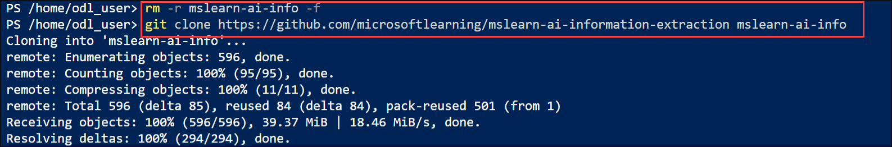

    > **Note:** As you enter commands into the cloudshell, the output may take up a large amount of the screen buffer. You can clear the screen by entering the `cls` command to make it easier to focus on each task.

1. After the repo has been cloned, navigate to the folder containing the code files for your app:

    ```
    cd mslearn-ai-info/Labfiles/content-app
    ls -a -l
    ```

    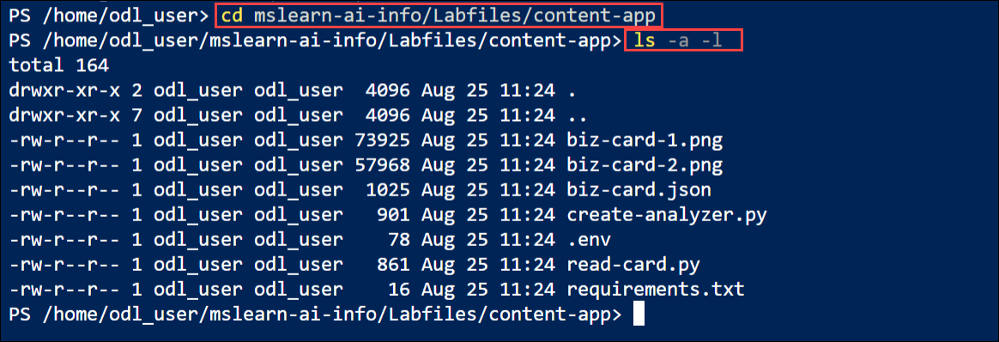

1. The folder contains two scanned business card images as well as the Python code files you need to build your app.

1. In the cloud shell command-line pane, enter the following command to install the libraries you'll use:

    ```
    python -m venv labenv
    ./labenv/bin/Activate.ps1
    pip install -r requirements.txt
    ```

1. Enter the following command to edit the configuration file that has been provided. The file is opened in a code editor.

    ```
    code .env
    ```

    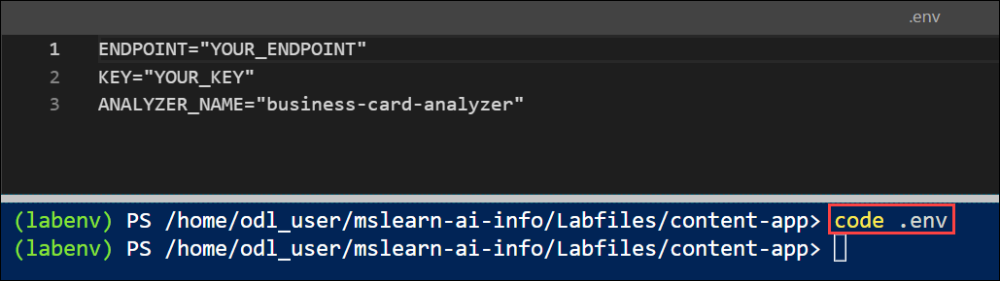

    
1. In the code file, provide the relavant values:

    - YOUR_ENDPOINT: **Azure AI Services endpoint (1)**
    - YOUR_KEY: **API Key (2)**
    - ANALYZER_NAME: **business-card-analyzer (3)**

        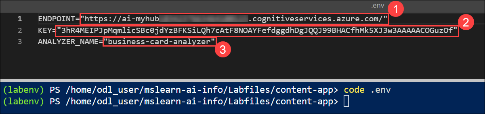

        **Note:** Insert the previously copied Endpoint and Key values. 

1. After you've replaced the placeholders, within the code editor, use the **CTRL+S** command to save your changes and then use the **CTRL+Q** command to close the code editor while keeping the cloud shell command line open.

    > **Note:** You can maximize the cloud shell pane now.

1. In the cloud shell command line, enter the following command to view the **biz-card.json** JSON file that has been provided. Scroll the cloud shell pane to view the JSON in the file, which defines an analyzer schema for a business card.

    ```
    cat biz-card.json
    ```

    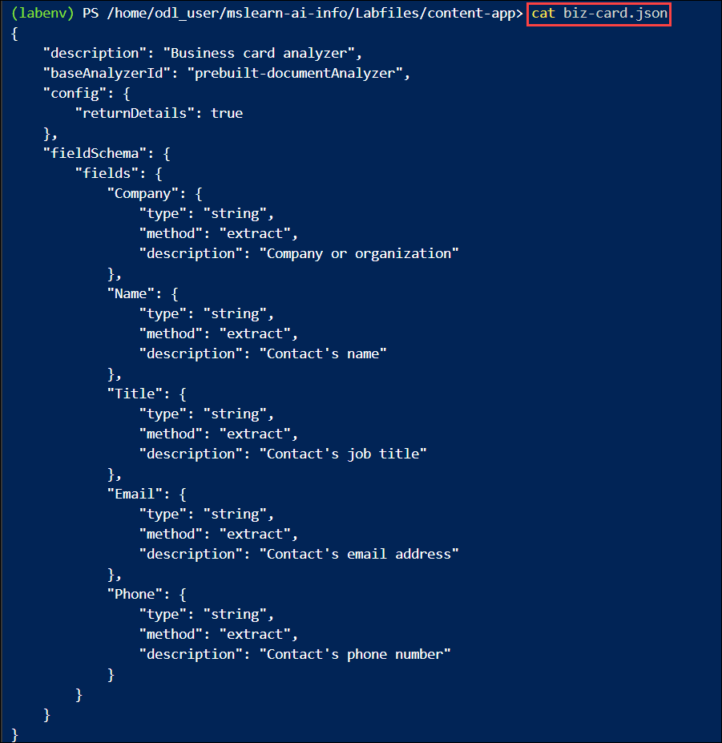

1. When you've viewed the JSON file for the analyzer, enter the following command to edit the **create-analyzer.py** Python code file that has been provided. The Python code file is opened in a code editor.

    ```
    code create-analyzer.py
    ```

    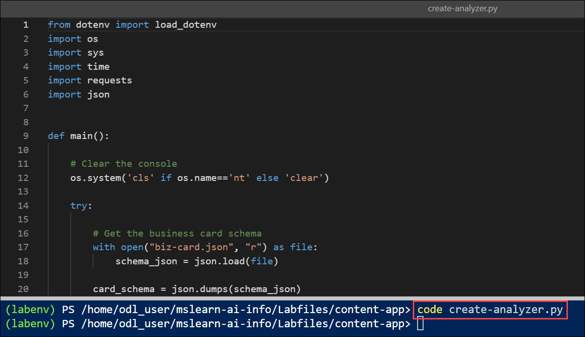

1. Review the code, which:
    - Loads the analyzer schema from **biz-card.json** file.
    - Retrieves the endpoint, key, and analyzer name from the environment configuration file.
    - Calls a function named **create_analyzer**, which is currently not implemented

1. In the **create_analyzer** function, find the comment **Create a Content Understanding analyzer** and add the following code (being careful to maintain the correct indentation):

    ```python
    # Create a Content Understanding analyzer
    print (f"Creating {analyzer}")

    # Set the API version
    CU_VERSION = "2025-05-01-preview"

    # initiate the analyzer creation operation
    headers = {
            "Ocp-Apim-Subscription-Key": key,
            "Content-Type": "application/json"}

    url = f"{endpoint}/contentunderstanding/analyzers/{analyzer}?api-version={CU_VERSION}"

    # Delete the analyzer if it already exists
    response = requests.delete(url, headers=headers)
    print(response.status_code)
    time.sleep(1)

    # Now create it
    response = requests.put(url, headers=headers, data=(schema))
    print(response.status_code)

    # Get the response and extract the callback URL
    callback_url = response.headers["Operation-Location"]

    # Check the status of the operation
    time.sleep(1)
    result_response = requests.get(callback_url, headers=headers)

    # Keep polling until the operation is no longer running
    status = result_response.json().get("status")
    while status == "Running":
            time.sleep(1)
            result_response = requests.get(callback_url, headers=headers)
            status = result_response.json().get("status")

    result = result_response.json().get("status")
    print(result)
    if result == "Succeeded":
            print(f"Analyzer '{analyzer}' created successfully.")
    else:
            print("Analyzer creation failed.")
            print(result_response.json())
    ```

    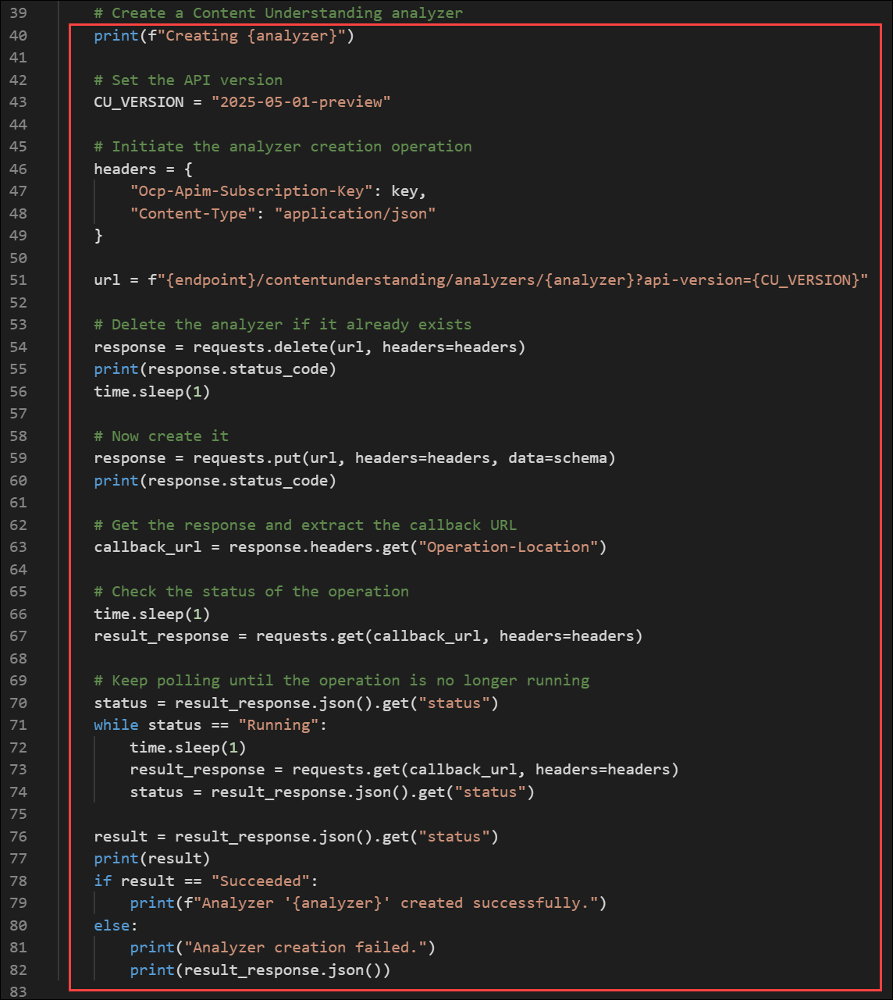

1. Review the code you added, which:
    - Creates appropriate headers for the REST requests
    - Submits an HTTP *DELETE* request to delete the analyzer if it already exists.
    - Submits an HTTP *PUT* request to initiate the creation of the analyzer.
    - Checks the response to retrieve the *Operation-Location* callback URL.
    - Repeatedly submits an HTTP *GET* request to the callback URL to check the operation status until it is no longer running.
    - Confirms success (or failure) of the operation to the user.

        > **Note**: The code includes some deliberate time delays to avoid exceeding the request rate limit foe the service.

1. Use the **CTRL+S** command to save the code changes, but keep the code editor pane open in case you need to correct any errors in the code. Resize the panes so you can clearly see the command line pane.

1. In the cloud shell command line pane, enter the following command to run the Python code:

    ```
    python create-analyzer.py
    ```

1. Review the output from the program, which should hopefully indicate that the analyzer has been created.

    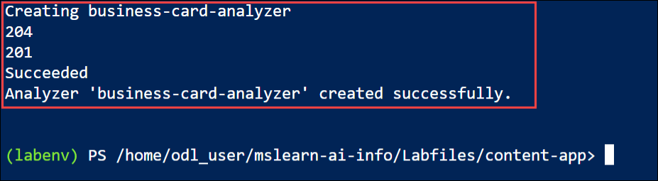

## Task 3: Use the REST API to analyze content

In this task, you’ll edit the provided Python client application to consume the Content Understanding analyzer you created. You’ll implement the `analyze_card` function to submit an image to the analyzer, poll for the analysis results, and then process and display the extracted fields. Finally, you’ll run the application on sample business card images to verify that the analyzer returns the expected values.

1. In the cloud shell command line, enter the following command to edit the **read-card.py** Python code file that has been provided. The Python code file is opened in a code editor.

    ```
    code read-card.py
    ```

    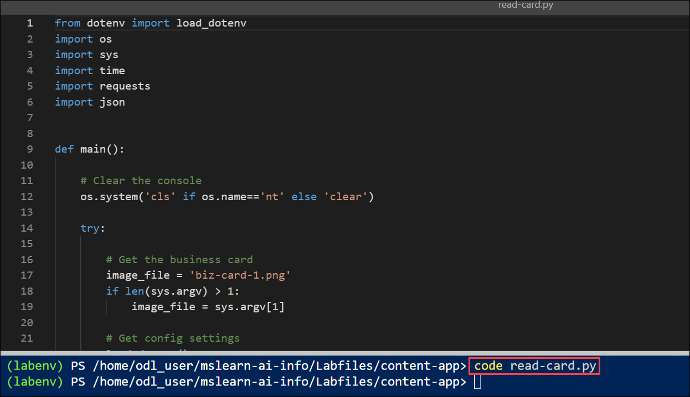

1. Review the code, which:
    - Identifies the image file to be analyzed, with a default of **biz-card-1.png**.
    - Retrieves the endpoint and key for your Azure AI Services resource from the project (using the Azure credentials from the current cloud shell session to authenticate).
    - Calls a function named **analyze_card**, which is currently not implemented

1. In the **analyze_card** function, find the comment **Use Content Understanding to analyze the image** and add the following code (being careful to maintain the correct indentation):

    ```python
    # Use Content Understanding to analyze the image
    print (f"Analyzing {image_file}")

    # Set the API version
    CU_VERSION = "2025-05-01-preview"

    # Read the image data
    with open(image_file, "rb") as file:
            image_data = file.read()
        
    ## Use a POST request to submit the image data to the analyzer
    print("Submitting request...")
    headers = {
            "Ocp-Apim-Subscription-Key": key,
            "Content-Type": "application/octet-stream"}
    url = f'{endpoint}/contentunderstanding/analyzers/{analyzer}:analyze?api-version={CU_VERSION}'
    response = requests.post(url, headers=headers, data=image_data)

    # Get the response and extract the ID assigned to the analysis operation
    print(response.status_code)
    response_json = response.json()
    id_value = response_json.get("id")

    # Use a GET request to check the status of the analysis operation
    print ('Getting results...')
    time.sleep(1)
    result_url = f'{endpoint}/contentunderstanding/analyzerResults/{id_value}?api-version={CU_VERSION}'
    result_response = requests.get(result_url, headers=headers)
    print(result_response.status_code)

    # Keep polling until the analysis is complete
    status = result_response.json().get("status")
    while status == "Running":
            time.sleep(1)
            result_response = requests.get(result_url, headers=headers)
            status = result_response.json().get("status")

    # Process the analysis results
    if status == "Succeeded":
            print("Analysis succeeded:\n")
            result_json = result_response.json()
            output_file = "results.json"
            with open(output_file, "w") as json_file:
                json.dump(result_json, json_file, indent=4)
                print(f"Response saved in {output_file}\n")

            # Iterate through the fields and extract the names and type-specific values
            contents = result_json["result"]["contents"]
            for content in contents:
                if "fields" in content:
                    fields = content["fields"]
                    for field_name, field_data in fields.items():
                        if field_data['type'] == "string":
                            print(f"{field_name}: {field_data['valueString']}")
                        elif field_data['type'] == "number":
                            print(f"{field_name}: {field_data['valueNumber']}")
                        elif field_data['type'] == "integer":
                            print(f"{field_name}: {field_data['valueInteger']}")
                        elif field_data['type'] == "date":
                            print(f"{field_name}: {field_data['valueDate']}")
                        elif field_data['type'] == "time":
                            print(f"{field_name}: {field_data['valueTime']}")
                        elif field_data['type'] == "array":
                            print(f"{field_name}: {field_data['valueArray']}")
    ```

    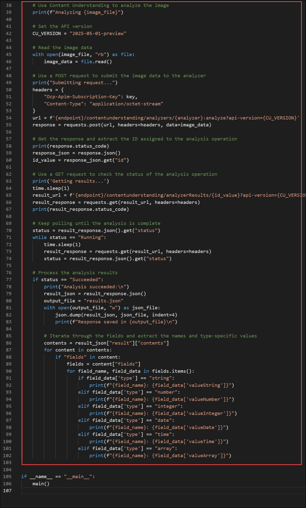

1. Review the code you added, which:
    - Reads the contents of the image file
    - Sets the version of the Content Understanding REST API to be used
    - Submits an HTTP *POST* request to your Content Understanding endpoint, instructing the to analyze the image.
    - Checks the response from the operation to retrieve an ID for the analysis operation.
    - Repeatedly submits an HTTP *GET* request to your Content Understanding endpoint to check the operation status until it is no longer running.
    - If the operation has succeeded, saves the JSON response, and then parses the JSON and displays the values retrieved for each type-specific field.

        > **Note**: In our simple business card schema, all of the fields are strings. The code here illustrates the need to check the type of each field so that you can extract values of different types from a more complex schema.

1. Use the **CTRL+S** command to save the code changes, but keep the code editor pane open in case you need to correct any errors in the code. Resize the panes so you can clearly see the command line pane.

1. In the cloud shell command line pane, enter the following command to run the Python code:

    ```
    python read-card.py biz-card-1.png
    ```

1. Review the output from the program, which should show the values for the fields in the following business card:

    

    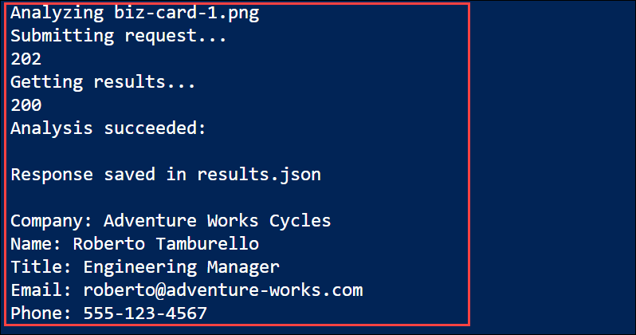

1. Use the following command to run the program with a different business card:

    ```
    python read-card.py biz-card-2.png
    ```

1. Review the results, which should reflect the values in this business card:

    

    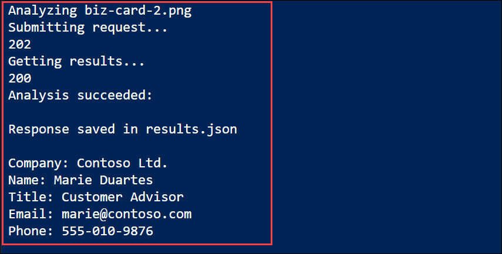

1. In the cloud shell command line pane, use the following command to view the full JSON response that was returned:

    ```
    cat results.json
    ```

    Scroll to view the JSON.

## Summary

In this lab, you worked with **Azure AI Content Understanding** to extract structured information from images of business cards. You first created an Azure AI Foundry hub and project, then used the REST API to create a Content Understanding analyzer based on a JSON schema. Finally, you built a Python client application to consume the analyzer, submitting business card images for analysis and retrieving the extracted field values.

Through these steps, you learned how to set up an Azure AI project, create and deploy a Content Understanding analyzer, and develop a client application to interact with the analyzer and process image-based data.

### You have successfully completed the Hands-on Lab!
