# Lab 34: Develop a Content Understanding client application

### Estimated Duration: 30 Minutes

## Lab Overview

In this lab, you’ll build an end-to-end solution using **Microsoft Foundry** to develop a Content Understanding application for extracting information from business cards. You’ll begin by creating a Foundry project and configuring the required resources, then connect your project to **Content Understanding Studio** to enable and deploy the necessary models.

You’ll then set up your development environment in **Visual Studio Code**, clone a sample repository, and configure your application using environment variables. Using Python and the **Azure Content Understanding SDK**, you’ll create an analyzer based on a defined schema and use it to process images of business cards. Finally, you’ll authenticate with Azure, run the application, and extract structured data such as names, titles, emails, and phone numbers from the images.

## Lab Objectives

In this lab, you'll perform the following tasks:

* Task 1: Create a Microsoft Foundry resource and project
* Task 2: Configure Content Understanding models and connection
* Task 3: Prepare the development environment
* Task 4: Create an analyzer with the Python SDK
* Task 5: Analyze content using the Python SDK

## Task 1: Create a Microsoft Foundry resource and project

In this task, you'll sign in to the Microsoft Foundry portal and create a new project with the required Azure resources.

1. Open a new tab in the browser, right-click on the following link [Foundry portal](https://ai.azure.com), then **Copy link** and paste it in a browser tab to log in to **Microsoft Foundry portal**.

1. Click on **Sign in**.

    

1. If prompted, provide the credentials below:

   - **Email/Username:** <inject key="AzureAdUserEmail"></inject>

   - **Password:** <inject key="AzureAdUserPassword"></inject>

      >**Note:** Close any tips or quick start panes that are opened the first time you sign in, and if necessary, use the **Foundry** logo at the top left to navigate to the home page.

1. At the top of the **Microsoft Foundry** portal, enable the **New Foundry toggle (1)** to switch to the latest Foundry user interface.   

1. From the **Select a project to continue** dialog, click the drop-down under **Select or search for a project**, and then select **Create a new project (2)**.

     

1. In the **Create a project** window, enter **Myproject<inject key="DeploymentID" enableCopy="false"/> (1)** as the project name. Open the **Advanced options (2)** drop-down, fill in the following details, and then click **Create (6)**:

    * Subscription: **Choose Default Subscription (3)**
    * Resource group: **AI-102-RG033 (4)**
    * Microsoft Foundry resource: **Keep as Default**
    * Region: **<inject key="Region"></inject> (5)**

        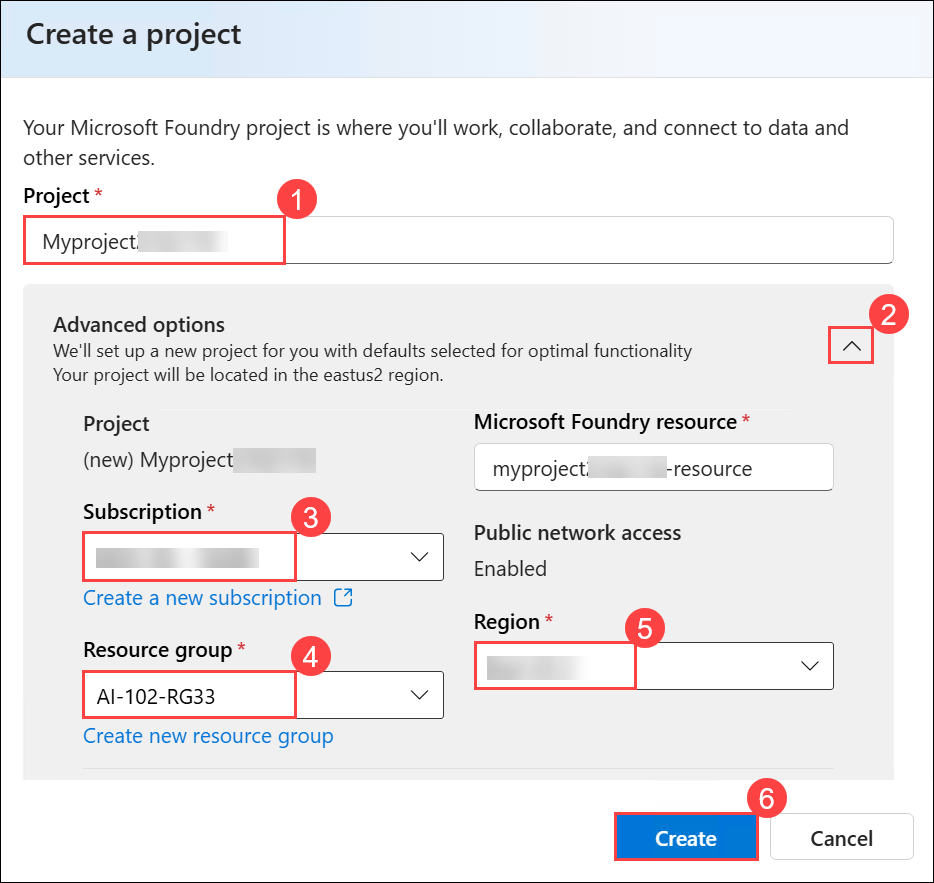 

        >**Note:** Azure Content Understanding is available in selected regions. See the [region support documentation](https://learn.microsoft.com/azure/ai-services/content-understanding/language-region-support) for the latest availability.

1. Wait for your project to be created. It may take around 1-2 minutes.

1. If you see the **“Welcome to the new Microsoft Foundry”** window, you can either explore the information using **Next**, or close it by selecting the **X** in the top-right corner to continue.

    

1. After the project is created, click the project name at the top of the page **(1)**, then select **Project details (2)**. 

    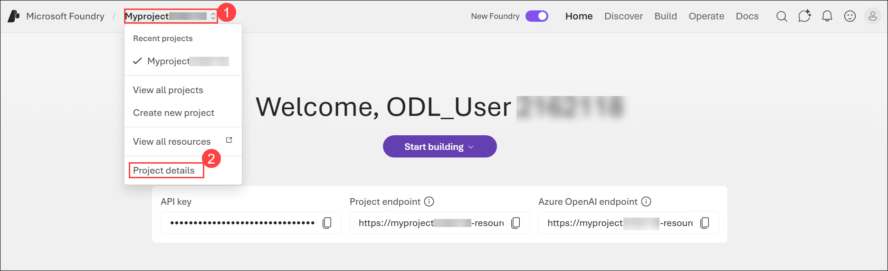

1. On the **Project details** page, follow the link to the parent resource, then copy the **Endpoint** and save it in a notepad for use later in the lab. Keep this browser tab open.

    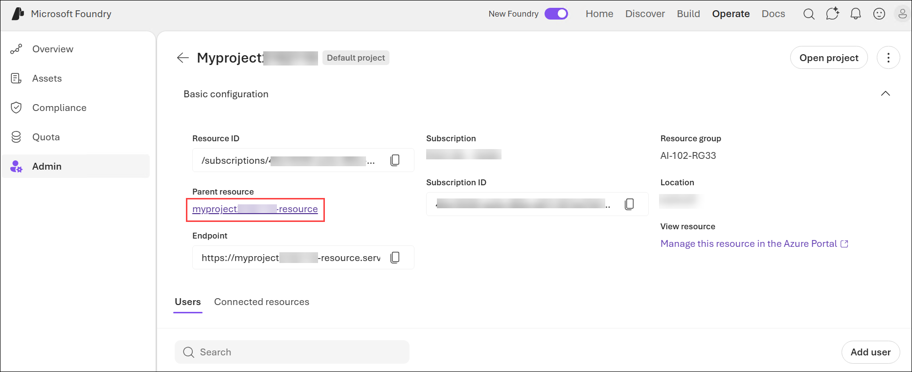

    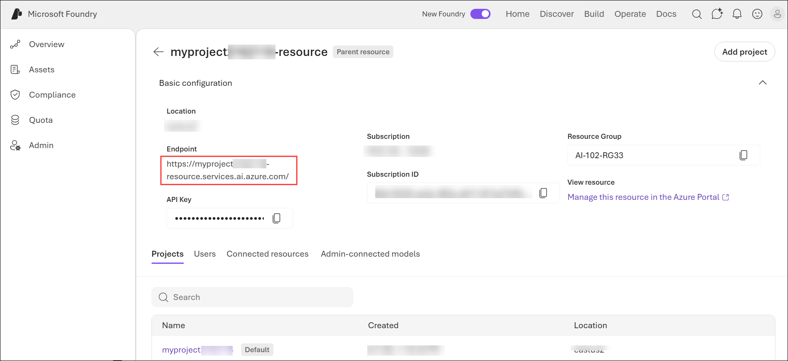


## Task 2: Configure Content Understanding models and connection

In this task, you'll connect your Foundry resource to Content Understanding Studio and deploy the required models for analysis.

Content Understanding uses OpenAI models for analysis that are deployed in your project. You need to deploy these models before using analyzers, and set up the connection between Content Understanding and your Foundry resource. The easiest way is through the Content Understanding Studio.

1. In a new tab, navigate to [Content Understanding Studio](https://contentunderstanding.ai.azure.com/home) at `https://contentunderstanding.ai.azure.com/home`

1. On the homepage of **Content Understanding Studio** click on **Sign in**.

    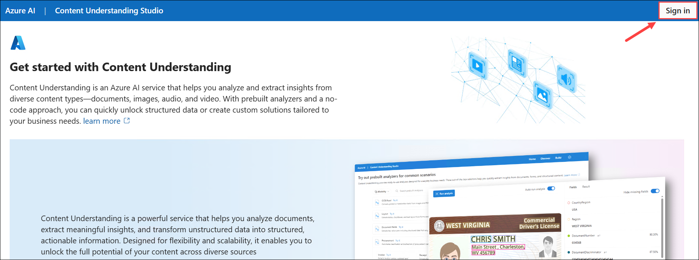

1. If prompted, provide the credentials below:

   - **Email/Username:** <inject key="AzureAdUserEmail"></inject>

   - **Password:** <inject key="AzureAdUserPassword"></inject>

1. Select the **Settings (gear) icon (1)** on the top navigation bar, then click **+ Add resource (2)** to connect a resource.

    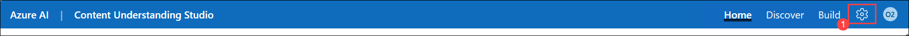

    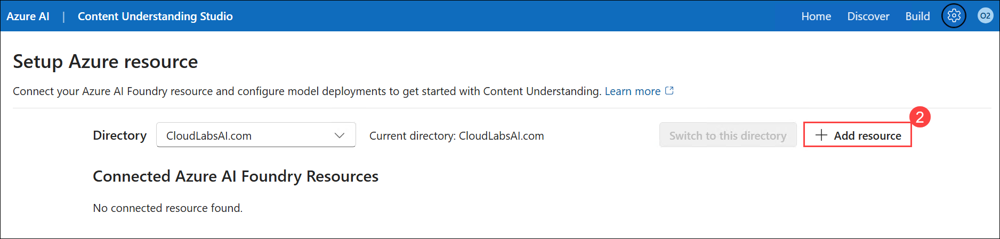

1. In the **Set up your default resource** window, select the required details and proceed:

    * Subscription name: **Select your subscription (1)**
    * Resource group name: **AI-102-RG33 (2)**
    * Resource name: **Select your Foundry resource (3)**
    * Enable auto-deployment: **Ensure this option is checked (4)**

    - Then, click **Next (5)** to continue.

        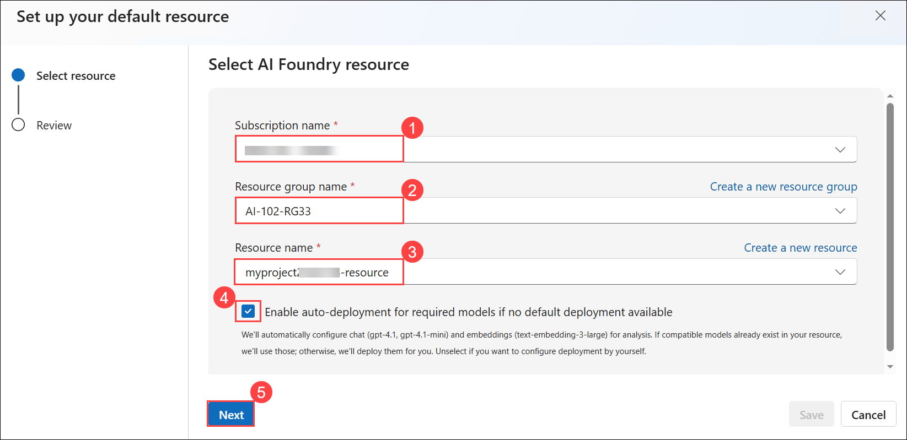

1.  Click on **Save** to create the configuration.

    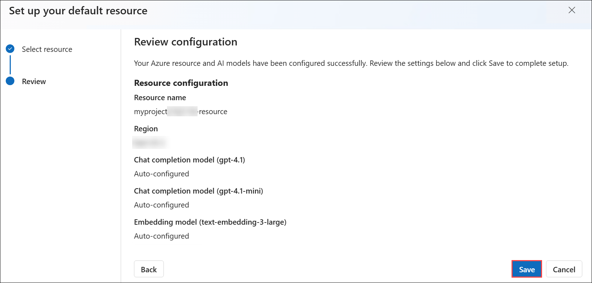

1. Wait while it deploys the required models for Content Understanding.

    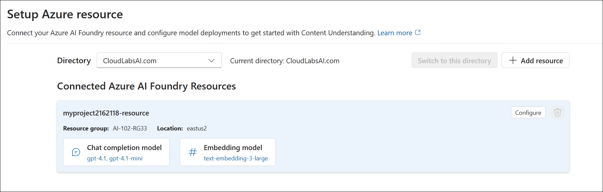

## Task 3: Prepare the development environment

In this task, you'll set up Visual Studio Code, clone the sample repository, and configure the environment for development.

1. On the desktop, locate **Visual Studio Code**, and then double-click the icon to open it.

    

1. Open the Command Palette by pressing **Ctrl+Shift+P** , type **`Git: Clone`** **(1)**, and then select **Git: Clone** (2) from the list.

    

1. In the URL bar, paste the following repository URL and press **Enter**:

    ```
    https://github.com/microsoftlearning/mslearn-ai-information-extraction
    ```

    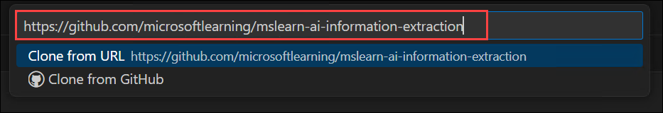

1. In the folder selection window, choose the **Downloads** folder **(1)**, and then select **Select as Repository Destination** **(2)**.

    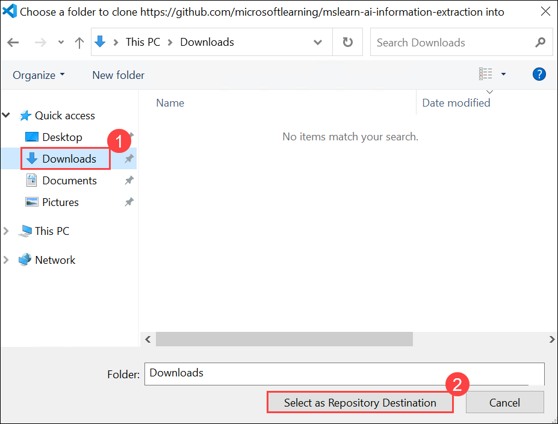

1. When prompted, select **Open** to open the cloned repository in Visual Studio Code.

    

1. When prompted, select **Yes, I trust the authors** to trust the folder and enable all features.

    

1. In Visual Studio Code, open the **Extensions** pane **(1)**, search for **Python** **(2)**, select the **Python** extension by Microsoft **(3)**, and then click **Install** **(4)** if it is not already installed.

    

1. In the **Explorer** pane, expand the **Labfiles (1)** folder, then navigate to **02-content-understanding-api (2)**. This folder contains the business card images **(3)** and the Python code files **(4)** required to build your application.

    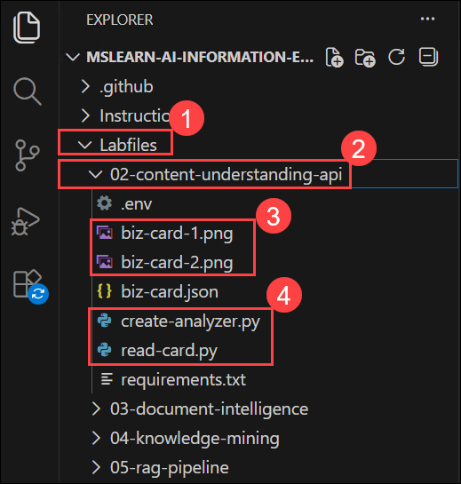

1. In the **Explorer** pane, right-click the **requirements.txt** file **(1)**, and then select **Open in Integrated Terminal** **(2)**.

    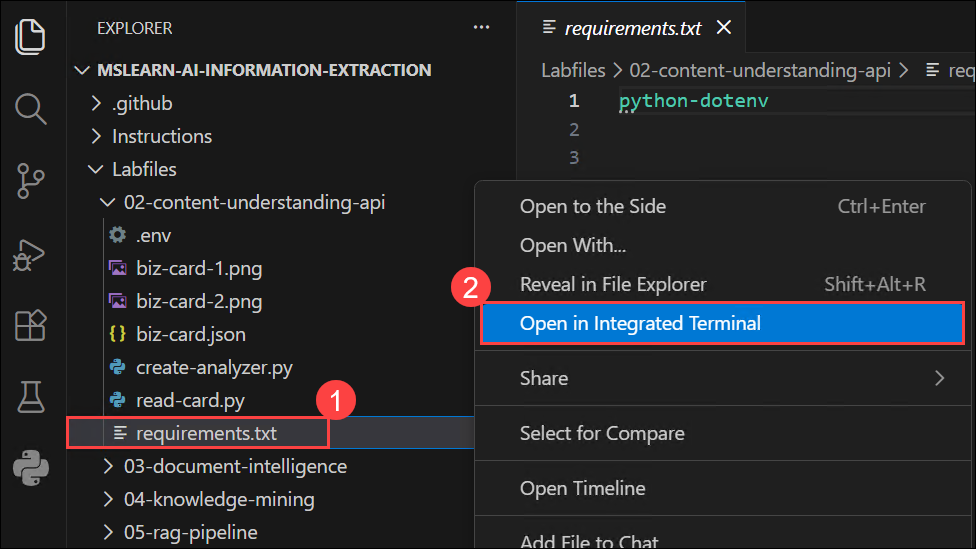

1. Run the following command in the terminal to install the required libraries:

    ```
   python -m venv labenv
   labenv\Scripts\activate
   pip install -r requirements.txt azure-identity azure-ai-contentunderstanding
    ```

1. In the VS Code Explorer pane, open the **.env** file in the **Labfiles/02-content-understanding-api** folder.

    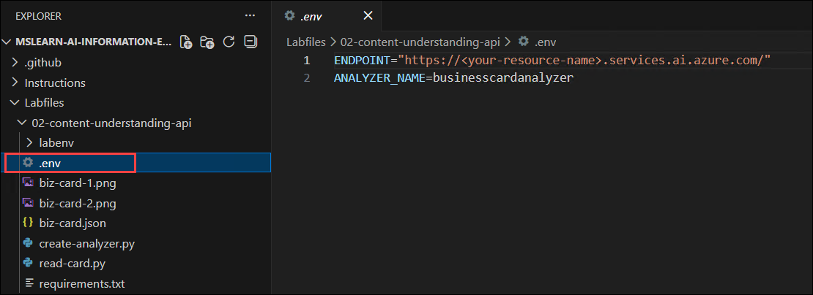

1. In the file, replace the **YOUR_ENDPOINT (1)** placeholder with your Microsoft Foundry resource endpoint and ensure that **ANALYZER_NAME (2)** is set to `businesscardanalyzer`.

    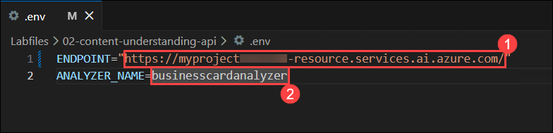

    > **Note:** You can also find the endpoint in the [Azure portal](https://portal.azure.com) by navigating to your Microsoft Foundry resource and viewing **Resource Management** > **Keys and Endpoint**.

1. Make sure save the file using **CTRL+S**.

## Task 4: Create an analyzer with the Python SDK

In this task, you'll use the Azure Content Understanding SDK to create an analyzer based on a defined schema for extracting business card information.

1. In the VS Code Explorer pane, open the **biz-card.json** file and review its contents. This JSON defines an analyzer schema for a business card, specifying the fields to extract (Company, Name, Title, Email, Phone).

    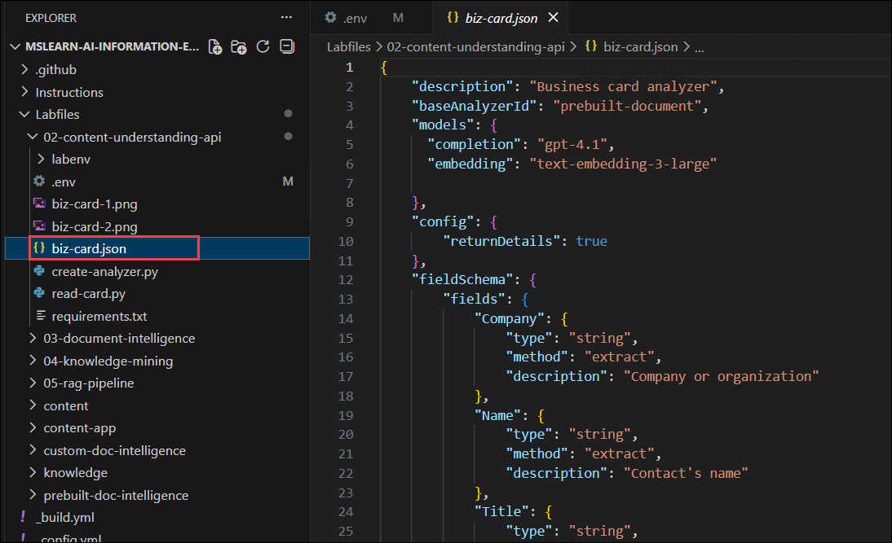

1. Open the **create-analyzer.py** file in VS Code.

    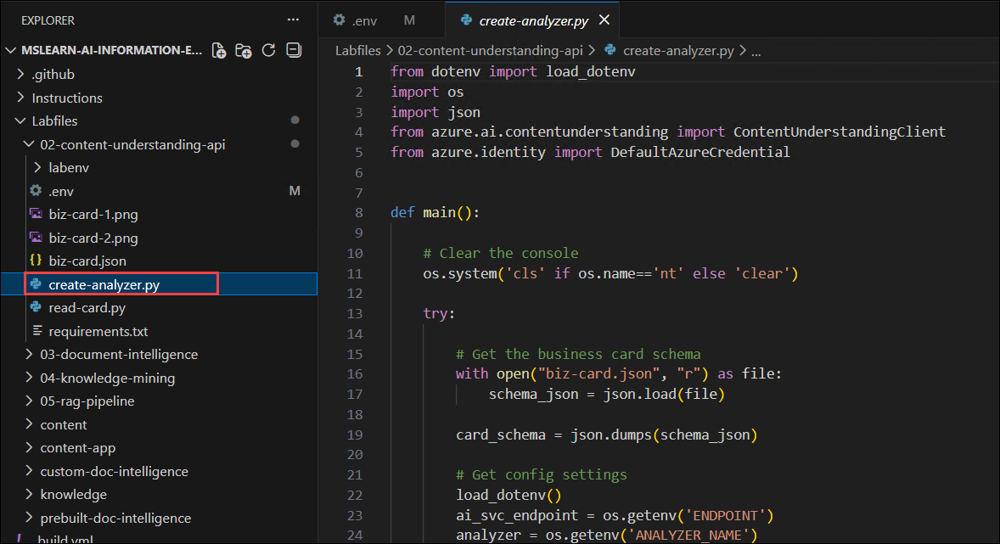

1. Review the code, which:

    - Imports the `ContentUnderstandingClient` and `AzureKeyCredential` from the [Azure Content Understanding SDK](https://learn.microsoft.com/python/api/overview/azure/ai-contentunderstanding-readme?view=azure-python-preview).
    - Loads the analyzer schema from the **biz-card.json** file.
    - Retrieves the endpoint, key, and analyzer name from the environment configuration file.
    - Calls a function named **create_analyzer**, which is currently not implemented.

1. In the **create_analyzer** function, find the comment **Create a Content Understanding analyzer** and add the following code (being careful to maintain the correct indentation):

    ```python
    # Create a Content Understanding analyzer
    print(f"Creating {analyzer}")

    # Create the Content Understanding client
    client = ContentUnderstandingClient(
        endpoint=endpoint,
        credential=DefaultAzureCredential()
    )

    # Parse the schema JSON into a ContentAnalyzer object
    analyzer_definition = json.loads(schema)

    # Create the analyzer using the SDK (long-running operation)
    poller = client.begin_create_analyzer(
        analyzer_id=analyzer,
        resource=analyzer_definition,
        allow_replace=True
    )

    # Wait for the operation to complete
    result = poller.result()
    print(f"Analyzer '{analyzer}' created successfully.")
    print(f"Status: {result['status'] if isinstance(result, dict) else 'Succeeded'}")
    ```

    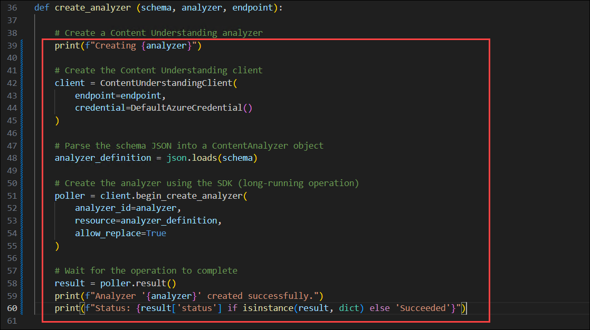

1. Review the code you added, which:
    - Creates a `ContentUnderstandingClient` instance with the endpoint and API key.
    - Parses the analyzer schema JSON.
    - Uses `begin_create_analyzer` to start the long-running operation to create the analyzer.
    - Calls `.result()` to wait for the operation to complete.

    > **Note**: The SDK handles polling automatically through the `LROPoller` pattern — no manual polling is needed!

1. Now save the file using **CTRL+S**.

1. In the Visual Studio Code terminal, enter the following command to sign into Azure

     ```powershell
     az login
     ```

     > **Note:** Minimize the VS Code to see the **Sign in** window.

1. In the **Sign in** window, select **Work or school account** **(1)**, and then select **Continue** **(2)**.

    

1. On the **Sign in** page, provide the credentials below:
 
    - **Email/Username:** <inject key="AzureAdUserEmail"></inject>
    
      

    - **Password:** <inject key="AzureAdUserPassword"></inject>
    
      

1. When prompted, select **Yes** to sign in to all apps and websites on this device.

    

1. On the **Account added to this device** window, select **Done** to complete the sign-in process.

    

1. In the Visual Studio Code terminal, press **Enter** to select the default subscription.

    

1. In the VS Code terminal (make sure the virtual environment is still activated and you're in the **Labfiles/02-content-understanding-api** folder), run the Python code:

    ```
    python create-analyzer.py
    ```

1. Review the output from the program, which should indicate that the analyzer has been created.

    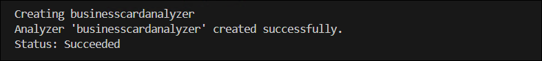

## Task 5: Analyze content using the Python SDK

In this task, you'll use the created analyzer to process business card images and extract structured data such as contact details.

1. In VS Code, open the **read-card.py** file.

    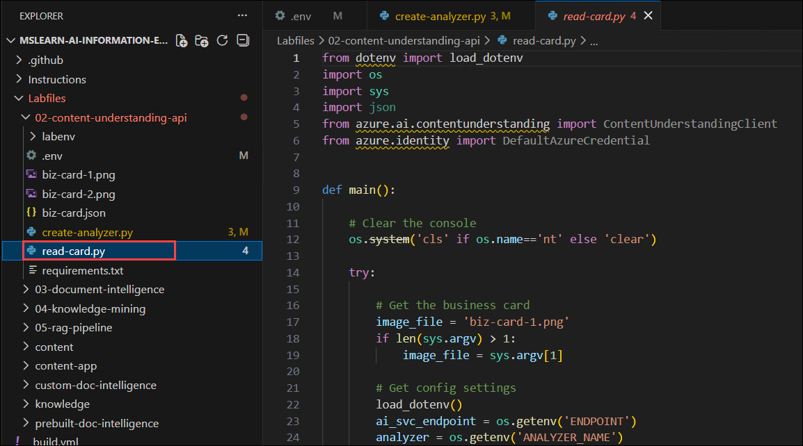

1. Review the code, which:
    - Imports the `ContentUnderstandingClient` and `AzureKeyCredential` from the SDK.
    - Identifies the image file to be analyzed, with a default of **biz-card-1.png**.
    - Retrieves the endpoint and key from the environment configuration file.
    - Calls a function named **analyze_card**, which is currently not implemented.

1. In the **analyze_card** function, find the comment **Use Content Understanding to analyze the image** and add the following code (being careful to maintain the correct indentation):

    ```python
    # Use Content Understanding to analyze the image
    print(f"Analyzing {image_file}")

    # Create the Content Understanding client
    client = ContentUnderstandingClient(
        endpoint=endpoint,
        credential=DefaultAzureCredential()
    )

    # Read the image data
    with open(image_file, "rb") as file:
        image_data = file.read()

    # Submit the image for analysis
    print("Submitting request...")
    poller = client.begin_analyze_binary(
        analyzer_id=analyzer,
        binary_input=image_data
    )

    # Wait for the analysis to complete
    result = poller.result()
    print("Analysis succeeded:\n")

    # Save JSON results to a file
    output_file = "results.json"
    with open(output_file, "w") as json_file:
        json.dump(dict(result), json_file, indent=4, default=str)
        print(f"Response saved in {output_file}\n")

    # Iterate through the contents and extract fields
    for content in result.contents:
        if hasattr(content, 'fields') and content.fields:
            for field_name, field_data in content.fields.items():
                value = field_data.value if hasattr(field_data, 'value') else None
                print(f"{field_name}: {value}")
    ```

    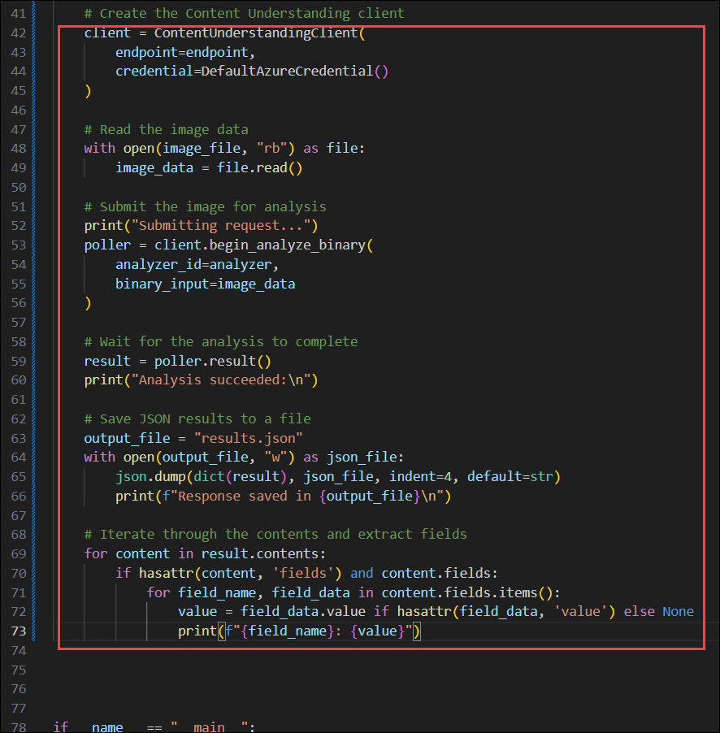

1. Review the code you added, which:
    - Creates a `ContentUnderstandingClient` instance.
    - Reads the content of the image file as bytes.
    - Calls `begin_analyze_binary` to submit the image to the analyzer (the SDK handles the asynchronous polling automatically).
    - Calls `.result()` to wait for and retrieve the analysis results.
    - Saves the JSON response and parses the extracted fields.

1. Make sure to save the file using **CTRL+S**.

1. In the VS Code terminal, run the Python code:

    ```
    python read-card.py biz-card-1.png
    ```

1. Review the output from the program, which should show the values for the fields in the following business card:

    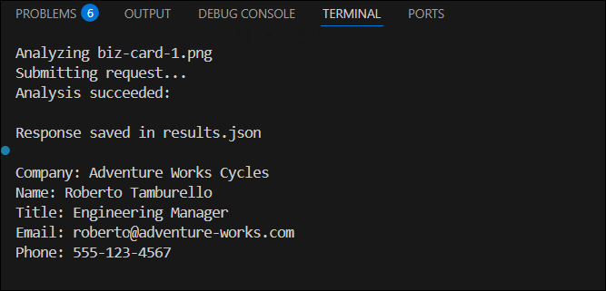

    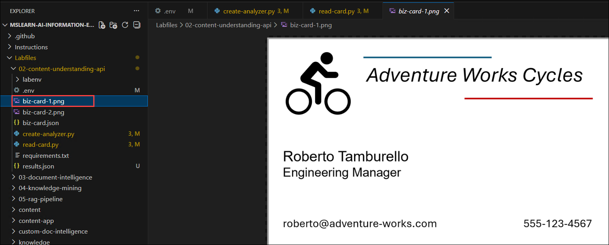

1. Run the program again with a different business card:

    ```
    python read-card.py biz-card-2.png
    ```

1. Review the results, which should reflect the values in this business card:

    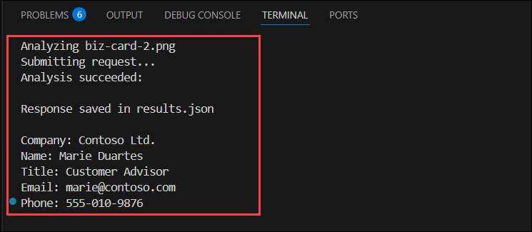

    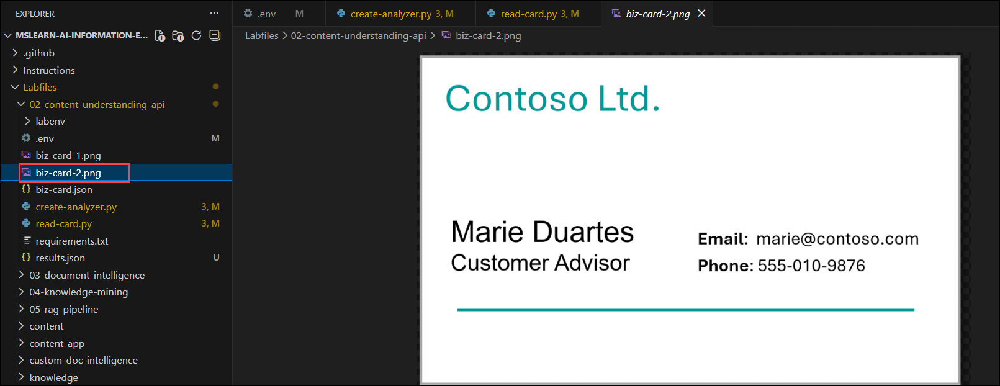

1. To view the full JSON response that was returned, open the **results.json** file in VS Code, or run the following command in the terminal:

    ```
    cat results.json
    ```

    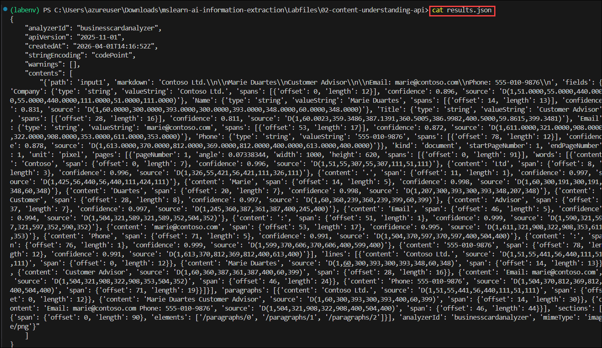

## Summary

In this exercise, you developed a Content Understanding application using Microsoft Foundry by configuring resources and deploying the required models. You explored Content Understanding Studio, created an analyzer using the Python SDK, and built a client application to process business card images. You then authenticated with Azure, ran the application, and extracted structured information such as contact details from the images. Great work!

### You have successfully completed the Hands-on Lab!