# Lab 34: Analyze forms with custom Azure AI Document Intelligence models

### Estimated Duration : 30 Minutes

## Overview

Organizations often deal with large volumes of documents like invoices, forms, or receipts that require manual data entry into business systems. This process is time-consuming, error-prone, and costly. To address this, you can use AI services to automatically extract structured information from documents and streamline workflows.

**Azure AI Document Intelligence** provides tools to analyze and process documents by extracting text, tables, and key-value pairs using OCR. Along with prebuilt models for common scenarios such as invoices and business cards, it also allows you to train **custom models** tailored to your own documents.

In this lab, you’ll walk through creating a Document Intelligence resource, preparing training data, training a custom model, and then testing it with a Python client application.

## Lab Objectives

- **Task 1:** Create a Azure AI Document Intelligence resource

- **Task 2:** Prepare to develop an app in Cloud Shell

- **Task 3:** Gather documents for training

- **Task 4:** Train the model using Document Intelligence Studio

## Task 1: Create a Azure AI Document Intelligence resource

In this task, you'll create an **Azure AI Document Intelligence** resource in your Azure subscription using the Azure portal. This resource will provide the service endpoint and key that your applications will use to analyze and process documents.

1. Open the Azure portal at `https://portal.azure.com`, and sign in using the Microsoft account.

1. If prompted, provide the credentials below:

    - **Email/Username:** <inject key="AzureAdUserEmail"></inject>

        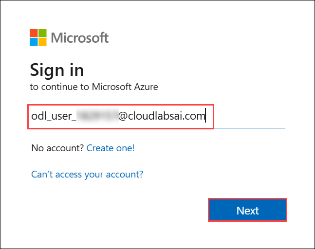

    - **Password:** <inject key="AzureAdUserPassword"></inject>

        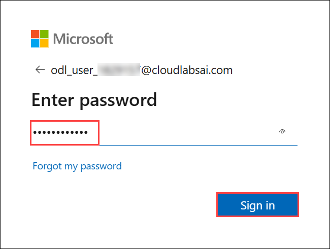

1. When the **Stay signed in?** window appears, select **No**.

    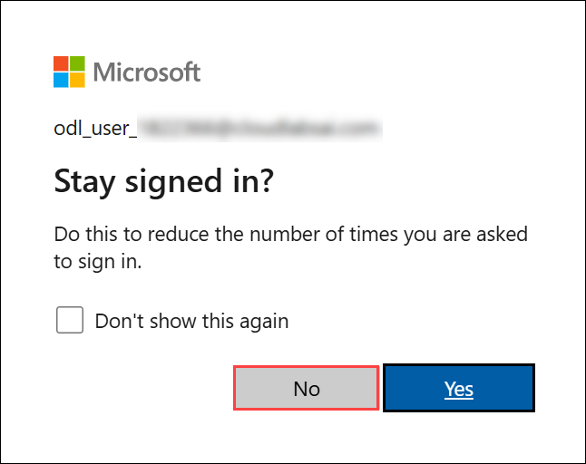

    >**Note:** If the **Welcome to Microsoft Azure** window appears, select **Cancel**.

    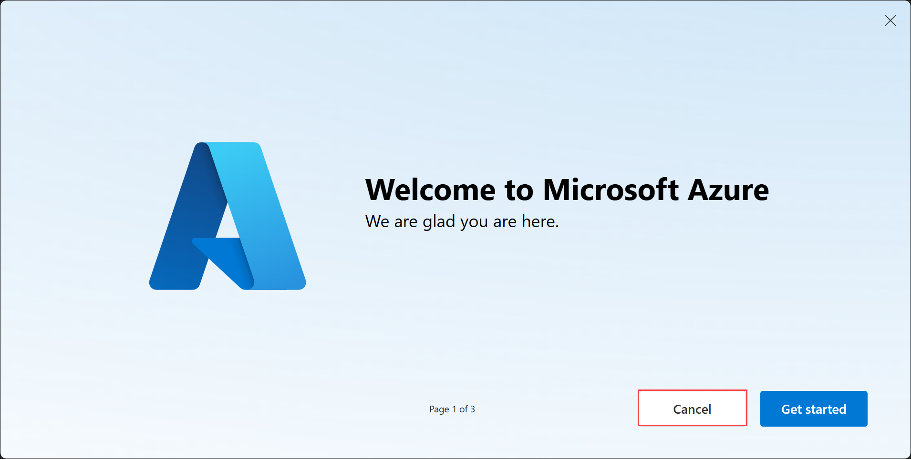

1. On the Azure portal home page, use the top search bar to enter **Document Intelligence (1)**, then select **Document Intelligence (2)** from the results.

    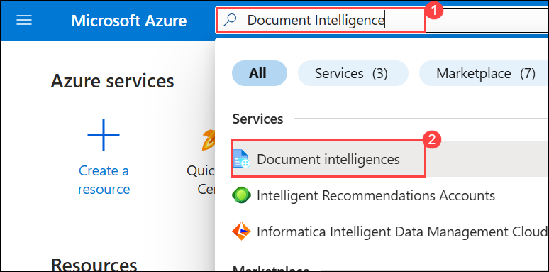

1. On the **AI Foundry | Document Intelligence** page, select **Create**.

    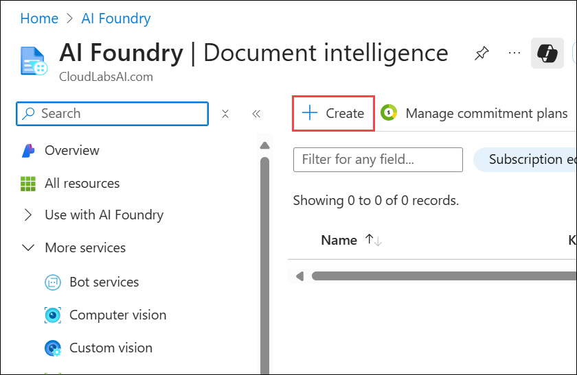

1. On the **Create Document Intelligence** page, provision the resource with the following settings, then select **Review + create (6)**:

    * Subscription: **Default Subscription (1)**
    * Resource group: **AI-102-RG35 (2)**
    * Region: **<inject key="Region"></inject> (3)**
    * Name: **documentintelligence<inject key="DeploymentID"></inject> (4)**
    * Pricing tier: **F0 (5)** (*free*) (**S** (*standard*) if F0 isn’t available)

        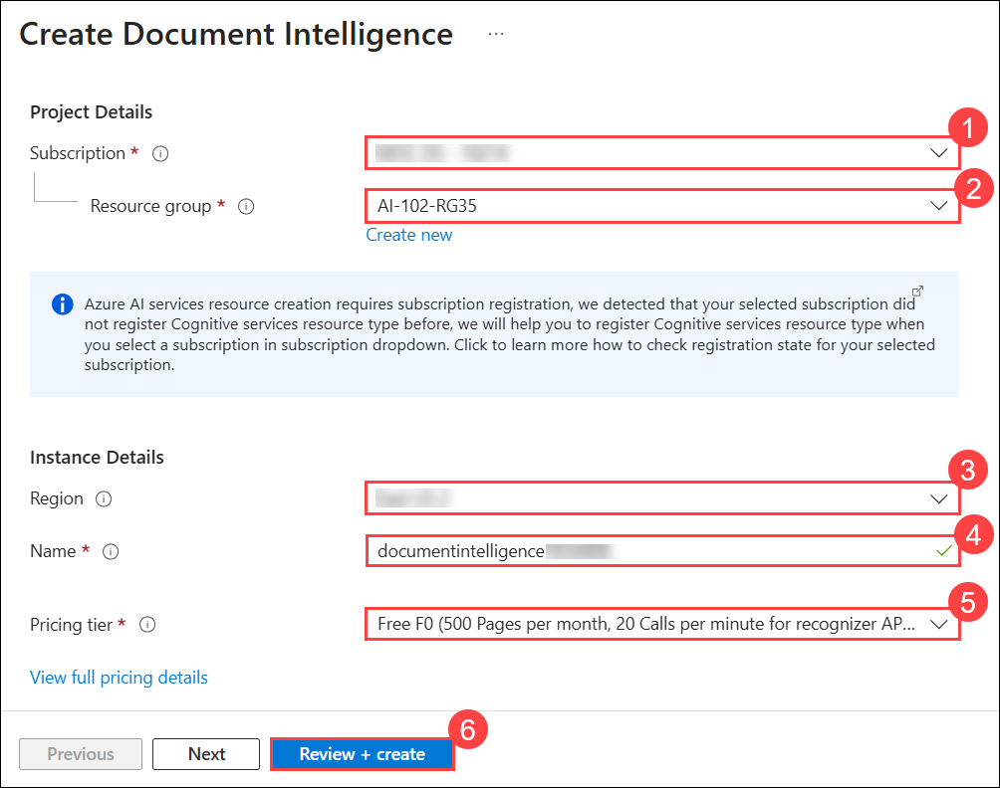

1. On the **Review + create** tab, click **Create** to provision the resource.

    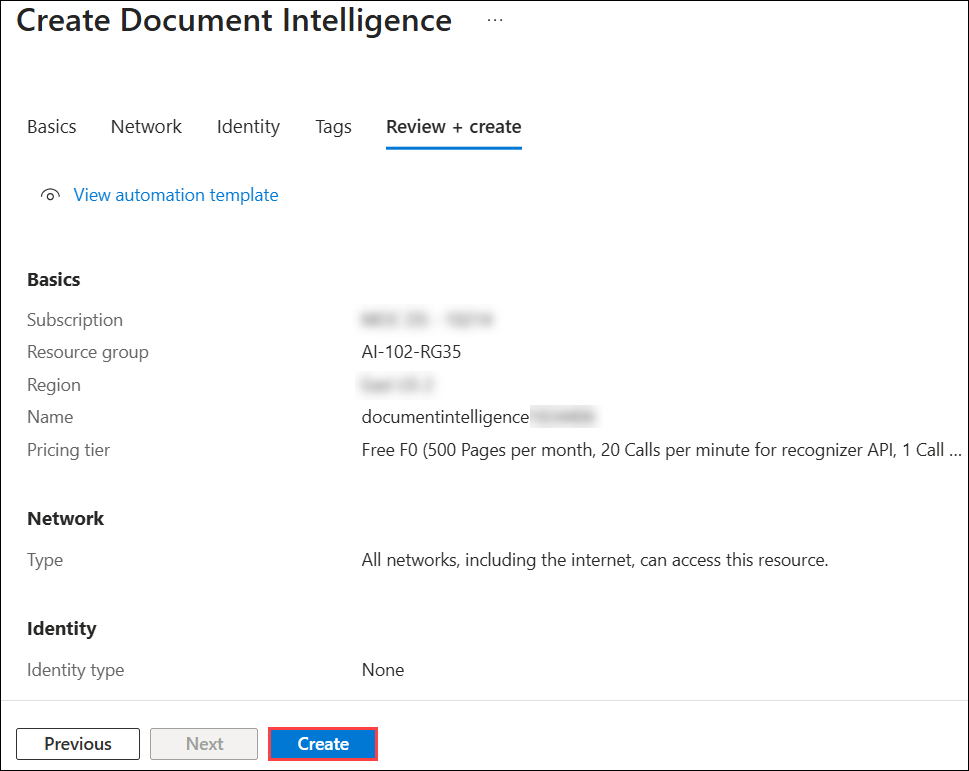

1. When the deployment is complete, select **Go to resource**. 

    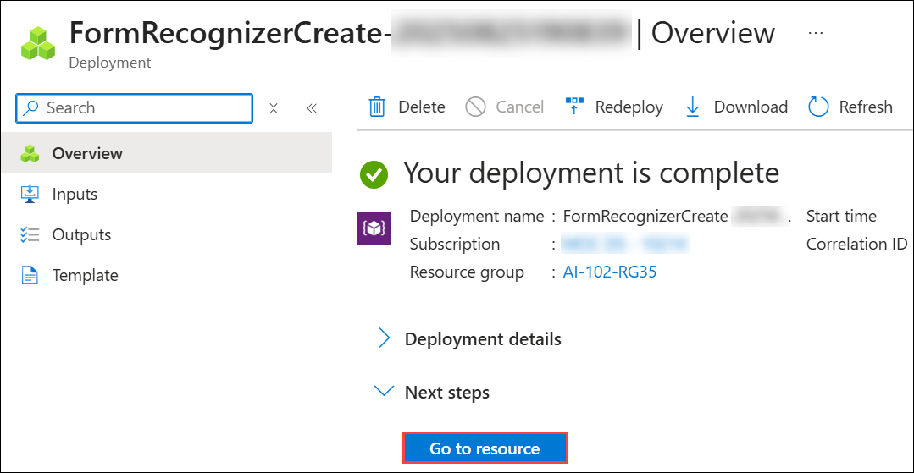

1. Open the **Overview** page to view the resource.

    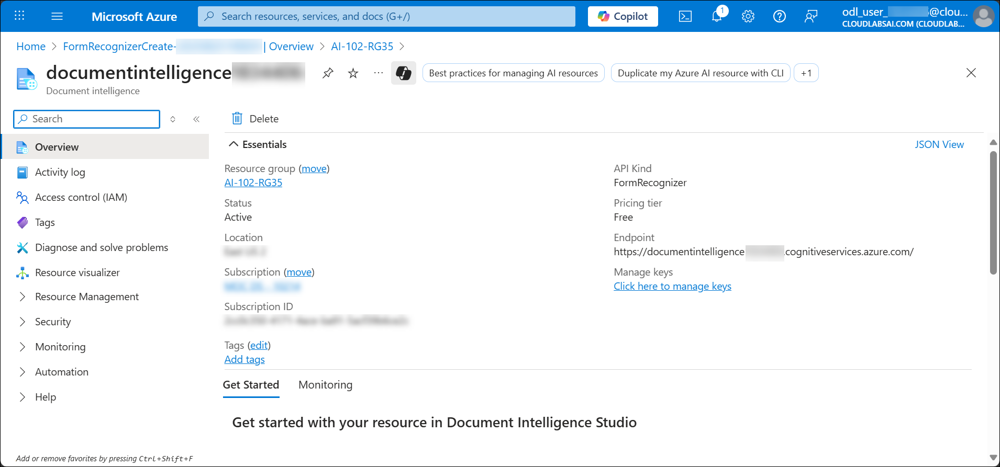

> **Congratulations** on completing the task! Now, it's time to validate it. Here are the steps:
>
> - Hit the Validate button for the corresponding task. If you receive a success message, you can proceed to the next task.
> - If not, carefully read the error message and retry the step, following the instructions in the lab guide.
> - If you need any assistance, please contact us at cloudlabs-support@spektrasystems.com. We are available 24/7 to help.
 
<validation step="90800275-a4dc-4f7d-8d53-b307b95fed37" />

## Task 2: Prepare to develop an app in Cloud Shell

In this task, you'll set up your development environment in Azure Cloud Shell. You’ll configure it to use PowerShell, switch to the classic version, and clone the provided GitHub repository so you can access the code files needed to build your text translation app.

1. On the **[Azure portal](https://portal.azure.com/)** [`https://portal.azure.com`] homepage, click the **\[>\_] Cloud Shell (1)** button located to the right of the **Copilot** tab at the top. This opens a new Cloud Shell session. In the **Welcome to Azure Cloud Shell** window, choose **PowerShell (2)**.

    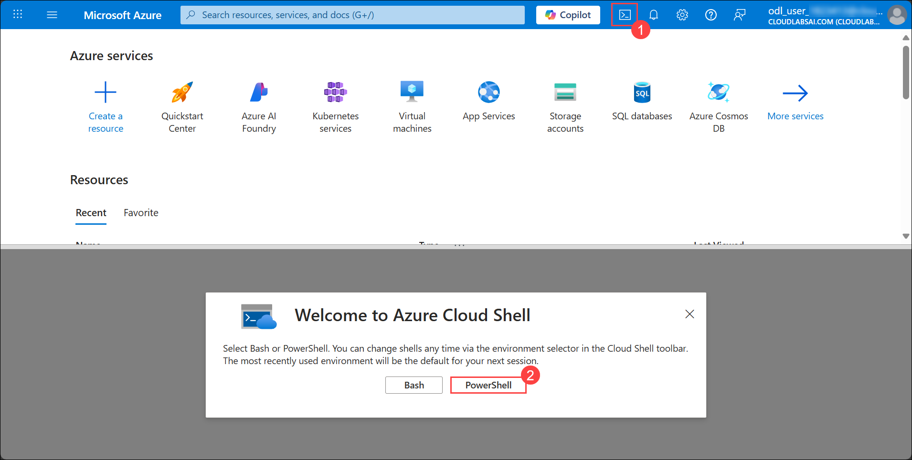

    >**Note:** The cloud shell provides a command-line interface in a pane at the bottom of the Azure portal. You can resize or maximize this pane to make it easier to work in.

    > **Note:** If you have previously created a cloud shell that uses a **Bash** environment, switch it to **PowerShell**.

1. In the **Getting started** window, ensure **No storage account required (1)** is selected. From the **Subscription** drop-down, choose **Default subscription (2)**, then click **Apply (3)**.

    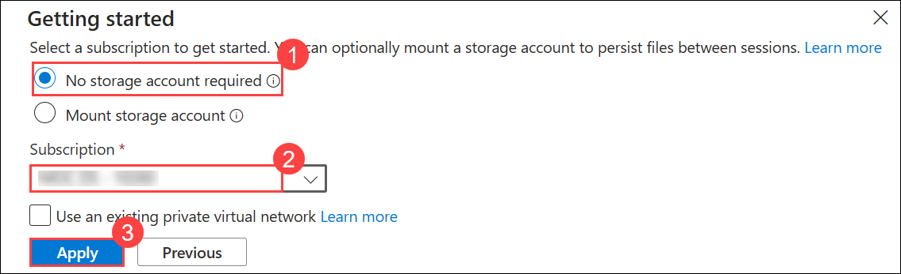

1. In the Cloud Shell toolbar, open the **Settings (1)** menu and choose **Go to Classic version (2)** from the drop-down.

    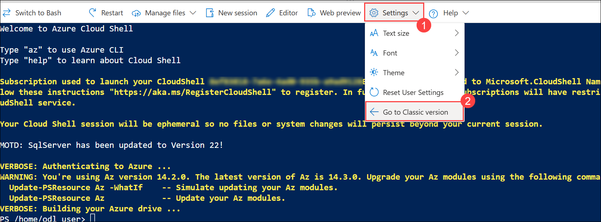

    >**Note:** Ensure you've switched to the classic version of the cloud shell before continuing.

1. In the PowerShell pane, enter the following commands to clone the GitHub repo for this exercise:

    ```
    rm -r mslearn-ai-info -f
    git clone https://github.com/microsoftlearning/mslearn-ai-information-extraction mslearn-ai-info
    ```

    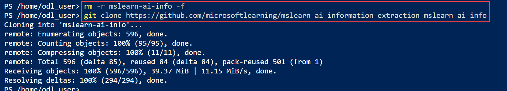

    > **Note:** As you paste commands into the cloudshell, the ouput may take up a large amount of the screen buffer. You can clear the screen by entering the `cls` command to make it easier to focus on each task.

1. After the repo has been cloned, navigate to the folder containing the application code files:  

    ```
    cd mslearn-ai-info/Labfiles/custom-doc-intelligence
    ```

    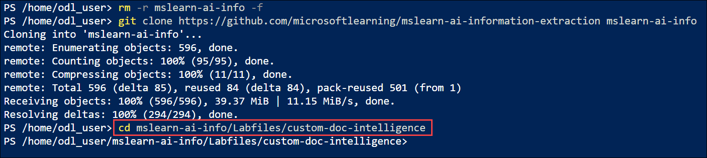

## Task 3: Gather documents for training

In this task, you'll prepare the training data for your custom Document Intelligence model. You’ll review the provided sample forms, configure a setup script with your subscription details, create a storage account, and upload the form images and labels into a blob container so they can be used to train the model.

1. You'll use the sample forms such as this one to train a test a model: 

    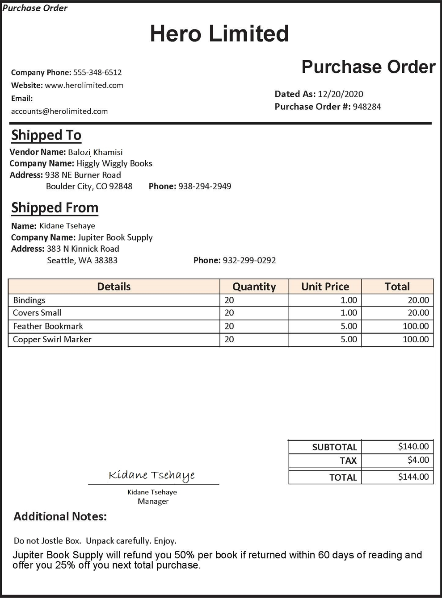

1. In the command line, run `ls ./sample-forms` to list the content in the **sample-forms** folder. Notice there are files ending in **.json** and **.jpg** in the folder.

    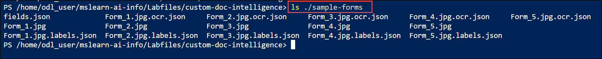

    You will use the **.jpg** files to train your model.  

    The **.json** files have been generated for you and contain label information. The files will be uploaded into your blob storage container alongside the forms.

1. In the **Azure portal** and navigate to your resource's **Overview (1)** page if you're not already there. Under the **Essentials** section, note the **Resource group (2)**, **Location (3)**, and **Subscription ID (4)**. You will need these values in subsequent steps.

    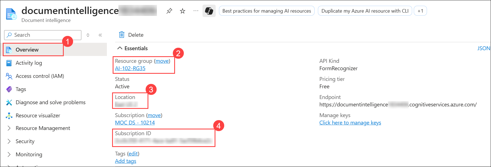

1. Run the following command to open **setup.sh** in a code editor. You will use this script to run the Azure command line interface (CLI) commands required to create the other Azure resources you need.

    ```
    code setup.sh
    ```

    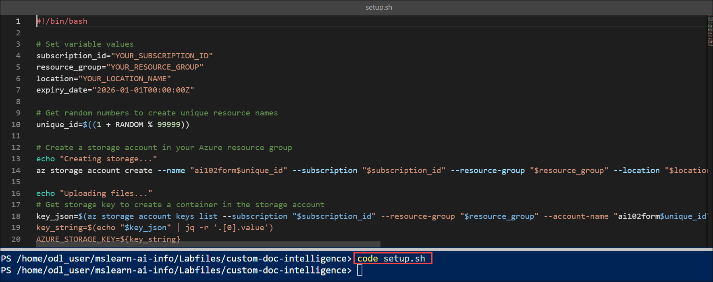

1. In the **setup.sh** script, review the commands. The program will:
    - Create a storage account in your Azure resource group
    - Upload files from your local *sampleforms* folder to a container called *sampleforms* in the storage account
    - Print a Shared Access Signature URI

1. Modify the **subscription_id**, **resource_group**, and **location** variable declarations with the appropriate values for the subscription, resource group, and location name where you deployed the Document Intelligence resource.

    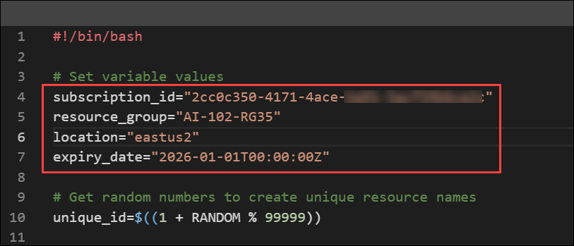

    > **Note:** For your **location** string, be sure to use the code version of your location. For example, if your location is "East US", the string in your script should be `eastus`. You can see that version is the **JSON View** button on the right side of the **Essentials** tab of your resource group in Azure portal.

    >**Note:** If the **expiry_date** variable is in the past, update it to a future date. This variable is used when generating the Shared Access Signature (SAS) URI. In practice, you will want to set an appropriate expiry date for your SAS. You can learn more about SAS [here](https://docs.microsoft.com/azure/storage/common/storage-sas-overview#how-a-shared-access-signature-works).  

1. After you've replaced the placeholders, within the code editor, use the **CTRL+S** command or **Right-click > Save** to save your changes and then use the **CTRL+Q** command or **Right-click > Quit** to close the code editor while keeping the cloud shell command line open.

1. Enter the following commands to make the script executable and to run it:

    ```PowerShell
    chmod +x ./setup.sh
    ./setup.sh
    ```

1. When the script completes, review the displayed output.

    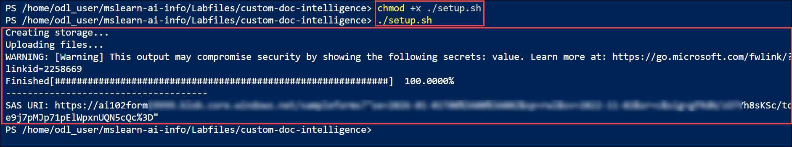

1. In the Azure portal, using the search bar, search for **Resource groups (1)**, and select the **Resource groups (2)** from the result.

    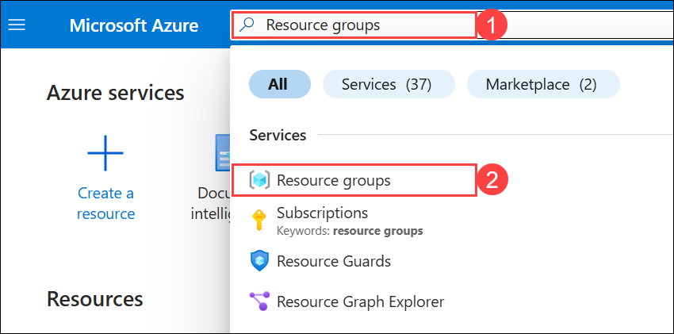

1. From the **Resource groups** blade, select the resource group **AI-102-RG35**.

    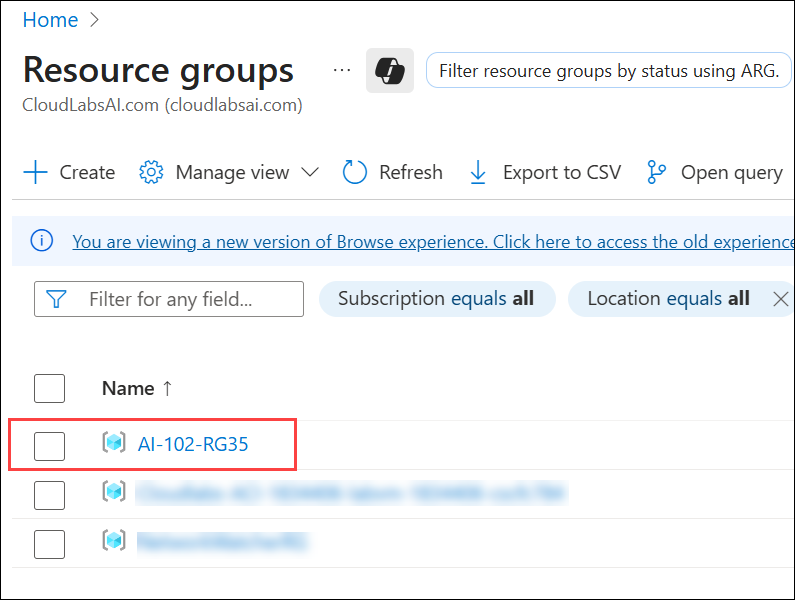

1. In the **Resources** column, confirm that the newly created **Azure Storage account** is listed, then click on it to open the account.

    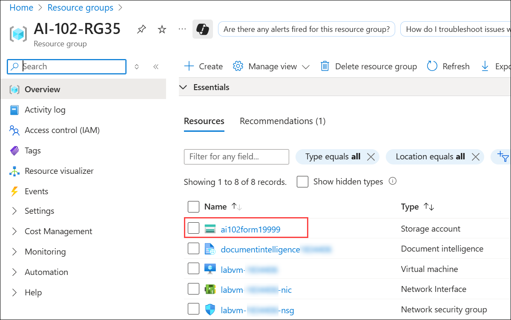

1. Open the storage account and in the pane on the left, select **Storage browser (1)**. Then in Storage Browser, expand **Blob containers (2)**.

    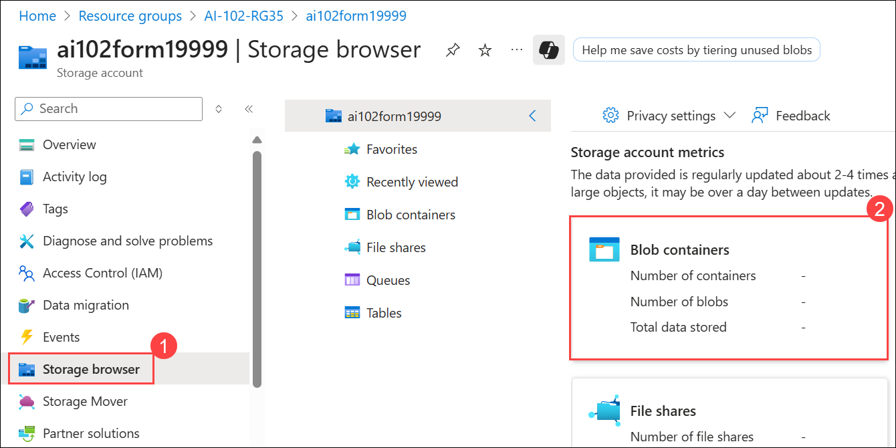

1. Select the **sampleforms** container.

    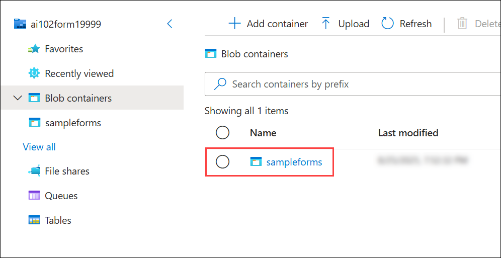

1. Verify that the files have been uploaded from your local **custom-doc-intelligence/sample-forms** folder.

    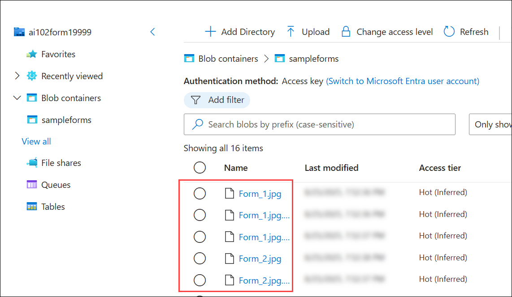

## Task 4: Train the model using Document Intelligence Studio

In this task, you'll use **Document Intelligence Studio** to create a custom extraction project and train your model with the sample forms you uploaded to Azure Storage. By connecting your storage container as the training data source, you’ll build a model that can recognize and extract structured information from similar documents.

1. Open a new browser tab, and navigate to the **Document Intelligence Studio** at `https://documentintelligence.ai.azure.com/studio`.

1. Scroll down to the **Custom models** section and select the **Custom extraction model** tile.

    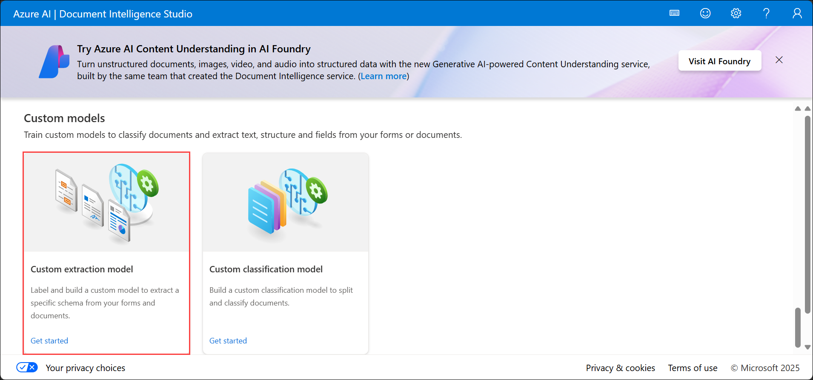

1. If prompted, sign in with your Azure credentials.

    - **Email/Username:** <inject key="AzureAdUserEmail"></inject>

    - **Password:** <inject key="AzureAdUserPassword"></inject> 

1. If you are asked which Azure AI Document Intelligence resource to use, select the subscription and resource name you used when you created the Azure AI Document Intelligence resource.

1. Under **My Projects** section, click on **+ Create a project**.

    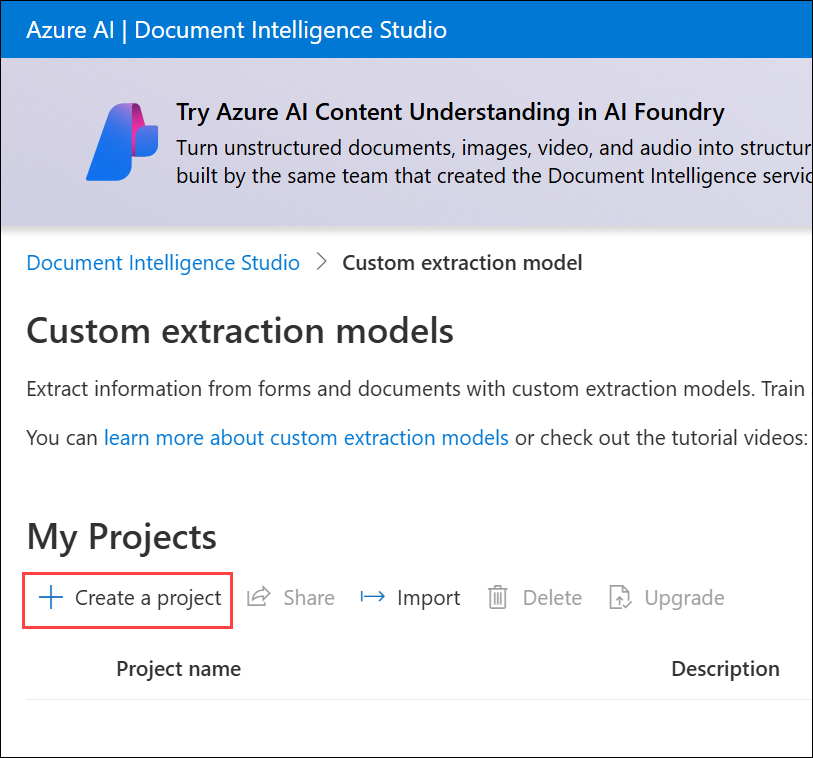

1. In the **Custom extraction model** window, under the **Enter project details** section, provide the following details:

    - Project name: **Myproject<inject key="DeploymentID"></inject> (1)**
    - Description: **Document Intelligence project (2)**
    - Click **Continue (3)**

        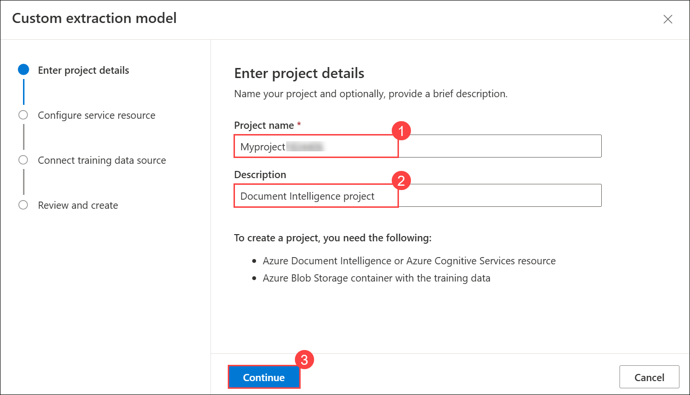

1. In the **Configure service resource** section, enter the following details: 

    - Subscription: **Choose Default Subscription (1)**
    - Resource group: **AI-102-RG35 (2)**
    - Document intelligence resource: **documentintelligence<inject key="DeploymentID"></inject> (3)**
    - Select the **Set as default (4)**
    - API version: **Select Deafult (5)**
    - Click **Continue (6)**

        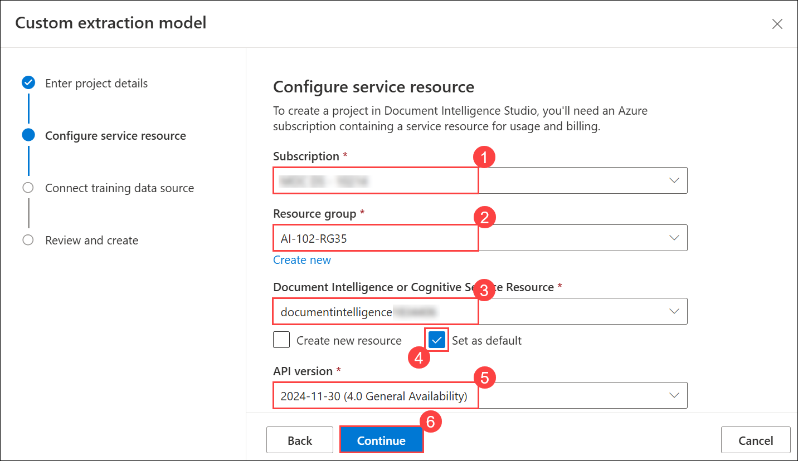

1. In the **Connect training data source** section, enter the following details:

    - Subscription: **Choose Default Subscription (1)**
    - Resource group: **AI-102-RG35 (2)**
    - Storage account: The **storage account** that was created by the setup script 
    - Select the **Set as default (4)**
    - Blob container: **sampleforms (5)**
    - Click **Continue (6)**

         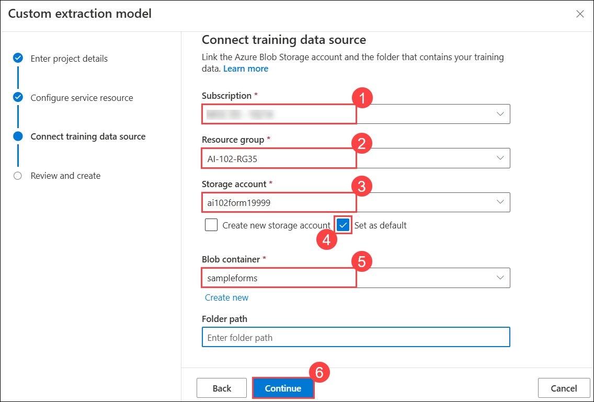

1. In the **Review and create** section, select **Create project**.

    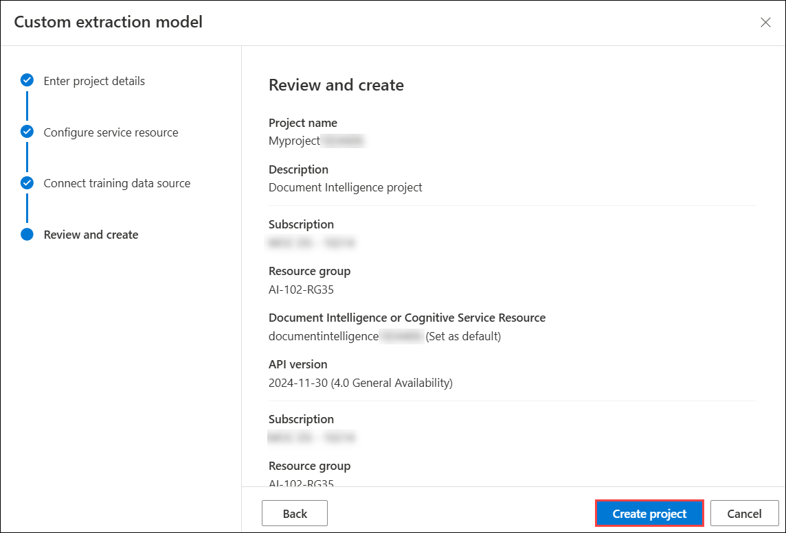

1. When your project is created, on the top right of the page, select **Train** to train your model.

    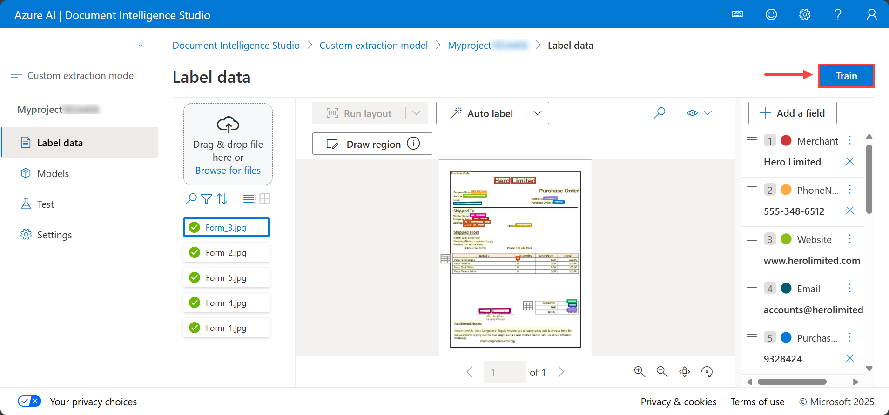

1.  In the **Train a new model** window, enter the following configurations:

    - Model ID: **Mymodel<inject key="DeploymentID"></inject> (1)**
    - Build Mode: **Template (2)**
    - Click **Train (3)**

        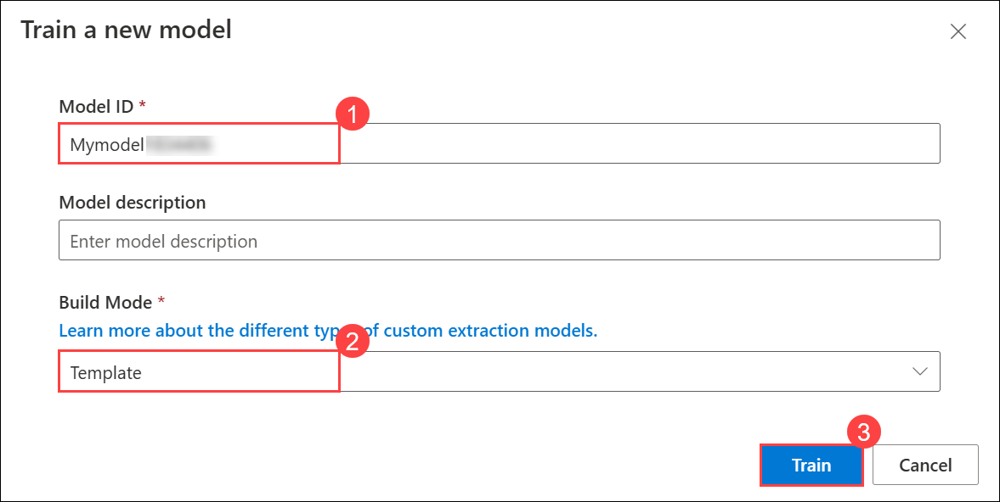

1. In the **Training in progress** dialog, select **Go to Models**.

    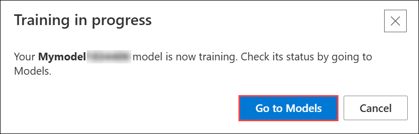

1. Training can take some time. Wait until the status is **succeeded**.

    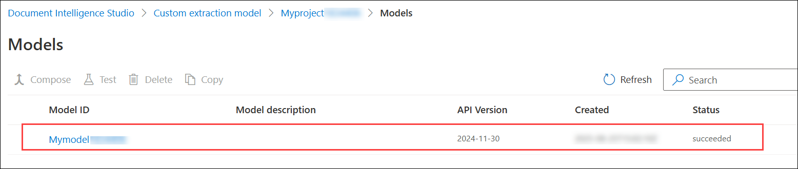

## Task 5: Test your custom Document Intelligence model

In this task, you'll test your custom Document Intelligence model by configuring the client application with your resource credentials and model ID. You’ll run the provided Python code to submit a sample form to your trained model and review the extracted results to verify that the model is working as expected.

1. Return to the browser tab containing the Azure Portal and cloud shell. In the command line, run the following command to change to the folder containing the application code files:

    ```
    cd Python
    ```

1. Install the Document Intelligence package by running the following command:

    ```
    python -m venv labenv
    ./labenv/bin/Activate.ps1
    pip install -r requirements.txt azure-ai-formrecognizer==3.3.3
    ```

1. Enter the following command to edit the configuration file that has been provided:

    ```
    code .env
    ```

    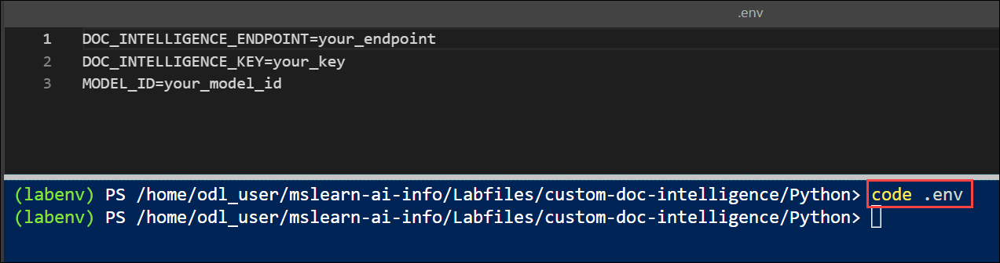

1. In the Azure portal pane, open the left navigation menu, select **Resource Management (1)**, then choose **Keys and Endpoint (2)**. Click **Copy to clipboard** for both the **Endpoint (3)** and **KEY 1 (4)**.

    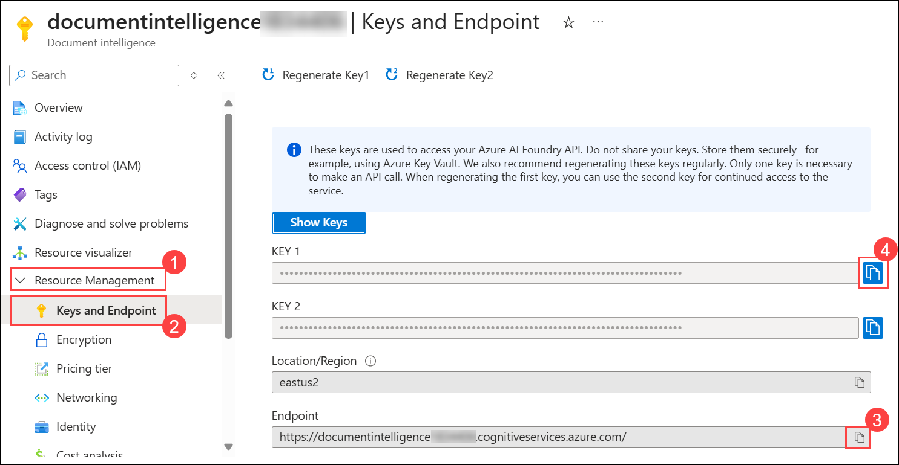

1. Then edit the configuration file with the following values:
    - **Document Intelligence endpoint (1)**
    - **Document Intelligence key (2)**
    - Model ID: **Mymodel<inject key="DeploymentID"></inject> (3)**

        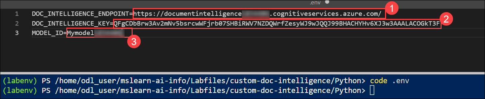

1. After you've replaced the placeholders, within the code editor, use the **CTRL+S** command to save your changes and then use the **CTRL+Q** command to close the code editor while keeping the cloud shell command line open.

1. Open the client application code file using `code test-model.py` and review its contents, ensuring that the image URL points to the file in the GitHub repository. Then, close the file without making any changes.

    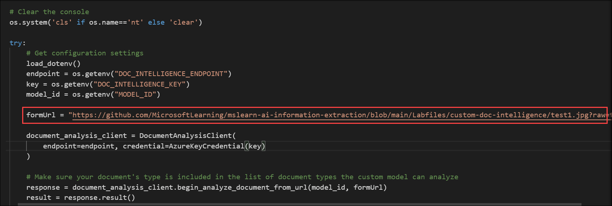

1. In the command line, and enter the following command to run the program:

    ```
    python test-model.py
    ```

1. View the output and observe how the output for the model provides field names like `Merchant` and `CompanyPhoneNumber`.

    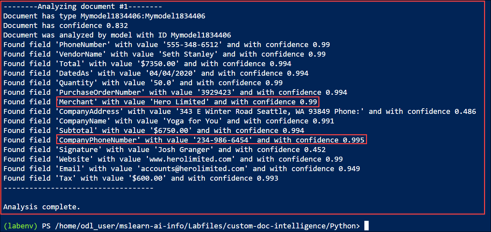

## Summary

In this lab, you worked with **Azure AI Document Intelligence** to build and test a custom model that can extract structured information from documents. You began by creating a Document Intelligence resource in the Azure portal and preparing your development environment in Cloud Shell. Next, you gathered sample forms, uploaded them to Azure Storage, and connected this data source to train a custom extraction model in Document Intelligence Studio. Finally, you configured a Python client application with your model credentials, tested it against sample documents, and reviewed the extracted results.  

Through these steps, you learned how to provision and configure an Azure AI Document Intelligence resource, train a custom model with labeled documents, and develop a client application to test and validate the model’s output.  

### You have successfully completed the Hands-on Lab!
