# Lab 36: Extract data with Azure Document Intelligence

### Estimated Duration: 1 Hour

## Lab Overview

In this lab, you’ll build an end-to-end solution using **Azure Document Intelligence** to extract data from documents. You’ll start by creating and configuring a resource in **Document Intelligence Studio**, and then use the **Read (OCR) model** to analyze and extract multilingual text. Next, you’ll set up your development environment in **Visual Studio Code** and use Python with the **Document Intelligence SDK** to analyze invoices and extract key details such as vendor name, customer name, and totals. Finally, you’ll create and train a **custom model**, and test it using Python to extract specific fields tailored to your own document formats.

## Lab Objectives

In this lab, you'll perform the following tasks:

* Task 1: Create a Document Intelligence resource

* Task 2: Use the Read model in the portal

* Task 3: Analyze an invoice with a prebuilt model using the Python SDK

  * Task 3.1: Prepare the development environment
  * Task 3.2: Add code to analyze an invoice

* Task 4: Train and test a custom model

  * Task 4.1: Prepare training data
  * Task 4.2: Train the model in Document Intelligence Studio
  * Task 4.3: Test the custom model with the Python SDK

## Task 1:  Create a Document Intelligence resource

In this task, you'll create and configure an Azure Document Intelligence resource using Document Intelligence Studio.

1. In a web browser, navigate to the **Document Intelligence Studio** at `https://contentunderstanding.ai.azure.com/documentintelligence/studio`

1. Click on **Sign in** from top right corner of the screen.

    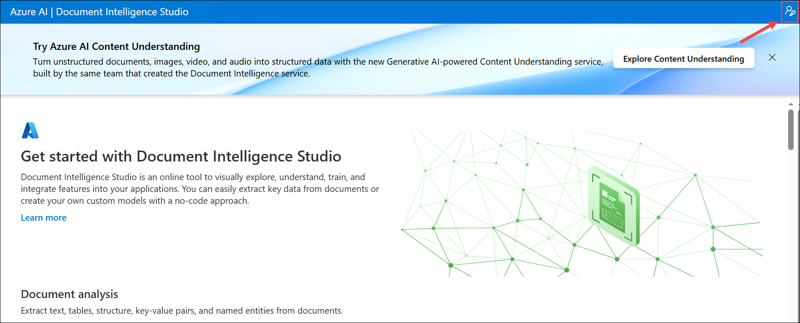

1. If prompted, provide the credentials below:

   - **Email/Username:** <inject key="AzureAdUserEmail"></inject>

   - **Password:** <inject key="AzureAdUserPassword"></inject>

1. In the Studio, select the **Settings (1)** icon (⚙) in the upper-right corner, and then select the **Resource (2)** tab.

    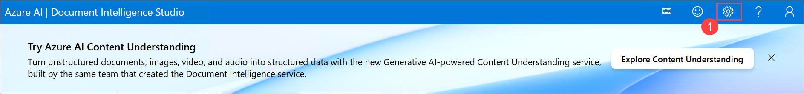

    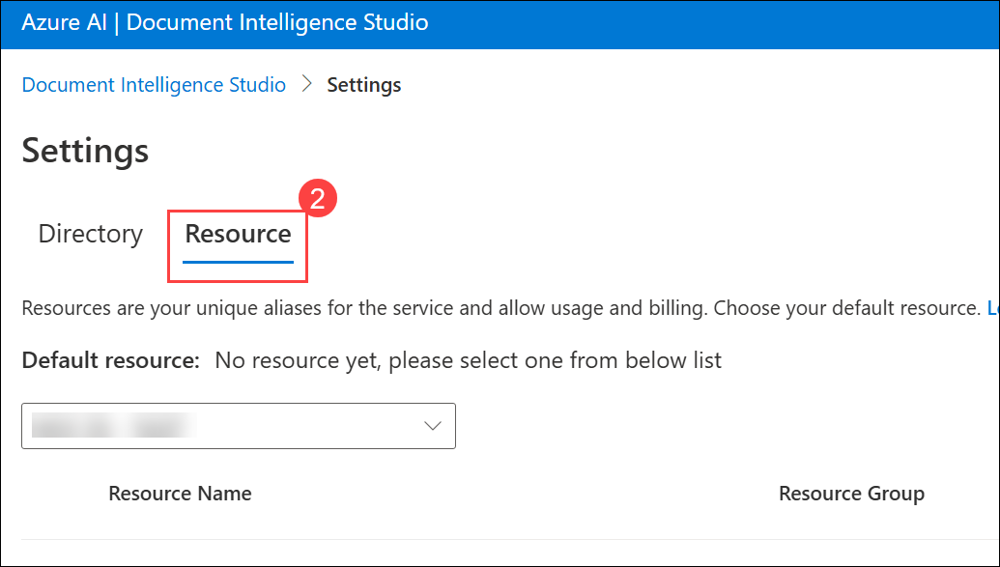

1. Select **+ Create a new resource** on **Settings** page.

    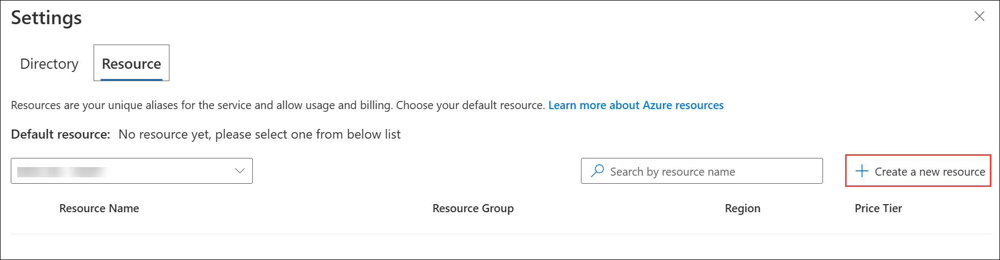

1. In the **Create resource** window, configure the settings as follows, and then click **Continue (6)**:

    * **Subscription**: Select **Default Subscription (1)**
    * **Resource group**: Select **AI-102-RG35 (2)**
    * **Resource name**: Enter *documentintelligence<inject key="DeploymentID" enableCopy="false"/>* **(3)**
    * **Location**: Select **<inject key="Region"></inject> (4)**
    * **Pricing tier**: Select **F0 Free (5)** *(If the Free tier is unavailable, choose Standard S0)*

        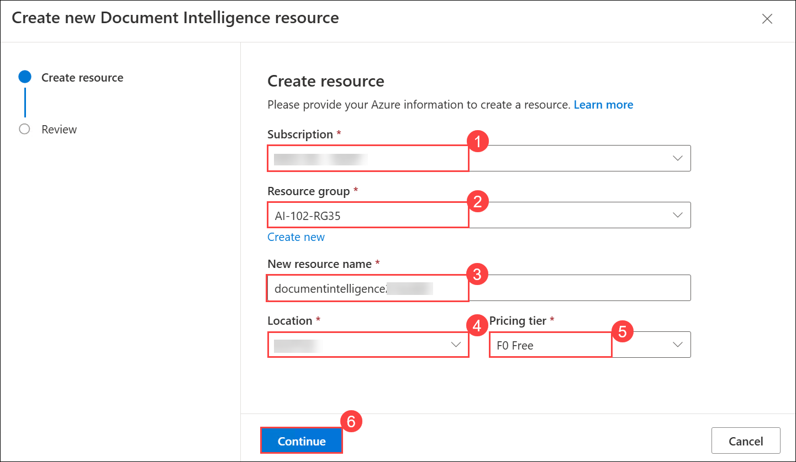

1. Review the configuration and then select **Finish**. 

    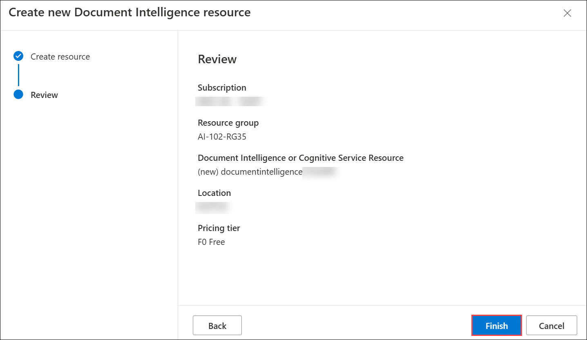

1. Wait for the resource to be deployed. The Studio automatically connects to the new resource.

    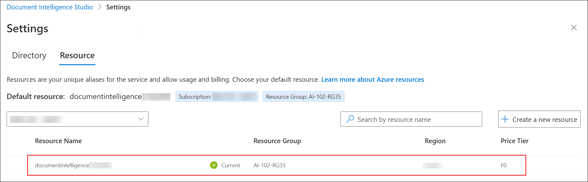

## Task 2: Use the Read model in the portal

In this task, you'll use the Read (OCR) model in Document Intelligence Studio to analyze a multilingual document and extract text.

1. At the top of the page, above **Settings**, select **Document Intelligence Studio** to navigate back to the homepage.

    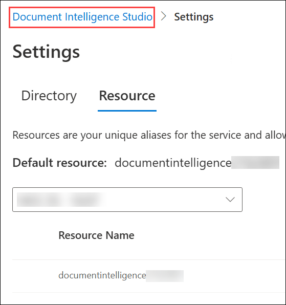

1. On the Document Intelligence Studio home page, under **Document analysis**, select the **OCR/Read** tile.

    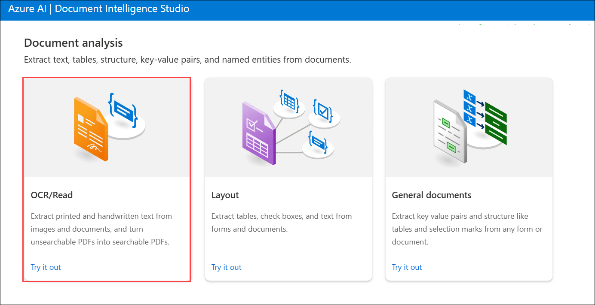

1. In the list of documents on the left, select **read-german.pdf**.

    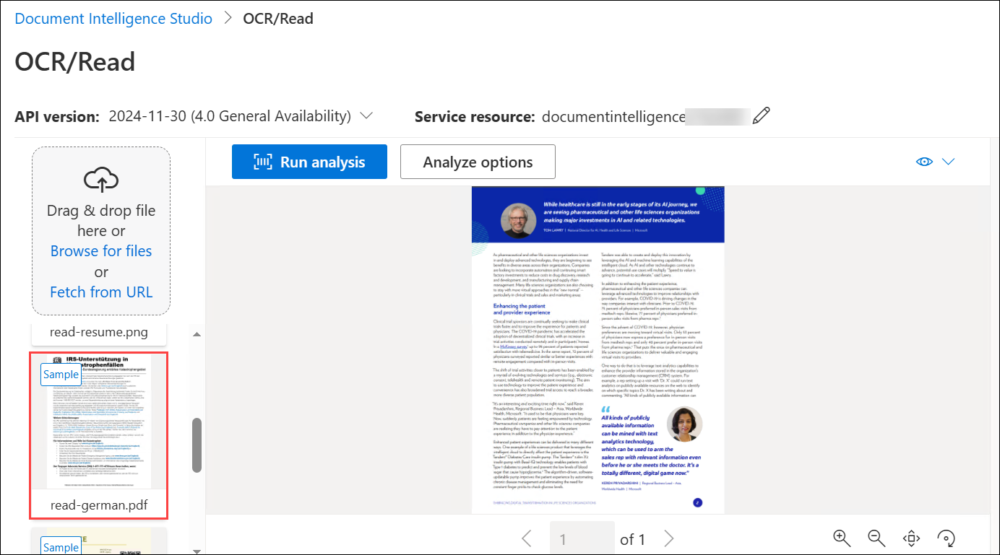

1. At the top toolbar, select **Analyze options (1)**, then enable the **Language (2)** check-box (under **Optional detection**) in the **Analyze options** pane and select **Save (3)**.

    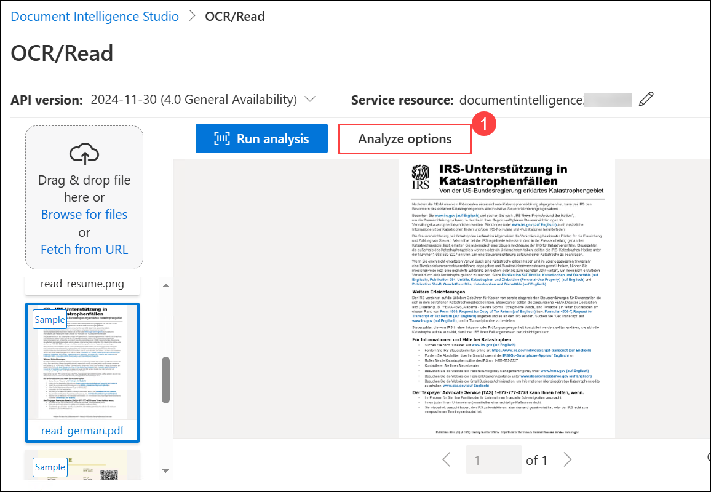

    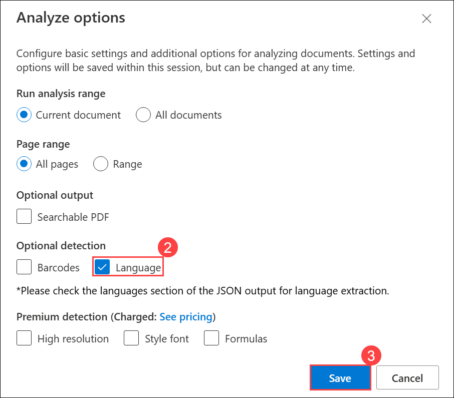

1. At the top-left, select **Run Analysis**.

    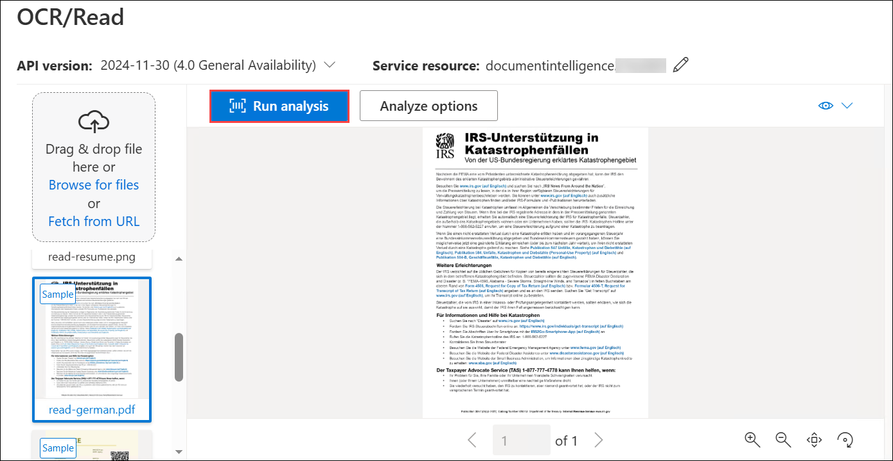

1. When the analysis is complete, the text extracted from the image is shown on the right in the **Content** tab. Review this text and compare it to the text in the original image for accuracy.

    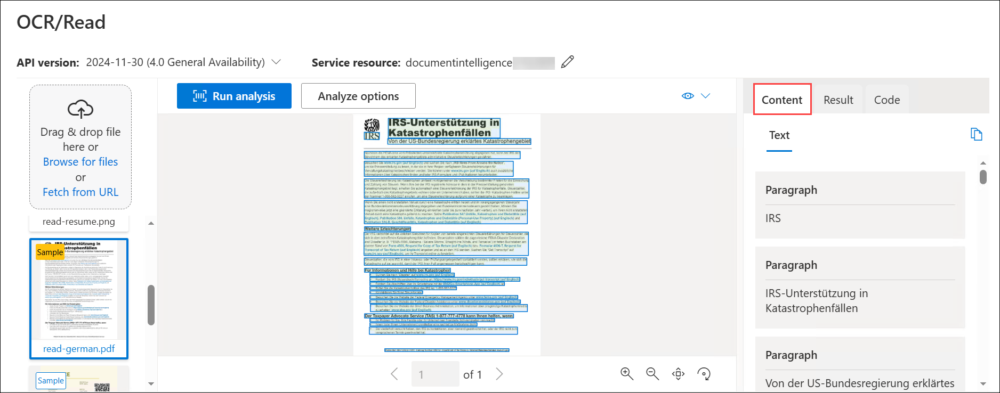

1. Select the **Result** tab. This tab displays the extracted JSON code.

    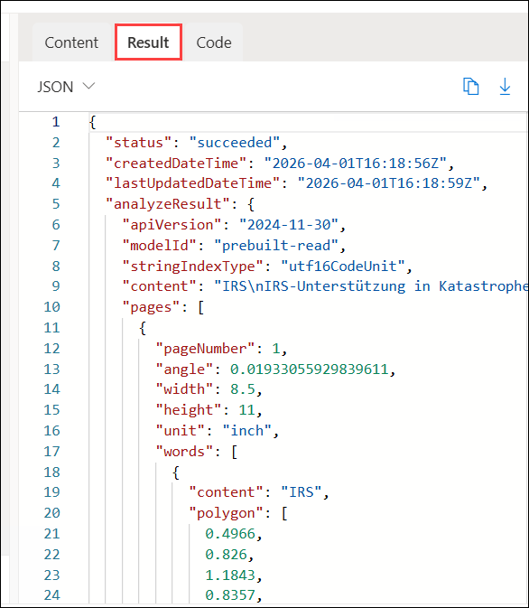

1. Scroll to the bottom of the JSON code in the **Result** tab. Notice that the read model has detected the language of each span indicated by `locale`. Most spans are in German (language code `de`) but you can find other language codes in the spans (e.g., English — language code `en` — in one of the first spans).

    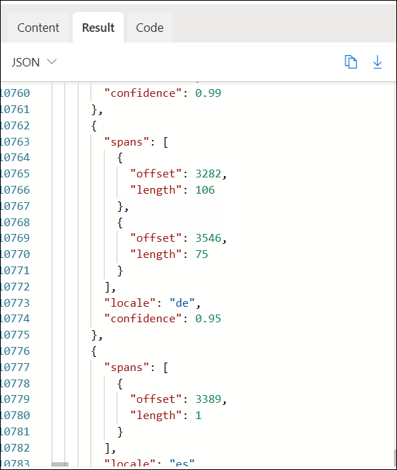

## Task 3: Analyze an invoice with a prebuilt model using the Python SDK

In this task, you'll use the Azure Document Intelligence Python SDK to analyze an invoice using a prebuilt model.

### Task 3.1: Prepare the development environment

1. Go to the **Azure portal** `https://portal.azure.com`, search for **Document Intelligence (1)** in the top search bar, and then select **Document intelligences (2)** from the results to locate the resource you created earlier.

    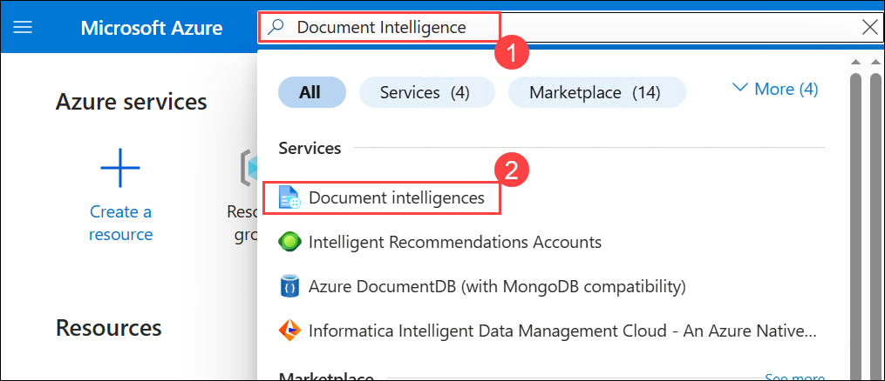

1. On the **Microsoft Foundry | Document intelligence** page, locate your **Document Intelligence** resource and select it.

    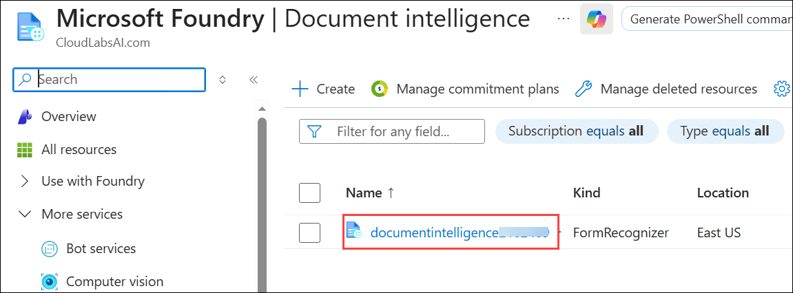

1. From the left navigation pane, expand **Resource Management (1)** and select **Keys and Endpoint (2)**. On this page, copy the **Endpoint (3)** and any one of the available **Keys (4)**, as you will use these values in the next steps.

    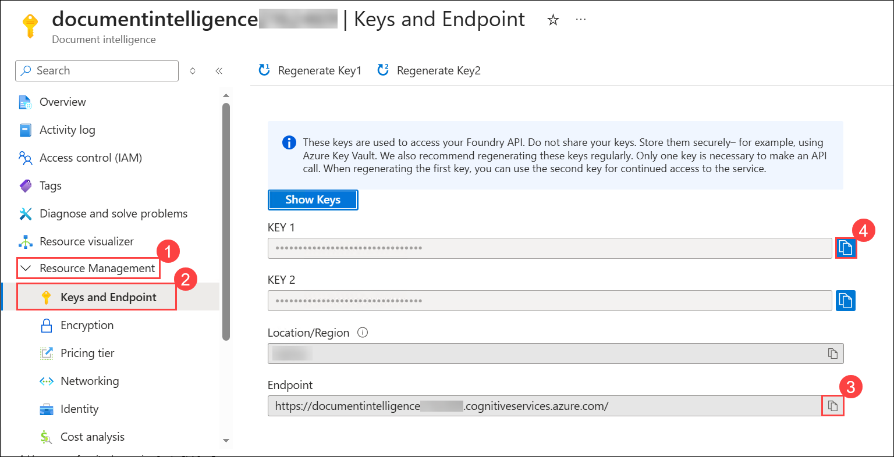

1. On the desktop, locate **Visual Studio Code**, and then double-click the icon to open it.

    

1. Open the Command Palette by pressing **Ctrl+Shift+P** , type **`Git: Clone`** **(1)**, and then select **Git: Clone** (2) from the list.

    

1. In the URL bar, paste the following repository URL and press **Enter**:

    ```
    https://github.com/microsoftlearning/mslearn-ai-information-extraction
    ```

    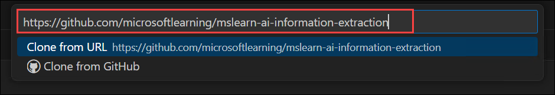

1. In the folder selection window, choose the **Downloads** folder **(1)**, and then select **Select as Repository Destination** **(2)**.

    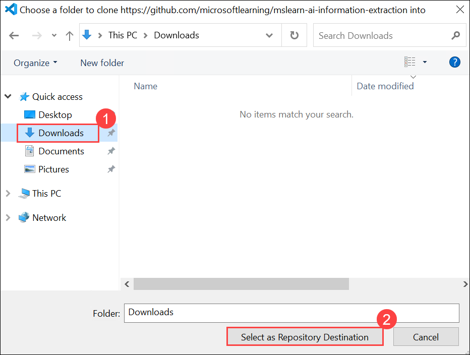

1. When prompted, select **Open** to open the cloned repository in Visual Studio Code.

    

1. When prompted, select **Yes, I trust the authors** to trust the folder and enable all features.

    

1. Open a new terminal by using **Ctrl+`** and navigate to the prebuilt Document Intelligence folder:

    ```
    cd Labfiles/03-document-intelligence/prebuilt/Python
    ```

    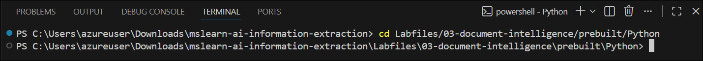

1. Run the following command to install the required libraries:

    ```
    python -m venv labenv
    labenv\Scripts\activate
    pip install -r requirements.txt azure-identity
    ```

    > **Note:** The requirements.txt installs the [azure-ai-documentintelligence](https://learn.microsoft.com/python/api/overview/azure/ai-documentintelligence-readme?view=azure-python) Python SDK package and its dependencies.

1. In the VS Code Explorer pane, open the **.env** file in **Labfiles/03-document-intelligence/prebuilt/Python**.

    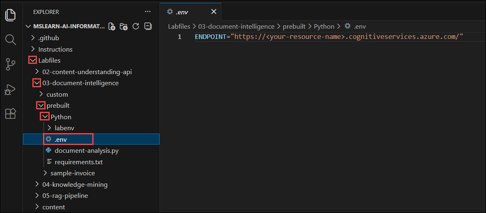

1. In the file, replace the **ENDPOINT**  placeholders with your Document Intelligence resource endpoint.

    .png)

1. Save the file by using **CTRL+S**.

### Task 3.2: Add code to analyze an invoice

This is the sample invoice that your code will analyze:

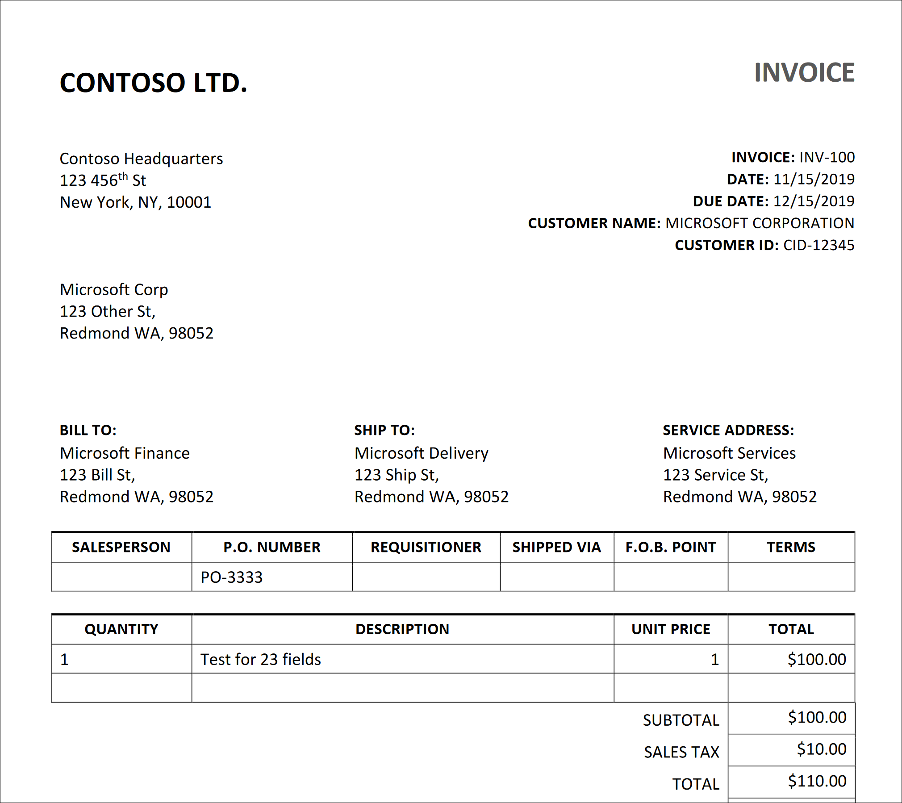

1. In VS Code, open the **document-analysis.py** file.

    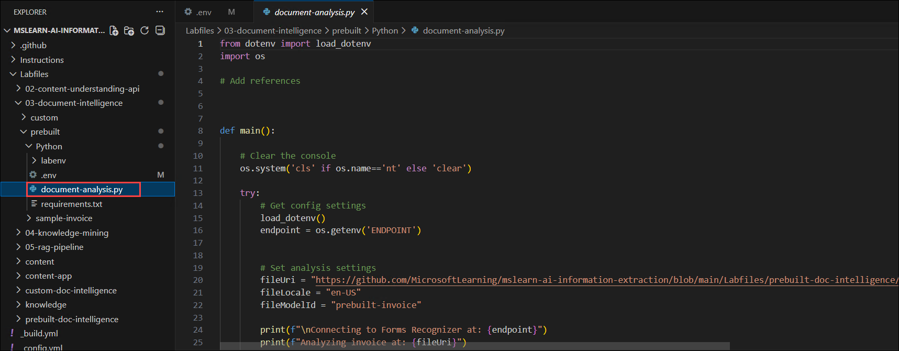

1. In the code file, find the comment **Import the required libraries** and add the following code:

    ```python
    # Add references
    from azure.identity import DefaultAzureCredential
    from azure.ai.documentintelligence import DocumentIntelligenceClient
    from azure.ai.documentintelligence.models import AnalyzeDocumentRequest
    ```

    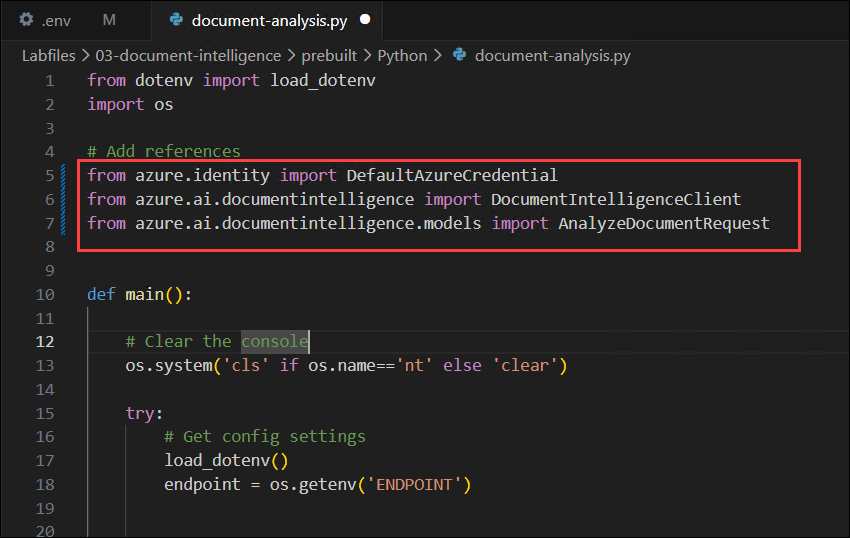

1. Find the comment **Create the client** and add the following code (being careful to maintain the correct indentation):

    ```python
    # Create the client
    document_analysis_client = DocumentIntelligenceClient(
        endpoint=endpoint, credential=DefaultAzureCredential()
    )
    ```

    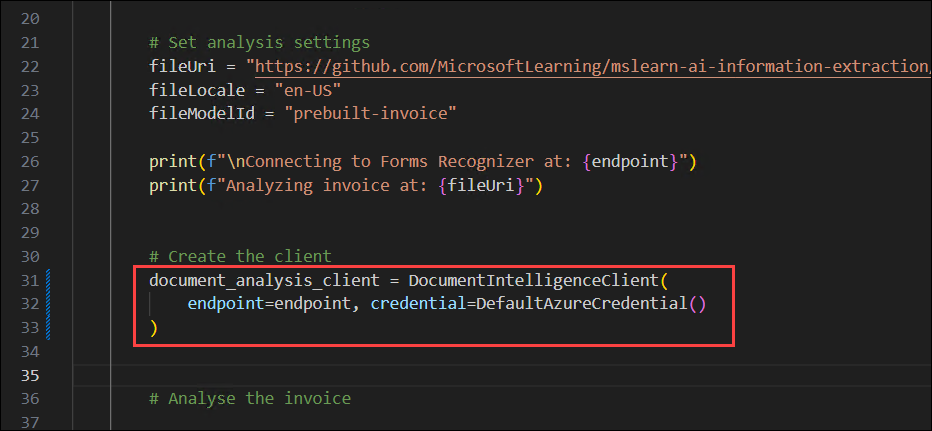

1. Find the comment **Analyze the invoice** and add the following code:

    ```python
    # Analyze the invoice
    poller = document_analysis_client.begin_analyze_document(
        "prebuilt-invoice",
        AnalyzeDocumentRequest(url_source=fileUri),
        locale=fileLocale
    )
    ```

    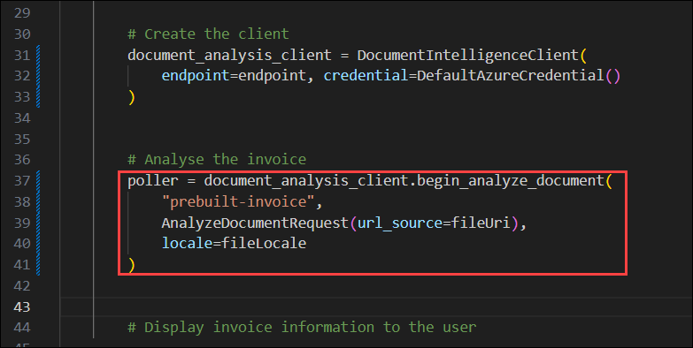

1. Find the comment **Display invoice information to the user** and add the following code:

    ```python
    # Display invoice information to the user
    result = poller.result()

    for document in result.documents:

        vendor_name = document.fields.get("VendorName")
        if vendor_name:
            print(f"\nVendor Name: {vendor_name.get('valueString')}, with confidence {vendor_name.get('confidence')}.")

        customer_name = document.fields.get("CustomerName")
        if customer_name:
            print(f"Customer Name: {customer_name.get('valueString')}, with confidence {customer_name.get('confidence')}.")

        invoice_total = document.fields.get("InvoiceTotal")
        if invoice_total:
            amount = invoice_total.get("valueCurrency", {})
            print(f"Invoice Total: {amount.get('currencySymbol', '$')}{amount.get('amount')}, with confidence {invoice_total.get('confidence')}.")
    ```

    .png)

1. Review the code you added, which:
    - Creates a `DocumentIntelligenceClient` with your endpoint and credentials.
    - Uses the `prebuilt-invoice` model to analyze the document from a URL.
    - Iterates through the results and prints the vendor name, customer name, and invoice total.

1. Save the file using **CTRL+S**.

1. In the Visual Studio Code terminal, enter the following command to sign into Azure

     ```powershell
     az login
     ```

     > **Note:** Minimize the VS Code to see the **Sign in** window.

1. In the **Sign in** window, select **Work or school account** **(1)**, and then select **Continue** **(2)**.

    

1. On the **Sign in** page, provide the credentials below:
 
    - **Email/Username:** <inject key="AzureAdUserEmail"></inject>
    
      

    - **Password:** <inject key="AzureAdUserPassword"></inject>
    
      

1. When prompted, select **Yes** to sign in to all apps and websites on this device.

    

1. On the **Account added to this device** window, select **Done** to complete the sign-in process.

    

1. In the Visual Studio Code terminal, press **Enter** to select the default subscription.

    

1. In the VS Code terminal, run the application:

    ```
    python document-analysis.py
    ```

1. Review the output. The program should display the vendor name, customer name, and invoice total with confidence levels. Compare the values with the sample invoice shown above.

    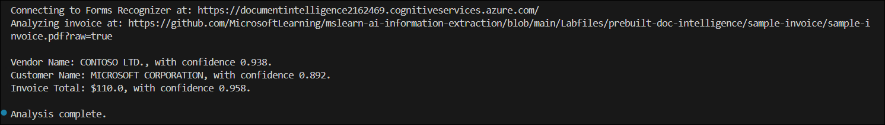

## Task 4: Train and test a custom model

In this task, you'll create, train, and test a custom Document Intelligence model to extract data from your own document formats.

### Task 4.1: Prepare training data

A setup script has been provided to create a storage account and upload sample forms for training.

1. In the VS Code terminal, navigate to the custom model folder:

    ```
    cd ../../custom
    ```

    > **Note:** If you're unsure of your current directory, run `cd` to check.

1. In VS Code, open the **setup.sh** file in **Labfiles/03-document-intelligence/custom**.

1. Review the commands in the script. It will:
    - Create a storage account in your Azure resource group
    - Upload files from the *sample-forms* folder to a container
    - Print a Shared Access Signature (SAS) URI

        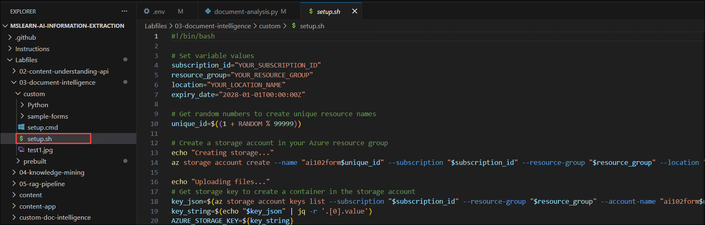

1. In the **Azure portal**, navigate to the **Document Intelligence** resource you opened in the previous task. From the left navigation pane, select **Overview (1)**, then copy the **Resource group (2)** and **Subscription ID (3)**. Next, select **JSON View (4)** and copy the **location (5)** value for use in the next step.

    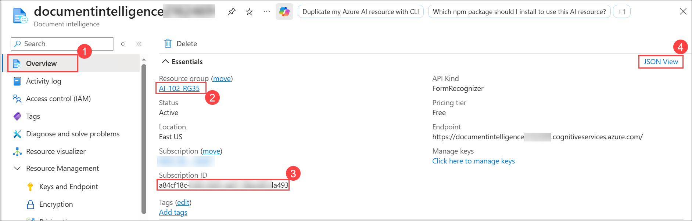

    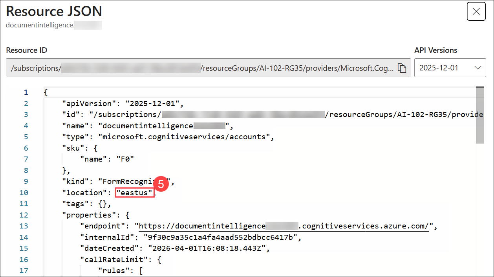

1. Modify the **subscription_id**, **resource_group**, and **location** variable declarations with the appropriate values for the subscription, resource group, and location name where you deployed the Document Intelligence resource.

    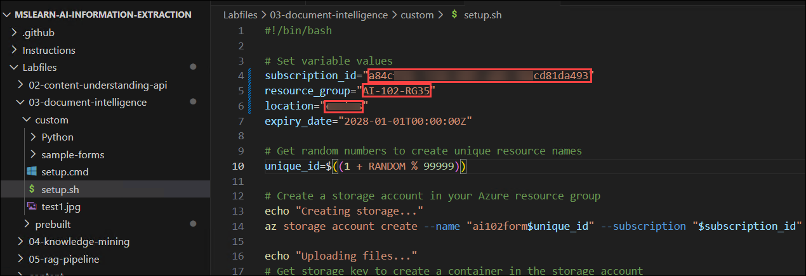

    > **Important:** For your **location** string, use the code format (e.g., `eastus` for "East US"). You can find this in the **JSON View** of your resource group in the Azure portal.

    >**Note:** If the **expiry_date** variable is in the past, update it to a future date, for example `2026-12-31`.

1. Save the file using **CTRL+S**.

1. To run the setup script, you need a Bash shell.

1. In **Visual Studio Code**, open a new terminal by clicking the **+ (New Terminal) icon (1)**, then select **Git Bash (2)** as the terminal profile.

    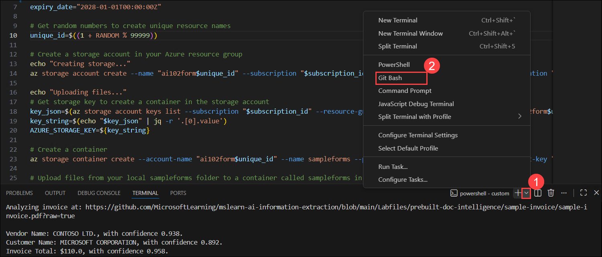

1. Run the following command:

    ```sh
    cd Labfiles/03-document-intelligence/custom
    ```

1. In the Visual Studio Code terminal, enter the following command to sign into Azure

     ```sh
     az login
     ```

     > **Note:** Minimize the VS Code to see the **Sign in** window.

1. In the **Sign in** window, choose your user account **(1)**, and then select **Continue (2)** to proceed.

    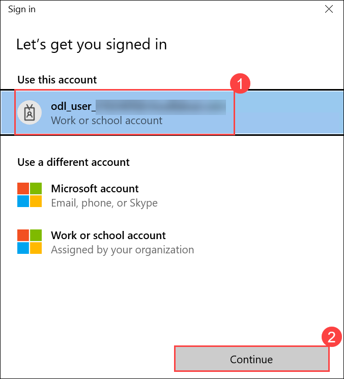

1. In the Visual Studio Code terminal, press **Enter** to select the default subscription.

    

1. Now run the script using the following command: 
    
    ```sh
    bash setup.sh
    ```

1. When the script completes, review the displayed output.

    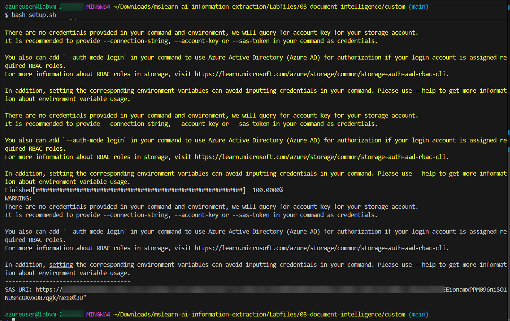

1. In the Azure portal, go to your resource group **AI-102-RG35** and verify that the storage account was created. Click on the storage account to open it.

    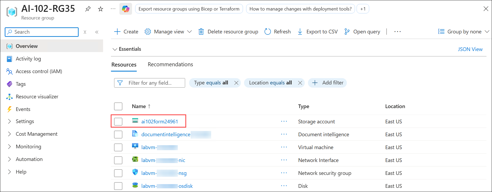

1. From the left navigation pane, select **Storage browser (1)**, expand **Blob containers (2)** and select the **sampleforms (3)** container to confirm the files were uploaded.

    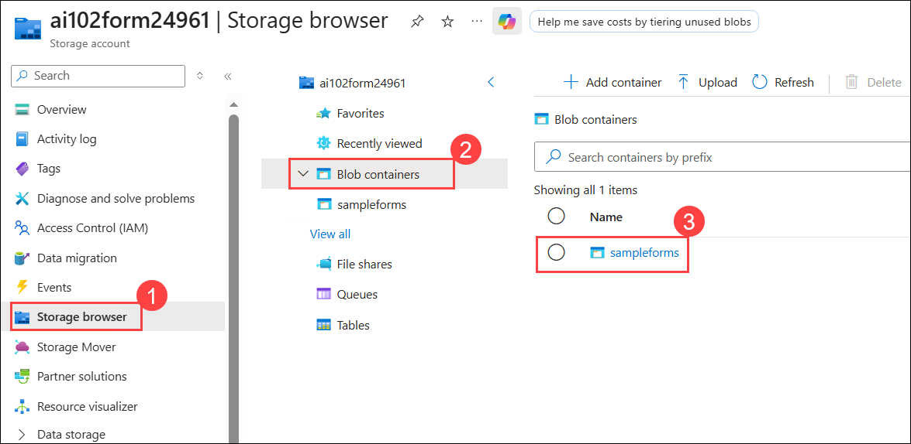

    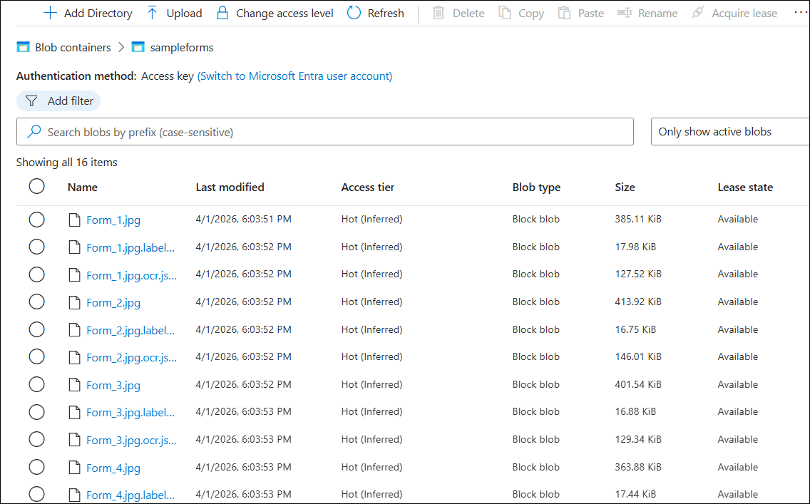

### Task 4.2 Train the model in Document Intelligence Studio

Now you'll use the training forms to build a custom extraction model.

1. Open a new browser tab and navigate to the **Document Intelligence Studio** at `https://contentunderstanding.ai.azure.com/documentintelligence/studio`.

1. Click on **Sign in** from top right corner of the screen.

    

1. If prompted, provide the credentials below:

   - **Email/Username:** <inject key="AzureAdUserEmail"></inject>

   - **Password:** <inject key="AzureAdUserPassword"></inject>

1. Scroll down to the **Custom models** section and select the **Custom extraction model** tile.

    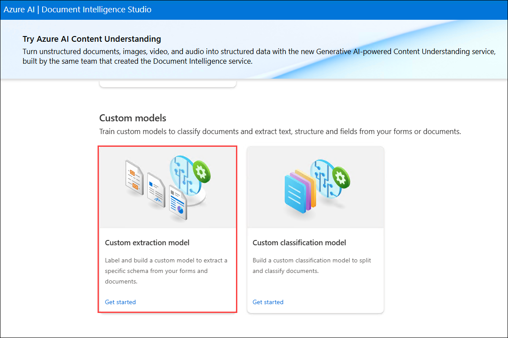

1. If asked which Azure Document Intelligence resource to use, select the subscription and resource name you used when you created the resource.

1. Under **My Projects**, click on **+ Create  new project**.

    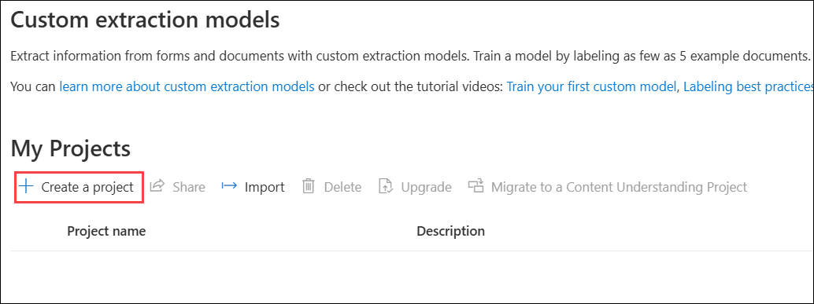

1. Provide the following configuration:

    - **Enter project details**:
        - **Project name**: myproject<inject key="DeploymentID" enableCopy="false"/> **(1)**
        - Click **Continue (2)**

            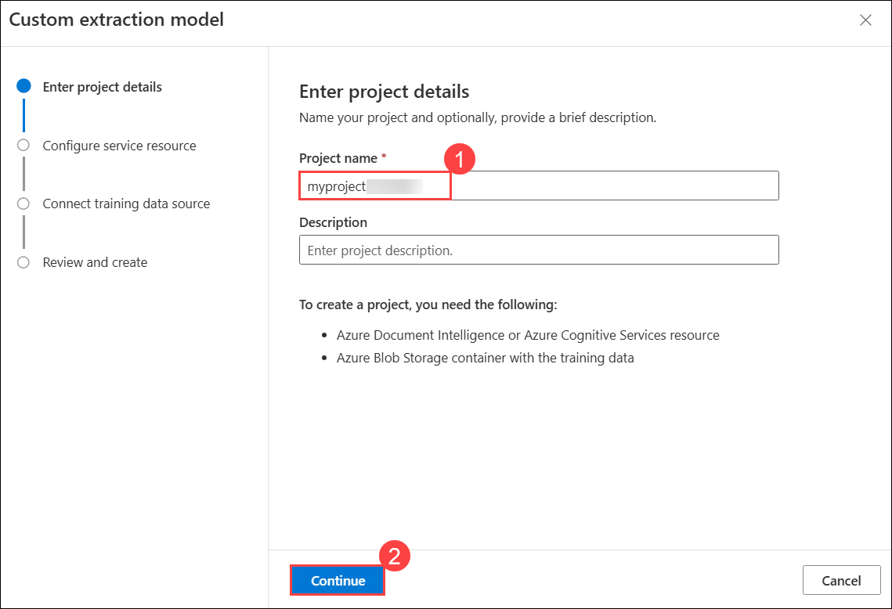

    - **Configure service resource**:
        - **Subscription**: Select default  Azure subscription **(1)**
        - **Resource group**: AI-102-RG35 **(2)**
        - **Document Intelligence resource**: Select documentintelligence<inject key="DeploymentID" enableCopy="false"/> **(3)**
        - Select the checkbox **Set as default (4)**
        - Click **Continue (5)**

            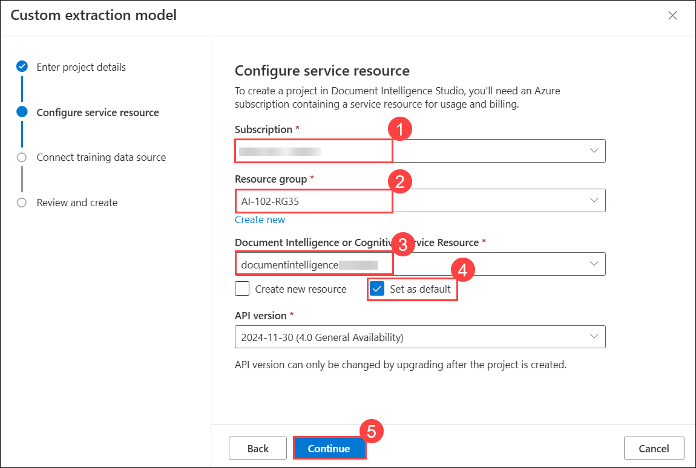

    - **Connect training data source**:
        - **Subscription**: Select default  Azure subscription **(1)**
        - **Resource group**: AI-102-RG35 **(2)**
        - **Storage account**: *The storage account created by the setup script* **(3)** 
        - Select the checkbox **Set as default** **(4)**, 
        - Select the `sampleforms` blob container **(5)**, 
        - Leave the folder path blank
        - Click **Continue (6)**

            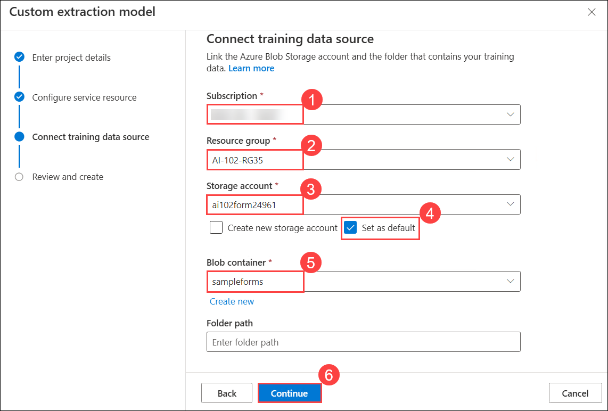

1. In the Review and create section, review the configuration and then click on **Create project**.

    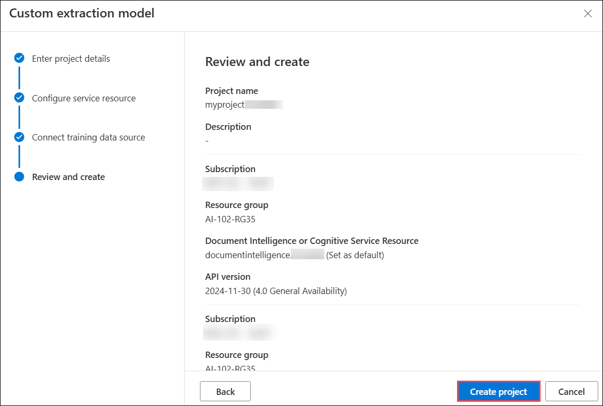

1. When your project is created, on the top right of the page, select **Train** to train your model. 

    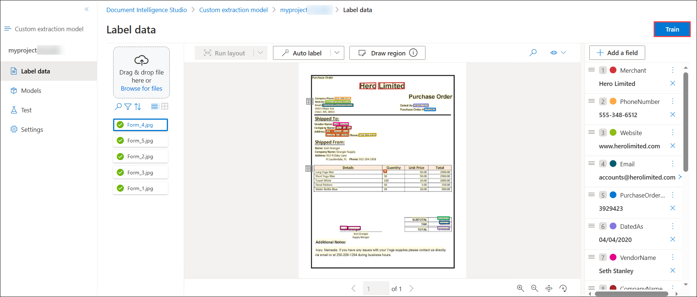

1. In the **Train a new model** window, use the following configuration:

    - **Model ID**: mymodel<inject key="DeploymentID" enableCopy="false"/> **(1)**
    - **Build Mode**: Template **(2)**
    - Click **Train (3)**

        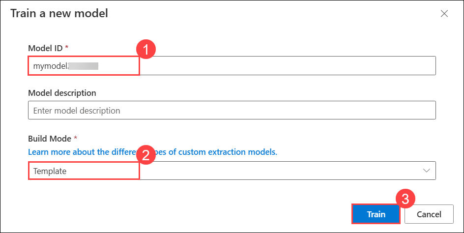

1. In the **Training in progress** dialog, select **Go to Models**.

    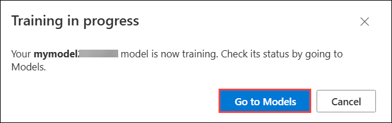

1. Training may take some time. Wait until the model status shows **succeeded**.

    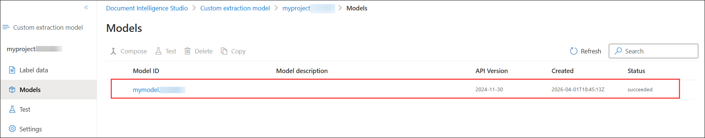

### Task 4.3 Test the custom model with the Python SDK

1. In the VS Code, open a new terminal using **Ctrl+Shift+`**. 

1. Navigate to the custom model Python folder using the following command:

    ```Powershell
    cd Labfiles/03-document-intelligence/custom/Python
    ```

1. Install the required packages (create a new virtual environment or reuse the existing one):

    ```
    python -m venv labenv
    labenv\Scripts\activate
    pip install -r requirements.txt azure-identity
    ```

1. In VS Code, open the **.env** file in **Labfiles/03-document-intelligence/custom/Python**.

    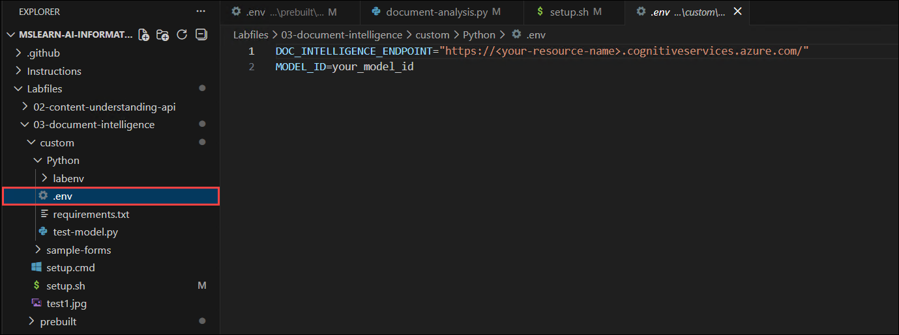

1. Update the file with the following values:
    - Your Document Intelligence **endpoint (1)** (you copied earlier)
    - The **Model ID (2)** you specified when training your model

        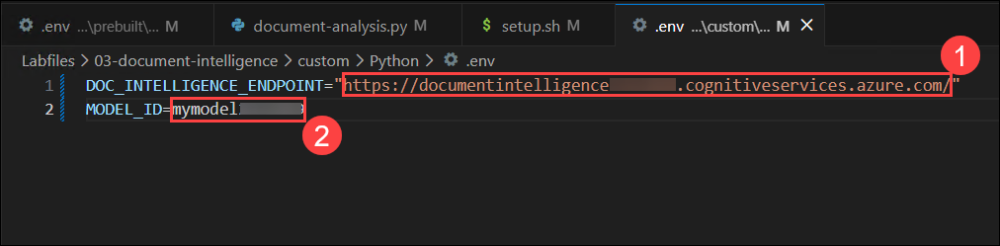

1. Save the file using **CTRL+S**.

1. In VS Code, open the **test-model.py** file.

    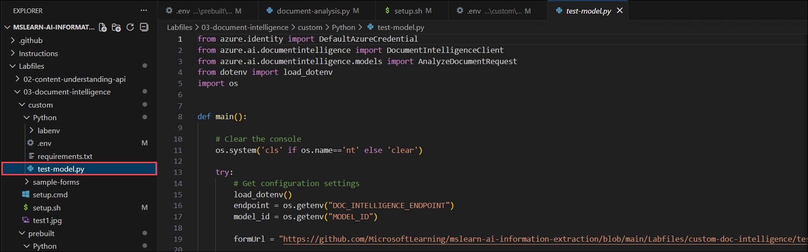

1. Review the code, which uses the [azure-ai-documentintelligence](https://learn.microsoft.com/python/api/overview/azure/ai-documentintelligence-readme?view=azure-python) SDK. Notice that it references a test image hosted in the GitHub repo. The code creates a `DocumentIntelligenceClient`, submits the image for analysis using your custom model, and prints the extracted fields.

1. In the VS Code terminal, run the program:

    ```
    python test-model.py
    ```

1. Review the output. The program should display the field names and values extracted from the test form, such as `Merchant`, `CompanyPhoneNumber`, and other fields you defined during training.

    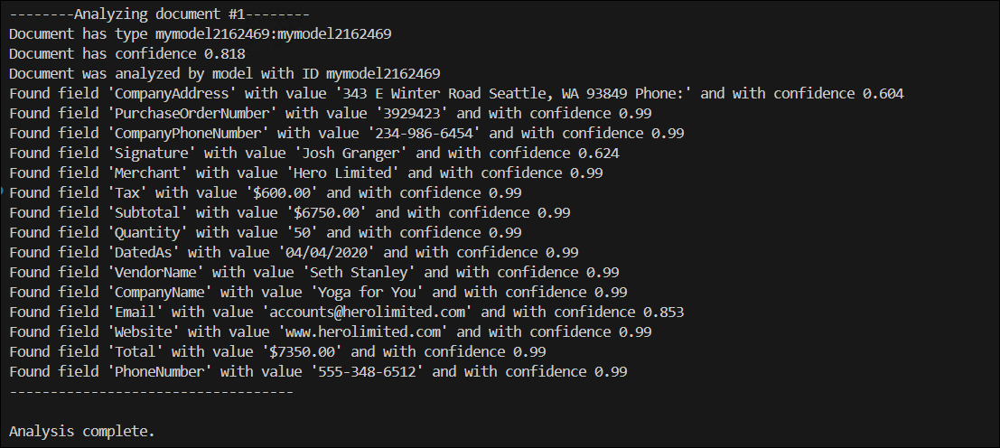

    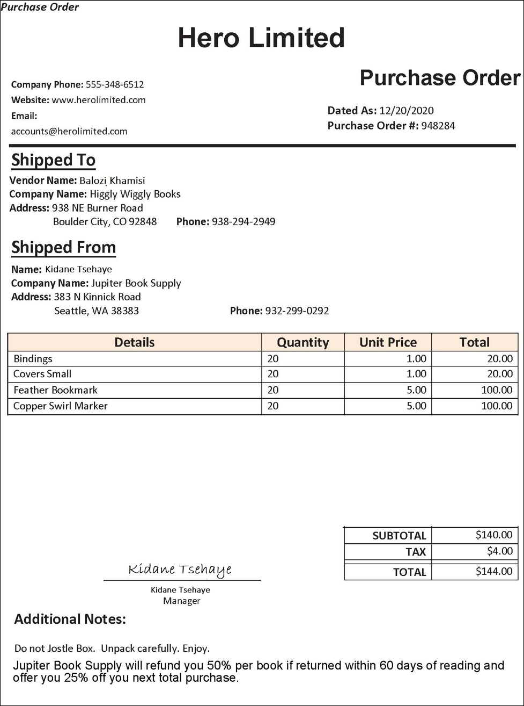

## Summary

In this exercise, you built a document processing solution using **Azure Document Intelligence** by creating and configuring the required resources in Document Intelligence Studio. You explored the Read (OCR) model to extract multilingual text, and used the Python SDK to analyze invoices and retrieve key information such as vendor details and totals. You then created and trained a custom model using your own dataset, and tested it programmatically to extract specific fields from documents. Great work!

### You have successfully completed the Hands-on Lab!