# Lab 36: Create an knowledge mining solution
In this lab, you use AI Search to index a set of documents maintained by Margie's Travel, a fictional travel agency. The indexing process involves using AI skills to extract key information to make them searchable, and generating a knowledge store containing data assets for further analysis.

### Task 1: Create an Azure AI Search resource

1. On the Azure portal, search for `Azure AI Search` **(1)**, and select **Azure AI Search (2)** from the services.

   

1. Select **+ Create**.

   

1. Create an **Azure AI Search** resource with the following settings:

    - Subscription: Leave your default  Azure subscription **(1)**
    - Resource group: Select **AI-102-RG24 (2)**
    - Service name: Enter **aisearch<inject key="DeploymentID" enableCopy="false"/> (3)**
    - Location: Select **<inject key="Region" enableCopy="false" /> (4)**
    - Pricing tier: If its Standard then select **Change Pricing Tier (5)**

      

      - Select **Free (1)** and then **Select (2)**

           

1. Select **Review+Create**.           

   

1. Select **Create**.   

1. Wait for deployment to complete, and then select **Go to resources**.

   

1. Review the **Overview** page on the blade for your Azure AI Search resource in the Azure portal. Here, you can use a visual interface to create, test, manage, and monitor the various components of a search solution; including data **sources, indexes, indexers,** and **skillsets**.

### Task 2: Create a storage account

1. On the Azure portal, search for `Storage account` **(1)**, and select **Storage account (2)** from the services.

   

1. Select **+ Create**.   

1. Then create a **Storage account** resource with the following settings:
    - Subscription: *Your Azure subscription* **(1)**
    - Resource group: Select **AI-102-RG24 (2)**
    - Storage account name: Enter **Storage<inject key="DeploymentID" enableCopy="false"/> (3)**
    - Region: Select **<inject key="Region" enableCopy="false" /> (4)**
    - Primary service: Select **Azure Blob Storage or Azure Data Lake Storage Gen 2 (5)**
    - Performance: **Standard (6)**
    - Redundancy: **Locally-redundant storage (LRS) (7)**
    - Then **Review+Create (8)**

          

1. Wait for deployment to complete, and then go to the deployed resource.

    >**Tip**:Keep the storage account portal page open - you will use it in the next procedure.


### Task 3: Upload documents to Azure Storage

Your knowledge mining solution will extract information from travel brochure documents in an Azure Storage blob container.

1. Right click on the following link [documents.zip](https://github.com/microsoftlearning/mslearn-ai-information-extraction/raw/main/Labfiles/knowledge/documents.zip), select **Copy link** and then paste it on the JumpVM's browser tab to download the zip folder.

1. Select the **folder** icon to navigate to the zip folder.

    

1. Right click on the **documents** zip folder **(1)** and then **Extract All (2)** to extract the downloaded *documents.zip* file

    

1. Provide the destination path as `C:\LabFiles` **(1)** and then **Extract (2)**. View the travel brochure files it contains. You'll extract and index information from these files.

    

1. On the Azure portal, search for `Storage account` **(1)**, and select **Storage account (2)** from the services.

    

1. Select the **Storage<inject key="DeploymentID" enableCopy="false"/>** Storage account.

    

1. From the navigation pane on the left, select **Storage browser (1)**. In the storage browser, select **Blob containers (2)**. In the toolbar, select **+ Add Container (3)**.

    

    Currently, your storage account should contain only the default **$logs** container.

1. Create a new container with the following settings and then select **Create (3)**:

     - Name: `documents` **(1)**
     - Anonymous access level: Private (no anonymous access) **(2)**

           

        > **Note**: Unless you enabled the option to allow anonymous container access when creating your storage account, you won't be able to select any other setting!

1. Select the **documents** container to open it.

    

 1. Then use the **Upload** toolbar button to upload the .pdf files you extracted from **documents.zip** .

    

1. Select **Browse for files (1)**, then navigate `C:\LabFiles` **(2)**. Select the **.pdf files** (6 files) **(3)** and then **Open (4)**.

    

### Task 4: Create and run an indexer

Now that you have the documents in place, you can create an indexer to extract information from them.

1. In the Azure portal, search for `Azure AI Search` **(1)**, and select **Azure AI Search (2)** from the services.

   

1. Then select the **aisearch<inject key="DeploymentID" enableCopy="false"/>** search service.

   

1. Then, on its **Overview** page, select **Import data**.

   

1. On the **Connect to your data** page, in the **Data Source** list, select **Azure Blob Storage**. Then complete the data store details with the following values:
    - Data Source: Azure Blob Storage **(1)**
    - Data source name: `margies-documents` **(2)**
    - Data to extract: **Content and metadata (3)**
    - Parsing mode: Default
    - Subscription: *Your Azure subscription* **(4)**
    - **Connection string**: Select **Choose an existing connection (5)**

          

      - Select your storage account **Storage<inject key="DeploymentID" enableCopy="false"/>**.

           

      - Select the **documents (1)** container and then **Select (2)**

           

    - Managed identity authentication: **None (6)**
    - Container name: **documents (7)**
    - Blob folder: *Leave this blank* **(8)**
    - Description: `Travel brochures` **(9)**
    - Proceed to the next step (**Add cognitive skills (10)**), which has three expandable sections to complete.

          

1. In the **Attach Azure AI Services (1)** section, select **Free (limited enrichments (2)**).

   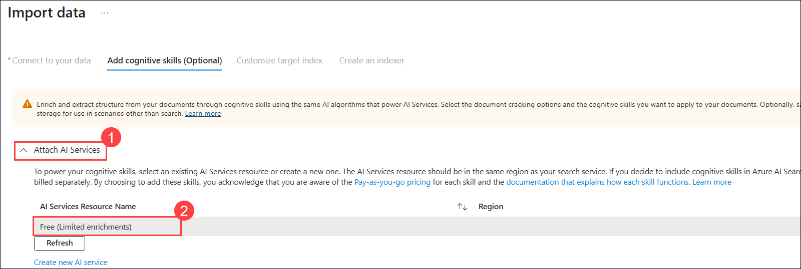

    > **Note**:The free Azure AI Services resource for Azure AI Search can be used to index a maximum of 20 documents. In a real solution, you should create an Azure AI Services resource in your subscription to enable AI enrichment for a larger number of documents.

1. In the **Add enrichments (1)** section:

    - Change the **Skillset name** to `margies-skillset` **(2)**
    - Select the option **Enable OCR and merge all text into merged_content field** **(3)**
    - Ensure that the **Source data field** is set to **merged_content (4)**.
    - Leave the **Enrichment granularity level** as **Source field (5)**, which is set the entire contents of the document being indexed; but note that you can change this to extract information at more granular levels, like pages or sentences.

      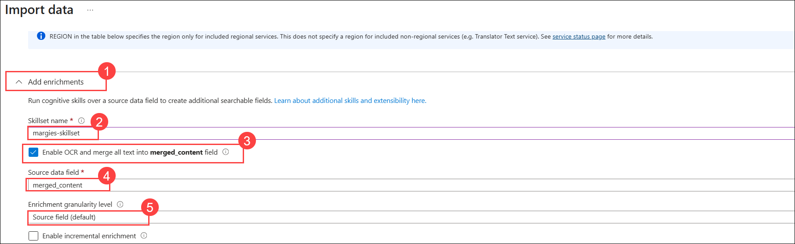 

    - Select the following enriched fields:

        | Cognitive Skill | Parameter | Field name |
        | --------------- | ---------- | ---------- |
        | **Text Cognitive Skills** | |  |
        | Extract people names | | people |
        | Extract location names | | locations |
        | Extract key phrases | | keyphrases |
        | **Image Cognitive Skills** | |  |
        | Generate tags from images | | imageTags |
        | Generate captions from images | | imageCaption |

        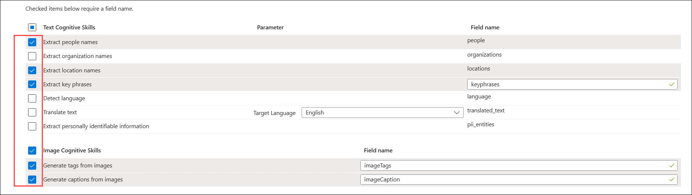          

        Double-check your selections (it can be difficult to change them later).

1. In the **Save enrichments to a knowledge store** section:
    - Select only the following checkboxes (an <font color="red">error</font> will be displayed, you'll resolve that shortly):
        - **Azure file projections**:
            - Image projections
        - **Azure table projections**:
            - Documents
                - Key phrases
        - **Azure blob projections**:
            - Document

          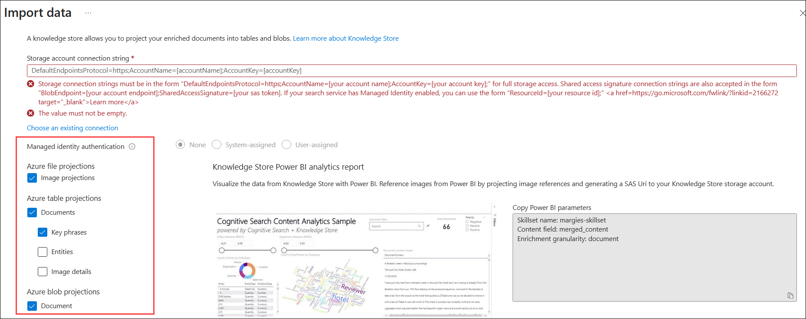

    - Under **Storage account connection string** (beneath the <font color="red">error messages</font>):
        - Select **Choose an existing connection**

          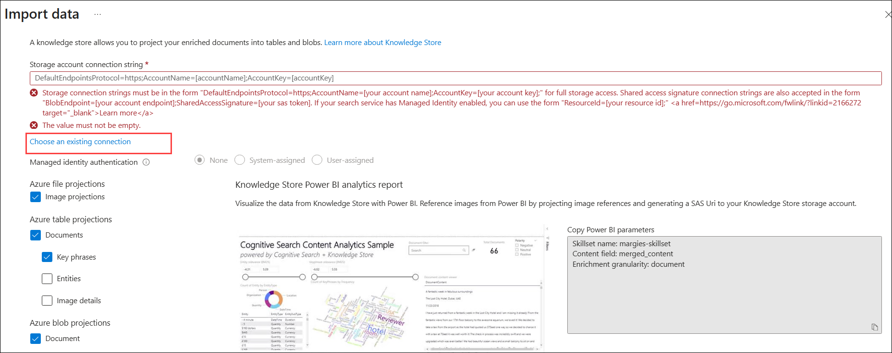 

        - Select your storage account

                   

        - Select the **documents (1)** container and then **Select (2)** (*this is only required to select the storage account in the browse interface - you'll specify a different container name for the extracted knowledge assets!*)

                   

    - Change the **Container name** to `knowledge-store` **(1)**. 

    - Proceed to the next step (**Customize target index (2)**), where you'll specify the fields for your index.    

      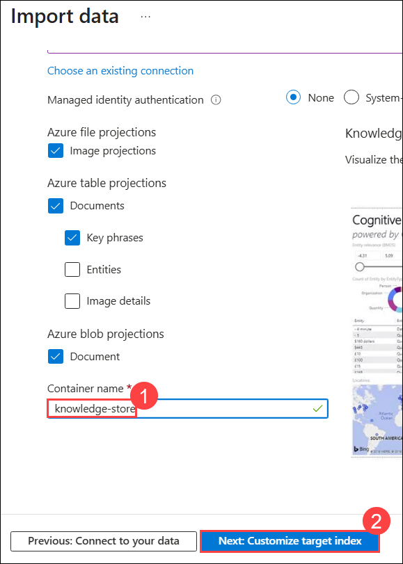                        

1. Change the **Index name** to `margies-index` **(1)**.
    - Ensure that the **Key** is set to **metadata_storage_path (2)**
    - Leave the **Suggester name** blank
    - Ensure **Search mode** is **analyzingInfixMatching (3)**

      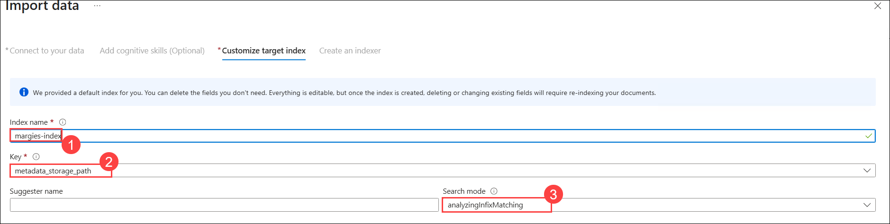      
       
1. Make the following changes to the index fields, leaving all other fields with their default settings **(1)** (**IMPORTANT**: you may need to scroll to the right to see the entire table) and then proceed to the next step (**Create an indexer (2)**), where you'll create and schedule the indexer.

    | Field name | Retrievable | Filterable | Sortable | Facetable | Searchable |
    | ---------- | ----------- | ---------- | -------- | --------- | ---------- |
    | metadata_storage_size | &nbsp;&nbsp;&nbsp;&nbsp;&nbsp;&nbsp;&#10004; | &nbsp;&nbsp;&nbsp;&nbsp;&nbsp;&nbsp;&#10004; | &nbsp;&nbsp;&nbsp;&nbsp;&nbsp;&nbsp;&#10004; | | |
    | metadata_storage_last_modified | &nbsp;&nbsp;&nbsp;&nbsp;&nbsp;&nbsp;&#10004; | &nbsp;&nbsp;&nbsp;&nbsp;&nbsp;&nbsp;&#10004; | &nbsp;&nbsp;&nbsp;&nbsp;&nbsp;&nbsp;&#10004; | | |
    | metadata_storage_name | &nbsp;&nbsp;&nbsp;&nbsp;&nbsp;&nbsp;&#10004; | &nbsp;&nbsp;&nbsp;&nbsp;&nbsp;&nbsp;&#10004; | &nbsp;&nbsp;&nbsp;&nbsp;&nbsp;&nbsp;&#10004; | | &nbsp;&nbsp;&nbsp;&nbsp;&nbsp;&nbsp;&#10004; |
    | locations | &nbsp;&nbsp;&nbsp;&nbsp;&nbsp;&nbsp;&#10004; | &nbsp;&nbsp;&nbsp;&nbsp;&nbsp;&nbsp;&#10004; | | | &nbsp;&nbsp;&nbsp;&nbsp;&nbsp;&nbsp;&#10004; |
    | people | &nbsp;&nbsp;&nbsp;&nbsp;&nbsp;&nbsp;&#10004; | &nbsp;&nbsp;&nbsp;&nbsp;&nbsp;&nbsp;&#10004; | | | &nbsp;&nbsp;&nbsp;&nbsp;&nbsp;&nbsp;&#10004; |
    | keyphrases | &nbsp;&nbsp;&nbsp;&nbsp;&nbsp;&nbsp;&#10004; | &nbsp;&nbsp;&nbsp;&nbsp;&nbsp;&nbsp;&#10004; | | | &nbsp;&nbsp;&nbsp;&nbsp;&nbsp;&nbsp;&#10004; |

    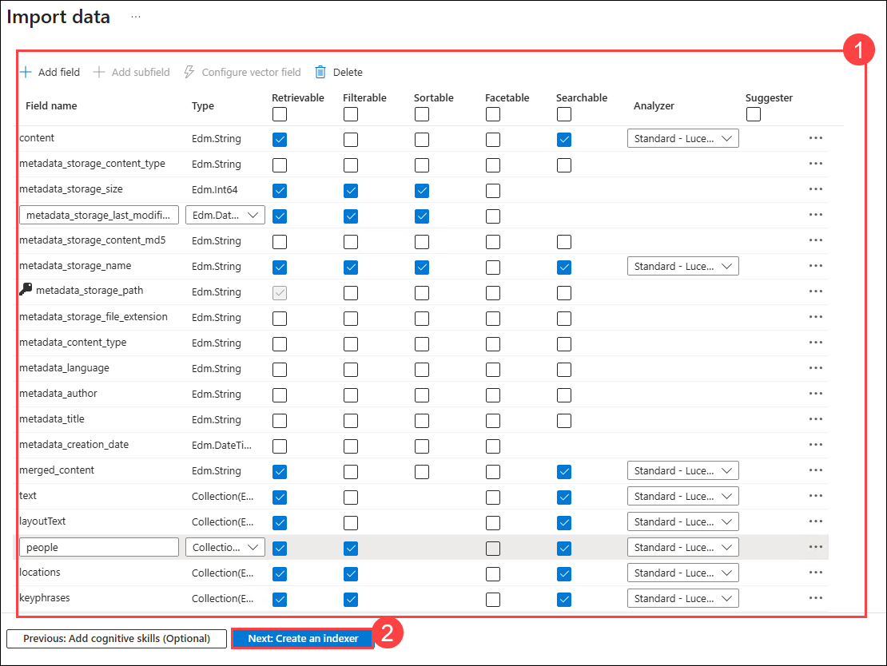      

    Double-check your selections, paying particular attention to ensure that the correct **Retrievable**, **Filterable**, **Sortable**, **Facetable**, and **Searchable** options are selected correctly for each field  (it can be difficult to change them later).

1. On the **Import data** page,

    - Change the **Indexer name** to `margies-indexer` **(1)**.
    - Leave the **Schedule** set to **Once (2)**.
    - Select **Submit (3)** to create the data source, skillset, index, and indexer.

      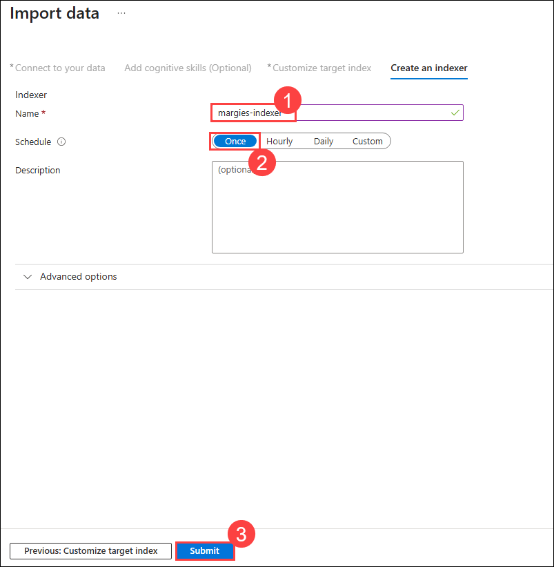  

    The indexer is run automatically and runs the indexing pipeline, which:
     - Extracts the document metadata fields and content from the data source
     - Runs the skillset of cognitive skills to generate additional enriched fields
     - Maps the extracted fields to the index.
     - Saves the extracted data assets to the knowledge store.
     
1. In the navigation pane on the left, under **Search management** view the **Indexers (1)** page, which should show the newly created **margies-indexer**. Wait a few minutes, and click **&orarr; Refresh** until the **Status** indicates **Success (2)**.

    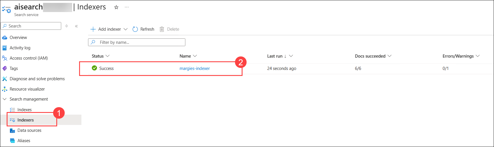

### Task 5: Search the index

Now that you have an index, you can search it.

1. Return to the **Overview** page for your Azure AI Search resource, and on the toolbar, select **Search explorer**.

    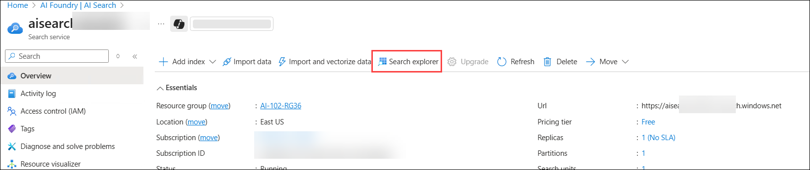

1. In Search explorer, in the **Query string** box, enter `*` **(1)** (a single asterisk), and then select **Search (2)**.

    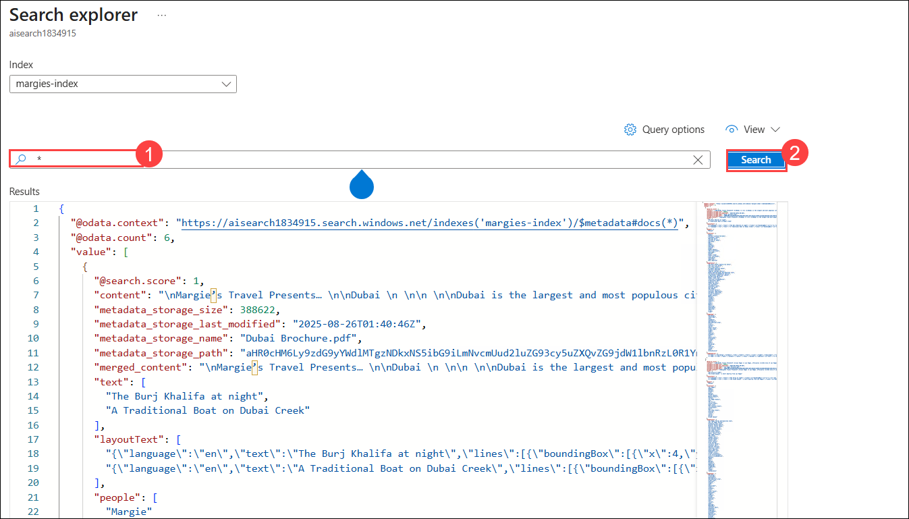

    This query retrieves all documents in the index in JSON format. Examine the results and note the fields for each document, which contain document content, metadata, and enriched data extracted by the cognitive skills you selected.

1. In the **View (1)** menu, select **JSON view (2)** and note that the JSON request for the search is shown, like this **(3)**:

    ```json
    {
      "search": "*",
      "count": true
    }
    ```

     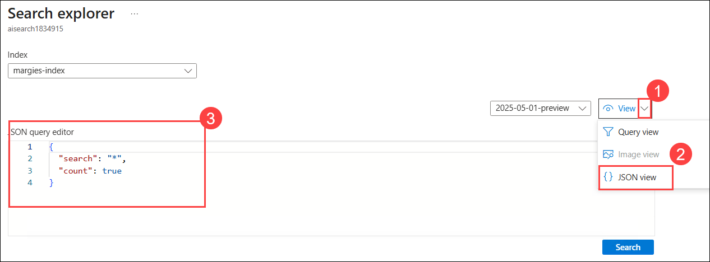

1. The results include a **@odata.count** field at the top of the results that indicates the number of documents returned by the search.

    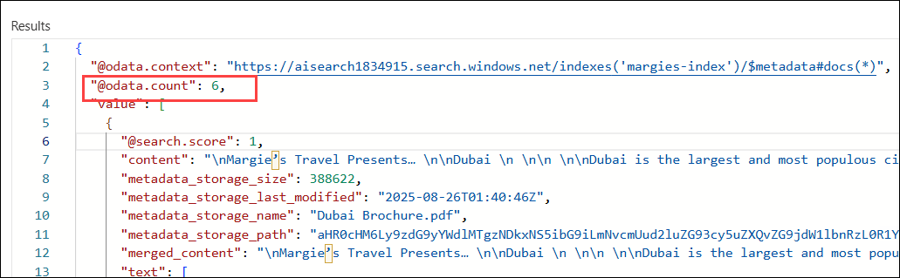

1. Modify the JSON request to include the **select** parameter as shown here:

    ```json
    {
      "search": "*",
      "count": true,
      "select": "metadata_storage_name,locations"
    }
    ```

     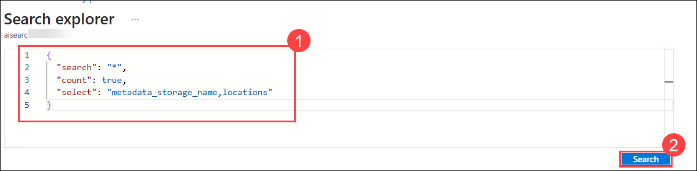    

     This time the results include only the file name and any locations mentioned in the document content. The file name is in the **metadata_storage_name** field, which was extracted from the source document. The **locations** field was generated by an AI skill.

     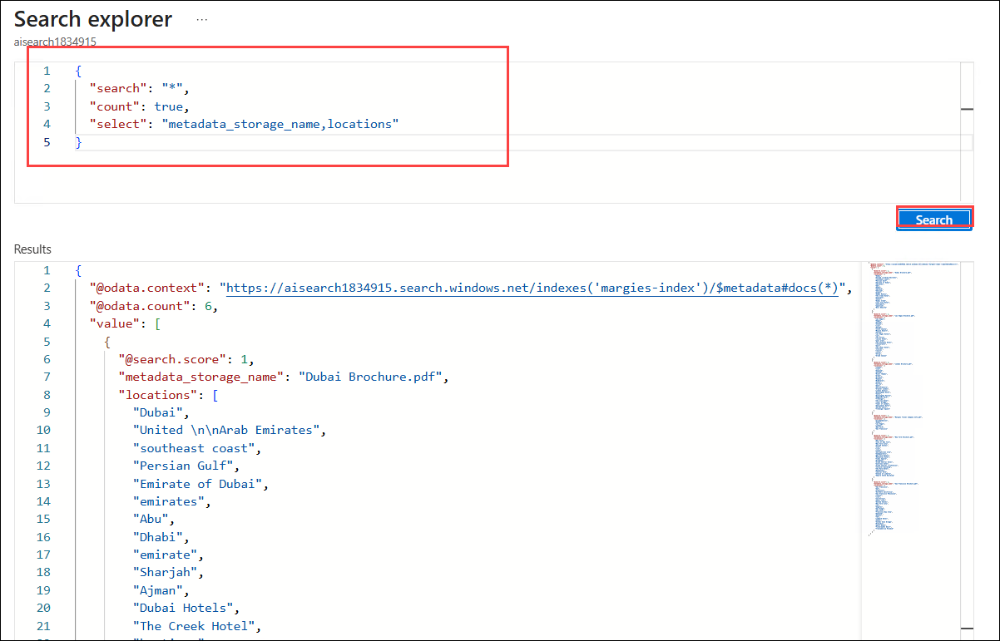        

1. Now try the following query string:

    ```json
    {
      "search": "New York",
      "count": true,
      "select": "metadata_storage_name,keyphrases"
    }
    ```

     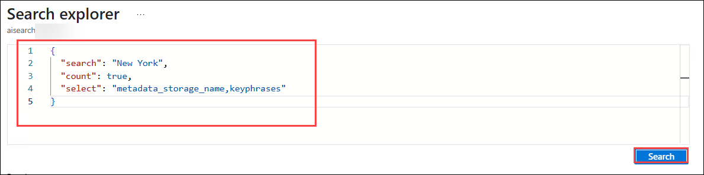     

     This search finds documents that mention "New York" in any of the searchable fields, and returns the file name and key phrases in the document.

     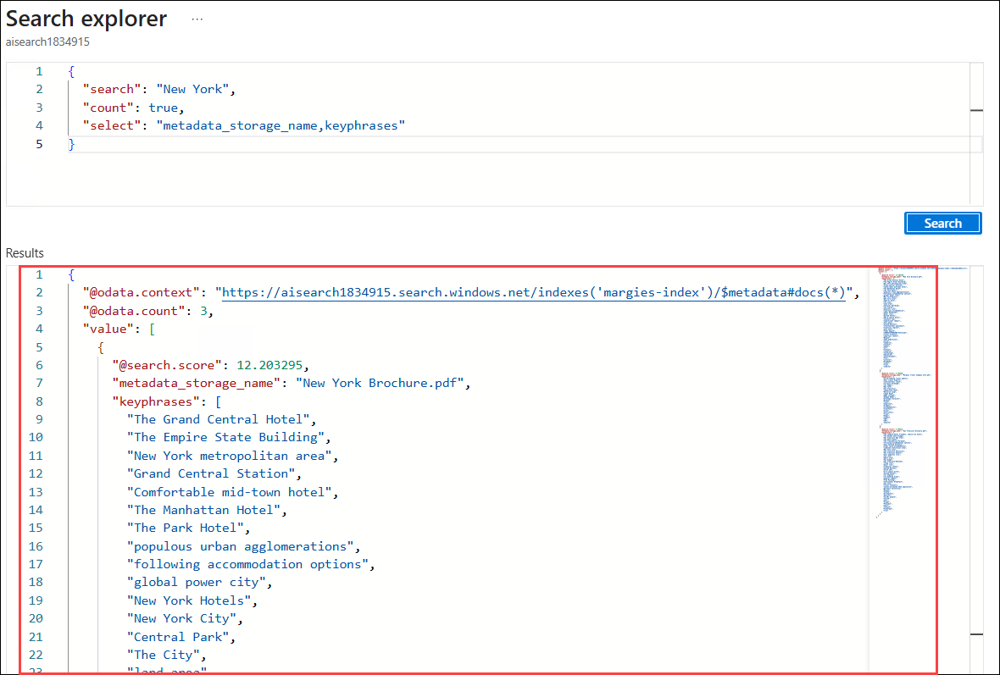     

1. Let's try one more query:

    ```json
    {
        "search": "New York",
        "count": true,
        "select": "metadata_storage_name,keyphrases",
        "filter": "metadata_storage_size lt 380000"
    }
    ```

    This query returns the filename and key phrases for any documents mentioning "New York" that are smaller than 380,000 bytes in size.  

### Task 6: Create a search client application

Now that you have a useful index, you can use it from a client application. You can do this by consuming the REST interface, submitting requests and receiving responses in JSON format over HTTP; or you can use the software development kit (SDK) for your preferred programming language. In this exercise, we'll use the SDK.

> **Note**: You can choose to use the SDK for either **C#** or **Python**. In the steps below, perform the actions appropriate for your preferred language.

### Task 6.1: Get the endpoint and keys for your search resource

1. In the Azure portal, close the search explorer page and return to the **Overview** page for your Azure AI Search resource.

   - Note the **Url (2)** value, which should be similar to **https://*your_resource_name*.search.windows.net**. This is the endpoint for your search resource.

     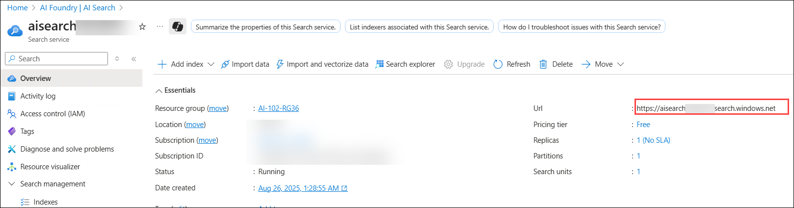   

1. In the navigation pane on the left, expand **Settings** and view the **Keys (2)** page.

    Note that there are two **admin** keys, and a single **query** key. An *admin* key is used to create and manage search resources; a *query* key is used by client applications that only need to perform search queries.

    - *You will need the **endpoint** and **query (2)** key for your client application.*

      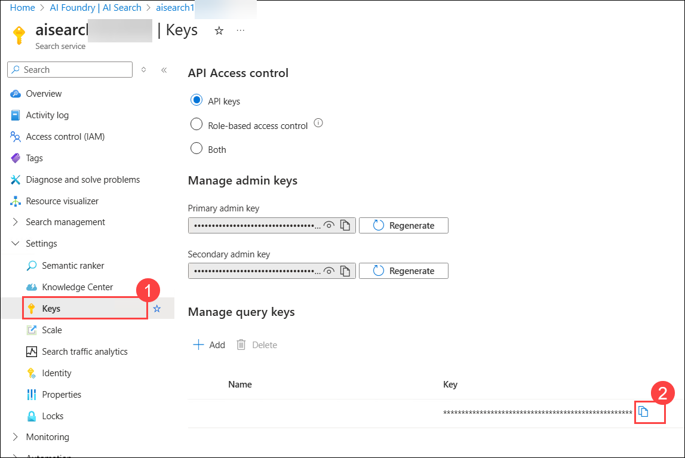    

### Task 6.2: Prepare to use the Azure AI Search SDK      

1. Use the **[>_]** button to the right of the search bar at the top of the page to create a new **Cloud Shell** in the Azure portal.

    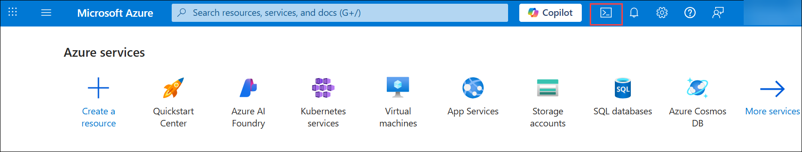 

1. Selecting a **PowerShell** environment.

     

1. On the **Getting started** page,

    - Select **No storage account required (1)** 
    - Select your subscription **(2)**
    - Click on **Apply (3)**

       

1. In the cloud shell toolbar, in the **Settings (1)** menu, select **Go to Classic version (2)** (this is required to use the code editor).

    

     >**Note**: The cloud shell provides a command-line interface in a pane at the bottom of the Azure portal. You can resize or maximize this pane to make it easier to work in.

     >**Note**: Ensure you've switched to the classic version of the cloud shell before continuing.

1. In the cloud shell pane, enter the following commands to clone the GitHub repo containing the code files for this exercise (type the command, or copy it to the clipboard and then right-click in the command line and paste as plain text):

    ```
   rm -r mslearn-ai-info -f
   git clone https://github.com/microsoftlearning/mslearn-ai-information-extraction mslearn-ai-info
    ```

     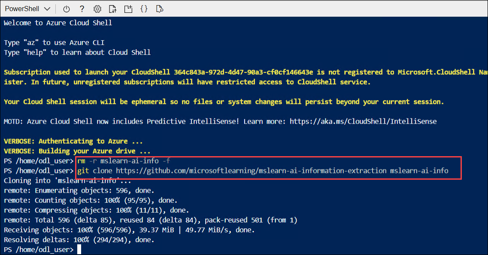     

      >**Tip**: As you enter commands into the cloudshell, the output may take up a large amount of the screen buffer. You can clear the screen by entering the `cls` command to make it easier to focus on each task.

1. After the repo has been cloned, navigate to the folder containing the application code files:

    ```
   cd mslearn-ai-info/Labfiles/knowledge/python
   ls -a -l
    ```

     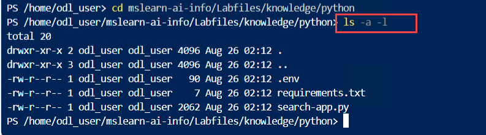      

1. Install the Azure AI Search SDK and Azure identity packages by running the following commands:

    ```
   python -m venv labenv
   ./labenv/bin/Activate.ps1
   pip install -r requirements.txt azure-identity azure-search-documents==11.5.1
    ```

1. Run the following command to edit the configuration file for your app:

    ```
   code .env
    ```

     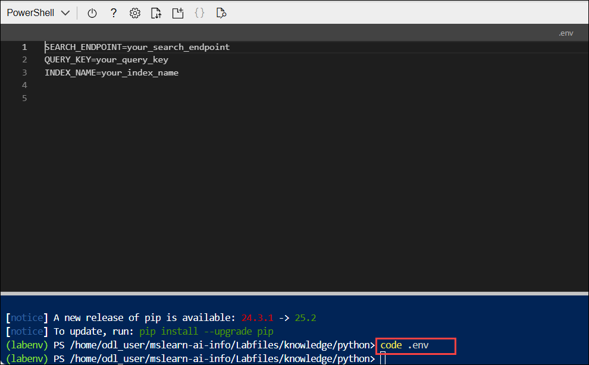     

     The configuation file is opened in a code editor.

1. Edit the configuration file to replace the following placeholder values with values you copied in `Task 6.2`:

    - **your_search_endpoint** (*replace with the endpoint for your Azure AI Search resource*)
    - **your_query_key** *(replace with the query key for your Azure AI Search resource*)
    - **your_index_name** (*replace with the name of your index, which should be `margies-index`*)    

      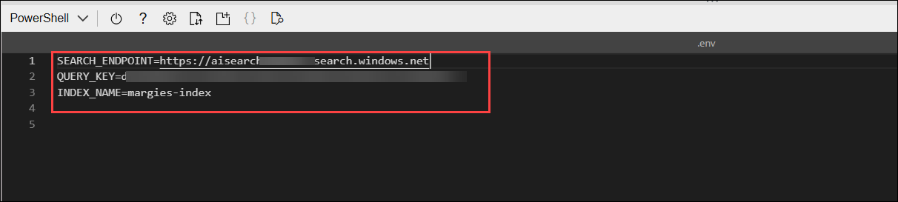   

1. When you've updated the placeholders, use the **CTRL+S** command to save the file and then use the **CTRL+Q** command to close it.

    >**Tip**: Now that you've copied the endpoint and key from the Azure portal, you might want to maximize the cloud shell pane to make it easier to work in.

1. Run the following command to open the code file for your app:

    ```
   code search-app.py
    ```

     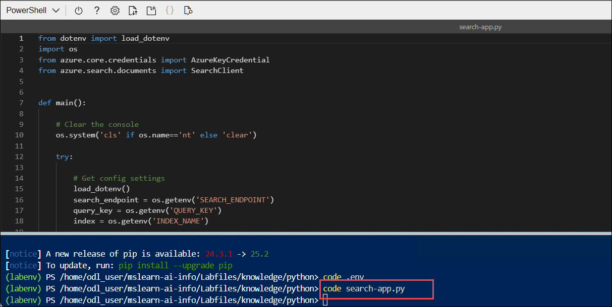      

     The code file is opened in a code editor.

1. Review the code, and note that it performs the following actions:

    - Retrieves the configuration settings for your Azure AI Search resource and index from the configuration file you edited.
    - Creates a **SearchClient** with the endpoint, key, and index name to connect to your search service.
    - Prompts the user for a search query (until they enter "quit")
    - Searches the index using the query, returning the following fields (ordered by metadata_storage_name):
        - metadata_storage_name
        - locations
        - people
        - keyphrases
    - Parses the search results that are returned to display the fields returned for each document in the result set.

1. Close the code editor pane (*CTRL+Q*), keeping the cloud shell command line console pane open.

1. Enter the following command to run the app:

    ```
   python search-app.py
    ```

          

1. When prompted, enter a query such as `London` and view the results.

       

1. Try another query, such as `flights`.

     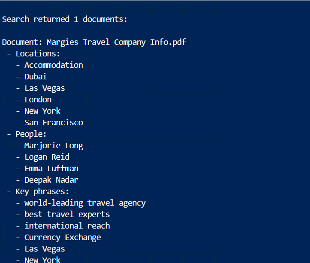   

     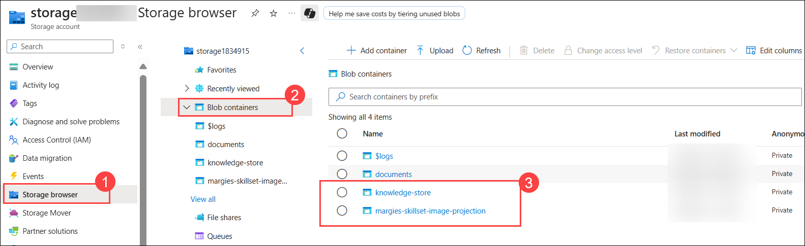        

1. When you're finished testing the app, enter `quit` to close it.

1. Close the Cloud shell, returning to the **Azure portal**.

### Task 7: View the knowledge store

After you have run an indexer that uses a skillset to create a knowledge store, the enriched data extracted by the indexing process is persisted in the knowledge store projections.

### Task 7.1: View object projections

The *object* projections defined in the Margie's Travel skillset consist of a JSON file for each indexed document. These files are stored in a blob container in the Azure Storage account specified in the skillset definition.

1. In the Azure portal, view the **Azure Storage** account you created previously.

1. Select the **Storage browser (1)** tab (in the pane on the left) to view the storage account in the storage explorer interface in the Azure portal.

   - Expand **Blob containers (2)** to view the containers in the storage account.
   - In addition to the **documents** container where the source data is stored, there should be two new containers: **knowledge-store** and **margies-skillset-image-projection**. These were created by the indexing process **(3)**.

      

1. Select the **knowledge-store** container. It should contain a folder for each indexed document.

1. Open any of the folders, and then select the **objectprojection.json** file it contains.

     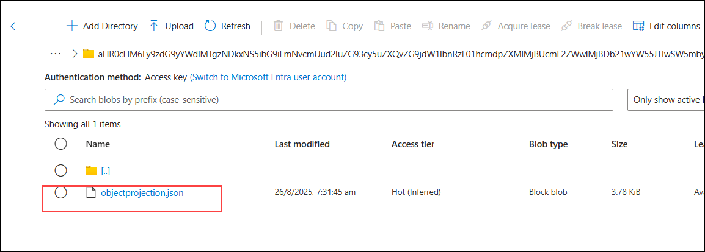 

1. Use the **Download** button on the toolbar to download and open it.

     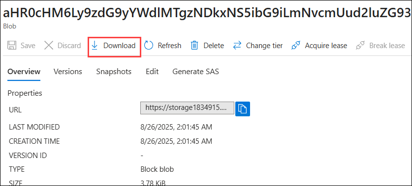 

1. Each JSON file contains a representation of an indexed document, including the enriched data extracted by the skillset as shown here (formatted to make it easier to read).

    ```json
    {
        "metadata_storage_content_type": "application/pdf",
        "metadata_storage_size": 388622,
        "<more_metadata_fields>": "...",
        "key_phrases":[
            "Margie’s Travel",
            "Margie's Travel",
            "best travel experts",
            "world-leading travel agency",
            "international reach"
            ],
        "locations":[
            "Dubai",
            "Las Vegas",
            "London",
            "New York",
            "San Francisco"
            ],
        "image_tags":[
            "outdoor",
            "tree",
            "plant",
            "palm"
            ],
        "more fields": "..."
    }
    ```

     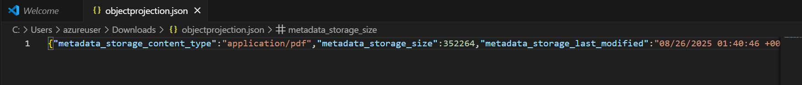     

     The ability to create *object* projections like this enables you to generate enriched data objects that can be incorporated into an enterprise data analysis solution.

### Task 7.2: View file projections

The *file* projections defined in the skillset create JPEG files for each image that was extracted from the documents during the indexing process.

1. In the *Storage browser* interface in the Azure portal, select the **margies-skillset-image-projection** blob container. This container contains a folder for each document that contained images.

     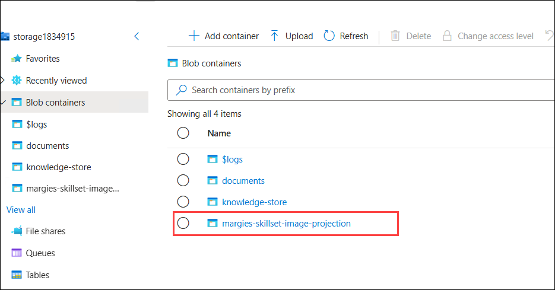 

1. Open any of the **folders** and view its contents - each folder contains at least one \*.jpg file.

1. Open any of the image files.

     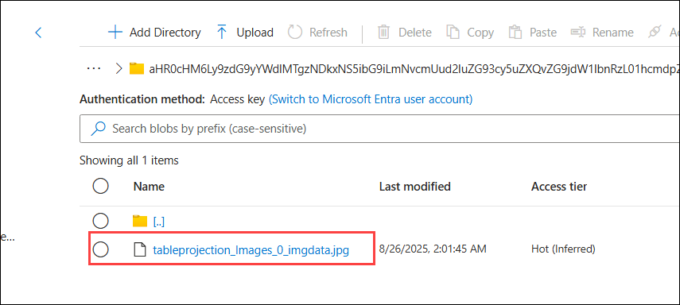 

1. Download the image and view it to see the image. 

      

The ability to generate *file* projections like this makes indexing an efficient way to extract embedded images from a large volume of documents.

### 7.3: Task View table projections

The *table* projections defined in the skillset form a relational schema of enriched data.

1. In the *Storage browser* interface in the Azure portal, expand **Tables (1)**.
  - Select the **margiesSkillsetDocument (2)** table to view data. This table contains a row for each document that was indexed:

    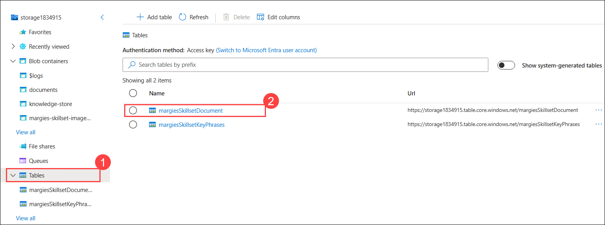   

  - View the **margiesSkillsetKeyPhrases (3)** table, which contains a row for each key phrase extracted from the documents.

    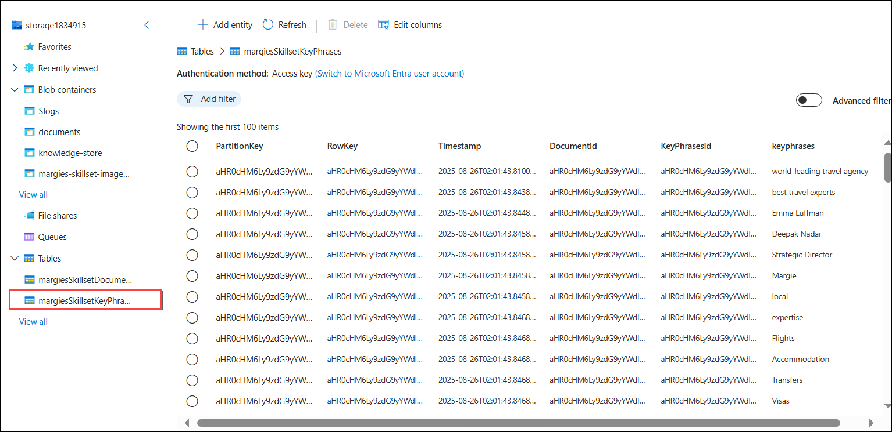  

The ability to create *table* projections enables you to build analytical and reporting solutions that query a relational schema. The automatically generated key columns can be used to join the tables in queries - for example to return all of the key phrases extracted from a specific document.


     
