# Lab 36: Create an knowledge mining solution
In this lab, you use AI Search to index a set of documents maintained by Margie's Travel, a fictional travel agency. The indexing process involves using AI skills to extract key information to make them searchable, and generating a knowledge store containing data assets for further analysis.

### Task 1: Create an Azure AI Search resource

1. On the Azure portal, search for `Azure AI Search` **(1)**, and select **Azure AI Search (2)** from the services.

   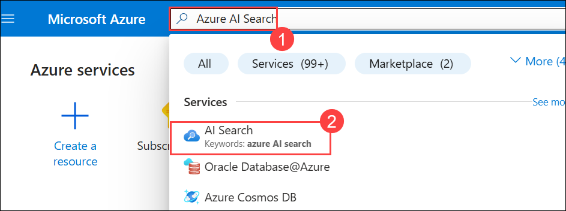

1. Select **+ Create**.

   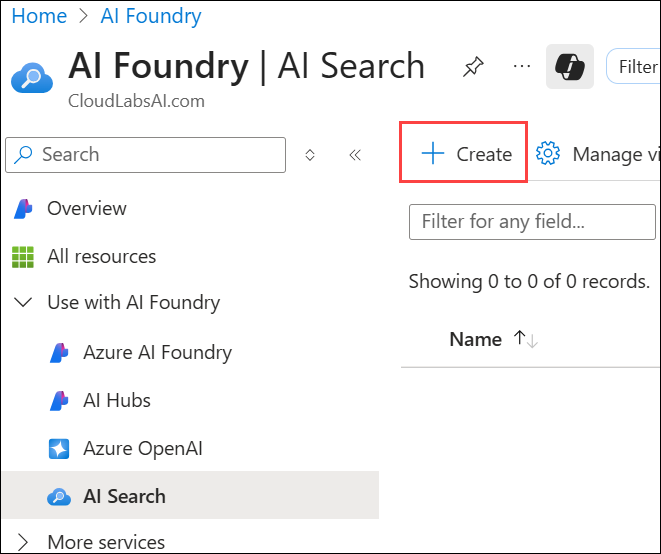

1. Create an **Azure AI Search** resource with the following settings:

    - Subscription: Leave your default  Azure subscription **(1)**
    - Resource group: Select **AI-102-RG24 (2)**
    - Service name: Enter **aisearch<inject key="DeploymentID" enableCopy="false"/> (3)**
    - Location: Select **<inject key="Region" enableCopy="false" /> (4)**
    - Pricing tier: If its Standard then select **Change Pricing Tier (5)**

      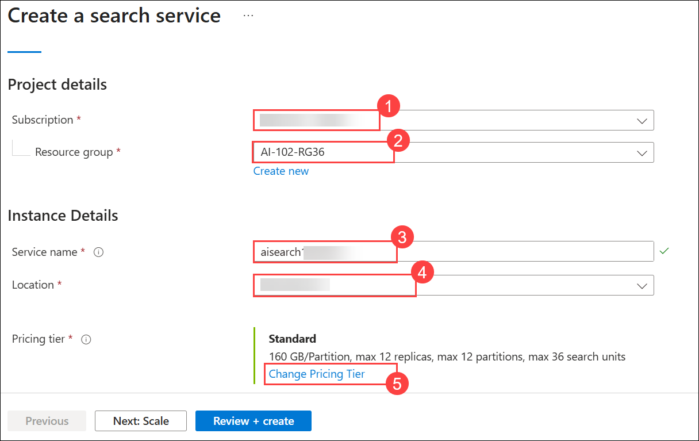

      - Select **Free (1)** and then **Select (2)**

        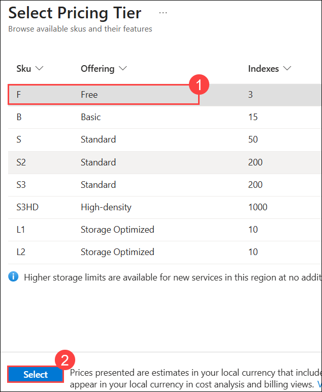   

1. Select **Review+Create**.           

   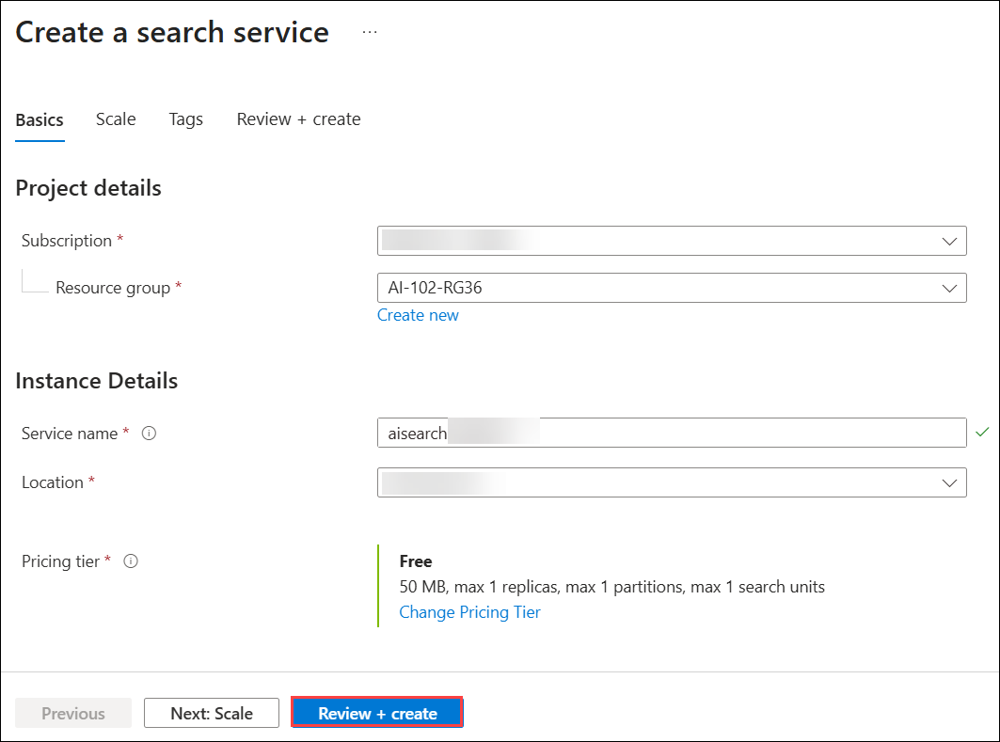

1. Select **Create**.   

1. Wait for deployment to complete, and then select **Go to resources**.

   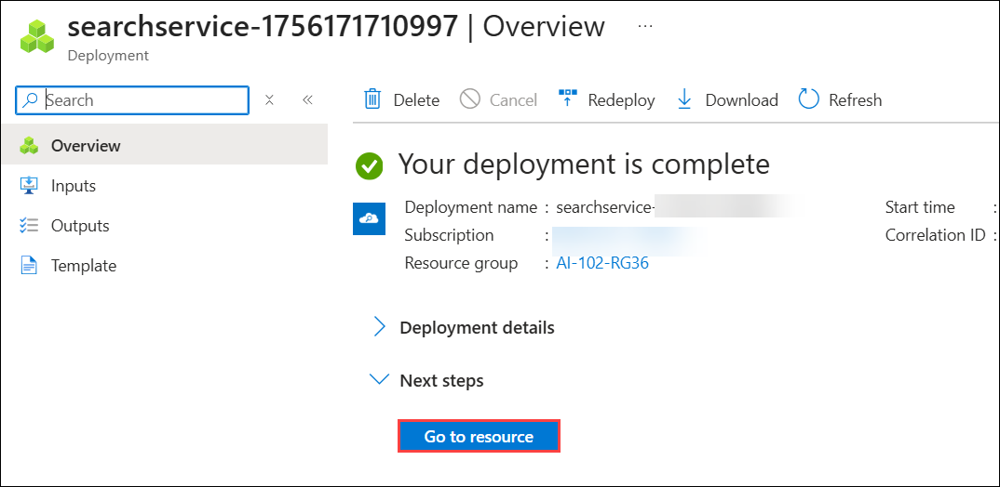

1. Review the **Overview** page on the blade for your Azure AI Search resource in the Azure portal. Here, you can use a visual interface to create, test, manage, and monitor the various components of a search solution; including data **sources, indexes, indexers,** and **skillsets**.

### Task 2: Create a storage account

1. On the Azure portal, search for `Storage account` **(1)**, and select **Storage account (2)** from the services.

   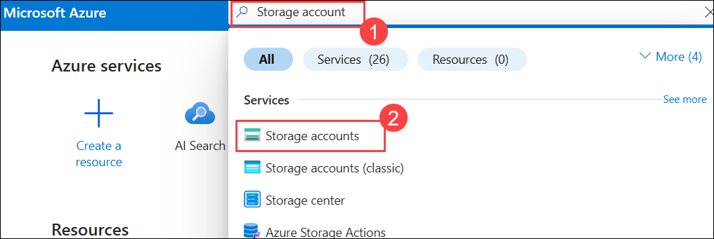

1. Select **+ Create**.   

1. Then create a **Storage account** resource with the following settings:
    - Subscription: *Your Azure subscription* **(1)**
    - Resource group: Select **AI-102-RG24 (2)**
    - Storage account name: Enter **Storage<inject key="DeploymentID" enableCopy="false"/> (3)**
    - Region: Select **<inject key="Region" enableCopy="false" /> (4)**
    - Primary service: Select **Azure Blob Storage or Azure Data Lake Storage Gen 2 (5)**
    - Performance: **Standard (6)**
    - Redundancy: **Locally-redundant storage (LRS) (7)**
    - Then **Review+Create (8)**

      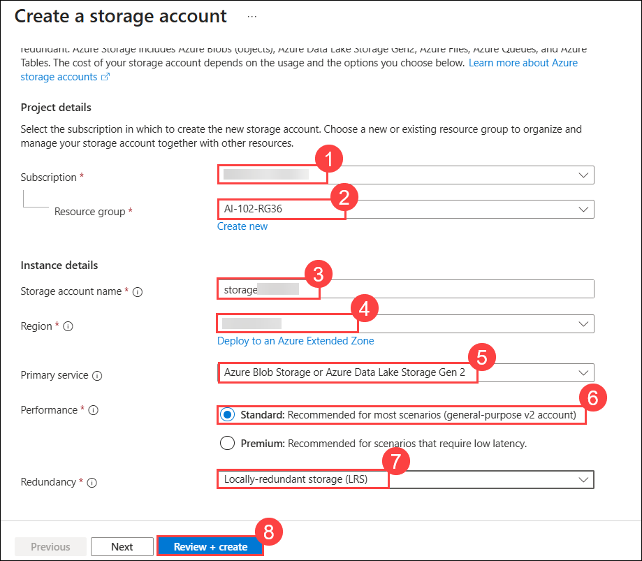    

1. Wait for deployment to complete, and then go to the deployed resource.

    >**Tip**:Keep the storage account portal page open - you will use it in the next procedure.

### Task 3: Upload documents to Azure Storage

Your knowledge mining solution will extract information from travel brochure documents in an Azure Storage blob container.

1. Right click on the following link [documents.zip](https://github.com/microsoftlearning/mslearn-ai-information-extraction/raw/main/Labfiles/knowledge/documents.zip), select **Copy link** and then paste it on the JumpVM's browser tab to download the zip folder.

1. Select the **folder** icon to navigate to the zip folder.

    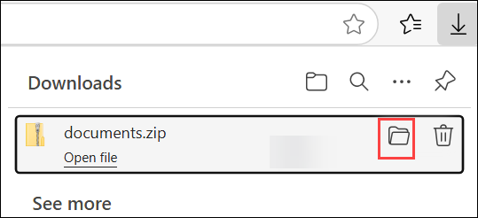

1. Right click on the **documents** zip folder **(1)** and then **Extract All (2)** to extract the downloaded *documents.zip* file

    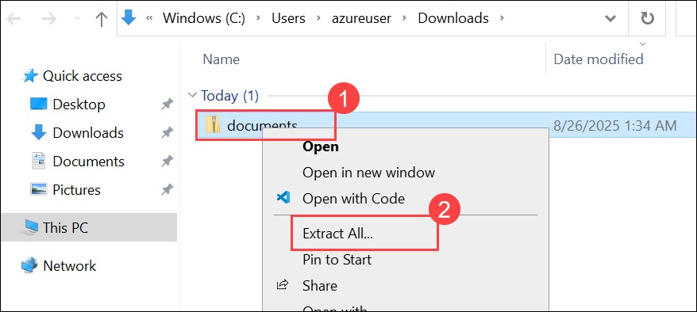

1. Provide the destination path as `C:\LabFiles` **(1)** and then **Extract (2)**. View the travel brochure files it contains. You'll extract and index information from these files.

    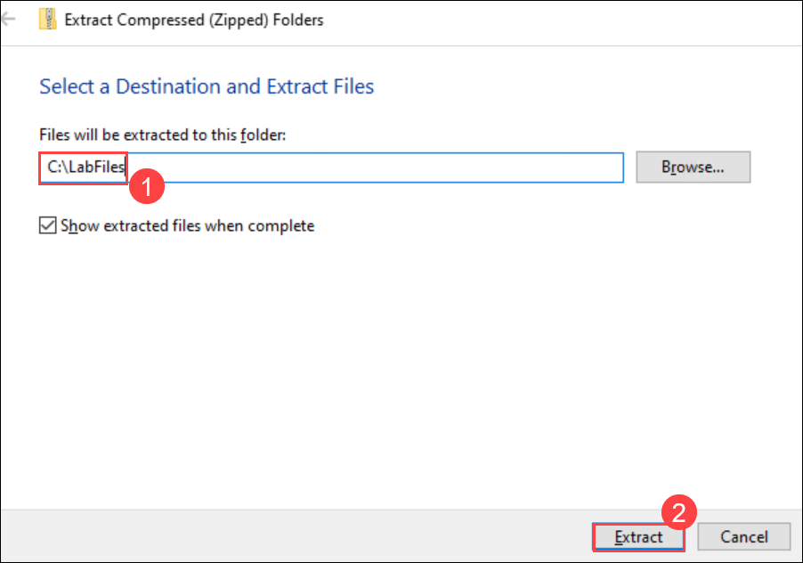

1. On the Azure portal, search for `Storage account` **(1)**, and select **Storage account (2)** from the services.

    

1. Select the **Storage<inject key="DeploymentID" enableCopy="false"/>** Storage account.

    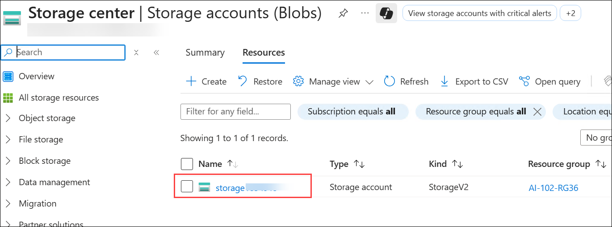

1. From the navigation pane on the left, select **Storage browser (1)**. In the storage browser, select **Blob containers (2)**. In the toolbar, select **+ Add Container (3)**.

    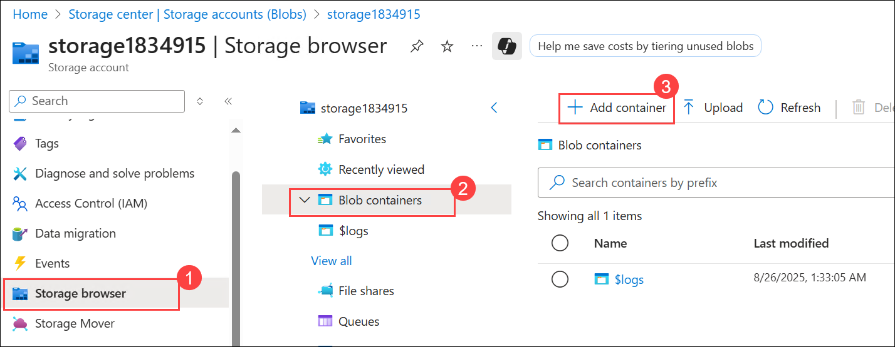

    Currently, your storage account should contain only the default **$logs** container.

1. Create a new container with the following settings and then select **Create (3)**:

     - Name: `documents` **(1)**
     - Anonymous access level: Private (no anonymous access) **(2)**

       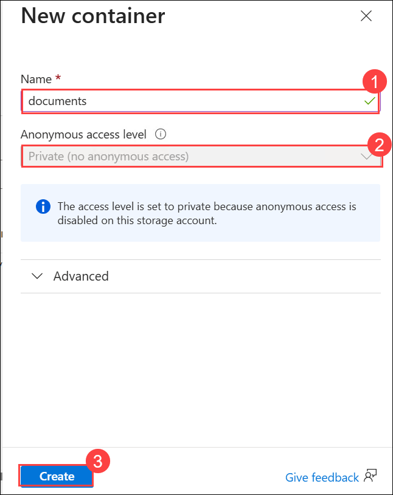    

        > **Note**: Unless you enabled the option to allow anonymous container access when creating your storage account, you won't be able to select any other setting!

1. Select the **documents** container to open it.

    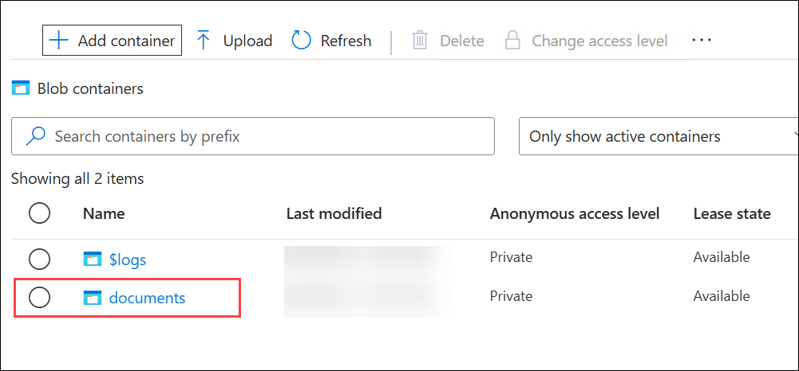

 1. Then use the **Upload** toolbar button to upload the .pdf files you extracted from **documents.zip** .

    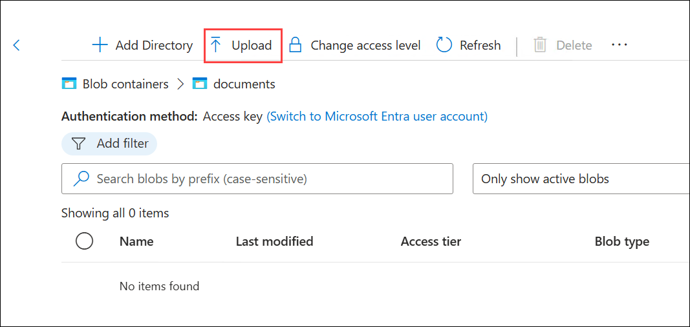

1. Select **Browse for files (1)**, then navigate `C:\LabFiles` **(2)**. Select the **.pdf files** (6 files) **(3)** and then **Open (4)**.

    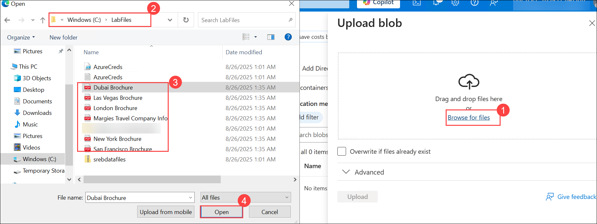

### Task 4: Create and run an indexer

Now that you have the documents in place, you can create an indexer to extract information from them.

1. In the Azure portal, search for `Azure AI Search` **(1)**, and select **Azure AI Search (2)** from the services.

   

1. Then select the **aisearch<inject key="DeploymentID" enableCopy="false"/>** search service.

   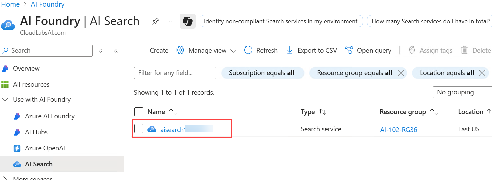

1. Then, on its **Overview** page, select **Import data**.

   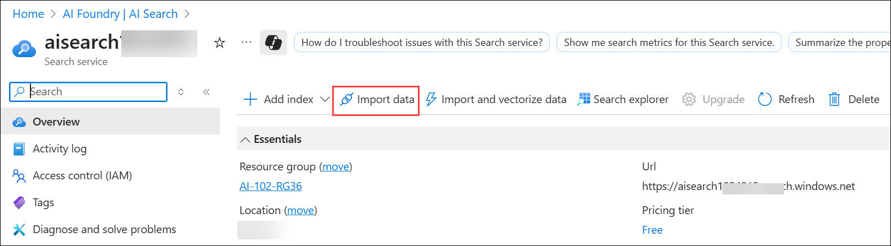

1. On the **Connect to your data** page, in the **Data Source** list, select **Azure Blob Storage**. Then complete the data store details with the following values:
    - Data Source: Azure Blob Storage **(1)**
    - Data source name: `margies-documents` **(2)**
    - Data to extract: **Content and metadata (3)**
    - Parsing mode: Default
    - Subscription: *Your Azure subscription* **(4)**
    - **Connection string**: Select **Choose an existing connection (5)**

      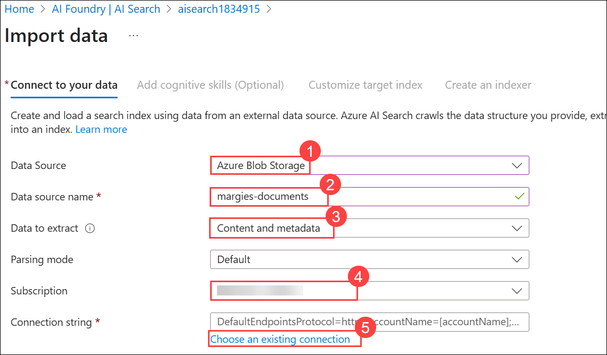    

      - Select your storage account **Storage<inject key="DeploymentID" enableCopy="false"/>**.

        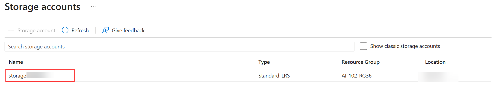   

      - Select the **documents (1)** container and then **Select (2)**

        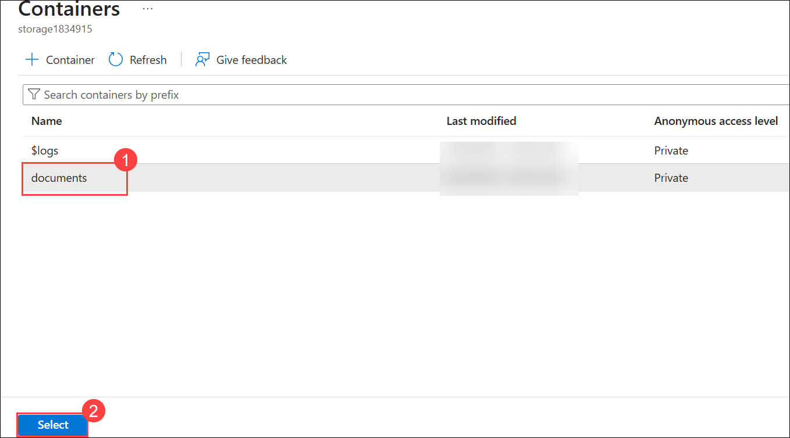   

    - Managed identity authentication: **None (6)**
    - Container name: **documents (7)**
    - Blob folder: *Leave this blank* **(8)**
    - Description: `Travel brochures` **(9)**
    - Proceed to the next step (**Add cognitive skills (10)**), which has three expandable sections to complete.

      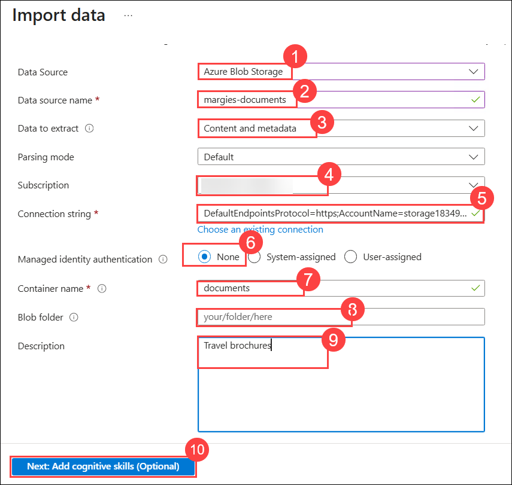    

