# Lab 37: Create an knowledge mining solution

### Estimated Duration : 45 Minutes

## Overview

In this lab, you will build a knowledge mining solution using Azure AI Search by indexing documents stored in Azure Blob Storage. You will enrich the data using built-in AI capabilities to extract key information such as phrases, entities, and locations. By the end, you will query the indexed data and integrate it into a client application using the Azure AI Search SDK.

## Lab Objectives

- **Task 1:** Create an Azure AI Search resource

- **Task 2:** Create a storage account

- **Task 3:** Upload documents to Azure Storage

- **Task 4:** Create and run an indexer

- **Task 5:** Search the index

- **Task 6:** Create a search client application

### Task 1: Create an Azure AI Search resource

In this task, you will create an Azure AI Search resource to enable indexing and querying of data.

1. On the Azure portal, search for `Azure AI Search` **(1)**, and select **Azure AI Search (2)** from the services.

   

1. Select **+ Create**.

   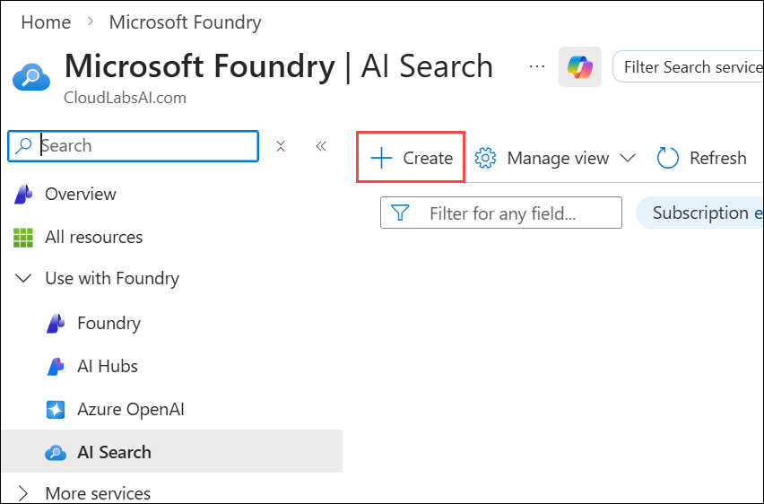

1. Create an **Azure AI Search** resource with the following settings:

    - Subscription: Leave your default  Azure subscription **(1)**
    - Resource group: Select **AI-102-RG37 (2)**
    - Service name: Enter **aisearch<inject key="DeploymentID" enableCopy="false"/> (3)**
    - Location: Select **<inject key="Region" enableCopy="false" /> (4)**
    - Pricing tier: If its Standard then select **Change Pricing Tier (5)**

      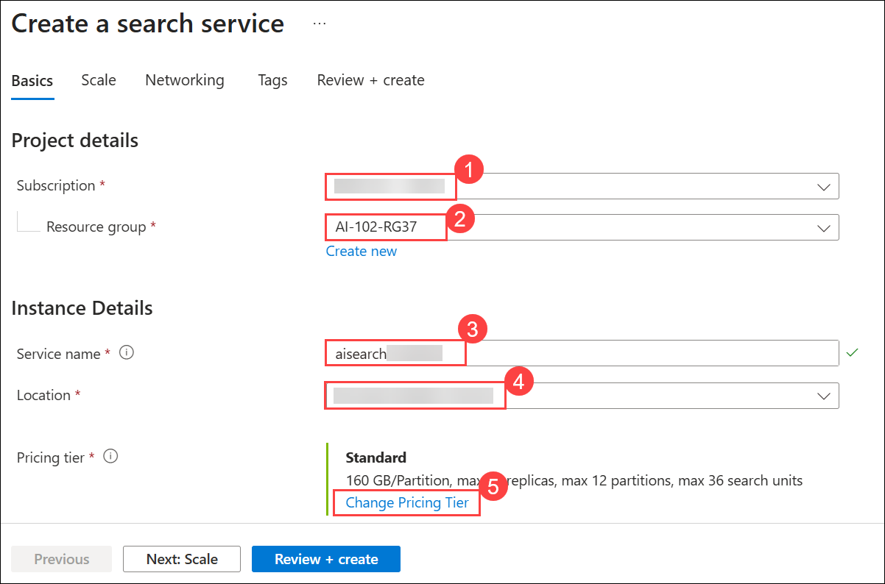

      - Select **Free (1)** and then **Select (2)**

           

1. Select **Review+Create**.           

   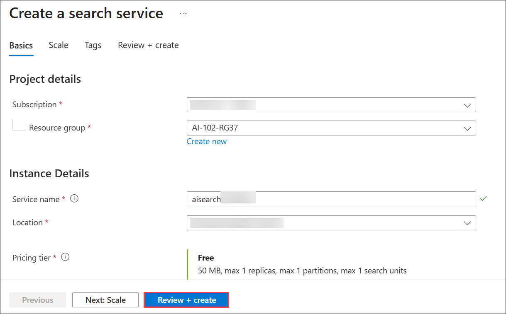

1. Select **Create**.   

1. Wait for deployment to complete, and then select **Go to resources**.

   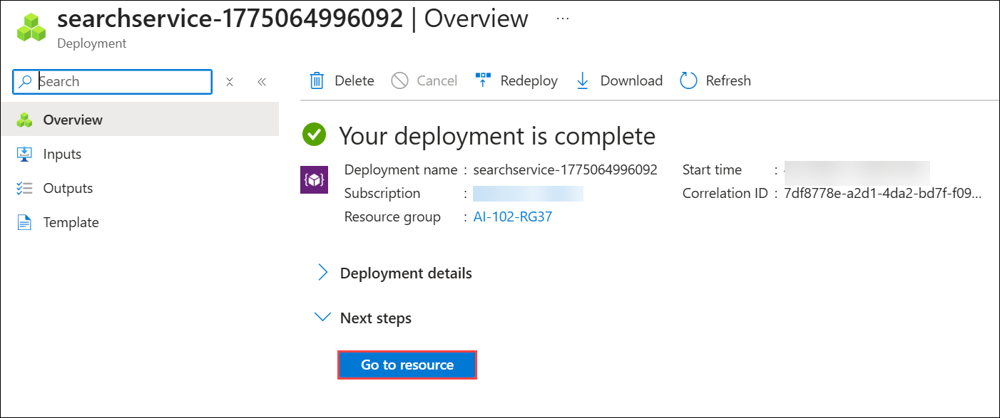

1. Review the **Overview** page on the blade for your Azure AI Search resource in the Azure portal. Here, you can use a visual interface to create, test, manage, and monitor the various components of a search solution; including data **sources, indexes, indexers,** and **skillsets**.

> **Congratulations** on completing the task! Now, it's time to validate it. Here are the steps:
>
> - Hit the Validate button for the corresponding task. If you receive a success message, you can proceed to the next task.
> - If not, carefully read the error message and retry the step, following the instructions in the lab guide.
> - If you need any assistance, please contact us at cloudlabs-support@spektrasystems.com. We are available 24/7 to help.
 
<validation step="84ca2020-f89f-4d72-92fe-def8f190cbeb" />

### Task 2: Create a storage account

In this task, you will create an Azure Storage account to store the documents for your knowledge mining solution.

1. In the Azure Portal tab, in the top search bar, search for **Storage accounts (1)** and select **Storage accounts (2)** from the services section.

    

1. In the **Storage center | Blob Storage** page, select **+ Create** to start creating a new storage account.

    

1. Then create a **Storage account** resource with the following settings:
    
    - Subscription: *Your Azure subscription* **(1)**
    - Resource group: Select **AI-102-RG37 (2)**
    - Storage account name: Enter **storage<inject key="DeploymentID" enableCopy="false"/> (3)**
    - Region: Select **<inject key="Region" enableCopy="false" /> (4)**
    - Primary service: Select **Azure Blob Storage or Azure Data Lake Storage Gen 2 (5)**
    - Performance: **Standard (6)**
    - Redundancy: **Locally-redundant storage (LRS) (7)**
    - Then **Review+Create (8)**

      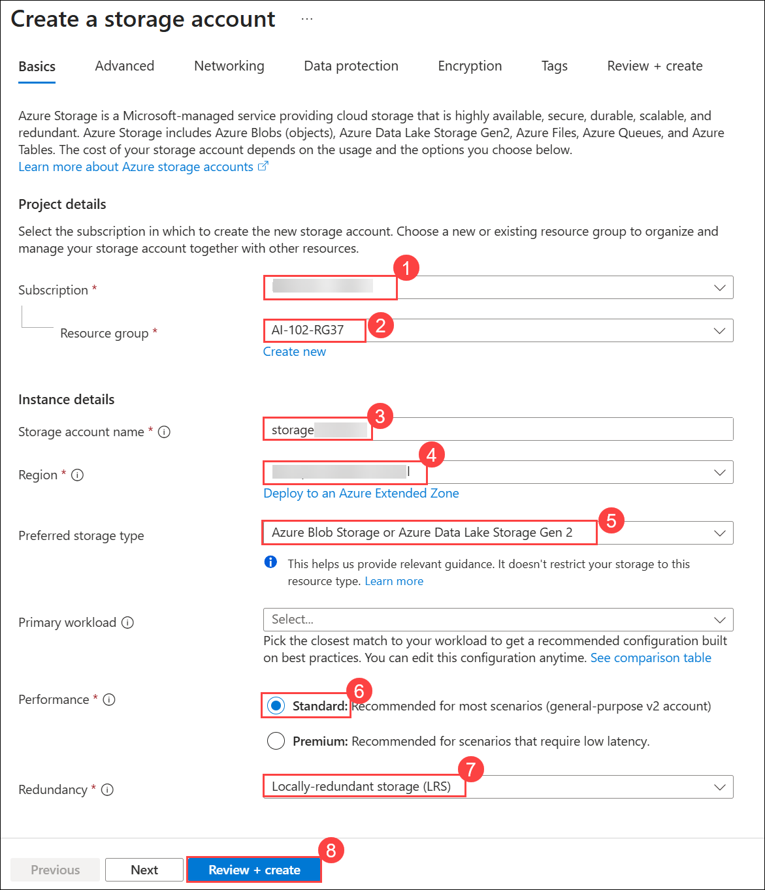  

1. Wait for deployment to complete, and then go to the deployed resource.

    >**Tip:** Keep the storage account portal page open - you will use it in the next procedure.

> **Congratulations** on completing the task! Now, it's time to validate it. Here are the steps:
>
> - Hit the Validate button for the corresponding task. If you receive a success message, you can proceed to the next task.
> - If not, carefully read the error message and retry the step, following the instructions in the lab guide.
> - If you need any assistance, please contact us at cloudlabs-support@spektrasystems.com. We are available 24/7 to help.
 
<validation step="593b8b7b-2f7c-4102-af2f-c6e455caf0c8" />

### Task 3: Upload documents to Azure Storage

In this task, you will upload sample documents to a Blob container in the storage account.

1. Right click on the following link [documents.zip](https://github.com/microsoftlearning/mslearn-ai-information-extraction/raw/main/Labfiles/knowledge/documents.zip), select **Copy link** and then paste it on the JumpVM's browser tab to download the zip folder.

1. Select the **folder** icon to navigate to the zip folder.

    

1. Right click on the **documents** zip folder **(1)** and then **Extract All (2)** to extract the downloaded *documents.zip* file

    

1. Provide the destination path as `C:\LabFiles` **(1)** and then **Extract (2)**. View the travel brochure files it contains. You'll extract and index information from these files.

    

1. On the Azure portal, search for **Storage account (1)**, and select **Storage accounts (2)** from the services.

    

1. Select the **Storage<inject key="DeploymentID" enableCopy="false"/>** Storage account.

    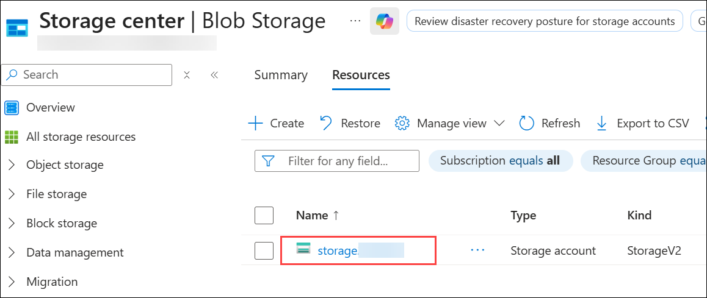  

1. From the navigation pane on the left, select **Storage browser (1)**. In the storage browser, select **Blob containers (2)**. In the toolbar, select **+ Add Container (3)**.

    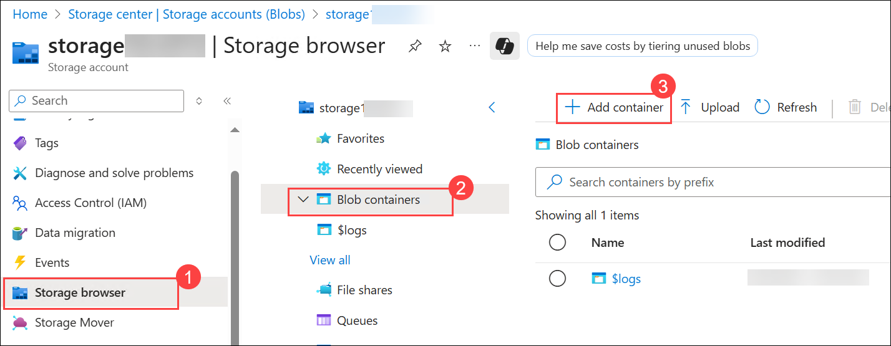  

    Currently, your storage account should contain only the default **$logs** container.

1. Create a new container with the following settings and then select **Create (3)**:

     - Name: `documents` **(1)**
     - Anonymous access level: Private (no anonymous access) **(2)**

           

        > **Note**: Unless you enabled the option to allow anonymous container access when creating your storage account, you won't be able to select any other setting!

1. Select the **documents** container to open it.

    

 1. Then use the **Upload** toolbar button to upload the .pdf files you extracted from **documents.zip** .

    

1. Select **Browse for files (1)**, then navigate `C:\LabFiles` **(2)**. Select the **.pdf files** (6 files) **(3)** and then **Open (4)**.

    

1. In the **Upload blob** pane, select **Upload**.

    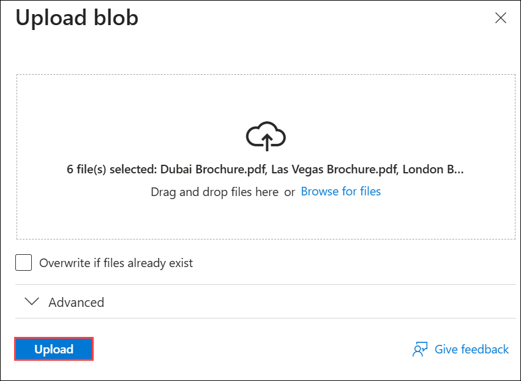  

> **Congratulations** on completing the task! Now, it's time to validate it. Here are the steps:
>
> - Hit the Validate button for the corresponding task. If you receive a success message, you can proceed to the next task.
> - If not, carefully read the error message and retry the step, following the instructions in the lab guide.
> - If you need any assistance, please contact us at cloudlabs-support@spektrasystems.com. We are available 24/7 to help.
 
<validation step="593b8b7b-2f7c-4102-af2f-c6e455caf0c8" />

### Task 4: Create and run an indexer

In this task, you will create and run an indexer to extract, enrich, and index data from the uploaded documents.

1. In the Azure portal, search for `Azure AI Search` **(1)**, and select **Azure AI Search (2)** from the services.

   

1. Then select the **aisearch<inject key="DeploymentID" enableCopy="false"/>** search service.

   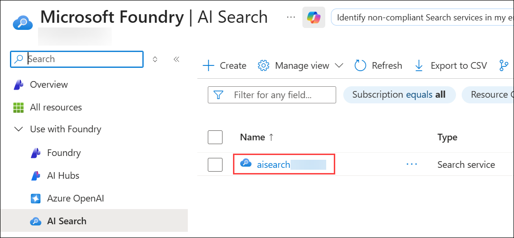  

1. Then, on its **Overview** page, select **Import data**.

   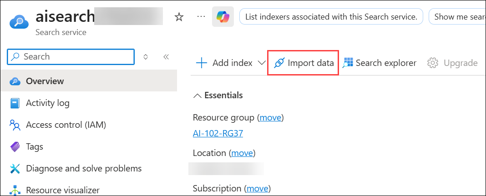  

1. In the **Choose a data source** section, select **Azure Blob Storage**.

    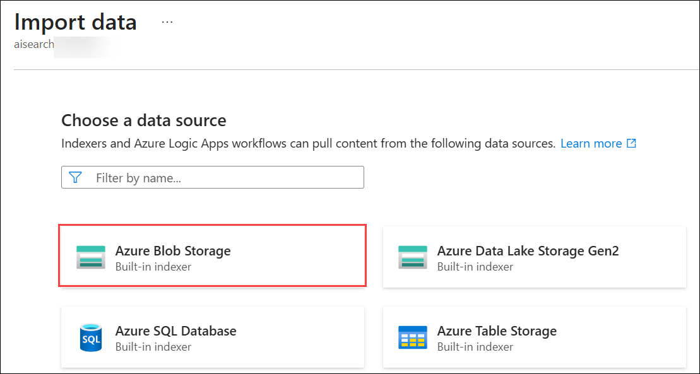  

1. In the **What scenario are you targeting?** section, select **Keyword search**.

    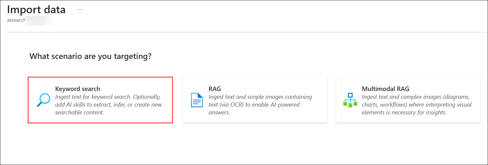 

1. On **Connect to your data** form set the following:

    - Subscription: *Your Azure subscription* **(1)**
    - Select your storage account **Storage<inject key="DeploymentID" enableCopy="false"/> (2)**.
    - **Blob container**: Select the **documents (3)** container.
    - Leave the remaining options as their default values, and then select **Next (4)**.

       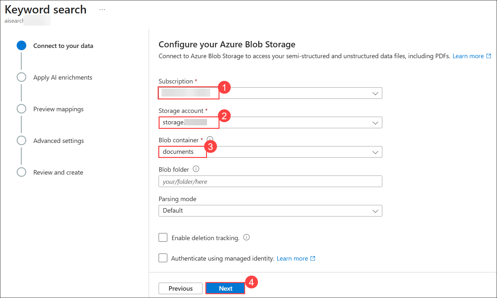 

1. On **Apply AI enrichments** set the following:
    - Select **Extract phrases (1)**.
    - Select **Extract entities**, select the settings icon **(2)**. 
    
      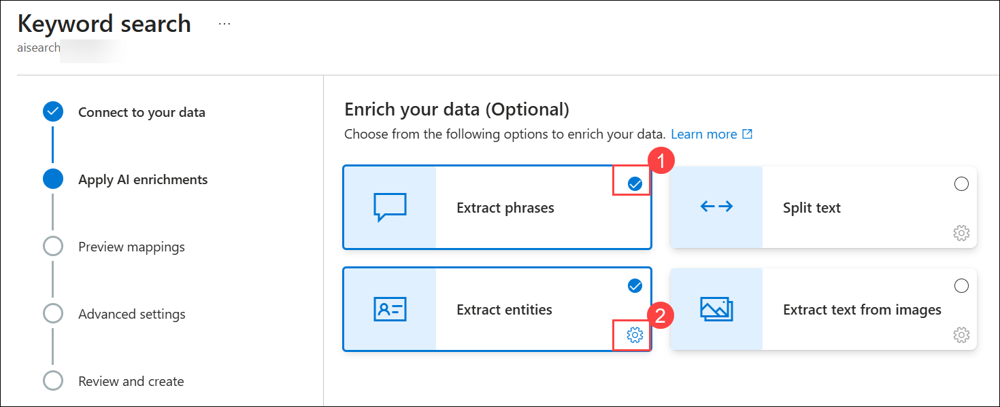 

1. In the **Extract text entities** pane, select **Persons (1)** and **Locations (1)**, and then click **Save (2)**.

    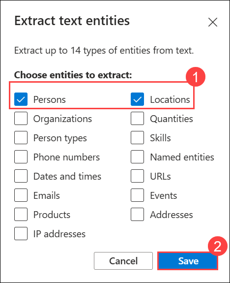 

1. Select **Extract text from images** and select the settings icon. 

    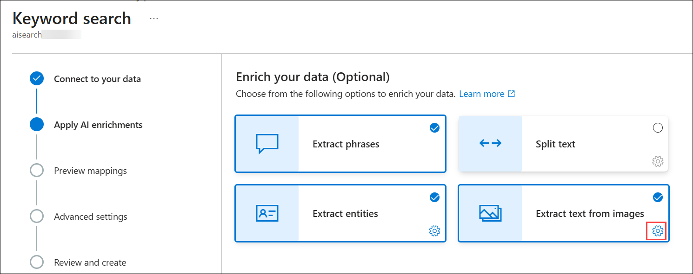 

1. In the **Extract text from images** pane, select **Generate tags (1)** and **Categorize content (1)**, and then click **Save (2)**.

    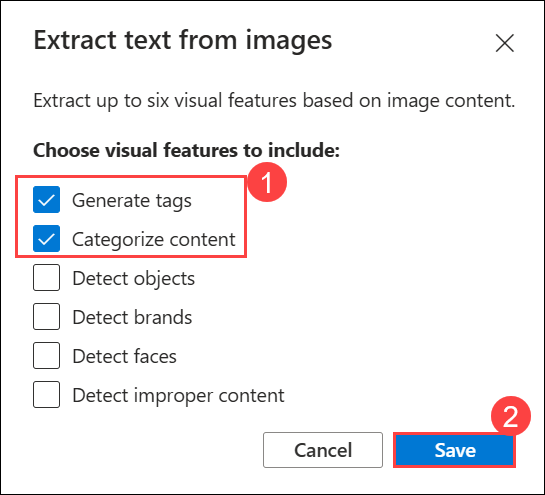 

1. In the **Apply AI enrichments** step, ensure **Extract phrases**, **Extract entities**, and **Extract text from images** are selected **(1)**, select **Use a free Foundry Tools resource (2)**, and then click **Next (3)**.

    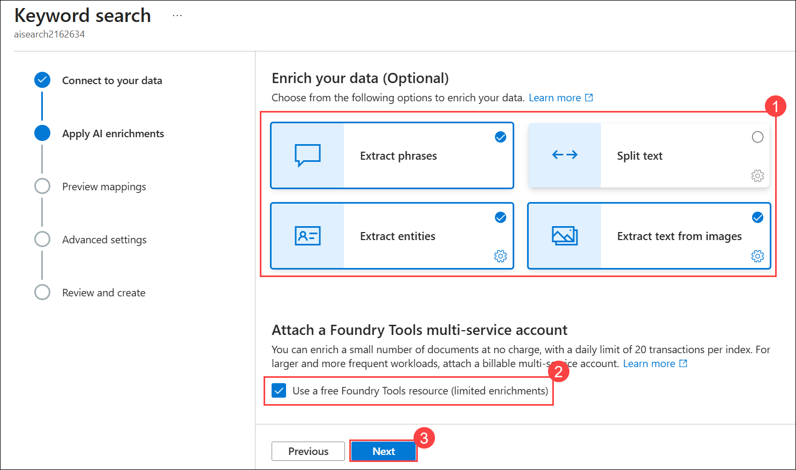 

1. In the **Preview mappings** step, scroll down and select **metadata_storage_size (1)**, click **Configure field (2)**, configure as shown in the following table repeat the same configuration for the remaining fields as required.

    - The fields are already mapped based on the options you selected in the previous step.

    | Target index field name | Retrievable | Filterable | Sortable | Facetable | Searchable |
    | ---------- | ----------- | ---------- | -------- | --------- | ---------- |
    | metadata_storage_size | &nbsp;&nbsp;&nbsp;&nbsp;&nbsp;&nbsp;&#10004; | &nbsp;&nbsp;&nbsp;&nbsp;&nbsp;&nbsp;&#10004; | &nbsp;&nbsp;&nbsp;&nbsp;&nbsp;&nbsp;&#10004; | | |

    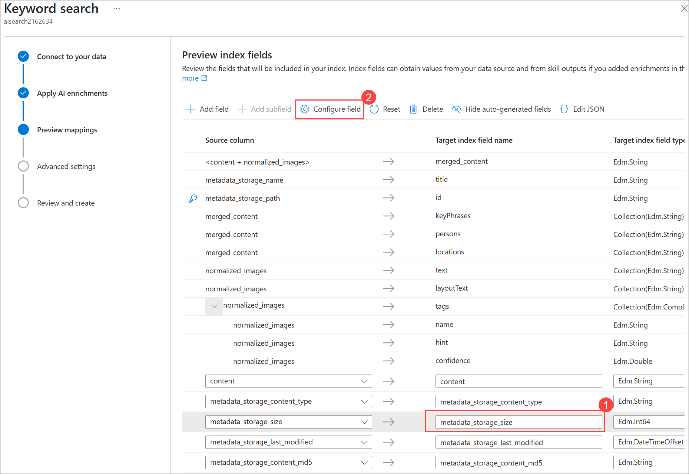 

    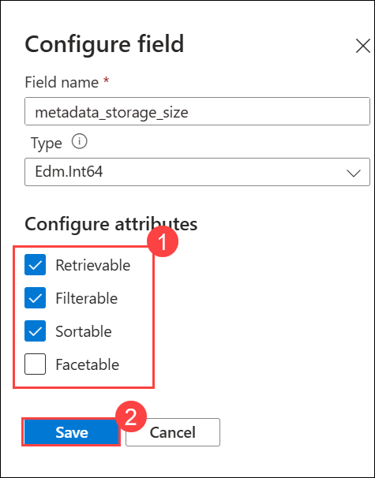 

1. On **Preview mappings** set the following configuration:

    | Target index field name | Retrievable | Filterable | Sortable | Facetable | Searchable |
    | ---------- | ----------- | ---------- | -------- | --------- | ---------- |
    | metadata_storage_last_modified | &nbsp;&nbsp;&nbsp;&nbsp;&nbsp;&nbsp;&#10004; | &nbsp;&nbsp;&nbsp;&nbsp;&nbsp;&nbsp;&#10004; | &nbsp;&nbsp;&nbsp;&nbsp;&nbsp;&nbsp;&#10004; | | |
    | title | &nbsp;&nbsp;&nbsp;&nbsp;&nbsp;&nbsp;&#10004; | | &nbsp;&nbsp;&nbsp;&nbsp;&nbsp;&nbsp;&#10004; | | &nbsp;&nbsp;&nbsp;&nbsp;&nbsp;&nbsp;&#10004; |
    | locations | &nbsp;&nbsp;&nbsp;&nbsp;&nbsp;&nbsp;&#10004; | &nbsp;&nbsp;&nbsp;&nbsp;&nbsp;&nbsp;&#10004; | | | &nbsp;&nbsp;&nbsp;&nbsp;&nbsp;&nbsp;&#10004; |
    | persons | &nbsp;&nbsp;&nbsp;&nbsp;&nbsp;&nbsp;&#10004; | | | | &nbsp;&nbsp;&nbsp;&nbsp;&nbsp;&nbsp;&#10004; |
    | keyPhrases | &nbsp;&nbsp;&nbsp;&nbsp;&nbsp;&nbsp;&#10004; | | | | &nbsp;&nbsp;&nbsp;&nbsp;&nbsp;&nbsp;&#10004; |

    - Double-check your selections carefully.
    - Select **Next**.

1. On **Advanced settings** set the following:
    - Ensure **Enable semantic ranker (1)** is selected.
    - If it isn't already selected, set **Schedule** to **Once (2)**.
    - Select **Next (3)**.

      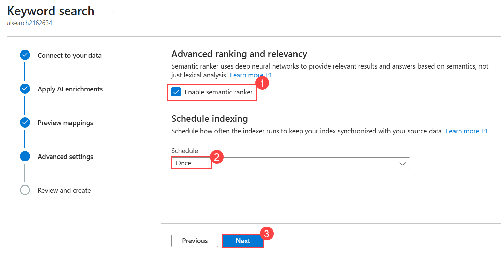 

1. On **Review and create** set **Objects name prefix** to `margies-index` **(1)** and then select **Create (2)**.

    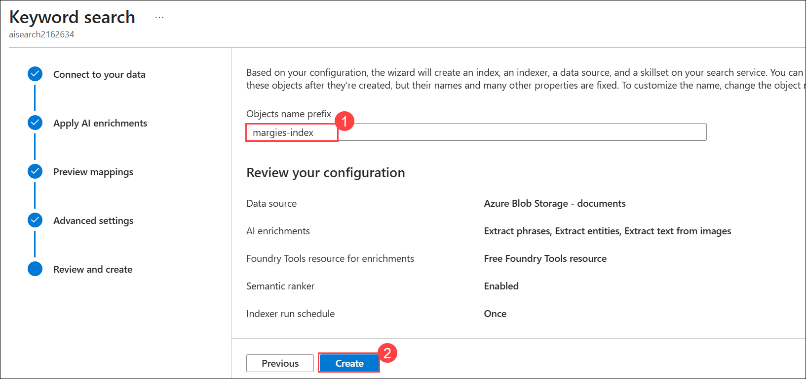

1. You may close the success notification.
     
1. In the navigation pane on the left, under **Search management (1)** view the **Indexers (2)** page, which should show the newly created **margies-indexer**. Wait a few minutes, and click **&orarr; Refresh** until the **Status** indicates **Success (2)**.

    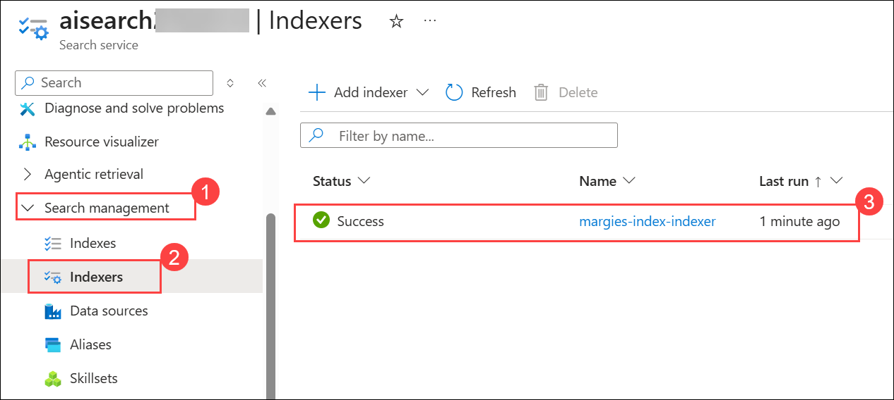

> **Congratulations** on completing the task! Now, it's time to validate it. Here are the steps:
>
> - Hit the Validate button for the corresponding task. If you receive a success message, you can proceed to the next task.
> - If not, carefully read the error message and retry the step, following the instructions in the lab guide.
> - If you need any assistance, please contact us at cloudlabs-support@spektrasystems.com. We are available 24/7 to help.
 
<validation step="f751ed87-843e-4b4c-ae55-8cb6d798cbe3" />

### Task 5: Search the index

In this task, you will query and explore the indexed data using the Search explorer.

1. Return to the **Overview** page for your Azure AI Search resource, and on the toolbar, select **Search explorer**.

    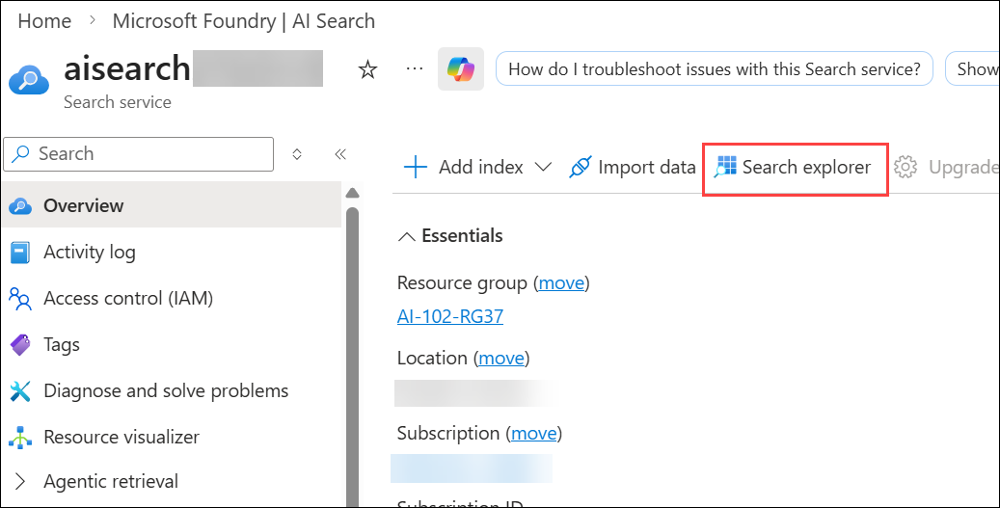

1. In Search explorer, in the **Query string** box, enter `*` **(1)** (a single asterisk), and then select **Search (2)**.

    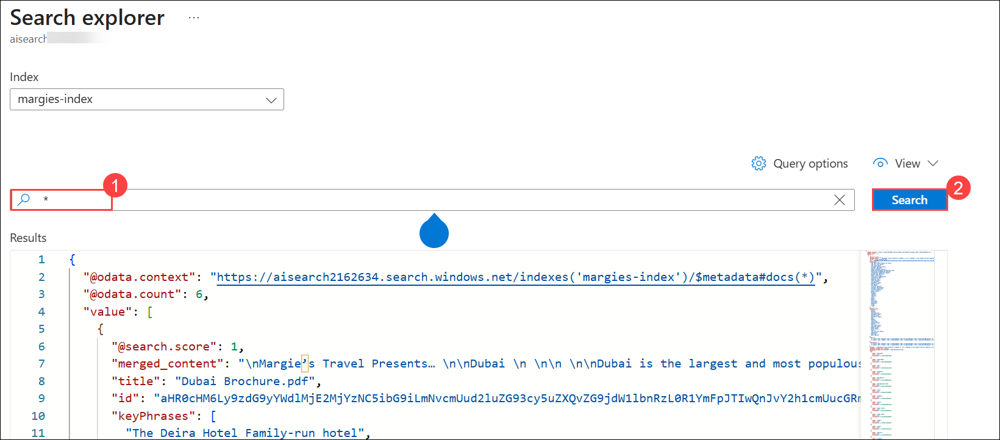

    This query retrieves all documents in the index in JSON format. Examine the results and note the fields for each document, which contain document content, metadata, and enriched data extracted by the cognitive skills you selected.

1. In the **View (1)** menu, select **JSON view (2)** and note that the JSON request for the search is shown, like this **(3)**:

    ```json
    {
    "search": "*",
    "count": true,
    "queryType": "semantic",
    "semanticConfiguration": "margies-index-semantic-configuration",
    "captions": "extractive",
    "answers": "extractive|count-3",
    "queryLanguage": "en-us"
    }
    ```

     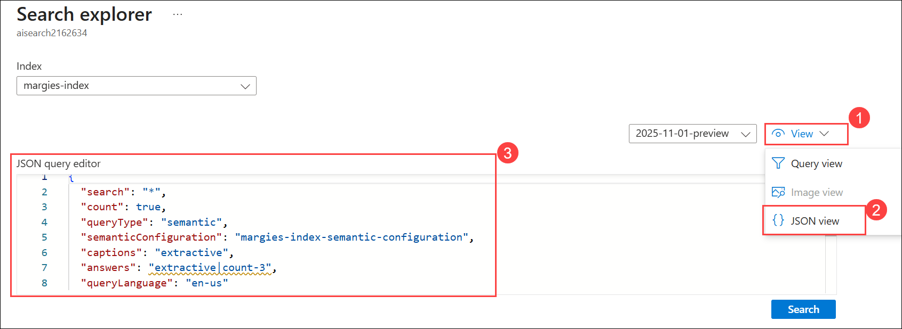

1. The results include a **@odata.count** field at the top of the results that indicates the number of documents returned by the search.

    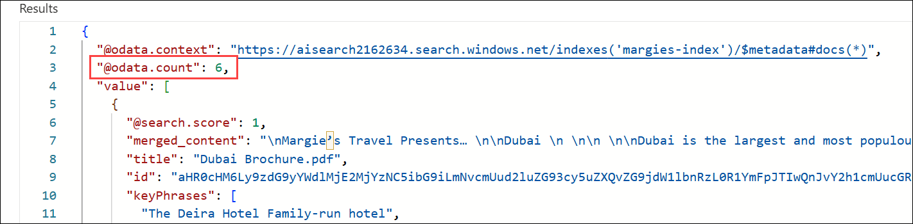

1. Modify the JSON request to include the **select** parameter as shown here:

    ```json
    {
        "search": "*",
        "count": true,
        "select": "title,locations"
    }
    ```

    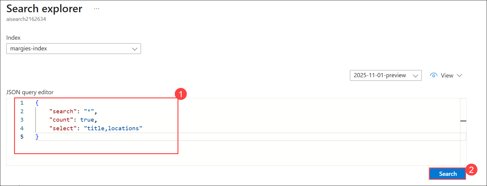

    This time the results include only the file name and any locations mentioned in the document content. The file name is in the **title** field. The **locations** field was generated by an AI skill.
    
      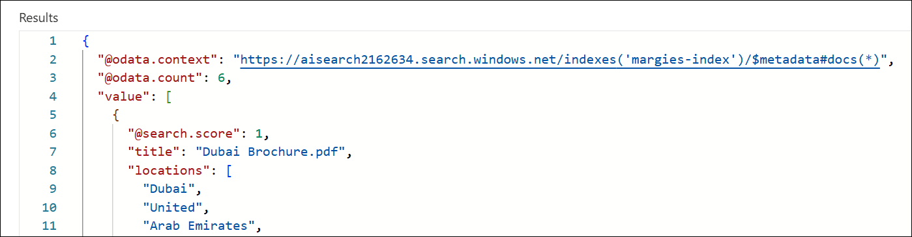

1. Now try the following query string:

    ```json
    {
        "search": "New York",
        "count": true,
        "select": "title,keyPhrases"
    }
    ```

    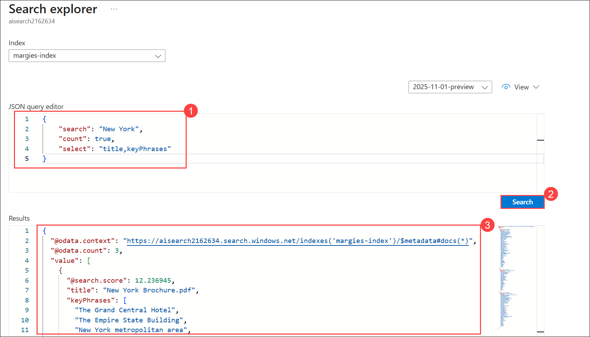

    This search finds documents that mention "New York" in any of the searchable fields, and returns the file name and key phrases in the document.
   
1. Let's try one more query:

    ```json
    {
        "search": "New York",
        "count": true,
        "select": "title,keyPhrases",
        "filter": "metadata_storage_size lt 380000"
    }
    ```

    This query returns the filename and key phrases for any documents mentioning "New York" that are smaller than 380,000 bytes in size.

### Task 6: Create a search client application

In this task, you will build and run a client application to interact with the search index using the Azure AI Search SDK.

### Task 6.1: Get the endpoint and keys for your search resource

1. In the Azure portal, close the search explorer page and return to the **Overview (1)** page for your Azure AI Search resource.

   - Note the **Url (2)** value, which should be similar to **https://*your_resource_name*.search.windows.net**. This is the endpoint for your search resource.

     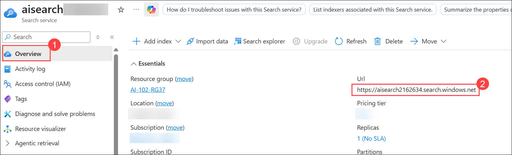

1. In the navigation pane on the left, expand **Settings (1)** and view the **Keys (2)** page.

    Note that there are two **admin** keys, and a single **query** key. An *admin* key is used to create and manage search resources; a *query* key is used by client applications that only need to perform search queries.

    - *You will need the **endpoint** and **query (3)** key for your client application.*

      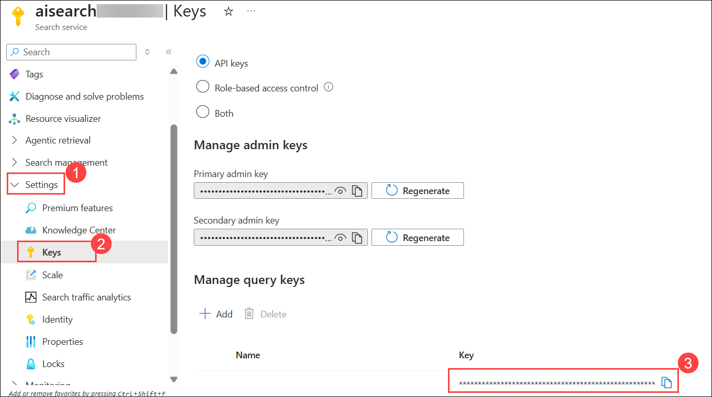  

### Task 6.2: Prepare to use the Azure AI Search SDK      

1. Use the **[>_]** button to the right of the search bar at the top of the page to create a new **Cloud Shell** in the Azure portal.

     

1. Selecting a **PowerShell** environment.

     

1. On the **Getting started** page,

    - Select **No storage account required (1)** 
    - Select your subscription **(2)**
    - Click on **Apply (3)**

       

1. In the cloud shell toolbar, in the **Settings (1)** menu, select **Go to Classic version (2)** (this is required to use the code editor).

    

     >**Note**: The cloud shell provides a command-line interface in a pane at the bottom of the Azure portal. You can resize or maximize this pane to make it easier to work in.

     >**Note**: Ensure you've switched to the classic version of the cloud shell before continuing.

1. In the cloud shell pane, enter the following commands to clone the GitHub repo containing the code files for this exercise (type the command, or copy it to the clipboard and then right-click in the command line and paste as plain text):

    ```
   rm -r mslearn-ai-info -f
   git clone https://github.com/microsoftlearning/mslearn-ai-information-extraction mslearn-ai-info
    ```

     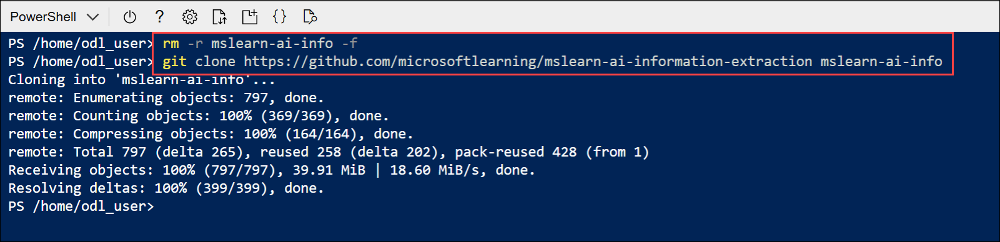     

      >**Tip**: As you enter commands into the cloudshell, the output may take up a large amount of the screen buffer. You can clear the screen by entering the `cls` command to make it easier to focus on each task.

1. After the repo has been cloned, navigate to the folder containing the application code files:

    ```
   cd mslearn-ai-info/Labfiles/knowledge/python
   ls -a -l
    ```

           

1. Install the Azure AI Search SDK and Azure identity packages by running the following commands:

    ```
   python -m venv labenv
   ./labenv/bin/Activate.ps1
   pip install -r requirements.txt azure-identity azure-search-documents==11.5.1
    ```

1. Run the following command to edit the configuration file for your app:

    ```
   code .env
    ```

          

     The configuation file is opened in a code editor.

1. Edit the configuration file to replace the following placeholder values with values you copied in `Task 6.1`:

    - **your_search_endpoint** (*replace with the endpoint for your Azure AI Search resource*)
    - **your_query_key** *(replace with the query key for your Azure AI Search resource*)
    - **your_index_name** (*replace with the name of your index, which should be `margies-index`*)    

         

1. When you've updated the placeholders, use the **CTRL+S** command to save the file and then use the **CTRL+Q** command to close it.

    >**Tip**: Now that you've copied the endpoint and key from the Azure portal, you might want to maximize the cloud shell pane to make it easier to work in.

1. Run the following command to open the code file for your app:

    ```
   code search-app.py
    ```

           

     The code file is opened in a code editor.

1. Review the code, and note that it performs the following actions:

    - Retrieves the configuration settings for your Azure AI Search resource and index from the configuration file you edited.
    - Creates a **SearchClient** with the endpoint, key, and index name to connect to your search service.
    - Prompts the user for a search query (until they enter "quit")
    - Searches the index using the query, returning the following fields (ordered by metadata_storage_name):
        - metadata_storage_name
        - locations
        - people
        - keyphrases
    - Parses the search results that are returned to display the fields returned for each document in the result set.

1. Close the code editor pane **CTRL+Q**, keeping the cloud shell command line console pane open.

1. Enter the following command to run the app:

    ```
   python search-app.py
    ```
     
1. When prompted, enter a query such as `London` and view the results.

    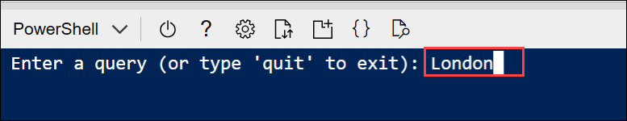  

    

1. Try another query, such as `flights`.

       

              

1. When you're finished testing the app, enter `quit` to close it.

### Summary

In this lab, you created an Azure AI Search resource and a storage account to build a knowledge mining solution. You uploaded documents, applied AI enrichments, and indexed the data to extract meaningful insights. Finally, you queried the index and developed a client application using the Azure AI Search SDK to interact with the data.

### You have successfully completed the Hands-on Lab!