# Create a Generative AI Chat App

### Estimated Duration: 45 Minutes

## Lab overview

In this lab, you will create a generative AI chat application by using the OpenAI SDK and the Responses API with a model deployed in a Microsoft Foundry project. You will create and configure a Microsoft Foundry project, deploy a generative AI model, and retrieve the Azure OpenAI endpoint required for application connectivity. You will then develop a Python-based chat application that interacts with the deployed model by using both the ChatCompletions and Responses APIs. Finally, you will enhance the application by implementing conversation tracking, streaming responses, and asynchronous processing to create a more responsive and context-aware chat experience.

## Lab objectives

In this exercise, you will perform:

* Task 1: Create a Microsoft Foundry project
* Task 2: Deploy a model
* Task 3: Get the Azure OpenAI endpoint
* Task 4: Get the application files from GitHub
* Task 5: Prepare the application configuration
* Task 6: Use the ChatCompletions API to chat with the model
* Task 7: Use the Responses API to chat with the model
* Task 8: Add conversation tracking
* Task 9: Implement streaming responses
* Task 10: Use the asynchronous API

### Task 1: Create a Microsoft Foundry project

In this task, you'll create a Microsoft Foundry project, configure the required Azure resources, and obtain the project endpoint needed for application development.

1. Copy the **Microsoft Foundry** link and paste it into a new browser tab to access the portal: `https://ai.azure.com/`

1. On the **Microsoft Foundry** home page, click on **Start building**.

     

1. If prompted to sign in, enter your credentials:
 
   - **Email/Username:** Enter <inject key="AzureAdUserEmail"></inject> **(1)** and click on **Next (2)**.
 
        
 
   - **Password:** Enter <inject key="AzureAdUserPassword"></inject> **(1)** and click on **Sign in (2)**.
 
      

1. If prompted to **Stay signed in?**, you can click **No**.

    

1. If prompted with, the **Get started with Microsoft Foundry** page, click on **Create project**.

   

1. In the **Create a project** wizard, enter project name **Myproject<inject key="DeploymentID" enableCopy="false" /> (1)**, and **Expand Advanced options (2)** to specify the following settings for your project: 

    - Foundry resource: **Leave default (3)**
    - Subscription : **Leave default subscription (4)** 
    - Region : Select **<inject key="location" enableCopy="false"/> (5)**
    - Resource group : Select **AI-103 (6)** 
    - Click on **Create** **(7)**

      

      > **Note:** If project creation gives an authorization error related to Application Insights or Log Analytics resources (for example, errors containing `Microsoft.OperationalInsights/workspaces/write` or `Microsoft.Insights/components/write`), **Toggle off** the *Set up recommended resources so I can explore everything Foundry has to offer* option before creating the project.

      .png)

1. Wait for your project to be created. It may take a few minutes. 

1. In the **All set, Let's build your agents** window, click **Let's go**.

    

1. Once the setup is complete, you are automatically redirected to the **Microsoft Foundry home page** for the newly created project.

   

   > **Note:** The Microsoft Foundry landing page may vary depending on the version of the portal, your account configuration, or recent UI updates. If your home page looks different, continue with the lab by locating the required menu options using the navigation menu. The appearance of the portal may differ, but the functionality and lab steps remain the same.

    
    
### Task 2: Deploy a model

In this task, you'll browse the Microsoft Foundry model catalog, select the GPT-4.1 model, and deploy it using the default deployment settings. You'll also identify the deployment name that will be used later by the client application.

1. From the **Microsoft Foundry** homepage, select **Discover (1)** from the top menu. Then select the **Models (2)** tab to view the Microsoft Foundry model catalog.

    The model catalog lists all models available in Foundry. Some are provided directly from Azure (and billed through your Azure subscription) while others are provided by partners and the community.

    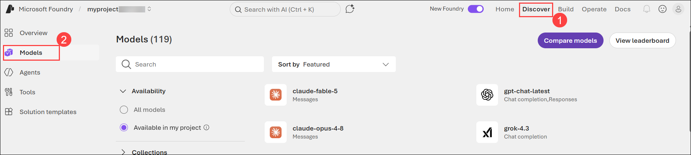

    >**Note:** You can search and filter the catalog, based on model names, capabilities, and other factors.

1. Search for `gpt-4.1` **(1)**. Then, in the search results, select the **gpt-4.1** model to view its **model card**.

    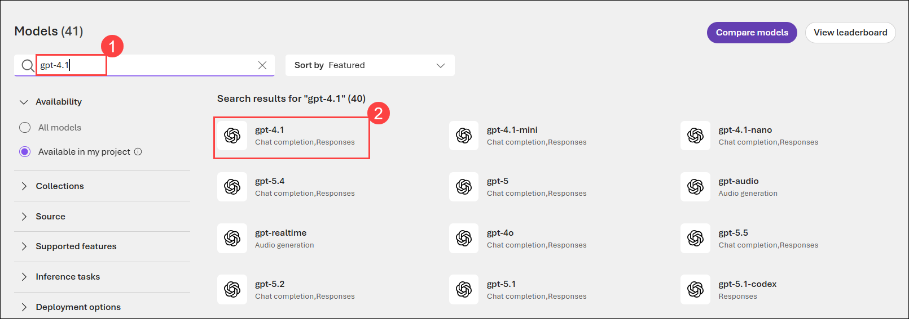

1. On the model page, select **Deploy (1)** drop-down and deploy the model using the ***Default settings (2)**.

    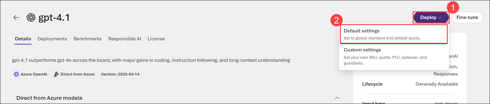

1. The deployed model will open in the model playground, where it will be selected in the **Model** drop-down list.

    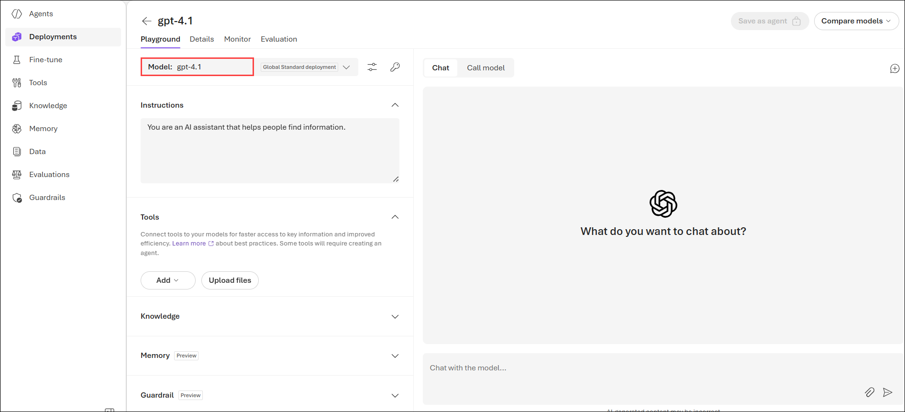

1. Note the deployment name that is assigned to the **gpt-4.1** model. You'll need to identify this deployment later.

    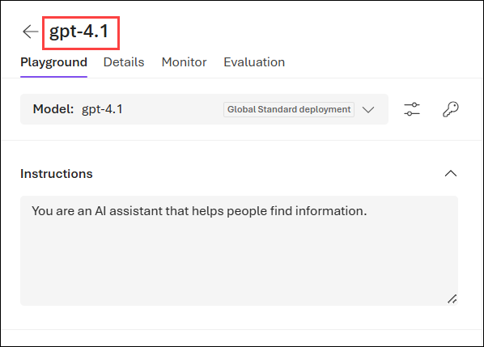

### Task 3: Get the Azure OpenAI endpoint

In this task, you'll locate and copy the Azure OpenAI endpoint from your Microsoft Foundry project. This endpoint will be used to connect the application to the deployed model by using Microsoft Entra ID authentication.

You'll need an endpoint to connect to the model from a client application. In this exercise, we're going to use the OpenAI SDK to chat with the model; and we'll use the Azure OpenAI endpoint with Entra ID authentication to connect to it.

> **Note**: As an alternative to Entra ID authentication, you could use the API Key for the project. using Entra ID authentication is preferred whenever possible.

1. Navigate to the **Home (1)** page of your Azure AI Foundry project.

    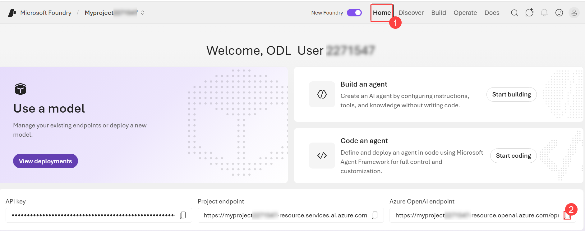

1. Locate the **Azure OpenAI Endpoint** field.

1. Select the **Copy (2)** icon next to the **Azure OpenAI Endpoint** value to copy the endpoint URL, and save it in a text editor such as Notepad. You will use this endpoint later when configuring your application and updating the `.env` file.

    
    
    > **Tip**: You'll use the **Azure OpenAI Endpoint** in this exercise, <u>not</u> the project endpoint!

## Create a client application to chat with the model

### Task 4: Get the application files from GitHub

In this task, you'll clone the application repository from GitHub

The initial application files you'll need to develop your chat application are provided in a GitHub repo.

1. In the Lab VM, open Visual Studio Code.

1. Open the Command Palette (Ctrl + Shift + P), or go to **View (1)** > **Command Palette (2)**, then search for and select **Git: Clone (3)**

    

    

1. Use this option to clone the repository:
   ```
   https://github.com/microsoftlearning/mslearn-ai-studio
   ```
   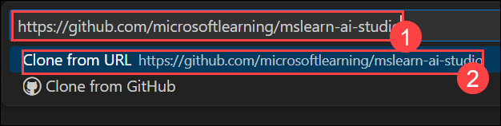
   
1. When prompted to choose a location, create a new local folder named `foundry-sdk` and clone the repository into it.

   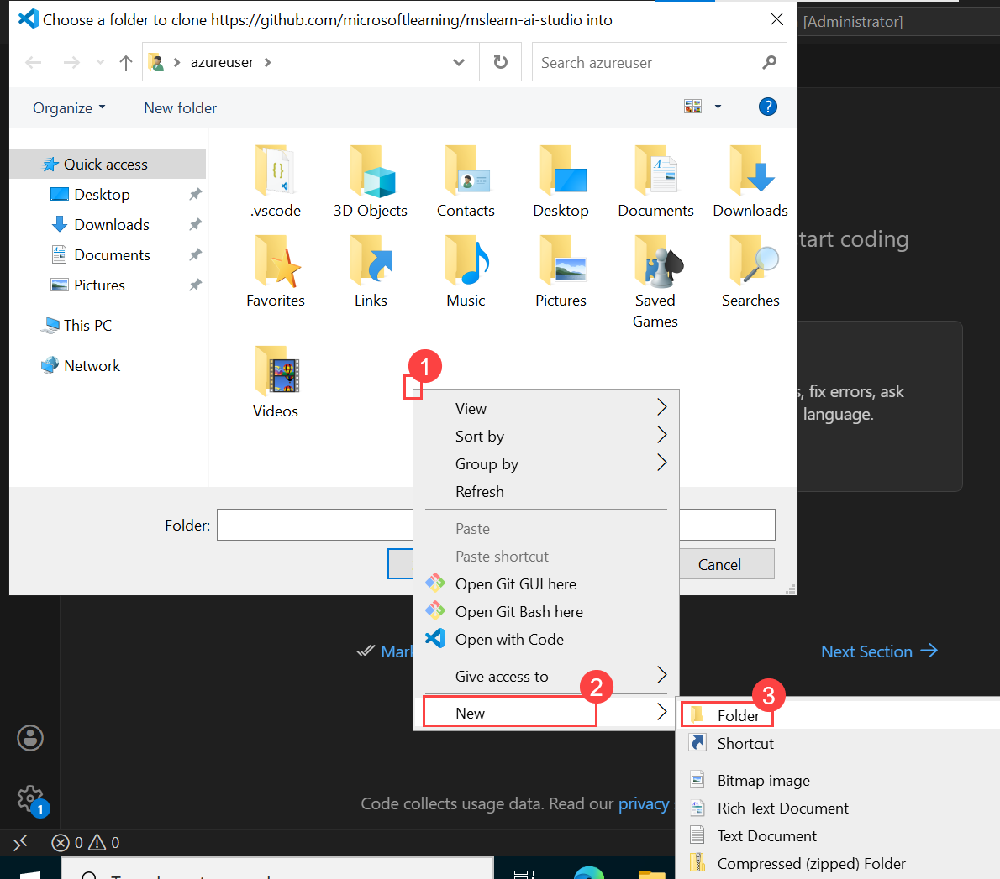

   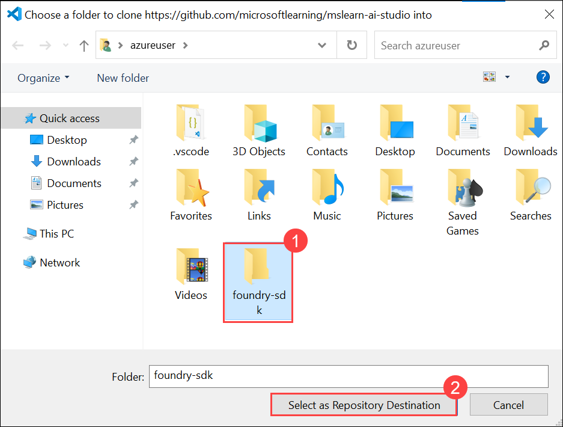

1. Select **Open** to open the repository.

   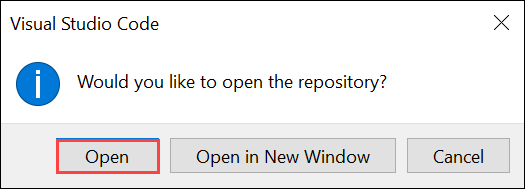

1. You may be prompted to confirm you trust the authors, select **Yes, I trust...** option
   
### Task 5: Prepare the application configuration

In this task, you will install the required Python tools and dependencies, create a virtual environment, and configure the application settings with the Azure OpenAI endpoint and model deployment information.

1. In Visual Studio Code, select the **Extensions (1)** icon from the Activity Bar on the left side of the window.

   

1. In the Extensions view, search for Python if it is not already displayed.

1. Locate the Python extension published by Microsoft.

1. Select **Install (2)** to install the Python extension.

1. Wait for the installation to complete. Once installed, the extension will provide Python language support, IntelliSense, debugging capabilities, and other Python development features in Visual Studio Code.

1. Open the Command Palette by selecting **View > Command Palette** or by pressing **Ctrl+Shift+P**.

1. In the Command Palette, type **Python: Select Interpreter (1)**.

   
   
1. From the list of matching commands, **select (2)** Python: Select Interpreter.

1. In the Select Interpreter window, select **Create Virtual Environment (3)**.

    
   
1. When prompted to select an environment type, choose **Venv (4)** to create a .venv virtual environment in the current workspace.

    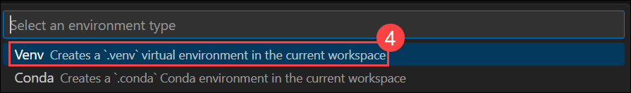
   
1. In the Select a Python installation window, choose Python 3.14.2 (Global) located at **C:\Program Files\Python314\python.exe (5)** to create the virtual environment.

     
   
1. If you are prompted to install dependencies, you can install the ones in the *requirements.txt* file in the */labfiles/foundry-chat/python/chat-app* folder

     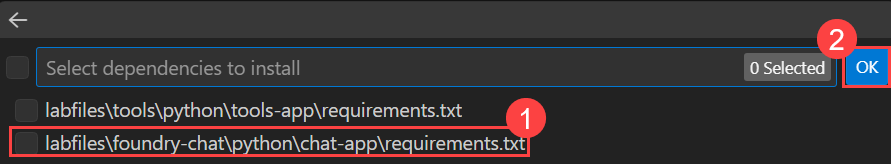

1. In the Explorer pane, navigate to the folder containing the application code files at **/labfiles/foundry-chat/python/chat-app**. The application files include:
    
    - **.env** (the application configuration file)
    - **requirements.txt** (the Python package dependencies that need to be installed)
    - **chat-app.py** (the code file for the chat application)
    - **chat-async.py** (the code file for an asynchronous version of the application)

1. In the **Explorer** pane, right-click the **chat-app** folder containing the application files, and select **Open in integrated terminal** (or open a terminal in the **Terminal** menu and navigate to the */labfiles/foundry-chat/python/chat-app* folder.)

   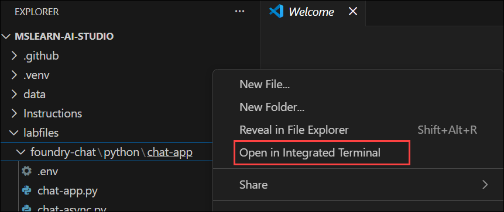

    > **Note**: Opening the terminal in Visual Studio Code will automatically activate the Python environment. You may need to enable running scripts on your system.

1. Ensure that the terminal is open in the **labfiles/foundry-chat/python/chat-app** folder with the prefix **(.venv)** to indicate that the Python environment you created is active.
1. Install the OpenAI SDK, Azure Identity, and other required packages by running the following command:

    ```
    pip install -r requirements.txt
    ```
   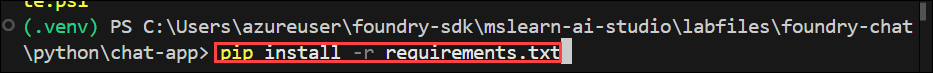
   
1. In the **Explorer** pane, in the **labfiles/foundry-chat/python/chat-app** folder, select the **.env** file to open it. Then update the configuration values to include the **Azure OpenAI Endpoint** and the name assigned to the deployment for the **gpt-4.1** model.

   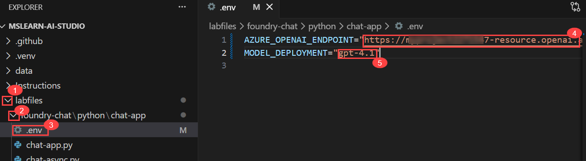
   
    > **Tip**: Copy the **Azure OpenAI Endpoint** (not the project endpoint!) from the project home page in the Foundry portal, and enter the exact deployment name assigned to your deployment in the `MODEL_DEPLOYMENT` setting.

1. **Save** the modified configuration file.

### Task 6: Use the *ChatCompletions* API to chat with the model

In this task, you'll update the application code to use the OpenAI SDK and the ChatCompletions API. You'll authenticate with Microsoft Entra ID, send prompts to the deployed model, and receive responses through a basic conversational interface.

The *ChatCompletions* API is a well-established way to build client applications for large language models, and has been widely adopted.

1. In the **Explorer** pane, in the **labfiles/foundry-chat/python/chat-app** folder, select the **chat-app.py** file (<u>not</u> *chat-async.py*) to open it.
1. Review the existing code. You will add code to use the OpenAI SDK to access your model.

    > **Tip**: As you add code to the code file, be sure to maintain the correct indentation.

1. At the top of the code file, under the existing namespace references, find the comment **Import namespaces** and add the following code to import the namespace you will need to use the OpenAI SDK:

    ```python
   # import namespaces
   from openai import OpenAI
   from azure.identity import DefaultAzureCredential, get_bearer_token_provider
    ```

1. In the **main** function, note that code to load the endpoint and key from the configuration file has already been provided. Then find the comment **Initialize the OpenAI client**, and add the following code to create a client for the OpenAI API:

    ```python
   # Initialize the OpenAI client
   token_provider = get_bearer_token_provider(
        DefaultAzureCredential(), "https://ai.azure.com/.default"
   )
    
   openai_client = OpenAI(
        base_url=azure_openai_endpoint,
        api_key=token_provider
   )
    ```

1. In the **main** function, note that code to request a user prompt until the user quits the app has been provided. Within this loop, find the **Get a response** comment, and add the following code:

    ```python
   # Get a response
   completion = openai_client.chat.completions.create(
        model=model_deployment,
        messages=[
            {
                "role": "system",
                "content": "You are a helpful AI assistant that answers questions and provides information."
            },
            {
                "role": "user",
                "content": input_text
            }
        ]
   )
   print(completion.choices[0].message.content)
    ```

    Note that the *ChatCompletions* API uses a JSON collection of *messages* to encapsulate the conversation. Often, these consist of a *system prompt* that provides instructions to the model, and a *user prompt* that includes the user's input.

1. Save the changes to the code file. Then, in the terminal pane, use the following command to sign into Azure.

    ```powershell
    az login
    ```

    > **Note**: In most scenarios, just using *az login* will be sufficient. However, if you have subscriptions in multiple tenants, you may need to specify the tenant by using the *--tenant* parameter. See [Sign into Azure interactively using the Azure CLI](https://learn.microsoft.com/cli/azure/authenticate-azure-cli-interactively) for details.

1. When prompted, follow the instructions to sign into Azure. Then complete the sign in process in the command line, viewing (and confirming if necessary) the details of the subscription containing your Foundry resource.
1. After you have signed in, enter the following command to run the application:

    ```powershell
   python chat-app.py
    ```

    The program should run in the terminal (if not, resolve any errors and try again).

1. When prompted, enter the following prompt:

    ```input
    Tell me about the ELIZA chatbot.
    ```

    After a few moments, the app should respond with some information about the ELIZA chatbot created in the 1960s.

1. Enter the prompt `quit` to end the application.

### Task 7: Use the *Responses* API to chat with the model

In this task, you'll modify the application to use the newer Responses API. You'll simplify the request structure by using instructions and input parameters while continuing to interact with the deployed model.

While the *ChatCompletions* API is widely used, it is increasingly being superseded by the newer *Responses* API. Let's update the code to use it.

1. In the **chat-app.py** code, in the **main** function, replace the code under the comment **Get a response** with the following code that uses the *Responses* API.

    ```python
   # Get a response
   response = openai_client.responses.create(
                model=model_deployment,
                instructions="You are a helpful AI assistant that answers questions and provides information.",
                input=input_text
   )
   print(response.output_text)
    ```

    Note the simpler syntax in which the system message is assigned to the *instructions* parameter, and the user prompt is assigned to the *input* parameter.

1. Save the changes to the code, and in the terminal pane, re-run the application (`python chat-app.py`).
1. When prompted, enter the same prompt as before:

    ```input
    Tell me about the ELIZA chatbot.
    ```

    After a few moments, the app should once again respond with some information about the ELIZA chatbot.

1. Enter the following prompt to try to continue the conversation:

    ```input
    How does it compare to modern LLMs?
    ```

    The app should respond in a way that indicates it doesn't understand what "it" refers to. The conversation context has been lost. We'll fix that.

1. Enter the prompt `quit` to end the application.

### Task 8: Add conversation tracking

In this task, you'll implement conversation state management by tracking response identifiers. This enables the application to maintain conversational context across multiple user prompts and responses.

To maintain the conversational context, we need to include references to previous responses in each new request.

1. In the **chat-app.py** code, in the **main** function, find the comment **Loop until the user wants to quit**, and add the following code <u>above</u> it (*before* the loop):

    ```python
   # Track responses
   last_response_id = None
    ```

1. Modify the code under the comment **Get a response** with the following code to pass the previous response ID on the request, and then obtain the new response ID so it can be added next time.

    ```python
   # Get a response
   response = openai_client.responses.create(
                model=model_deployment,
                instructions="You are a helpful AI assistant that answers questions and provides information.",
                input=input_text,
                previous_response_id=last_response_id,
   )
   print(response.output_text)
   last_response_id = response.id
    ```

    Using this technique, you can pass the ID of the previous reponse to maintain context. You could also implement more complex logic to pass an ID from any previous response to redirect a conversation or resume a previous conversational thread.

1. Save the changes to the code, and in the terminal pane, re-run the application (`python chat-app.py`).
1. When prompted, enter the same prompt as before:

    ```input
    Tell me about the ELIZA chatbot.
    ```

    After a few moments, the app should once again respond with some information about the ELIZA chatbot.

1. Enter the following prompt to try to continue the conversation:

    ```input
    How does it compare to modern LLMs?
    ```

    This time, the app should respond with a comparison of the ELIZA chatbot and modern LLMs. The response may be quite lengthy, and the app waits until it has all been received from the model before displaying it; which may make the app seem unresponsive. We'll fix that next!

1. Enter the prompt `quit` to end the application.

### Task 9: Implement *streaming* responses

In this task, you'll enhance the chat experience by enabling response streaming. Instead of waiting for a complete response, the application will display output incrementally as it is generated by the model.

To handle long responses, you can use *streaming* to start processing partial responses before the full text has been returned.

1. In the **chat-app.py** code, in the **main** function, replace the code under the comment **Get a response** with the following code that uses *streaming*.

    ```python
   # Get a response
   stream = openai_client.responses.create(
                model=model_deployment,
                instructions="You are a helpful AI assistant that answers questions and provides information.",
                input=input_text,
                previous_response_id=last_response_id,
                stream=True
   )
   for event in stream:
        if event.type == "response.output_text.delta":
            print(event.delta, end="")
        elif event.type == "response.completed":
            last_response_id = event.response.id
   print()
    ```

    Note that the *stream=True* parameter creates a streamed response in which *events* occur as each new chunk (or *delta*) is ready for processing.

1. Save the changes to the code, and in the terminal pane, re-run the application (`python chat-app.py`).
1. When prompted, enter the same prompt as before:

    ```input
    Tell me about the ELIZA chatbot.
    ```

    After a few moments, the app should start responding with some information about the ELIZA chatbot. The response should appear incrementally as each chunk is returned.

1. Enter the following prompt to try to continue the conversation:

    ```input
    How does it compare to modern LLMs?
    ```

    Again, the response should be displayed incrementally.

1. Enter the prompt `quit` to end the application.

### Task 10: Use the asynchronous API

In this task, you'll build an asynchronous version of the chat application by using the AsyncOpenAI client. You'll send and process requests asynchronously, manage conversation context, and properly close asynchronous resources when the application exits.

The OpenAI SDK offers an asynchronous option that can increase the responsiveness of applications when using long-running model or agent operations.

1. In the **Explorer** pane, in the **labfiles/foundry-chat/python/chat-app** folder, select the **chat-async.py** file (<u>not</u> *chat-app.py*) to open it.
1. Review the existing code. You will add code to use the OpenAI SDK async API to access your model.

    > **Tip**: As you add code to the code file, be sure to maintain the correct indentation.

1. At the top of the code file, under the existing namespace references, find the comment **Import namespaces** and add the following code to import the namespace you will need to use the OpenAI SDK:

    ```python
   # import namespaces for async
   import asyncio
   from openai import AsyncOpenAI
   from azure.identity.aio import DefaultAzureCredential, get_bearer_token_provider
    ```

1. In the **main** function, note that code to load the endpoint and key from the configuration file has already been provided. Then find the comment **Initialize an async OpenAI client**, and add the following code to create a client for the OpenAI API:

    ```python
   # Initialize an async OpenAI client
   credential = DefaultAzureCredential()
   token_provider = get_bearer_token_provider(
    credential, "https://ai.azure.com/.default"
   )

   async_client = AsyncOpenAI(
        base_url=azure_openai_endpoint,
        api_key=token_provider
   )
    ```

1. In the **main** function, note that code to request a user prompt until the user quits the app has been provided. Within this loop, find the **Await an asynchronous response** comment, and add the following code:

    ```python
   # Await an asynchronous response
   response = await async_client.responses.create(
                model=model_deployment,
                instructions="You are a helpful AI assistant that answers questions and provides information.",
                input=input_text,
                previous_response_id=last_response_id
   )
   assistant_text = response.output_text
   print("Assistant:", assistant_text)
   last_response_id = response.id
    ```

    This code awaits an asynchronous response from the model.

1. At the end of the **main** function, in the **finally** block, find the comment **Close the async client session** and add the following code to close the asynchronous client:

    ```python
   # Close the async client session
    await credential.close()
    ```

1. Save the changes to the code file. Then, in the terminal pane, use the following command to run the program:

    ```powershell
   python chat-async.py
    ```

    The program should run in the terminal (if not, resolve any errors and try again).

1. When prompted, enter the following prompt:

    ```input
    Tell me about the Turing test.
    ```

    After a few moments, the app should respond with some information about the Turing test.

1. Enter the prompt `quit` to end the application.

## Summary

In this exercise, you used the OpenAI SDK and the *ChatCompletions* and *Responses* APIs to create a client application for a generative AI model that you deployed in a Microsoft Foundry project. You customized the model's behavior by tracking conversational context and implemented streaming to deliver a responsive chat experience.

### Congratulations, you’ve successfully completed the hands-on lab!
