# Deploy agents to Microsoft Teams and Copilot

### Estimated Duration: 45 Minutes

## Lab overview

In this lab, you will use Microsoft Foundry to create and configure an AI agent, ground it with enterprise knowledge documents, and test its responses in the agent playground. You will then publish the agent to Microsoft Teams and Microsoft 365 Copilot, making it accessible to users within their existing workflows. Finally, you will validate the published agent by interacting with it in both Teams and Microsoft 365 Copilot and verifying that it can accurately answer questions using the uploaded policy documents.

## Lab objectives

In this exercise, you will perform:

* Task 1: Create a Microsoft Foundry project
* Task 2: Configure your agent with instructions and grounding data
* Task 3: Test the agent in the playground
* Task 4: Publish agent to Microsoft Teams and Microsoft 365 Copilot
* Task 5: Test your agent in Teams
* Task 6: Test your agent in Microsoft 365 Copilot

## Task 1: Create a Microsoft Foundry project

In this task, you'll create a Microsoft Foundry project, configure the required Azure resources, and obtain the project endpoint needed for application development.

1. Copy the **Microsoft Foundry** link and paste it into a new browser tab to access the portal: `https://ai.azure.com/`

1. On the **Microsoft Foundry** home page, click on **Start building**.

     

1. If prompted to sign in, enter your credentials:
 
   - **Email/Username:** Enter <inject key="AzureAdUserEmail"></inject> **(1)** and click on **Next (2)**.
 
        
 
   - **Password:** Enter <inject key="AzureAdUserPassword"></inject> **(1)** and click on **Sign in (2)**.
 
      

1. If prompted to **Stay signed in?**, you can click **No**.

    

1. If prompted with, the **Get started with Microsoft Foundry** page, click on **Create project**.

   

1. In the **Create a project** wizard, enter project name **Myproject<inject key="DeploymentID" enableCopy="false" /> (1)**, and **Expand Advanced options (2)** to specify the following settings for your project: 

    - Foundry resource: **Leave default (3)**
    - Subscription : **Leave default subscription (4)** 
    - Region : Select **<inject key="location" enableCopy="false"/> (5)**
    - Resource group : Select **AI-103 (6)** 
    - Click on **Create** **(7)**

      

      > **Note:** If project creation gives an authorization error related to Application Insights or Log Analytics resources (for example, errors containing `Microsoft.OperationalInsights/workspaces/write` or `Microsoft.Insights/components/write`), **Toggle off** the *Set up recommended resources so I can explore everything Foundry has to offer* option before creating the project.

      .png)

1. Wait for your project to be created. It may take a few minutes. 

1. In the **All set, Let's build your agents** window, click **Let's go**.

    

1. Once the setup is complete, you are automatically redirected to the **Microsoft Foundry home page** for the newly created project.

   

   > **Note:** The Microsoft Foundry landing page may vary depending on the version of the portal, your account configuration, or recent UI updates. If your home page looks different, continue with the lab by locating the required menu options using the navigation menu. The appearance of the portal may differ, but the functionality and lab steps remain the same.

    

2. After your project is created, select **Start building** in the **Build an agent** tile on the homepage.

    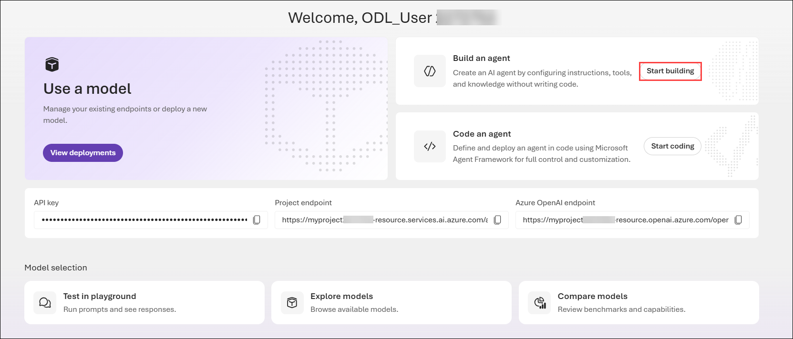

3. Set the **Agent name** to **enterprise-knowledge-agent-<inject key="DeploymentID" enableCopy="false" /> (2)** and then select **Create (2)**.

    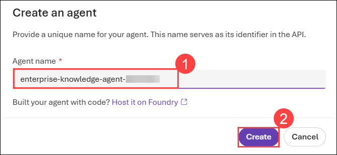

1. The playground will open for your newly created agent. You'll see that an available deployed model is already selected for you.

    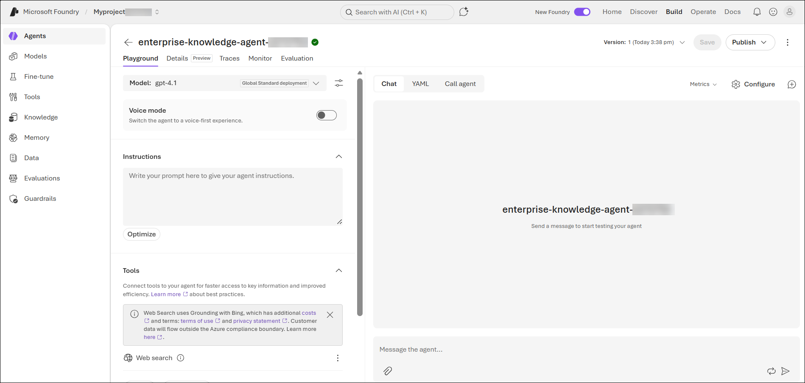

## Task 2: Configure your agent with instructions and grounding data

In this task, you'll configure an AI agent with custom instructions, upload enterprise policy documents, and establish knowledge grounding to enable accurate, document-based responses.

1. On the **Playground** tab of the agent page, copy and paste the following text into the **Instructions (1)** box, then select **Save (2)** to save the agent configuration.

    ```
    You are an Enterprise Knowledge Assistant for Contoso Corporation.
    
    Your role:
    - Answer questions about company policies and procedures
    - Provide accurate information from uploaded documents
    - Be professional, helpful, and concise
    - If you don't know the answer, say so and suggest who to contact
    
    Always cite your sources when referencing specific policies.
    ```

    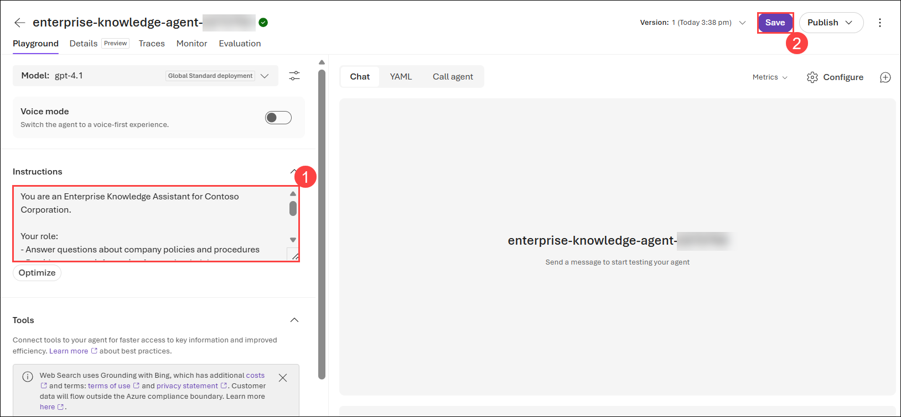

3. Open a new browser tab for each of the following URLs. On each page, select all the text (**Ctrl+A**), copy it (**Ctrl+C**), and save the content as a text file on your LabVM.

    **IT Security Policy:**

    ```text
    https://raw.githubusercontent.com/MicrosoftLearning/mslearn-ai-agents/main/Labfiles/05a-m365-teams-integration/Python/sample_documents/it_security_policy.txt
    ```

    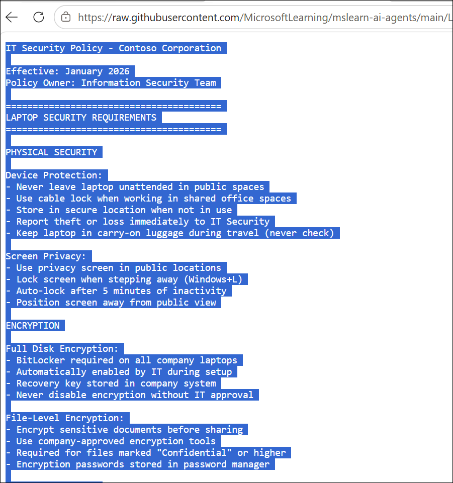

1. From the **Start** menu, search for **Notepad (1)**, and then select **Notepad (2)** from the search results to open it.

    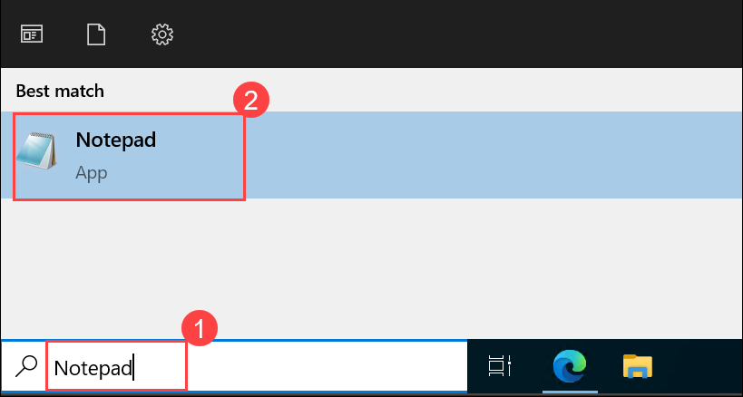

1. Paste the content you copied earlier into Notepad. Then select **File (1)** > **Save As... (2)**, and save the file as a **.txt** file on the LabVM.

    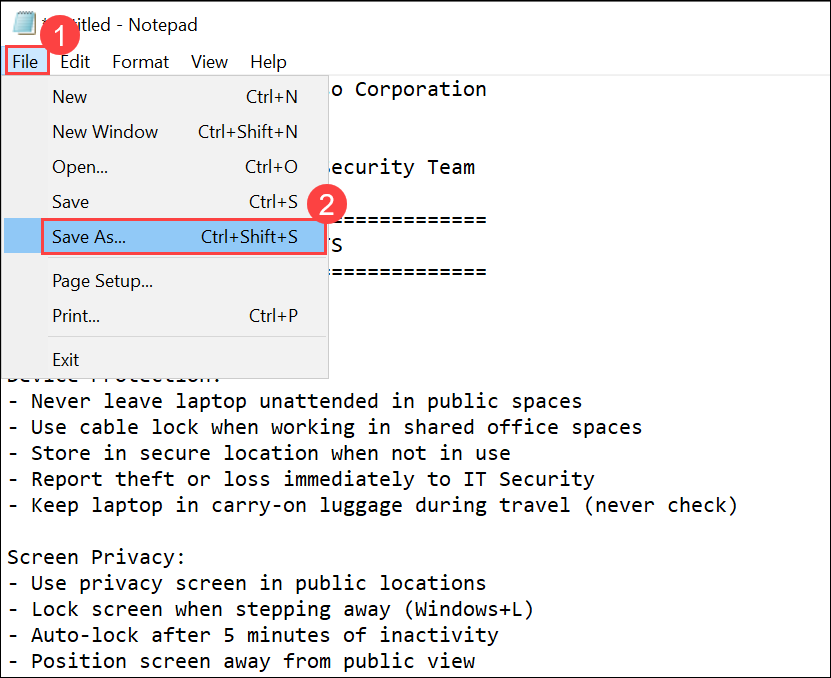

1. In the **Save As** window, select **Downloads (1)** from the left pane, enter `it_security_policy.txt` in the **File name (2)** field, and then select **Save (3)**.

    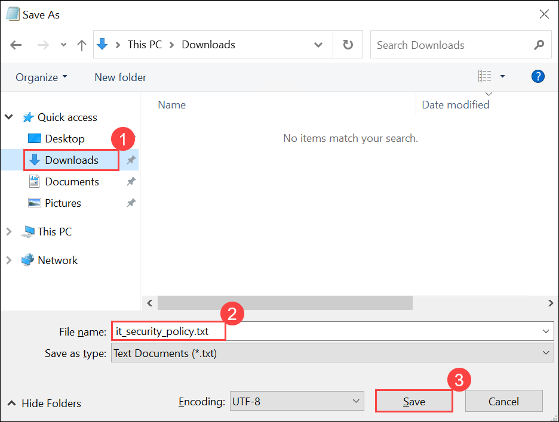

1. Repeat the same steps for the Remote Work Policy content, and save the file as `remote_work_policy.txt` in the **Downloads** folder.

    **Remote Work Policy:**

    ```text
    https://raw.githubusercontent.com/MicrosoftLearning/mslearn-ai-agents/main/Labfiles/05a-m365-teams-integration/Python/sample_documents/remote_work_policy.txt
    ```

4. Return to the agent page, scroll down to the **Tools** section, and select **Upload files**.

    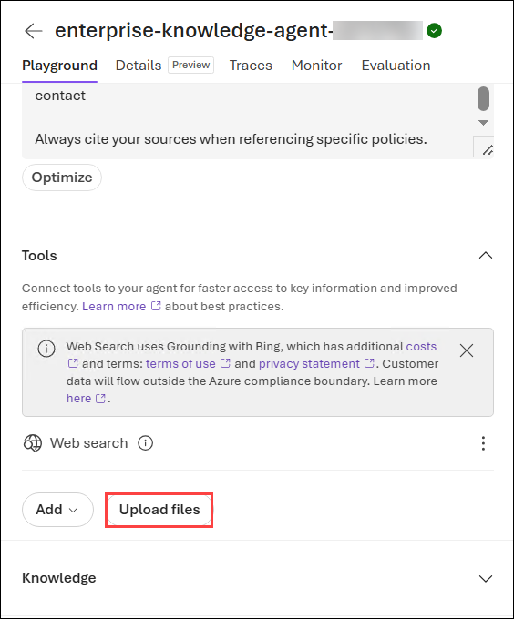

5. In the **Attach files** dialog, select **browse for files**.

    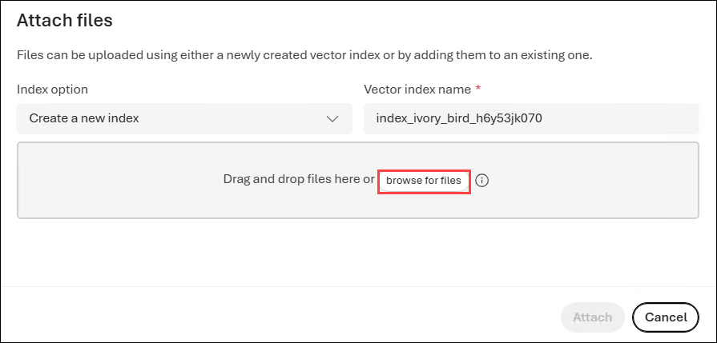

1. On the **Open** window, select **Download  (1)** from the left pane and select both policy documents **(2)** that you have saved in the previous steps, and then select **Open (3)**.

    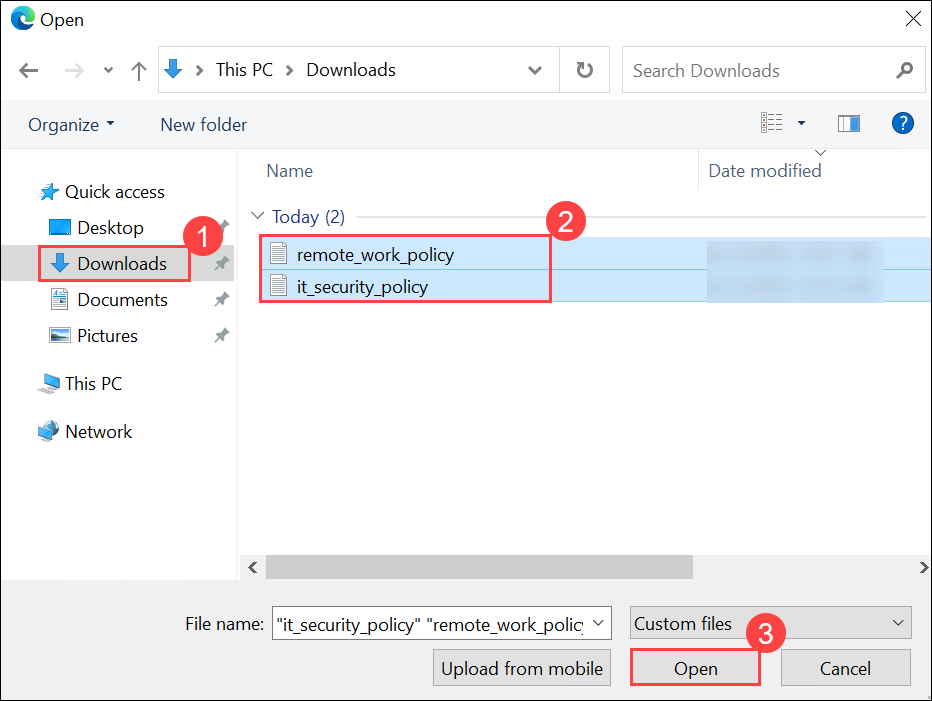

1. Verify that the two files are uploaded and then click **Attach**.

    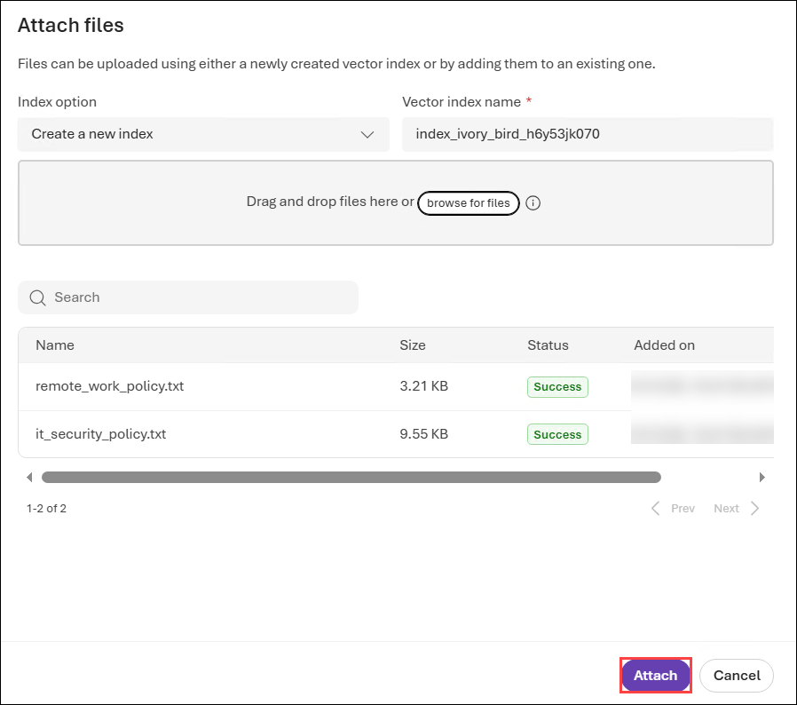

## Task 3: Test the agent in the playground

In this task, you'll test the agent in the Foundry playground to verify that it can retrieve information from the uploaded documents and respond accurately to user queries.

1. In the playground, ask a question about IT security:

    ```
    What are the password requirements for my laptop?
    ```

    .png)

2. The agent should provide specific information from the IT security policy (minimum 12 characters, uppercase, lowercase, numbers, special characters, etc.)

    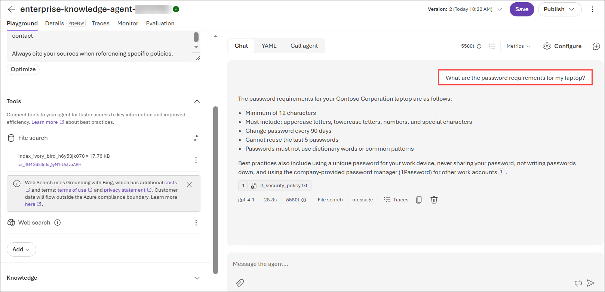

3. Try a question about remote work:

    ```
    What are the core hours for remote employees?
    ```

4. The agent should respond with information from the remote work policy (9 AM - 3 PM).

    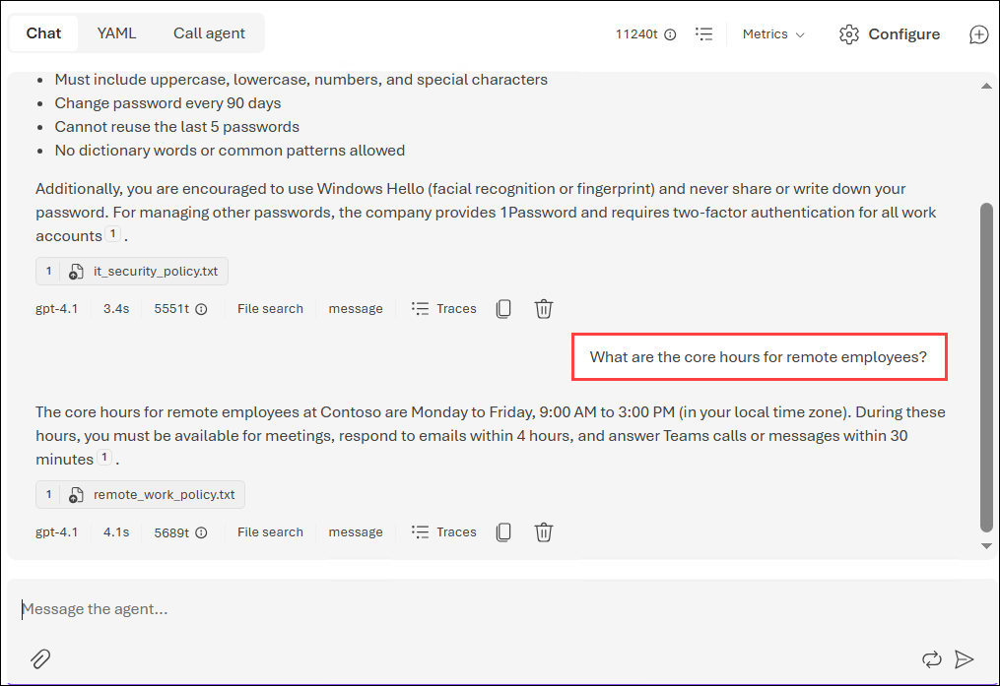

5. Try another query:

    ```
    What encryption is required on company laptops?
    ```

6. Notice how the agent finds the right document and provides accurate answers about BitLocker requirements.

    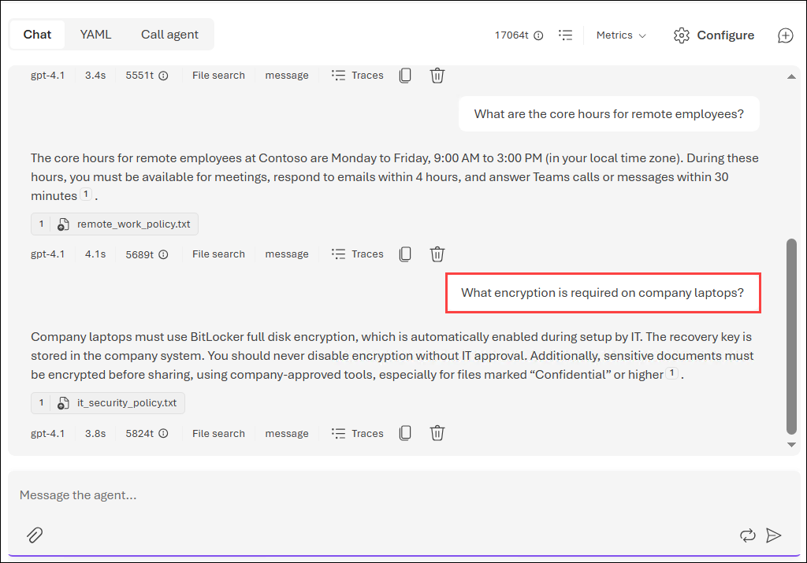

    Your agent now has knowledge grounding and can answer questions based on your company documents.

7. From the top right corner select **Save**.

    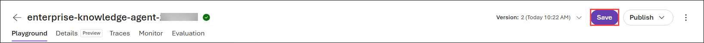

## Task 4: Publish agent to Microsoft Teams and Microsoft 365 Copilot

In this task, you'll publish the configured agent to Microsoft Teams and Microsoft 365 Copilot, making it accessible to users through Microsoft 365 experiences.

1. In the Foundry portal, open your agent **enterprise-knowledge-agent-<inject key="DeploymentID" enableCopy="false" />** if not already opened.

2. Select the **Publish (1)** button at the top of the page and then select **Publish to Teams and Microsoft 365 Copilot (2)**.

    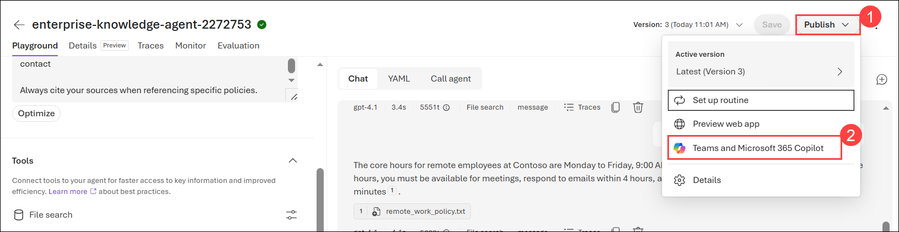

1. In the **Publish to Teams and Microsoft 365** window, enter the following details:

    * **Agent name**: Leave the default value **(1)**
    * **Short Description**: `AI assistant for company policies` **(2)**
    * **Description**: `Enterprise AI assistant that answers questions about company policies, IT procedures, and employee resources` **(3)**
    * **Developer**: `Contoso` **(4)**
    - Click on **More (5)** to expand
    * **Developer Website**: `https://contoso.com` **(6)**
    * **Terms of Use URL**: `https://contoso.com/privacy` **(7)**
    * **Privacy statement**: `https://contoso.com/terms` **(8)**
    - Click on  **Next: Publish options** **(9)**

        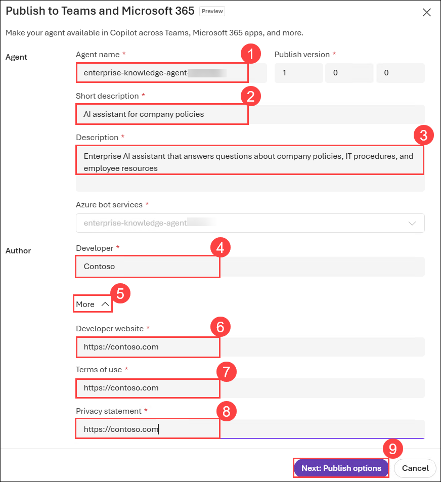

4. In the **Publish options** dialog, select **Just you (1)** to make the agent available only to your account for testing, and then select **Publish (2)**. The agent is published immediately and appears under **Your agents** in the agent store. You can also share the agent with others by sending them the agent link.

    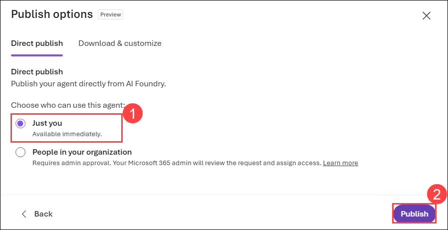

## Task 5: Test your agent in Teams

In this task, you'll access the published agent in Microsoft Teams and validate its functionality by interacting with it and testing knowledge-based queries.

1. After Publishing the agent, go back to the agent **enterprise-knowledge-agent-<inject key="DeploymentID" enableCopy="false" />** in the Foundry portal.

1. Select the **Publish (1)** drop-down menu, choose **Teams and Microsoft 365 Copilot (2)**, and then select **Open in Teams (3)** to launch the agent in Microsoft Teams.

   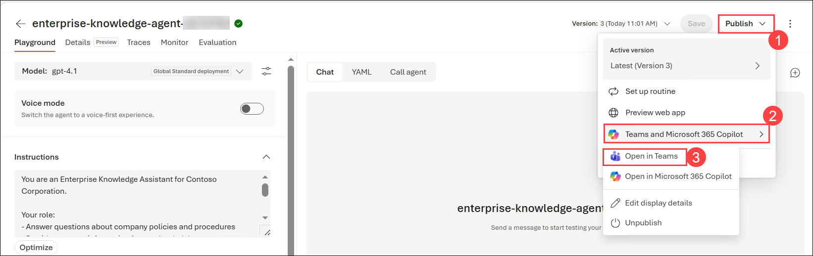

2. A new browser tab opens and loads Microsoft Teams.

3. In Teams, select **Apps** from the left navigation pane.

   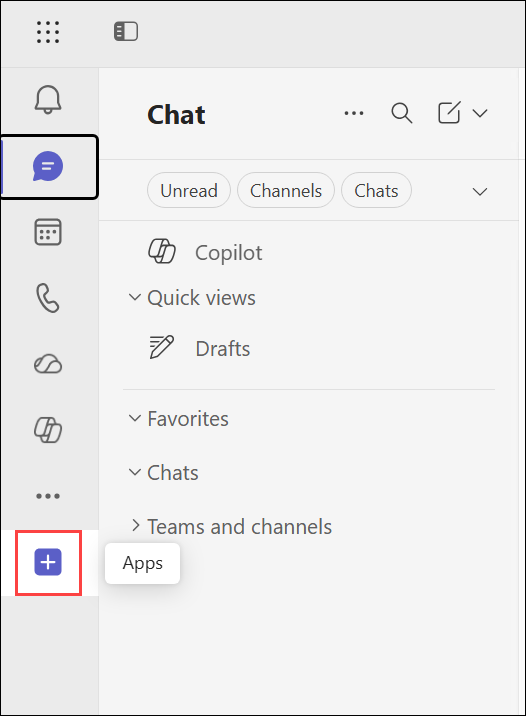

4. Select **Manage your apps (1)**, locate your agent and click on **ellipsis** **(2)** in the list of available apps, and then select **View details (3)** to open it.

   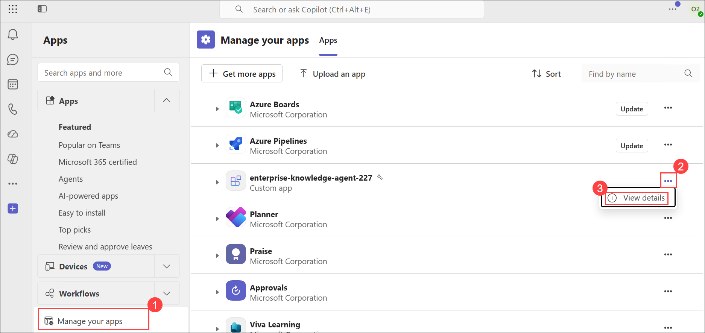

1. Now click **Open**.

    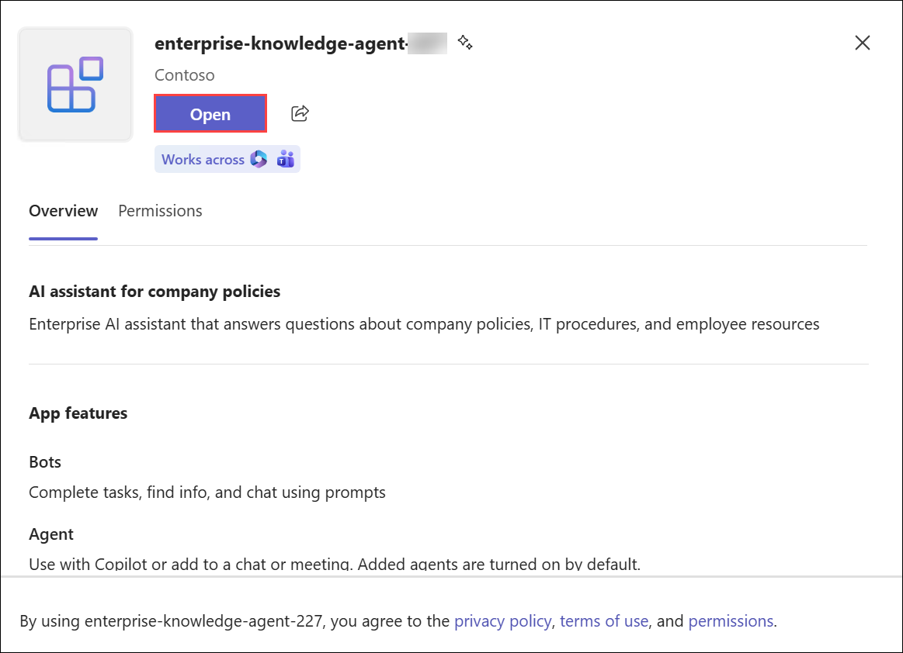

1. On the **Let's go** window, click **Open**.

    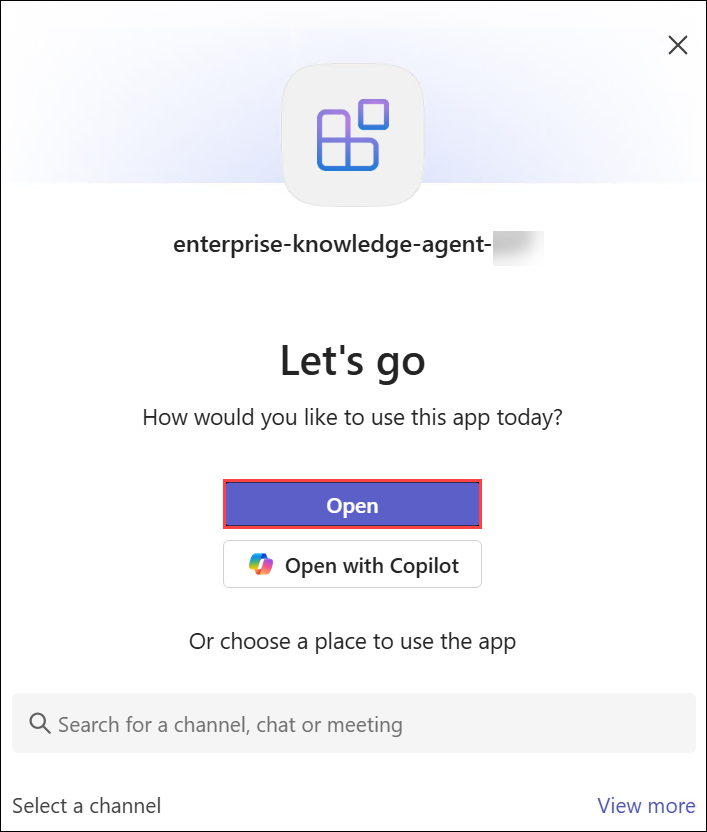

5. When the chat window opens, send the following greeting to verify that the agent is working correctly:

   ```
   Hello! What can you help me with?
   ```

    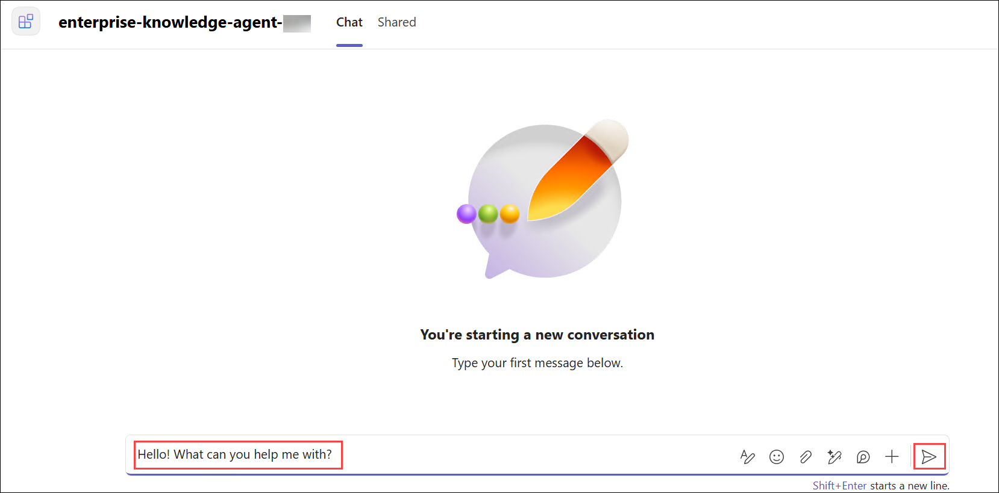

1. If prompted with **User Sign-in**, click on **Open sign-in link**.

    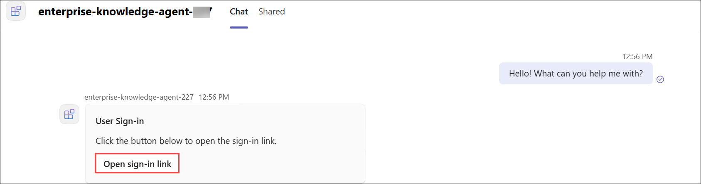

1. Review the response generated.
    
    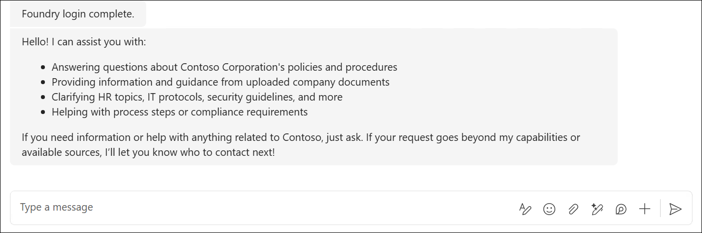

3. Test a knowledge query:

    ```
    What are the laptop password requirements?
    ```

    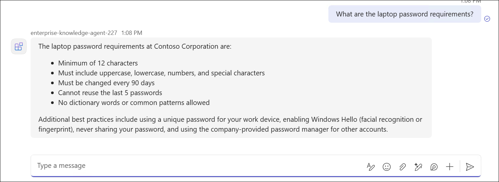

4. Try another question:

    ```
    What MFA methods are supported?
    ```

5. The agent should respond with information from the IT security policy document!

    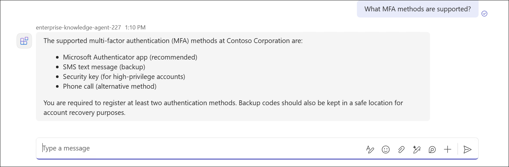

## Task 6: Test your agent in Microsoft 365 Copilot

In this task, you'll access the published agent in Microsoft 365 Copilot and verify that it can answer questions using information grounded in the uploaded enterprise documents.

1. Return to the Foundry portal (**[https://ai.azure.com](https://ai.azure.com)**) and navigate to your agent by selecting **Build** → **Agents** → **enterprise-knowledge-agent-<inject key="DeploymentID" enableCopy="false" />**.

2. Select **Publish (1)**, choose **Publish to Teams and Microsoft 365 Copilot (2)**, and then select **Open in Microsoft 365 Copilot (3)** to launch the agent in Microsoft 365 Copilot.

   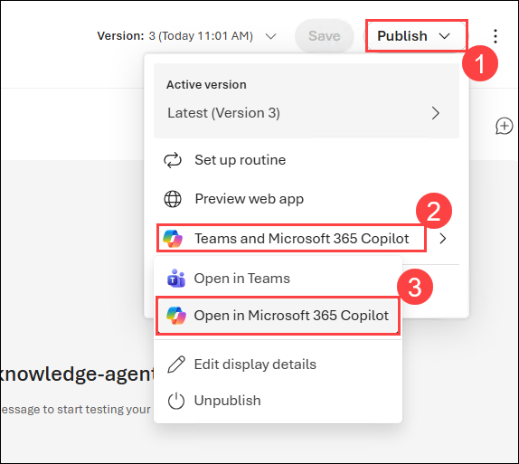

3. A new browser tab opens and loads **Microsoft 365 Copilot**.

4. In the left navigation pane, select **More agents (1)**, and then select **enterprise-knowledge-agent-<inject key="DeploymentID" enableCopy="false" /> (2)** from the **Your agents** section to start interacting with the agent.

    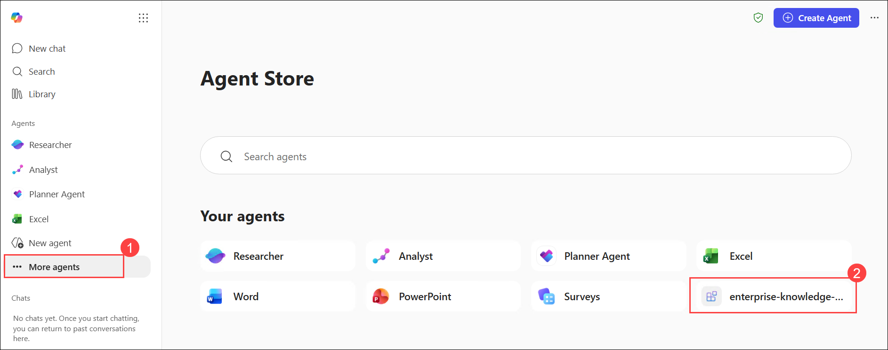

1. In the chat window for your agent, enter the following prompt to test the agent's knowledge and verify that it can access the uploaded policy documents:

   ```
   @Enterprise Knowledge Agent What are the laptop security requirements?
   ```

   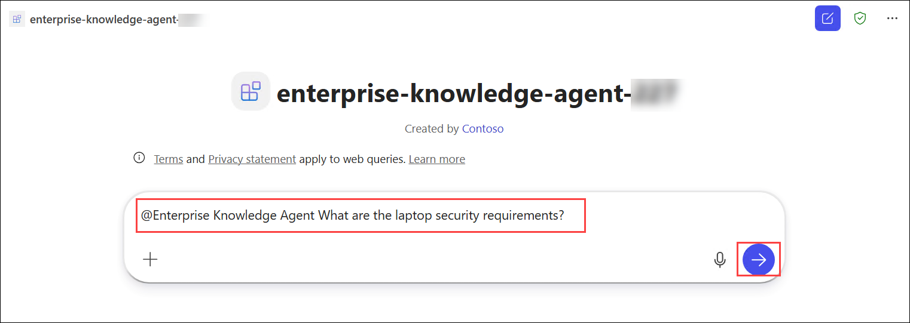

2. Review the response returned by the agent and confirm that it provides information from the IT Security Policy document.

   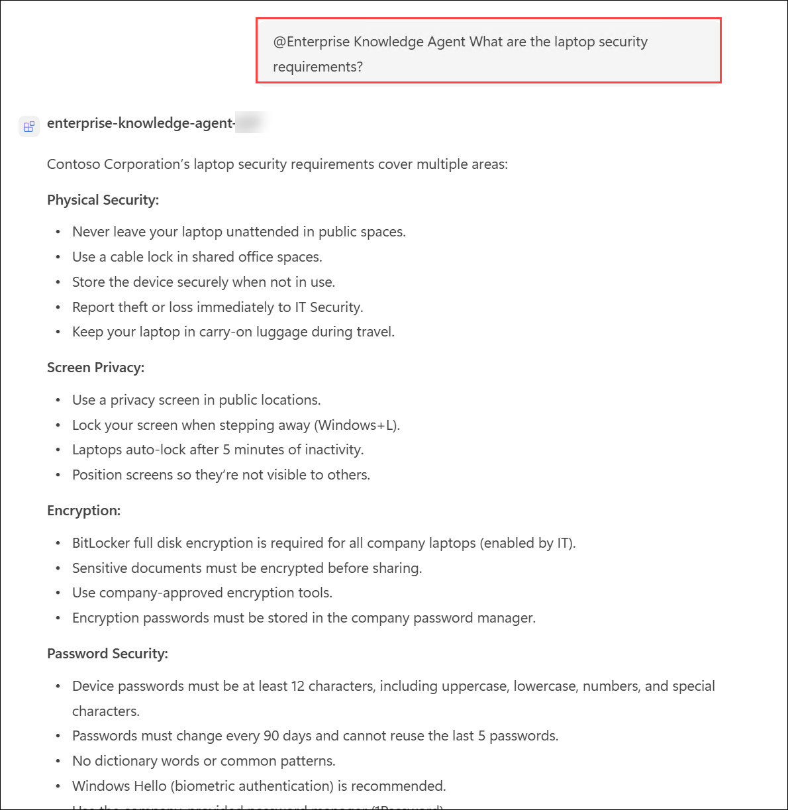

3. Next, submit the following prompt:

   ```
   What MFA methods are supported for company systems?
   ```

4. Review the response and observe how Microsoft 365 Copilot routes the request to your agent, which returns information grounded in the uploaded IT Security Policy document.

    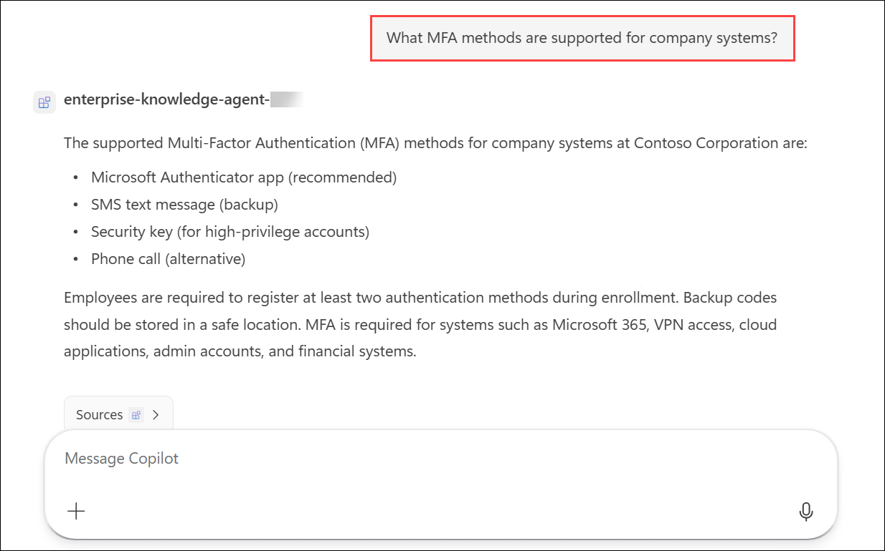

    > **Note:** For **organization scope**, an admin must first approve the app in the [Microsoft 365 admin center](https://admin.cloud.microsoft/?#/agents/all/requested) under **Requests**. Once approved, the agent appears under **Built by your org** for all users.

## Summary

In this lab, you created a Microsoft Foundry project and built an AI agent configured with custom instructions and enterprise knowledge documents. You tested the agent in the Foundry playground to verify that it could answer questions using grounded data from uploaded policy files. You then published the agent to Microsoft Teams and Microsoft 365 Copilot, making it available to users through familiar Microsoft 365 experiences. Finally, you validated the deployment by interacting with the agent in both Teams and Microsoft 365 Copilot and confirmed that it could successfully retrieve and present information from the uploaded knowledge sources.

### Congratulations, you’ve successfully completed the hands-on lab!