# Generate video with Sora in Microsoft Foundry

Sora is an AI model from OpenAI that creates realistic and imaginative video scenes from text instructions. The model can generate a wide range of video content, including realistic scenes, animations, and special effects. It supports several video resolutions and durations, and can also use reference images and remix existing videos.

In this exercise, you'll explore how to deploy the Sora model and generate video content using the Microsoft Foundry portal. You'll also build an application that generates videos from images, polls for completion status, and remixes existing videos.

> **Note**: To complete this exercise, you need an Azure subscription that has access to a video generation model, such as ***Sora 2***. Some of the technologies used in this exercise are in preview or in active development. You may experience some unexpected behavior, warnings, or errors. Video generation can take 1 to 5 minutes to complete depending on your settings.

This exercise will take approximately **45** minutes.

## Understand responsible AI considerations

Azure OpenAI's video generation models include built-in Responsible AI (RAI) protections to help ensure safe and compliant use.

The Sora 2 model enforces several content restrictions:

- Only content suitable for audiences under 18
- Copyrighted characters and copyrighted music are rejected
- Real people—including public figures—cannot be generated
- Input images with faces of humans are currently rejected

Azure provides input and output moderation across all image generation models, along with Azure-specific safeguards such as content filtering and abuse monitoring. These systems help detect and prevent the generation or misuse of harmful, unsafe, or policy-violating content.

## Prerequisites

Before starting this exercise, ensure you have:

- An active [Azure subscription](https://azure.microsoft.com/pricing/purchase-options/azure-account)
- [Visual Studio Code](https://code.visualstudio.com/) installed
- [Python version 3.13 or higher](https://www.python.org/downloads/) installed
- [Git](https://git-scm.com/install/) installed and configured
- [Azure CLI](https://learn.microsoft.com/cli/azure/install-azure-cli?view=azure-cli-latest) installed

## Task 1: Create a Microsoft Foundry project

In this task, you'll create a Microsoft Foundry project, configure the required Azure resources, and obtain the project endpoint needed for application development.

1. Copy the **Microsoft Foundry** link and paste it into a new browser tab to access the portal: `https://ai.azure.com/`

1. On the **Microsoft Foundry** home page, click on **Start building**.

     

1. If prompted to sign in, enter your credentials:
 
   - **Email/Username:** Enter <inject key="AzureAdUserEmail"></inject> **(1)** and click on **Next (2)**.
 
        
 
   - **Password:** Enter <inject key="AzureAdUserPassword"></inject> **(1)** and click on **Sign in (2)**.
 
      

1. If prompted to **Stay signed in?**, you can click **No**.

    

1. If prompted with, the **Get started with Microsoft Foundry** page, click on **Create project**.

   

1. In the **Create a project** wizard, enter project name **Myproject<inject key="DeploymentID" enableCopy="false" /> (1)**, and **Expand Advanced options (2)** to specify the following settings for your project: 

    - Foundry resource: **Leave default (3)**
    - Subscription : **Leave default subscription (4)** 
    - Region : Select **<inject key="location" enableCopy="false"/> (5)**
    - Resource group : Select **AI-103 (6)** 
    - Click on **Create** **(7)**

      

      > **Note:** If project creation gives an authorization error related to Application Insights or Log Analytics resources (for example, errors containing `Microsoft.OperationalInsights/workspaces/write` or `Microsoft.Insights/components/write`), **Toggle off** the *Set up recommended resources so I can explore everything Foundry has to offer* option before creating the project.

      .png)

1. Wait for your project to be created. It may take a few minutes. 

1. In the **All set, Let's build your agents** window, click **Let's go**.

    

1. Once the setup is complete, you are automatically redirected to the **Microsoft Foundry home page** for the newly created project.

   

   > **Note:** The Microsoft Foundry landing page may vary depending on the version of the portal, your account configuration, or recent UI updates. If your home page looks different, continue with the lab by locating the required menu options using the navigation menu. The appearance of the portal may differ, but the functionality and lab steps remain the same.

    

1. On the home page for your project, note that the API key, project endpoint, and OpenAI endpoint are displayed here.

    > **Note:** You're going to need the Azure OpenAI endpoint later!

    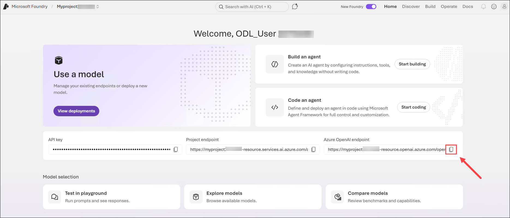

## Task 2: Deploy a model

You'll need a model that can process image-based input.

1. Select **Discover (1)** from the top menu and then on the **Discover** page, select the **Models (2)** tab to view the Microsoft Foundry model catalog.

    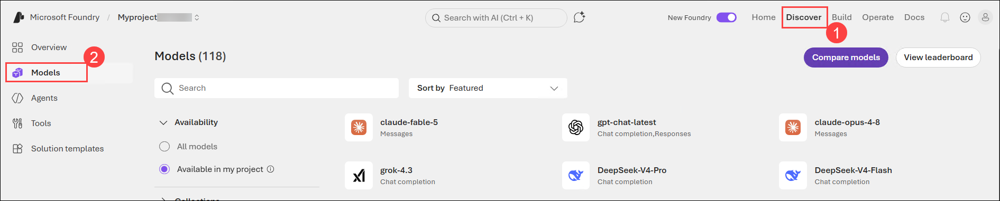

1. Search for `Sora-2` **(1)** and select it **(2)** from the result.

    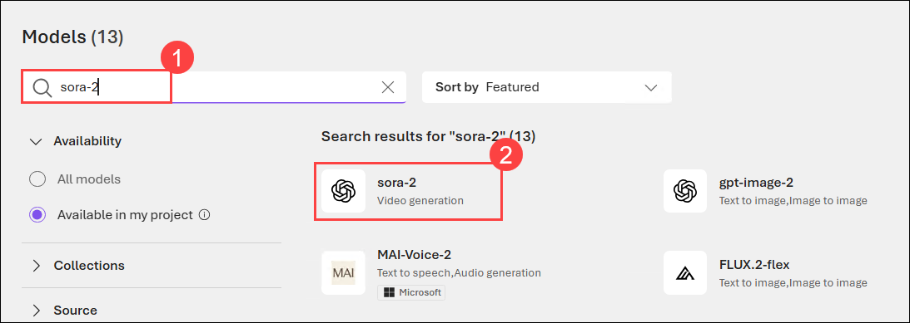

1. Select **Deploy (1)** drop-down and then deploy `Sora-2` model using the **Default settings (2)**. Deployment may take a minute or so.

    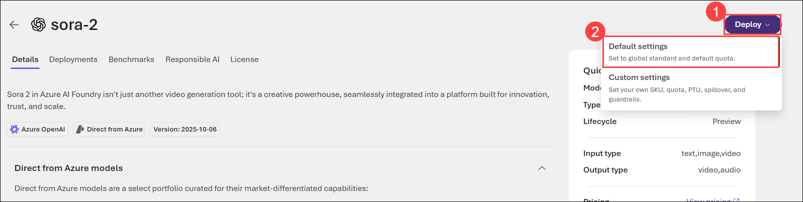

1. When the model has been deployed, view the model playground page that is opened, in which you can chat with the model.

    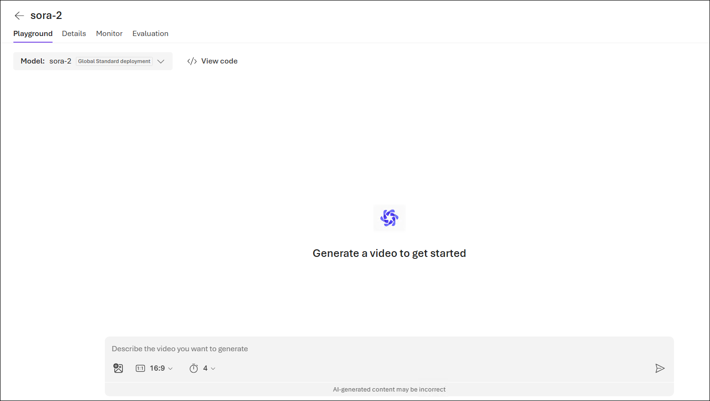

    > **Note:** Note the model deployment name (which by default should be *Sora-2*) - you'll need this later!

## Task 3: Test the model in the playground

Now you can test your vide-generation model deployment in the chat playground.

1. In the playground, enter the following prompt into the text box and press Enter on the keyboard:

    ```
    A director giving a presentation in a modern conference room.
    ```

1. Set the video duration to 4 seconds. Then elect **Generate** to start the video generation process.

    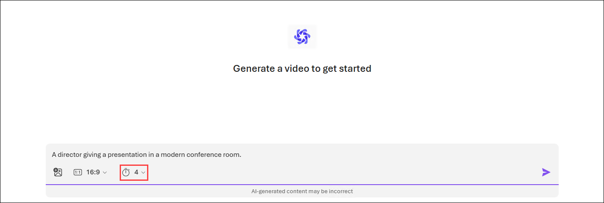

    > **Note:** Video generation typically takes 1 to 5 minutes depending on your settings. The content generation APIs include content moderation filters. If Azure OpenAI recognizes your prompt as harmful content, it won't return a generated video.

1. Once the AI-generated video has finished processing, it will appear on the page. Select the generated video to review the output.

   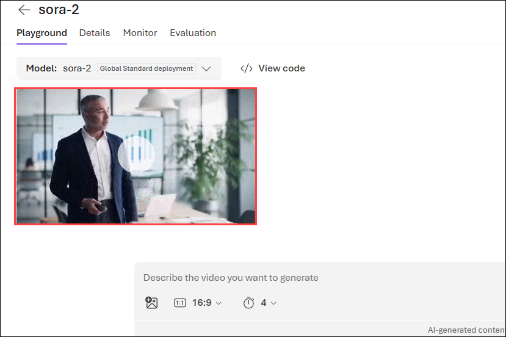

2. In the video details pane, select the **Edit** (**pencil**) icon. Append the following instruction to the existing prompt, and then submit the update to regenerate the video with background music:

   ```
   Use an inviting instrumental as the background music.
   ```

   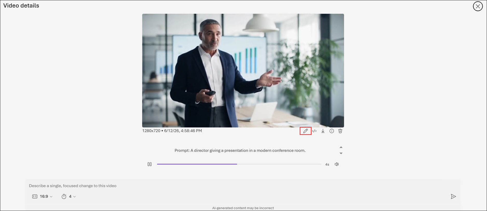

   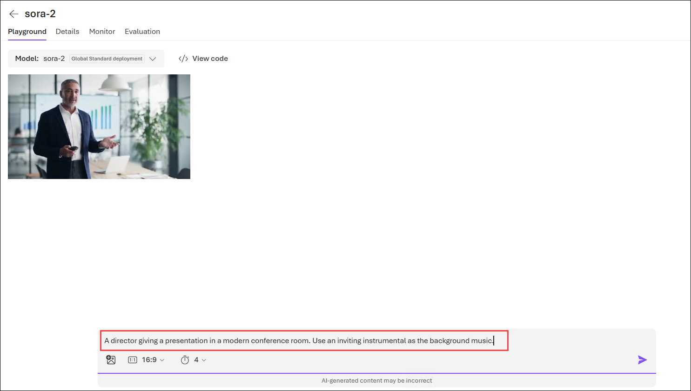

3. After the updated video is generated, review the output and verify that the video now includes inviting instrumental background music.

   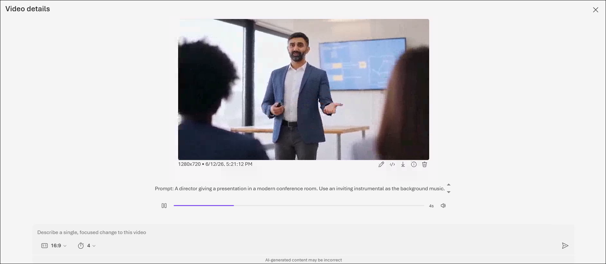

## Task 4: Create a video generation application

Now that you've explored the playground, let's build a Python application that programmatically generates videos using the Sora 2 API.

### Get application files from GitHub

The initial application files you'll need to develop the translation application are provided in a GitHub repo.

1. In the Lab VM, open **Visual Studio Code** from the desktop.

    

1. Open the Command Palette (Ctrl + Shift + P), or go to **View (1)** > **Command Palette (2)**, then search for and select **Git: Clone (3)**

    

    

1. Paste the `https://github.com/microsoftlearning/mslearn-ai-vision` repo link and press Enter to clone it to a local folder.

    

1. On the **Choose a folder to clone** window, select **Download (1)** from the left navigation pane and then select **Select as Repository Destination (2)**.

    

1. On the **Would you like to open the repository?** dialoge, click **Open**.

    

1. You may be prompted to confirm you trust the authors.

    

1. In Visual Studio Code, select the **Extensions (1)** icon from the Activity Bar on the left side of the window.

1. In the Extensions view, search for Python if it is not already displayed.

1. Locate the Python extension published by Microsoft.

1. Select **Install (2)** to install the Python extension.

   

1. Wait for the installation to complete. Once installed, the extension will provide Python language support, IntelliSense, debugging capabilities, and other Python development features in Visual Studio Code.

1. Open the Command Palette by selecting **View > Command Palette** or by pressing **Ctrl+Shift+P**.

1. In the Command Palette, type **Python: Select Interpreter (1)**.

   
   
1. From the list of matching commands, **select (2)** Python: Select Interpreter.

1. In the Select Interpreter window, select **Create Virtual Environment (3)**.

   
   
1. When prompted to select an environment type, choose **Venv (4)** to create a .venv virtual environment in the current workspace.

   
   
1. In the Select a Python installation window, choose Python 3.14.2 (Global) located at
**C:\Program Files\Python314\python.exe (5)** to create the virtual environment.

   

    > **Tip:** If you are prompted to install dependencies, you can install the ones in the *requirements.txt* file in the */labfiles/video-generation/python* folder; but it's OK if you don't - we'll install them later!

    > **Tip**: If you prefer to use the terminal, you can create your **Venv** environment with `python -m venv labenv`, then activate it with `\labenv\Scripts\activate`.

### Task 4.1: Prepare the application configuration

1. After the repo has been cloned, navigate to the **Labfiles (1) -> video-generation\python (2)** folder.

    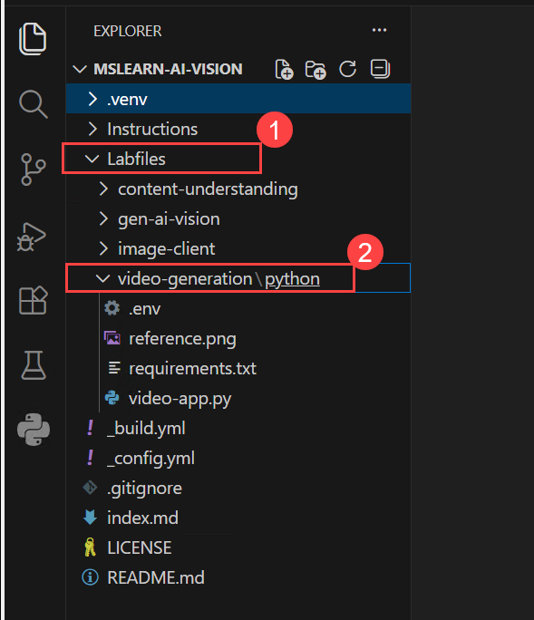

1. In the VS Code Explorer pane, review the files in the folder:

    - `.env` - A configuration file for application settings.
    - `video-app.py` - The Python code file for the video application.
    - `requirements.txt` - A file listing the package dependencies.
    - `reference.png` - An image file that you can use as a reference for video generation.

        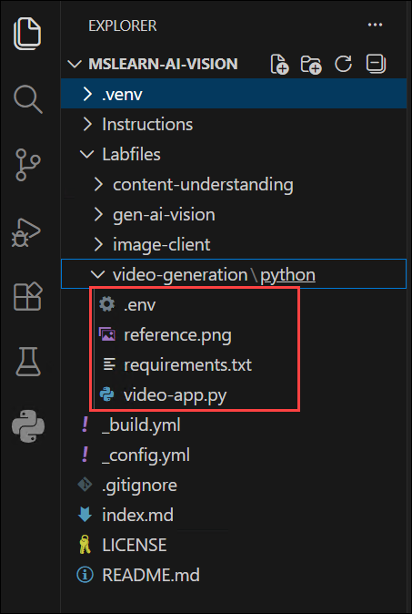

1. In the **Explorer** pane, in the **python** folder, select the **.env** file to open it.

    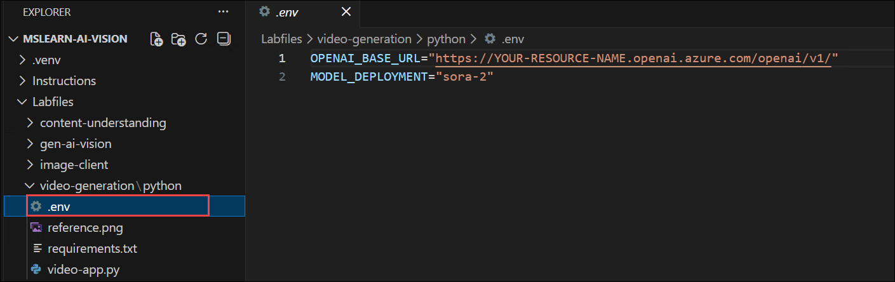

1. Then update the configuration values to include the **Azure OpenAI endpoint** for your Foundry resource, and the model deployment name for your video-generation model.
Paste the OpenAI endpoint that you copied previously and press **Ctrl+S** to save the file.

    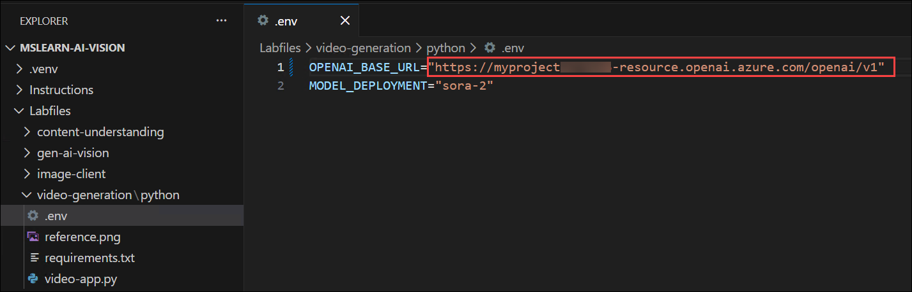

    > **Important:** Be sure to add the `https://{foundry-resource-name}.openai.azure.com/openai/v1/` Azure openAI endpoint, <u>not</u> the project endpoint!

1. In the **Explorer** pane, right-click the **python** folder containing the application files, and select **Open in integrated terminal** (or open a terminal in the **Terminal** menu and navigate to the */labfiles/video-generation/python* folder.)

    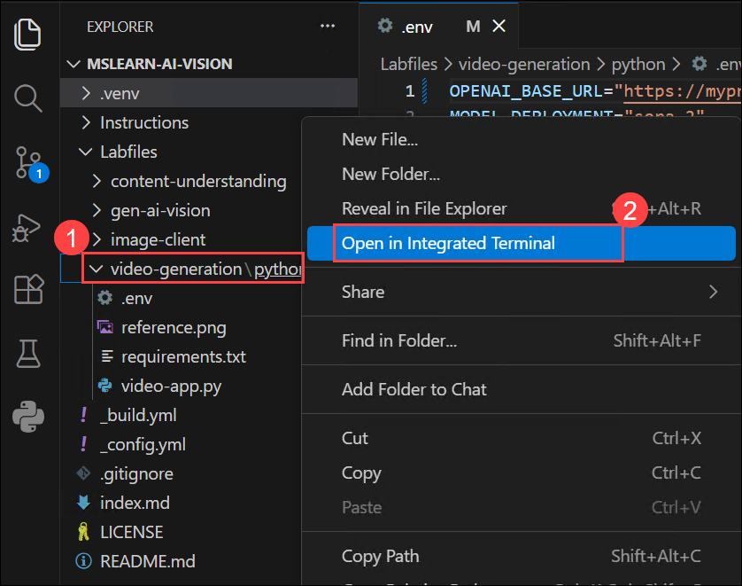

    > **Note:** Opening the terminal in Visual Studio Code will automatically activate the Python environment. You may need to enable running scripts on your system.

1. Ensure that the terminal is open in the **/labfiles/video-generation/python*** folder with the prefix **(.venv)** to indicate that the Python environment you created is active.

    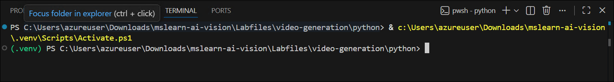

1. Install the required Python packages by running the following command:

    ```
    pip install -r requirements.txt
    ```

### Task 4.2: Write code to generate videos from an image reference

> **Tip:** As you add code, be sure to maintain the correct indentation.

1. In VS Code, open the `video-app.py` file.

    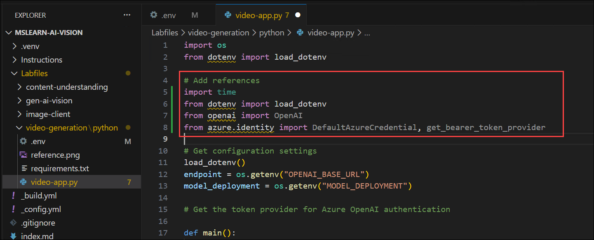

1. Find the comment **Add references** and add the following code for the necessary imports:

    ```python
    # Add references
    import time
    from dotenv import load_dotenv
    from openai import OpenAI
    from azure.identity import DefaultAzureCredential, get_bearer_token_provider
    ```

    

1. Find the comment **Get the token provider for Azure OpenAI authentication** and add the following code:

    ```python
    
    # Get the token provider for Azure OpenAI authentication
    token_provider = get_bearer_token_provider(
        DefaultAzureCredential(), "https://cognitiveservices.azure.com/.default"
    )

    #Initialize the OpenAI client with the endpoint and token provider
    client = OpenAI(
        base_url=endpoint,
        api_key=token_provider,
    )
    ```

    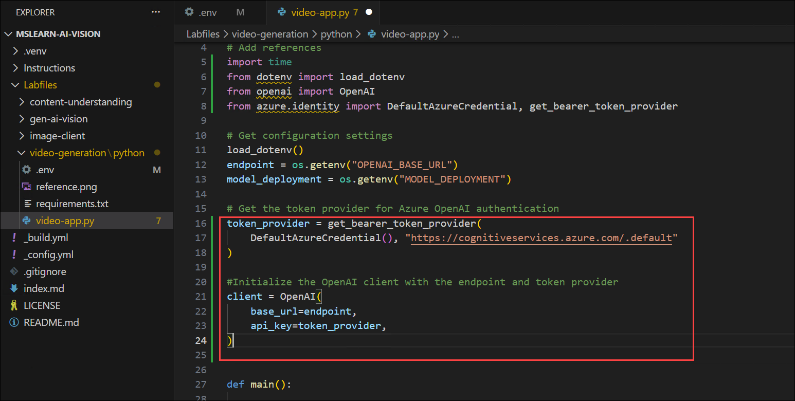

1. In the main function, find the comment **Generate a video from a text prompt** and add the following code:

    ```python
    # Generate a video from a text prompt
    video = client.videos.create(
        model=model_deployment,
        prompt="A peaceful mountain lake at sunrise with mist rising from the water",
        size="1280x720",
        seconds='4',
    )
    video = poll_video_status(video.id)
    ```

    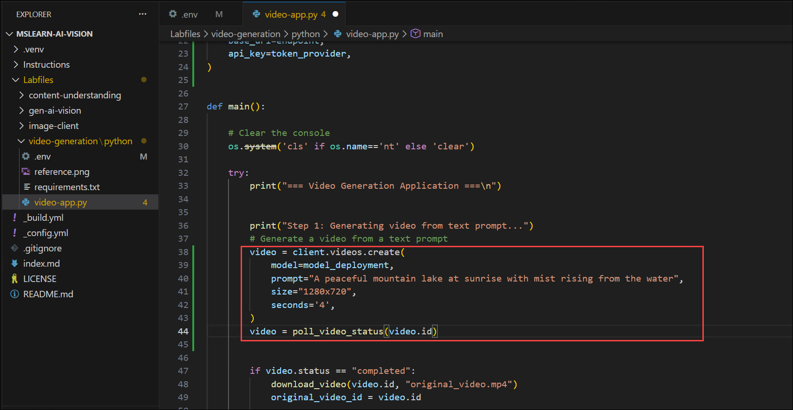

1. In the main function, find the comment **Generate a video from a reference image** and add the following code:

    ```python
    # Generate a video from a reference image
    video = generate_video_from_image(
        image_path="reference.png",
        prompt="The scene comes to life with gentle movement and ambient lighting",
        size="1280x720",
        seconds='4'
    )
    if video.status == "completed":
        download_video(video.id, "image_based_video.mp4")
    ```

    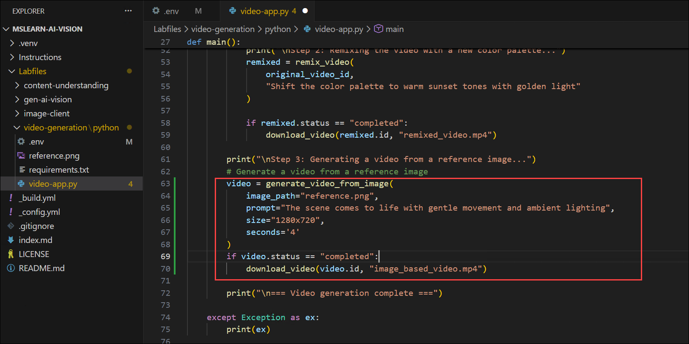

1. Find the comment **Poll video status until completion** and add the following code to complete the `poll_video_status` function:

    ```python
    # Poll video status until completion
    video = client.videos.retrieve(video_id)
    
    while video.status not in ["completed", "failed", "cancelled"]:
        print(f"Status: {video.status}. Waiting 20 seconds...")
        time.sleep(20)
        video = client.videos.retrieve(video_id)
    
    if video.status == "completed":
        print("Video successfully completed!")
    else:
        print(f"Video creation ended with status: {video.status}")
    
    return video
    ```

    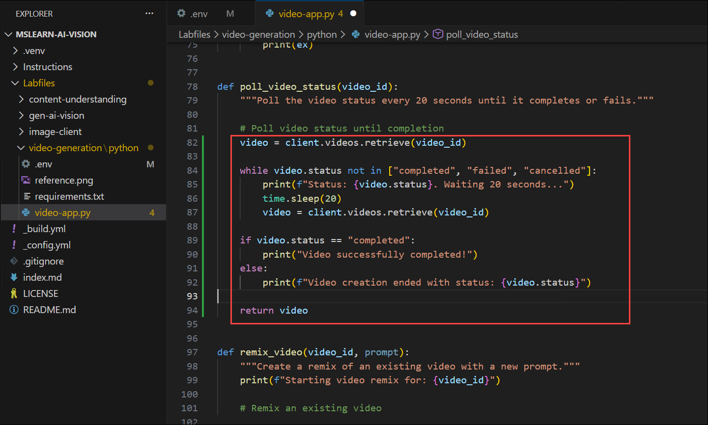

1. Find the comment **Remix an existing video** and add the following code to complete the `remix_video` function:

    ```python
    # Remix an existing video
    video = client.videos.remix(
        video_id=video_id,
        prompt=prompt,
    )
    
    print(f"Remix started. New video ID: {video.id}")
    print(f"Initial status: {video.status}")
    
    # Poll for completion
    video = poll_video_status(video.id)
    return video
    ```

    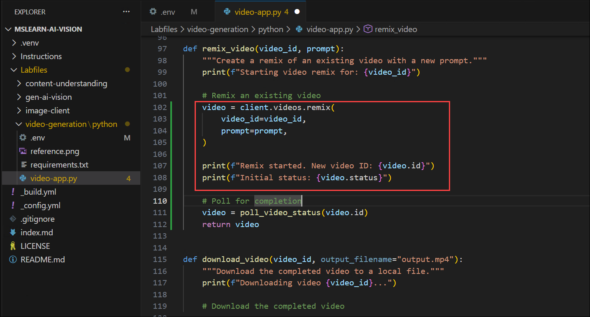

1. Find the comment **Download the completed video** and add the following code to complete the `download_video` function:

    ```python
    # Download the completed video
    print(f"Downloading video {video_id}...")
    content = client.videos.download_content(video_id, variant="video")
    content.write_to_file(output_filename)
    print(f"Saved video to {output_filename}")
    ```

    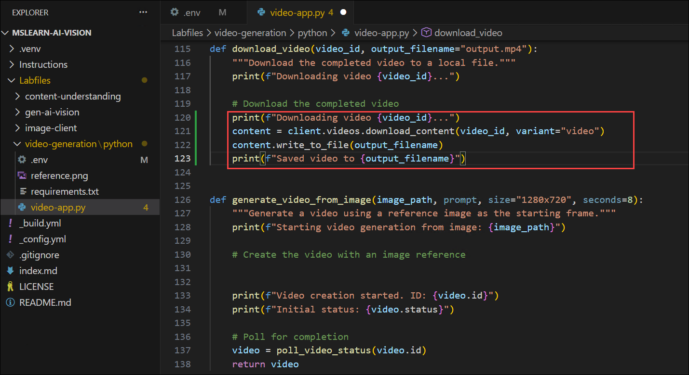

1. Find the comment **Create the video with an image reference** and add the following code to complete the `generate_video_from_image` function:

    ```python
    # Create the video with an image reference
    video = client.videos.create(
        model=model_deployment,
        prompt=prompt,
        size=size,
        seconds=seconds,
        input_reference=open(image_path, "rb"),
    )
    ```

    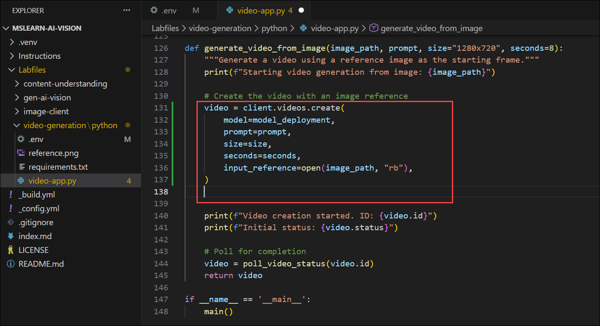

1. Save the file (**Ctrl+S**).

### Task 4.3: Sign into Azure and run the app

1. In the terminal pane, use the following command to sign into Azure.

    ```powershell
    az login
    ```

    

    

    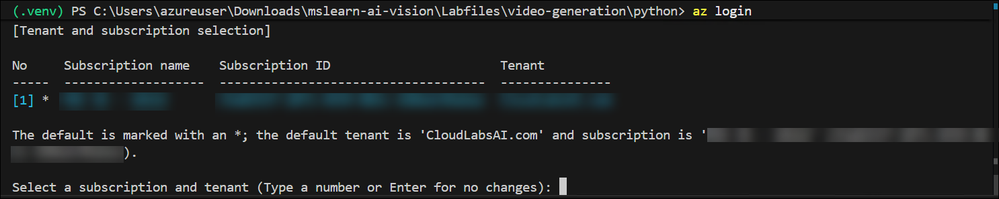

    > **Note**: In most scenarios, just using *az login* will be sufficient. However, if you have subscriptions in multiple tenants, you may need to specify the tenant by using the *--tenant* parameter. See [Sign into Azure interactively using the Azure CLI](https://learn.microsoft.com/cli/azure/authenticate-azure-cli-interactively) for details.

1. When prompted, follow the instructions to sign into Azure. Then complete the sign in process in the command line, viewing (and confirming if necessary) the details of the subscription containing your Foundry resource.

1. After you have signed in, enter the following command to run the application:

    ```
    python video-app.py
    ```

    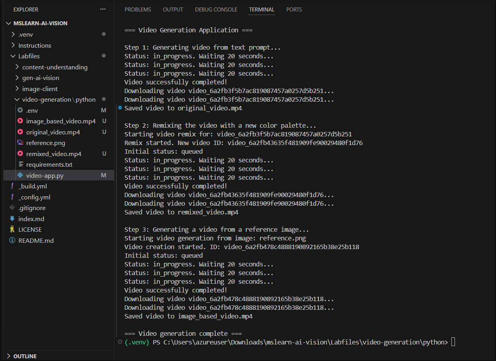

1. Observe the output as the application:
    - Creates a video from a text prompt
    - Polls for the video status until completion
    - Downloads the completed video
    - Remixes the video with a new style
    - Downloads the remixed video

        > **Note**: Video generation typically takes 1-5 minutes per video. Be patient while waiting for the status to change to "completed".

1. When the application finishes, check your project folder for `original_video.mp4`, `remixed_video.mp4`, and `image_based_video.mp4`.

    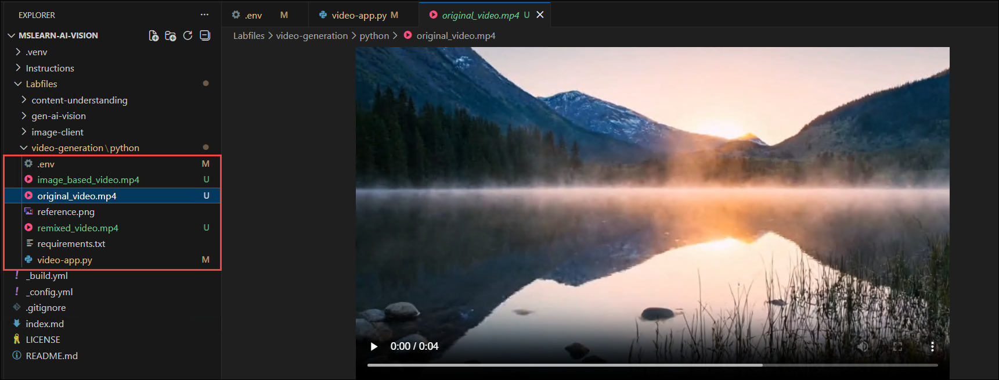

## Summary

In this exercise, you used the Microsoft Foundry portal to explore video generation with the Sora model, and built a Python application that programmatically generates videos. You learned how to:

- Generate videos from text prompts and reference images
- Poll for video generation status until completion
- Download completed videos
- Remix existing videos with new prompts

The Sora 2 API provides powerful video generation capabilities through a simple asynchronous workflow: create a job, poll for status, and download the result.

## Clean up

When you finish exploring video generation in Foundry, you should delete the resources you've created to avoid unnecessary Azure costs.

- Navigate to the [Azure portal](https://portal.azure.com) at `https://portal.azure.com`.
- In the Azure portal, on the **Home** page, select **Resource groups**.
- Select the resource group that you created for this exercise.
- At the top of the **Overview** page for your resource group, select **Delete resource group**.
- Enter the resource group name to confirm you want to delete it, and select **Delete**.