# Analyze images with Azure Content Understanding

### Estimated Duration: 45 Minutes

## Lab overview

In this lab, you will use Azure Content Understanding to build and test a custom image analyzer that generates image descriptions and tags. You will then develop a Python application that submits images to the analyzer and retrieves AI-generated results for content understanding scenarios.

## Lab objectives

In this exercise, you will perform:

* Task 1: Create a Microsoft Foundry project

* Task 2: Create an Azure storage account

* Task 3: Create an image analyzer in Azure Content Understanding

* Task 4: Create an image analyzer application

## Task 1: Create a Microsoft Foundry project

In this task, you will create a Microsoft Foundry project and configure the Azure resources required for Azure Content Understanding and application development.

1. Copy the **Microsoft Foundry** link and paste it into a new browser tab to access the portal: `https://ai.azure.com/`

1. On the **Microsoft Foundry** home page, click on **Start building**.

     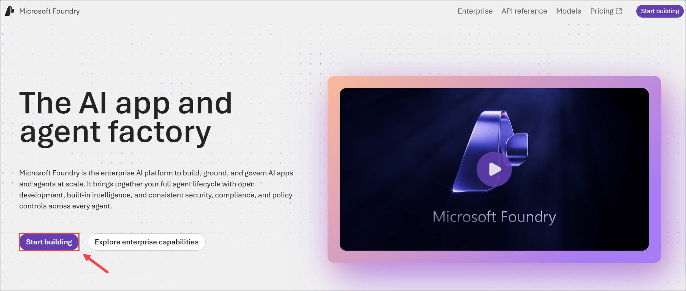

1. If prompted to sign in, enter your credentials:
 
   - **Email/Username:** Enter <inject key="AzureAdUserEmail"></inject> **(1)** and click on **Next (2)**.
 
        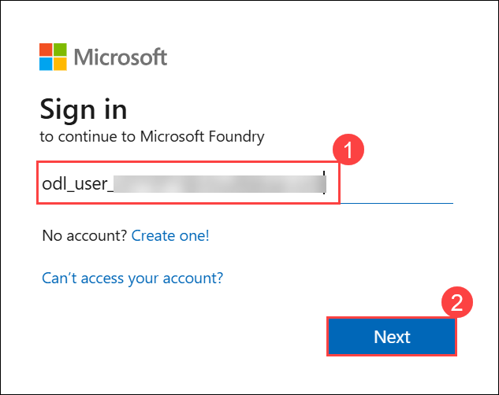
 
   - **Password:** Enter <inject key="AzureAdUserPassword"></inject> **(1)** and click on **Sign in (2)**.
 
      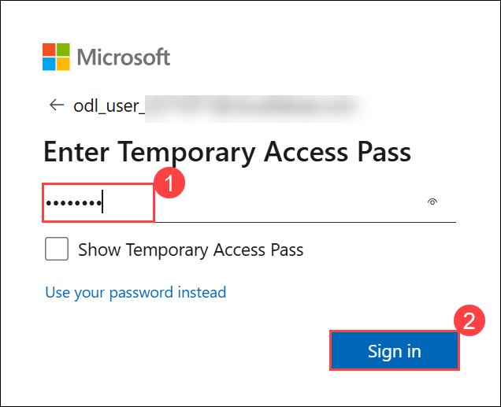

1. If prompted to **Stay signed in?**, you can click **No**.

    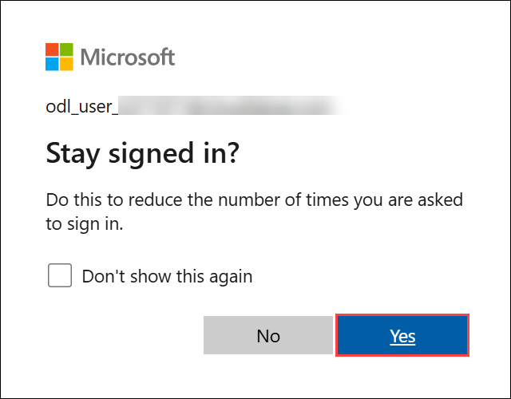

1. If prompted with, the **Get started with Microsoft Foundry** page, click on **Create project**.

   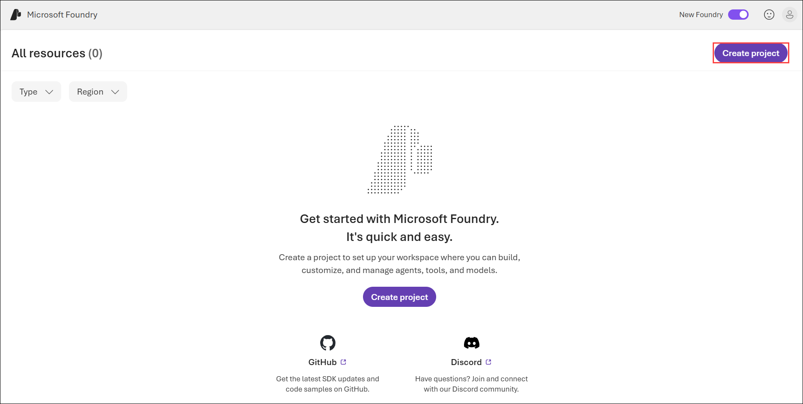

1. In the **Create a project** wizard, enter project name **Myproject<inject key="DeploymentID" enableCopy="false" /> (1)**, and **Expand Advanced options (2)** to specify the following settings for your project: 

    - Foundry resource: **Leave default (3)**
    - Subscription : **Leave default subscription (4)** 
    - Region : Select **<inject key="Region" enableCopy="false"/> (5)**
    - Resource group : Select **AI-103 (6)** 
    - Click on **Create** **(7)**

      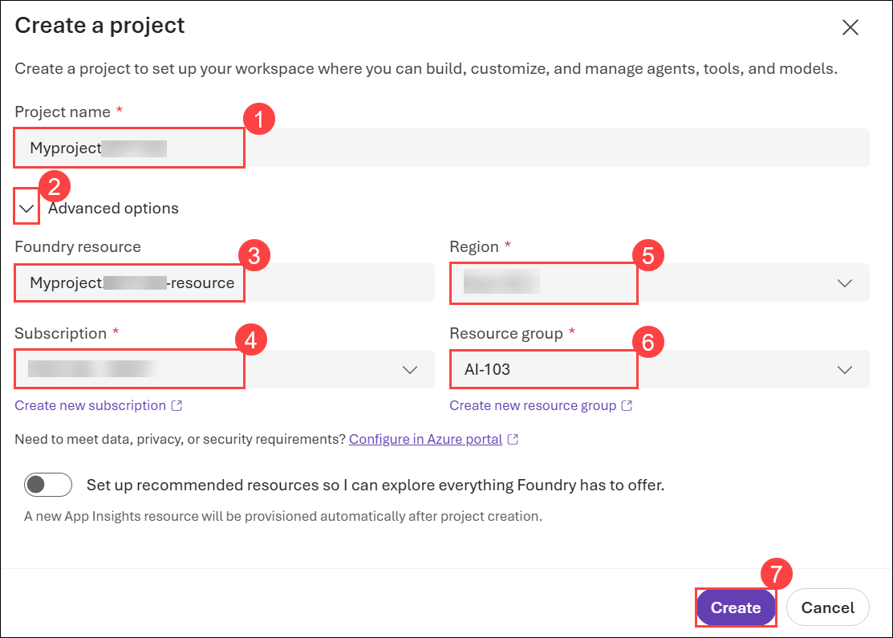

      > **Note:** If project creation gives an authorization error related to Application Insights or Log Analytics resources (for example, errors containing `Microsoft.OperationalInsights/workspaces/write` or `Microsoft.Insights/components/write`), **Toggle off** the *Set up recommended resources so I can explore everything Foundry has to offer* option before creating the project.

      .png)

1. Wait for your project to be created. It may take a few minutes. 

1. In the **All set, Let's build your agents** window, click **Let's go**.

    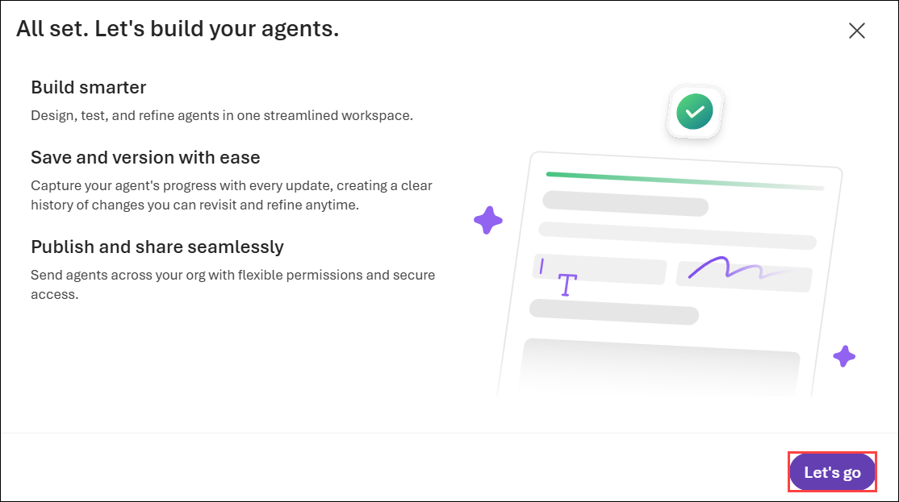

1. Once the setup is complete, you are automatically redirected to the **Microsoft Foundry home page** for the newly created project.

   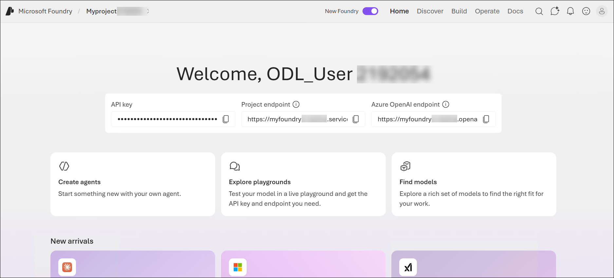

   > **Note:** The Microsoft Foundry landing page may vary depending on the version of the portal, your account configuration, or recent UI updates. If your home page looks different, continue with the lab by locating the required menu options using the navigation menu. The appearance of the portal may differ, but the functionality and lab steps remain the same.

    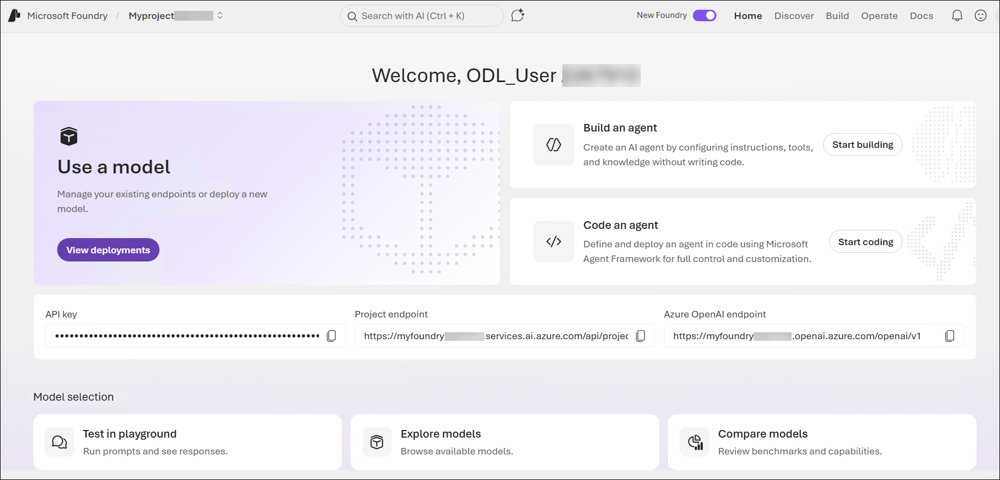

> **Congratulations** on completing the task! Now, it's time to validate it. Here are the steps:
 
- Hit the Validate button for the corresponding task. You will receive a success message. 
- If not, carefully read the error message and retry the step, following the instructions in the lab guide.
- If you need any assistance, please contact us at cloudlabs-support@spektrasystems.com. We are available 24/7 to help you out.

  <validation step="36778d74-b294-4397-a6d0-775c536b2979" />

## Task 2: Create an Azure storage account

In this task, you will create an Azure Storage account that will be used to store content assets for image analysis with Azure Content Understanding.

1. In a new browser tab, open the [Azure portal](https://portal.azure.com) at `https://portal.azure.com`.

1. In the Azure Portal tab, in the top search bar, search for **Storage accounts (1)** and select **Storage accounts (2)** from the services section.

    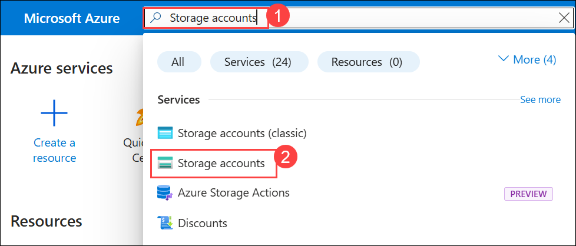

1. In the **Storage center | Blob Storage** page, select **+ Create** to start creating a new storage account.

    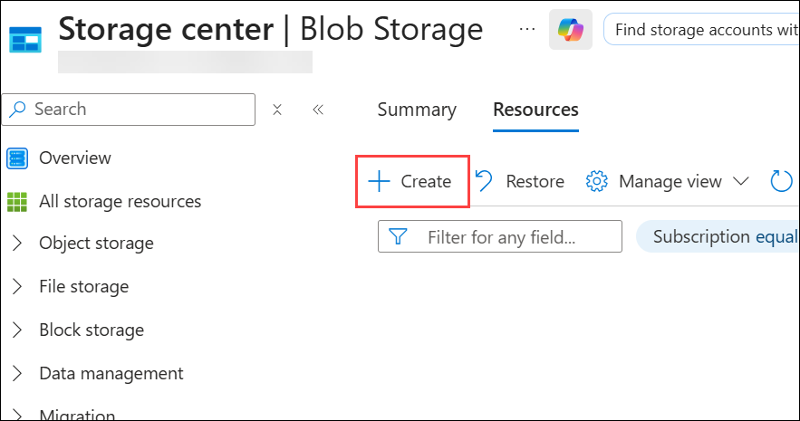

1. Then create a **Storage account** resource with the following settings:
    
    - Subscription: *Your Azure subscription* **(1)**
    - Resource group: Select **AI-103 (2)**
    - Storage account name: Enter **storage<inject key="DeploymentID" enableCopy="false"/> (3)**
    - Region: Select **<inject key="Region" enableCopy="false" /> (4)**
    - Primary service: Select **Azure Blob Storage or Azure Data Lake Storage Gen 2 (5)**
    - Performance: **Standard (6)**
    - Redundancy: **Locally-redundant storage (LRS) (7)**
    - Then **Review + Create (8)**

      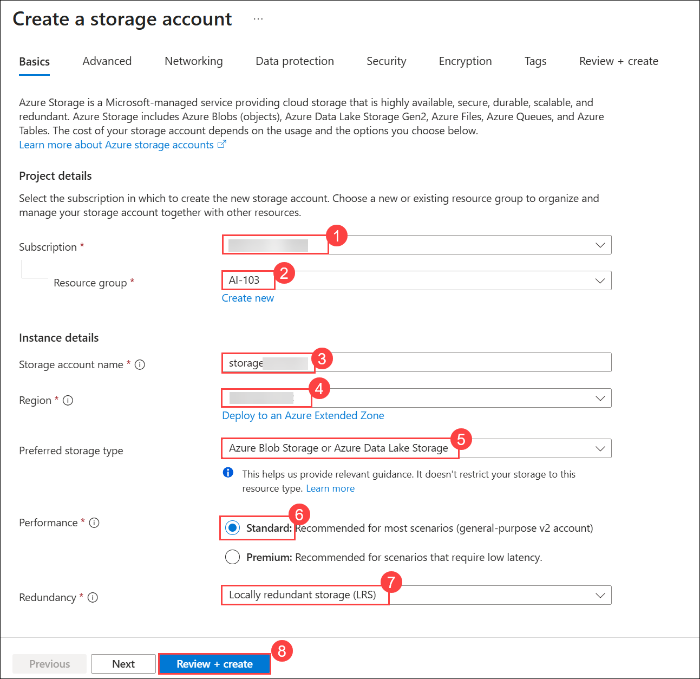  

1. Review the storage account configuration, and then select **Create** to deploy the storage account.

    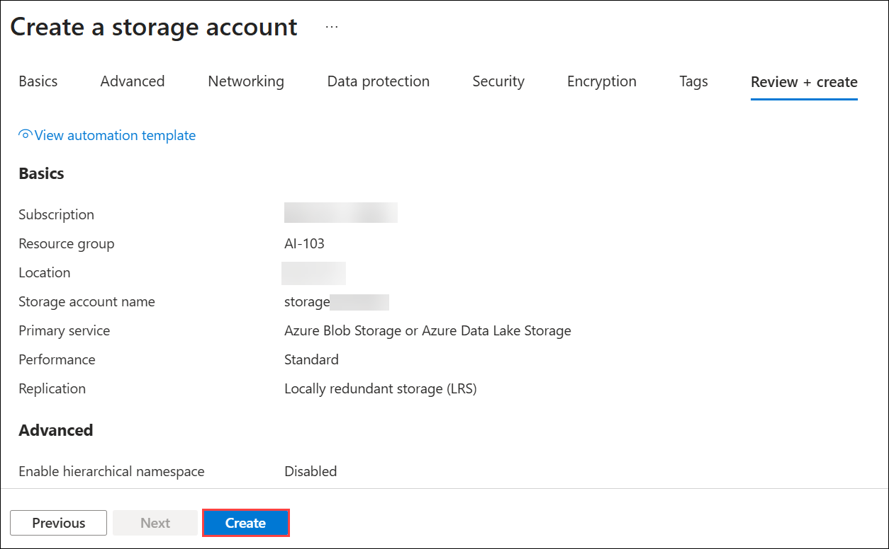  

1. Wait for deployment to complete, and then go to the deployed resource.

> **Congratulations** on completing the task! Now, it's time to validate it. Here are the steps:
 
- Hit the Validate button for the corresponding task. You will receive a success message. 
- If not, carefully read the error message and retry the step, following the instructions in the lab guide.
- If you need any assistance, please contact us at cloudlabs-support@spektrasystems.com. We are available 24/7 to help you out.

  <validation step="7742ddd0-2870-44a3-892b-9744634d49a6" />

## Task 3: Create an image analyzer in Azure Content Understanding

In this task, you will create, configure, test, and publish a custom image analyzer that generates descriptions and tags from uploaded images.

1. In a new browser tab, navigate to [Content Understanding Studio](https://contentunderstanding.ai.azure.com/home) at `https://contentunderstanding.ai.azure.com/home`.

1. On the homepage of **Content Understanding Studio** click on **Sign in**.

    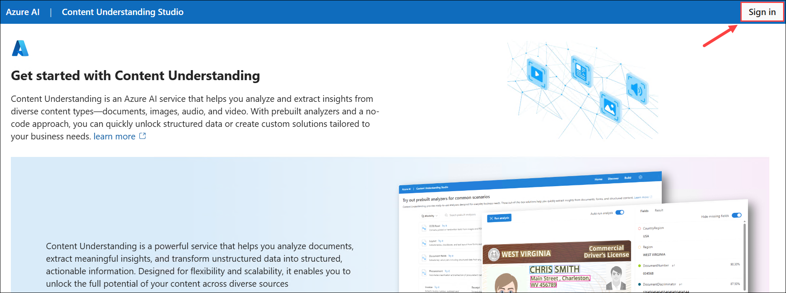  

1. If prompted, provide the credentials below:

    - **Email/Username:** <inject key="AzureAdUserEmail"></inject>

    - **Password:** <inject key="AzureAdUserPassword"></inject>

1. Select the **Settings (gear) icon (1)** on the top navigation bar, then click **+ Add resource (2)** to connect a resource.

    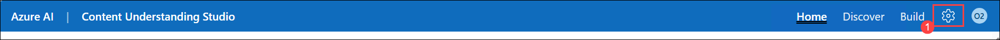  

    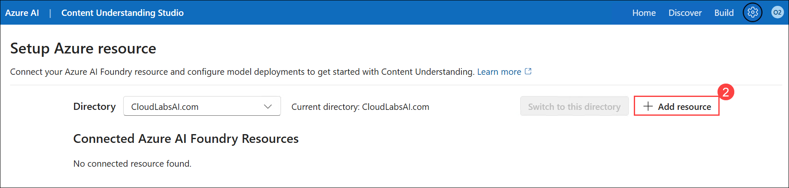  

1. In the **Set up your default resource** window, select the required details and proceed:

    * Subscription name: **Select your subscription (1)**
    
    * Resource group name: **AI-103 (2)**
    
    * Resource name: **Select your Foundry resource (3)**
    
    * Enable auto-deployment: **Ensure this option is checked (4)**

    - Then, click **Next (5)** to continue.

         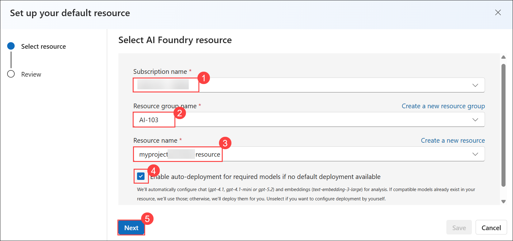  

1. Click on **Save** to create the configuration.

     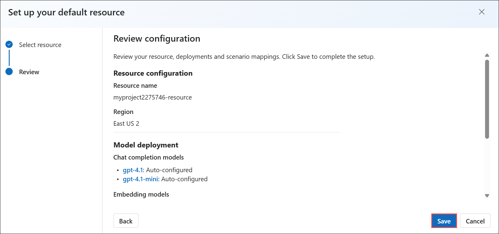  

1. The deployment process can take 2-3 minutes. Once the models are deployed, the resource will appear under **Connected Azure AI Foundry Resources**. Note the name of the resource.

    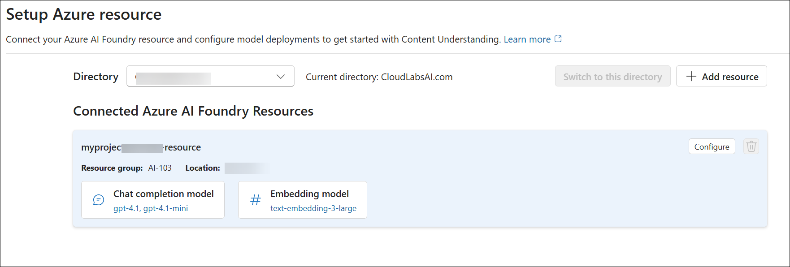  

1. On the menu bar, select **Build (1)**, and then click **Create (2)** to create a new project.

    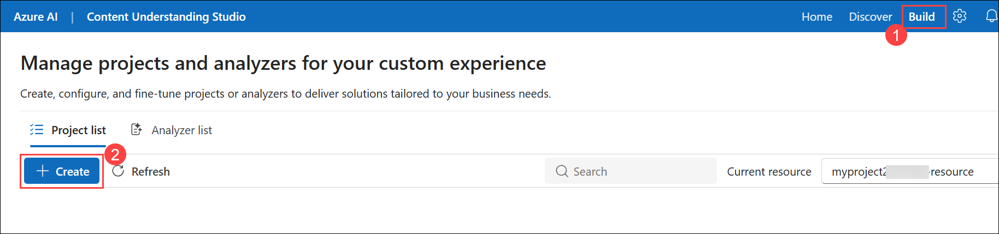  

1. In the **Create a new project** pane, then create a project with the following settings:
    - **Project name**: **Image_analysis_<inject key="DeploymentID" enableCopy="false"/> (1)**
    - **Description**: `Image analysis project` **(2)**
    - choose the type of project that is best for your case: select **Extract content and field with custom schema (3)**
    - **Advanced settings**: Verify the settings are the same as the last project

      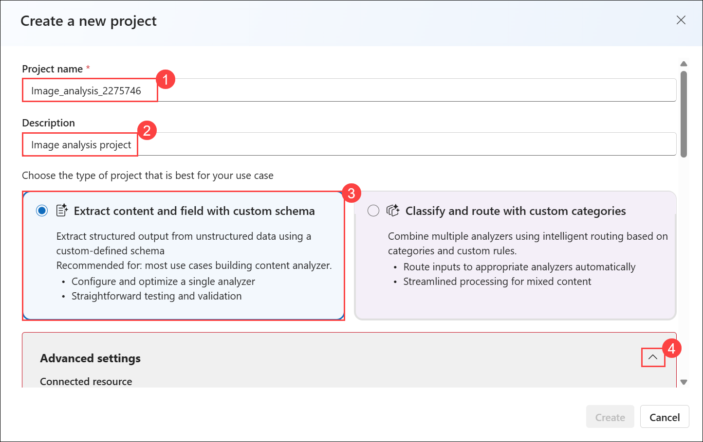  

    - **Advanced settings**
        - **Connected resource:** Confirm your Foundry resource is selected **(1)**
        - **Connect storage account:** Select the storage account **storage<inject key="DeploymentID" enableCopy="false"/>(2)**
        - **Blob container:**  new container **(3)**.
        - Click **Create (5)**

            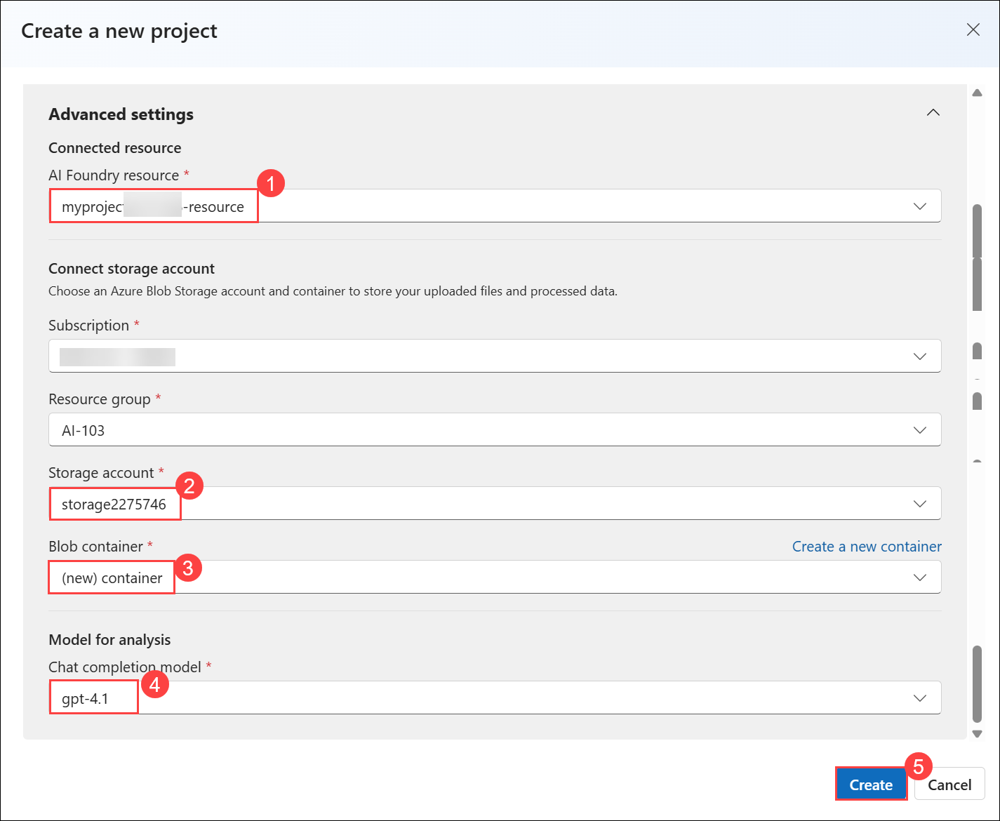  

1. Open a new browser tab and copy, paste the following link.

    ```
    https://microsoftlearning.github.io/mslearn-ai-vision/Labfiles/content-understanding/lion.jpg
    ```

1. Right-click the sample image, select **Save image as**, save the file to a local folder, and then use it later to upload into the analyzer project.

    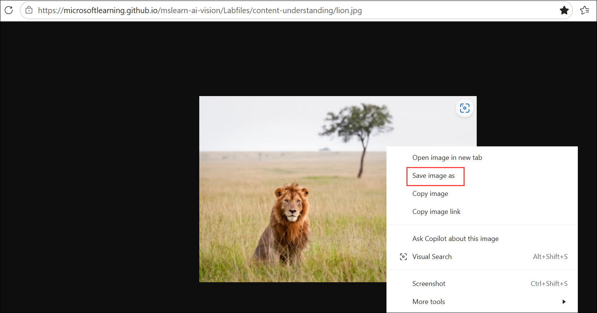  

1. In the **Save As** window, select the **Downloads (1)** folder, keep the default file name, and then click **Save (2)**.

    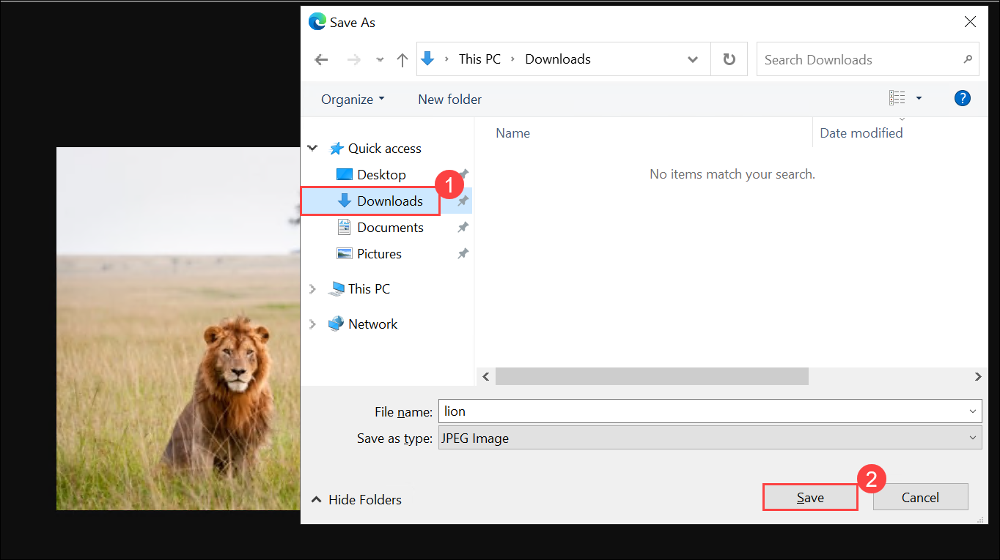  

1. Then return to the Content Understanding project page, select **Browse for files** to upload the image.

    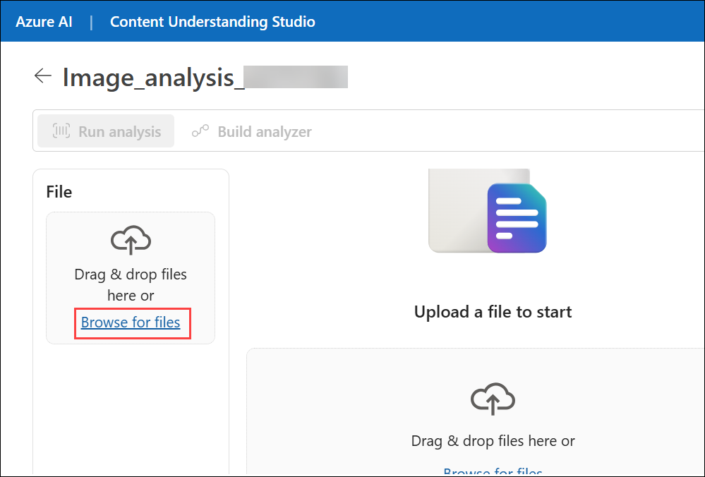

1. When prompted to choose a template, select **Image Analysis (1)** and ensure the schema is set to **Start from Scratch**. Then **Save (2)** the project.

    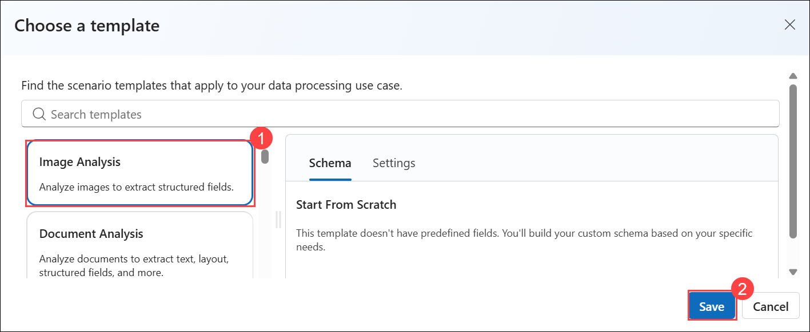 

1. In the **Schema** tab, select **Add new field** to begin defining the fields for the analyzer.

    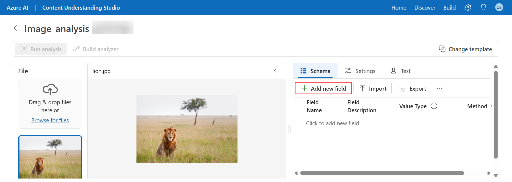 

1. In the **Schema** pane, use the **Add new field** to add the following fields to the schema **(1)**:

    | Field Name | Field Descriptopn | Value type | Method |
    |--|--|--|--|
    | `Description` | `Image description` | String | Generate |
    | `Tags` | `Image tags` | List of Strings | Generate |

1. **Save (2)** the changes to the schema.

    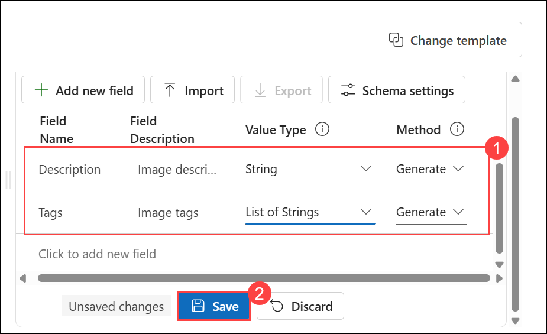 

1. Select **Run analysis** to run the analyzer on the image, and review the fields that are generated; which should include an accurate description and a collection of relevant tags for the image.

    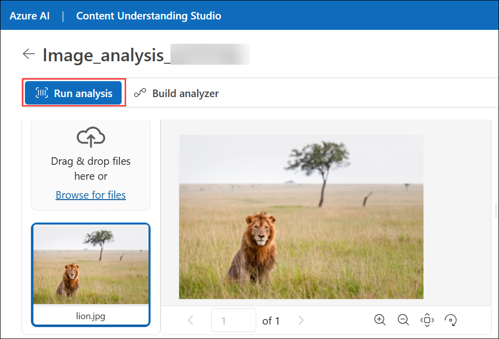 

    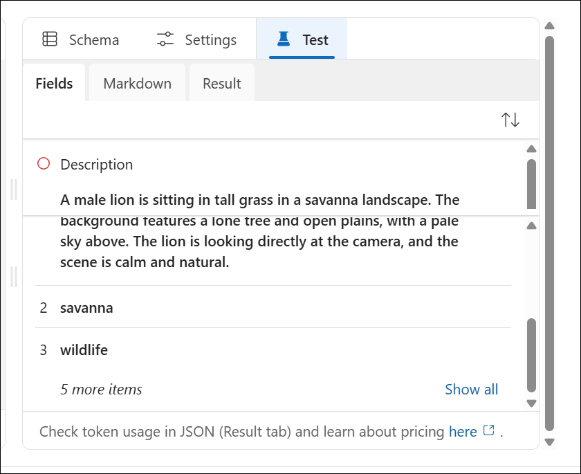 

1. When you're satisfied that the analyzer has returned accurate values for the fields, use the **Build analyzer** button to publish an analyzer.

     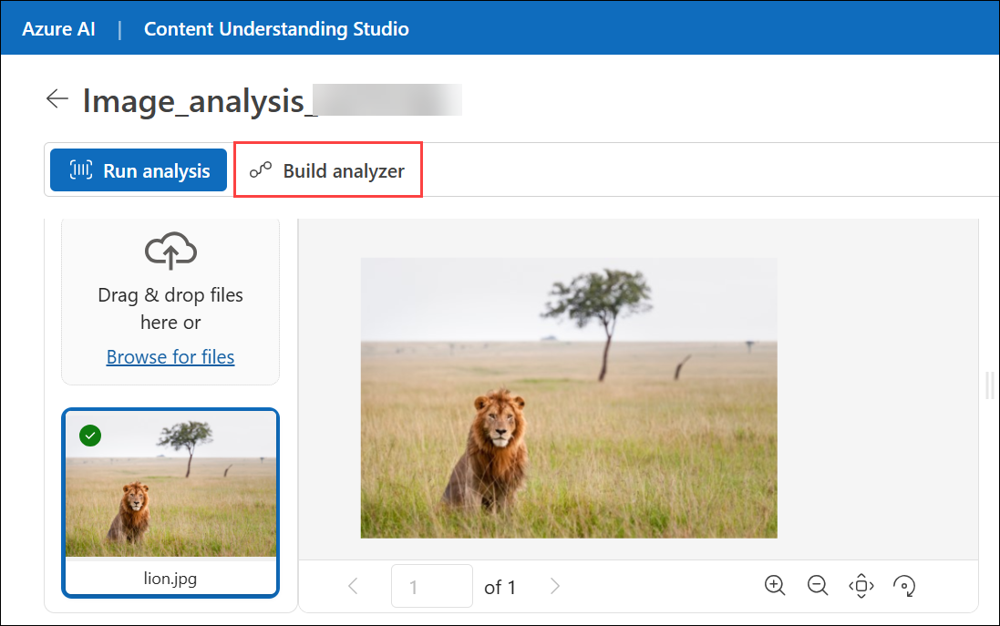 

    >**Tip**: You'll need the name later to identify your analyzer in application code.

1. In the **Build a Content Understanding analyzer** window, enter **wildlife_image_analyzer (1)** as the analyzer name, enter **Image analyzer for generating image descriptions and tags (2)** as the description, and then select **Build (3)**.

    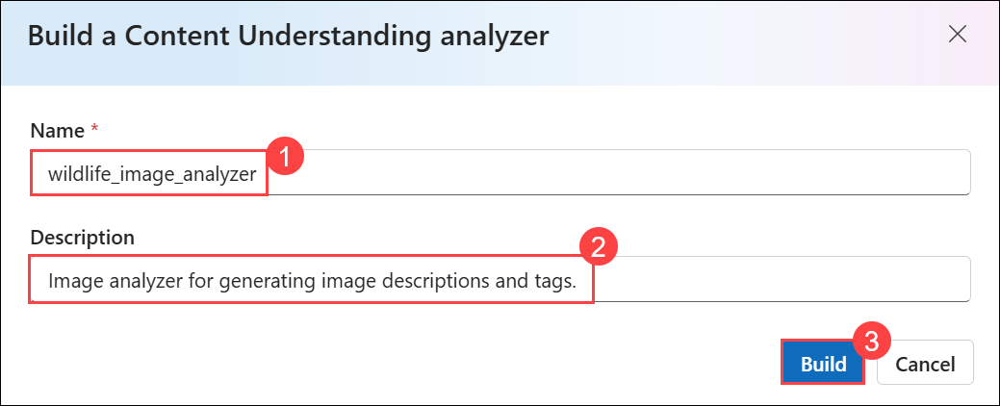 

    > **Note:** Copy and save the **analyzer name** (**wildlife_image_analyzer**), as it will be required in later steps.

1. When the analyzer has been built, select **Jump to analyzer list** to view all built analyzers. 

    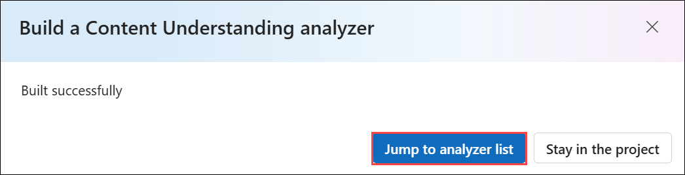 

1. Select your analyzer in the list to open it, and then view the **Code Example** tab to see the code necessary to use your analyzer.

    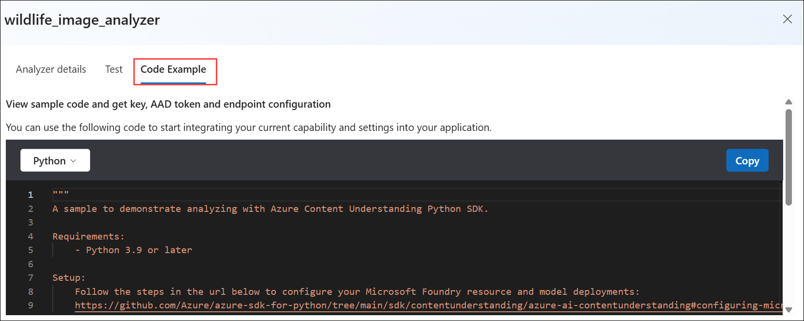 

1. Review the Python code example, noting in the **main** function the **endpoint** for your Content Understanding resource; which should look similar to this:

    ```
   https://{your_foundry_resource}.services.ai.azure.com/
    ```

    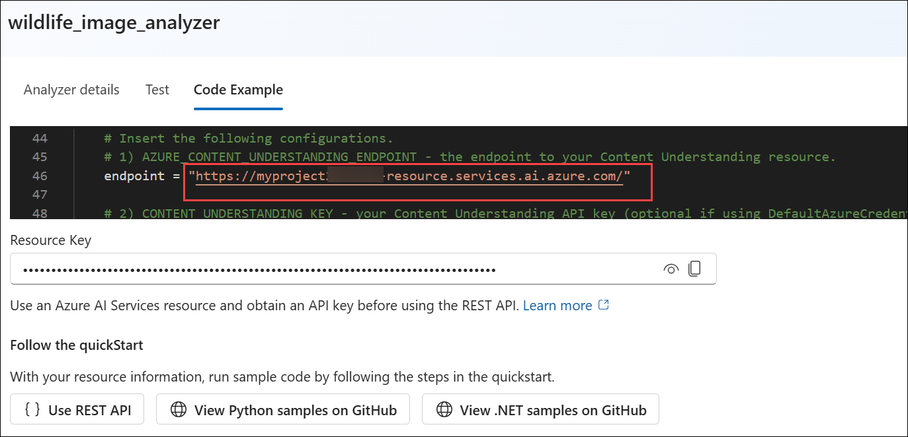 

    > **Note:** Copy and save the **endpoint URL** displayed on the **Code Example** tab, as it will be required in later steps when sending requests to the Content Understanding analyzer.

1. Under the code example, note that your **resource key** is available. You *can* use this in a client application to authenticate a connection to the endpoint; but in this exercise we're going to use Microsoft Entra ID authentication.

    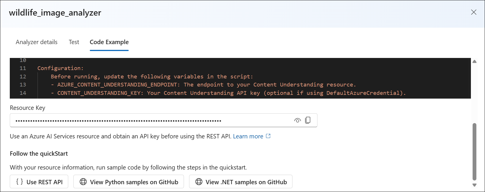 

## Task 4: Create an image analyzer application

In this task, you will configure a Python development environment, integrate your published analyzer, and build an application that analyzes images and displays AI-generated descriptions and tags.

### Task 4.1: Get application files from GitHub

In this task, you will clone the sample GitHub repository, install the required Python tools and extension, and create a virtual environment for developing the image analyzer application.

1. In the Lab VM, open **Visual Studio Code** from the desktop.

    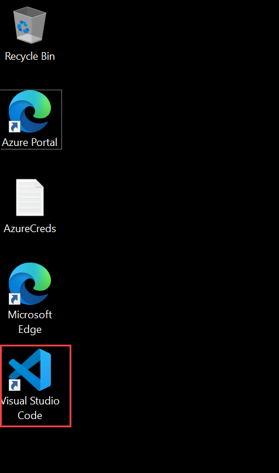

1. Open the Command Palette (Ctrl + Shift + P), or go to **View (1)** > **Command Palette (2)**, then search for and select **Git: Clone (3)**

    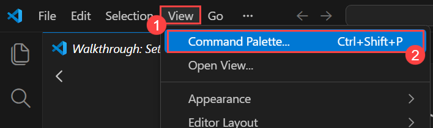

    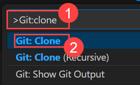

1. Paste the `https://github.com/microsoftlearning/mslearn-ai-vision` repo link and press Enter to clone it to a local folder.

    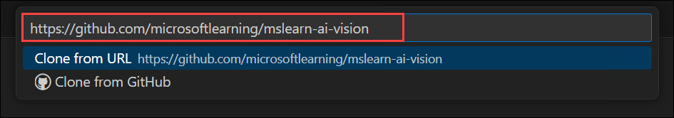

1. On the **Choose a folder to clone** window, select **Download (1)** from the left navigation pane and then select **Select as Repository Destination (2)**.

    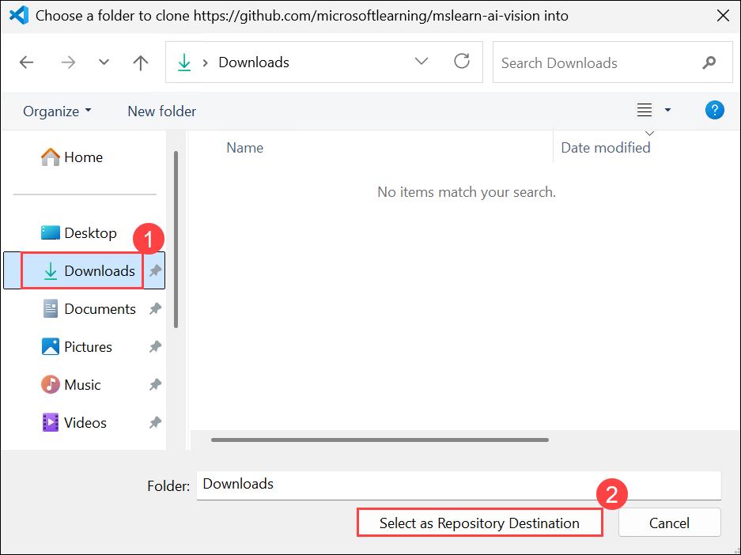

1. On the **Would you like to open the repository?** dialoge, click **Open**.

    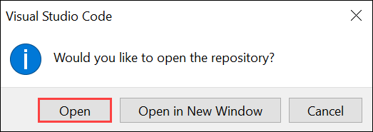

1. You may be prompted to confirm you trust the authors.

    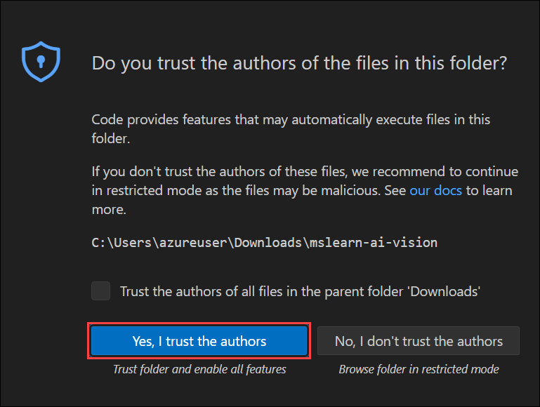

1. In Visual Studio Code, select the **Extensions (1)** icon from the Activity Bar on the left side of the window.

1. In the Extensions view, search for Python if it is not already displayed.

1. Locate the Python extension published by Microsoft.

1. Select **Install (2)** to install the Python extension.

   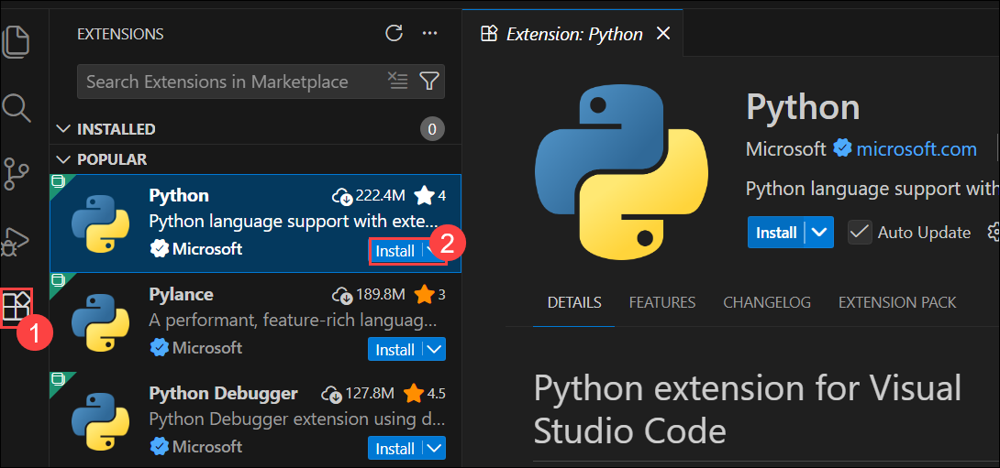

1. Wait for the installation to complete. Once installed, the extension will provide Python language support, IntelliSense, debugging capabilities, and other Python development features in Visual Studio Code.

1. Open the Command Palette by selecting **View > Command Palette** or by pressing **Ctrl+Shift+P**.

1. In the Command Palette, type **Python: Select Interpreter (1)**.

   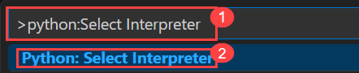
   
1. From the list of matching commands, **select (2)** Python: Select Interpreter.

1. In the Select Interpreter window, select **Create Virtual Environment (3)**.

   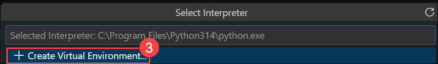
   
1. When prompted to select an environment type, choose **Venv (4)** to create a .venv virtual environment in the current workspace.

   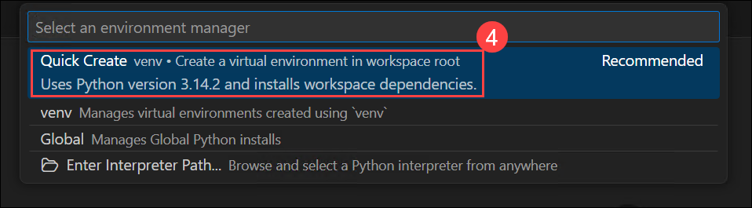

1. In the Select a Python installation window, choose Python 3.14.2 (Global) located at **C:\Program Files\Python314\python.exe (5)** to create the virtual environment.

   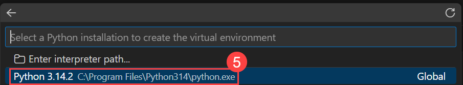

    > **Tip:** If you are prompted to install dependencies, you can install the ones in the *requirements.txt* file in the */labfiles/video-generation/python* folder; but it's OK if you don't - we'll install them later!

    > **Tip**: If you prefer to use the terminal, you can create your **Venv** environment with `python -m venv labenv`, then activate it with `\labenv\Scripts\activate`.

### Task 4.2: Prepare the application configuration

In this task, you will configure the application by updating environment settings with your analyzer details and installing the required Python dependencies.

1. After the repo has been cloned, navigate to the **Labfiles (1) -> content-understanding\python (2)** folder.

    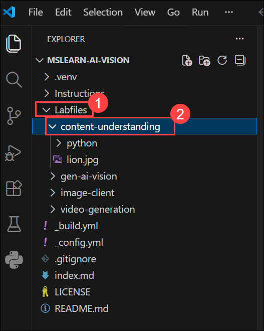 

1. In the VS Code Explorer pane, review the files in the folder:

    - `.env` - A configuration file for application settings.
    - `analyze-image.py` - The Python code file for the image analyzer application.
    - `requirements.txt` - A file listing the package dependencies.
    - `images` - A folder containing images for analysis.

       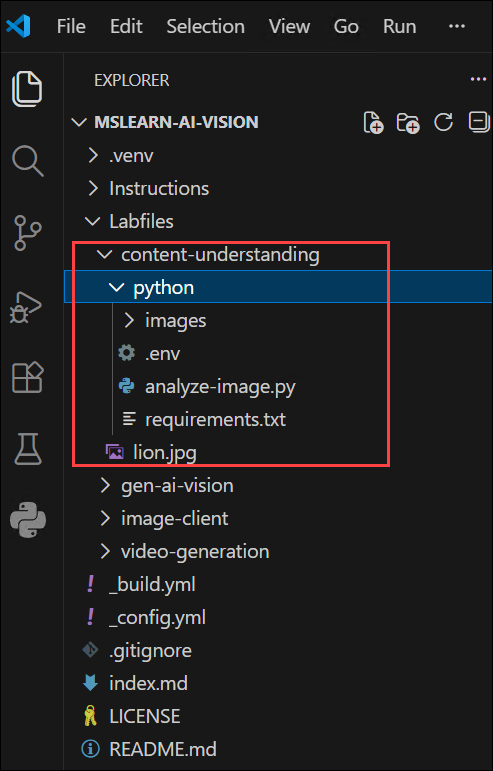 

1. In the **Explorer** pane, in the **python** folder, select the **.env (1)** file to open it.

1. Then update it with the **endpoint** value for your resource endpoint (copied from the code example in Content Understanding Studio) and the name of your analyzer and press **Ctrl+S** to save the file **(2)**.

    > **Important**:Be sure to add the `https://{YOUR-RESOURCE-NAME}.services.ai.azure.com` Foundry resource endpoint, <u>not</u> the project endpoint or Azure OpenAI endpoint!

    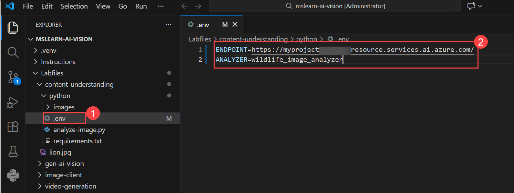 

1. In the **Explorer** pane, right-click the **python (1)** folder containing the application files, and select **Open in integrated terminal (2)** (or open a terminal in the **Terminal** menu and navigate to the */labfiles/content-understanding/python* folder.)

    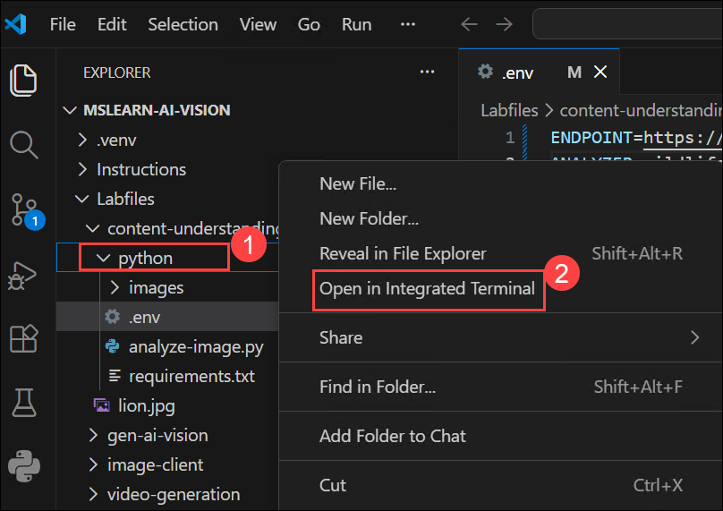 

    > **Note**: Opening the terminal in Visual Studio Code will automatically activate the Python environment. You may need to enable running scripts on your system.

1. Ensure that the terminal is open in the **/labfiles/content-understanding/python*** folder with the prefix **(.venv)** to indicate that the Python environment you created is active.

    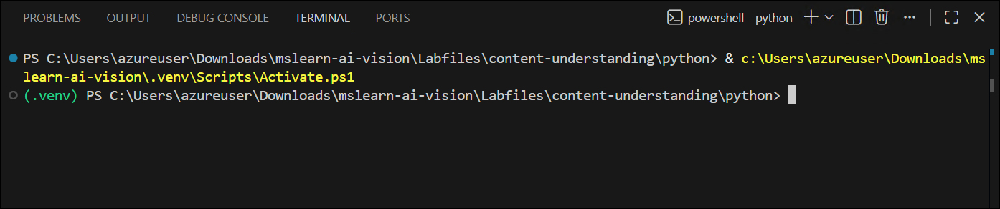 

1. Install the required Python packages by running the following command:

    ```
    pip install -r requirements.txt
    ```

### Task 4.3: Write code to analyze images and generate descriptions

In this task, you will add the required Python code to connect to Azure Content Understanding, submit images for analysis, and process the returned results.

> **Tip**: As you add code, be sure to maintain the correct indentation.

1. In VS Code, open the `analyze-image.py` file.

1. Find the comment **Add references** and add the following code for the necessary imports:

    ```python
   # Add references
   from azure.ai.contentunderstanding import ContentUnderstandingClient
   from azure.ai.contentunderstanding.models import AnalysisInput, AnalysisResult
   from azure.core.exceptions import AzureError
   from azure.identity import DefaultAzureCredential
    ```

    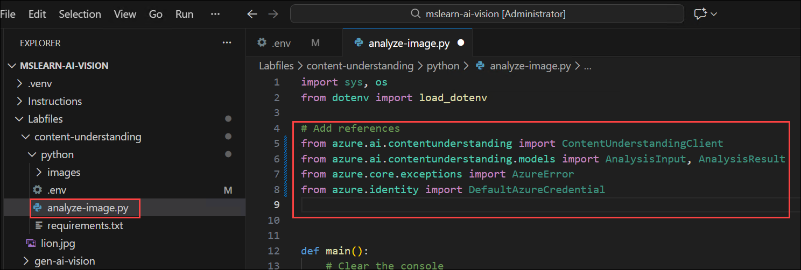 

1. In the **main** function, note that code to get the configuration values from your environment file has been provided.

1. Find the comment **Set up Content Understanding client** and add the following code:

    ```python
   # Set up Content Understanding client
   credential = DefaultAzureCredential()
   client = ContentUnderstandingClient(
        endpoint=endpoint,
        credential=credential,
        api_version=api_version)
    ```

    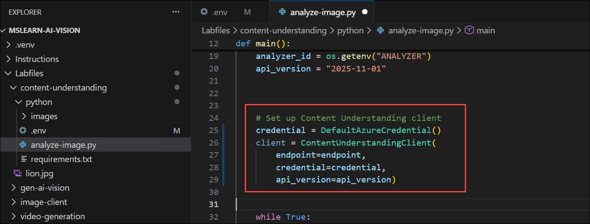 

1. Note that code for the user to input a file number or quit the program has been provided.

1. Find the comment **Analyze the file** and add the following code:

    ```python
   # Analyze the file
   try:
        poller = client.begin_analyze(
            analyzer_id=analyzer_id,
            inputs=[AnalysisInput(data=file_bytes)],
        )
        result: AnalysisResult = poller.result()
   except AzureError as err:
        print(f"[Azure Error]: {err.message}")
        sys.exit(1)
   except Exception as ex:
        print(f"[Unexpected Error]: {ex}")
        sys.exit(1)

   for field in result.contents[0].fields:
        if field == "Description":
            print(f"{field}:\n{result.contents[0].fields[field].value_string}\n")
        elif field == "Tags":
            print(f"{field}:")
            for tag in result.contents[0].fields[field].value_array:
                print("  -", tag.value_string)
    ```

    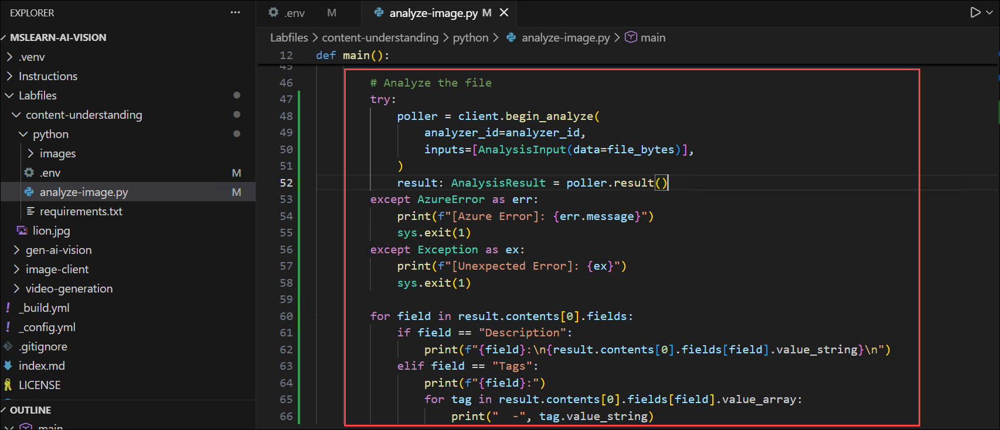 

    This code submits the selected file data to your analyuzer, polls for the results, and then displays the *Description* and *Tags* values that are returned.

1. Save the file (**Ctrl+S**).

### Task 4.4: Test the app

In this task, you will authenticate to Azure, run the application, and verify that image descriptions and tags are generated successfully.

1. In the terminal pane, use the following command to sign into Azure.

    ```powershell
    az login
    ```

    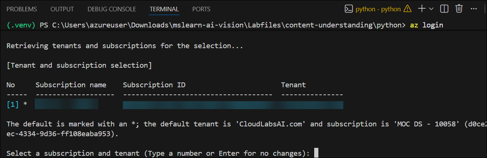 

    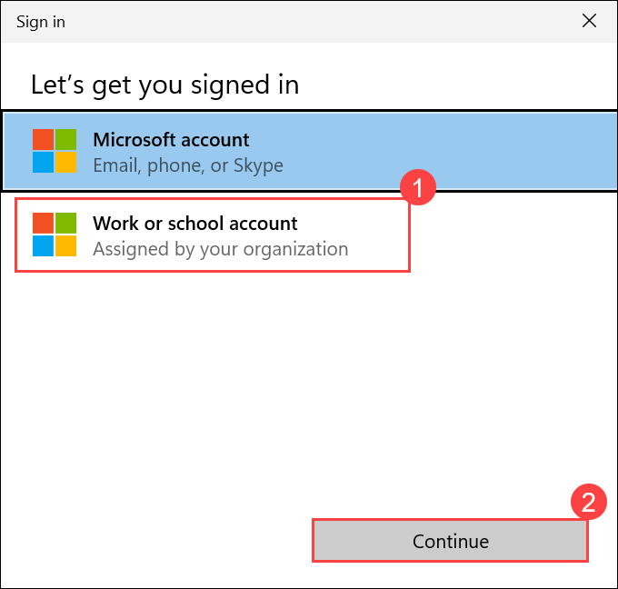

    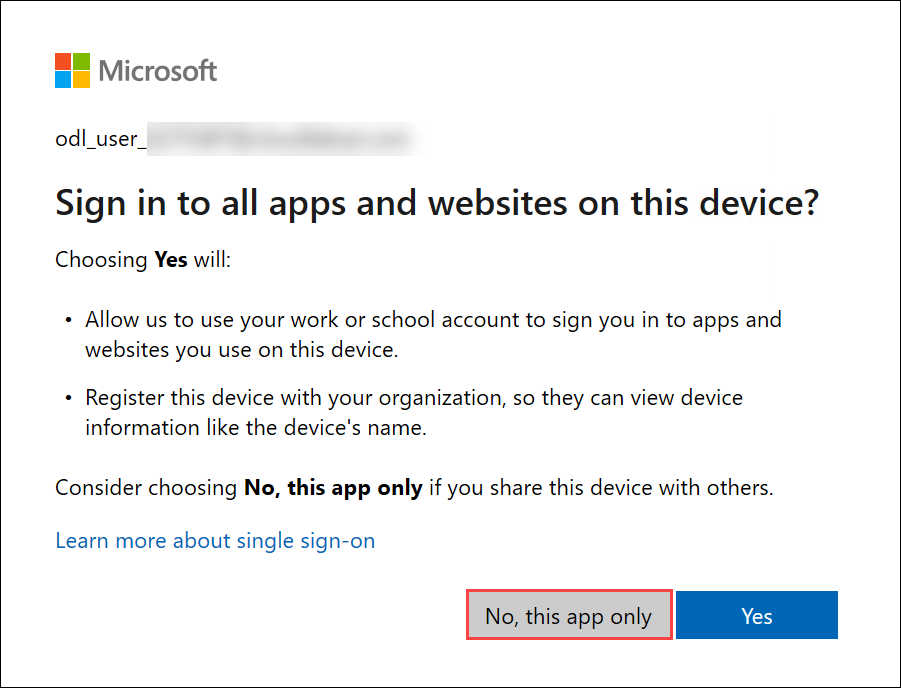

    > **Note**: In most scenarios, just using *az login* will be sufficient. However, if you have subscriptions in multiple tenants, you may need to specify the tenant by using the *--tenant* parameter. See [Sign into Azure interactively using the Azure CLI](https://learn.microsoft.com/cli/azure/authenticate-azure-cli-interactively) for details.

1. When prompted, follow the instructions to sign into Azure. Then complete the sign in process in the command line, viewing (and confirming if necessary) the details of the subscription containing your Foundry resource.

1. After you have signed in, enter the following command to run the application:

    ```
    python analyze-image.py
    ```

1. When prompted, enter a number that corresponds to one of these images:

    |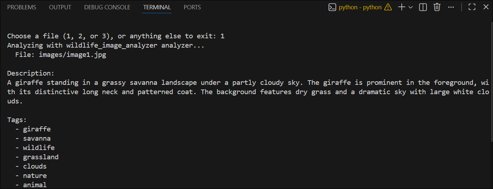  | 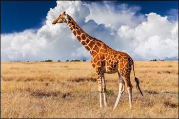  |  
    |--|--|--|
    | 1 | 2 | 3 |

     

1. Observe the output, which should include a description of the selected image and a collection of appropriate tags.

1. When you're finished, enter any value other than 1, 2, or 3 to exit.

## Summary

In this exercise, you created a Foundry resource and deployed the necessary models for content understanding. You explored the pre-built image analyzer in the Content Understanding Studio, and then built a Python application that sends images to the analyzer and retrieves generated descriptions. Great work!

# Congratulations, you’ve successfully completed the hands-on lab!