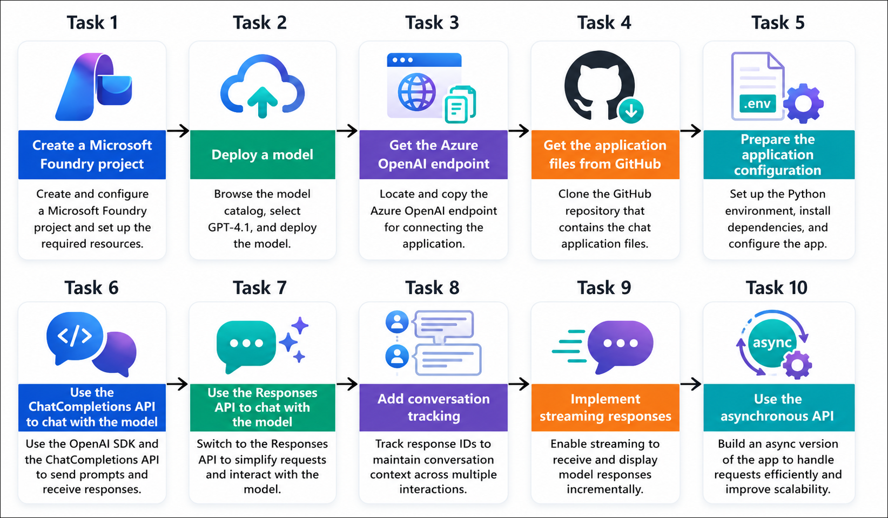

# Getting Started with your AI-103: Azure AI Apps and Agents Developer Associate Workshop

Welcome to your AI-103: Azure AI Apps and Agents Developer Associate workshop! We’re excited to guide you through hands-on learning with Azure AI services using Microsoft Foundry, the Azure portal, and tools like Document Intelligence, Custom Vision, the Language Service, etc., to create, deploy, and test intelligent solutions.

# Lab 03: Create a Generative AI Chat App

### Overall Estimated Timing: 45 Minutes

## Overview

In this hands-on lab, you will build a generative AI chat application by using the OpenAI SDK and Azure OpenAI models deployed in Microsoft Foundry. You will create a Microsoft Foundry project, deploy a generative AI model, and configure your application to connect securely using the Azure OpenAI endpoint. You will then develop a Python-based chat application that communicates with the deployed model by using both the **ChatCompletions** and **Responses** APIs. Finally, you will enhance the application by implementing conversation tracking, streaming responses, and asynchronous processing to create a more responsive, scalable, and context-aware chat experience.

## Objectives

By the end of this lab, you will be able to:

1. **Create and configure a Microsoft Foundry project:** Set up a Foundry project, deploy a generative AI model, and obtain the Azure OpenAI endpoint required for application connectivity.

2. **Develop a Python-based generative AI chat application:** Configure the development environment, install the required dependencies, and build a client application that communicates with a deployed Azure OpenAI model.

3. **Interact with AI models using multiple APIs:** Implement chat functionality by using both the **ChatCompletions API** and the newer **Responses API**, and understand the differences between the two approaches.

4. **Enhance conversational experiences:** Implement conversation tracking to preserve chat context across multiple prompts and enable streaming responses to improve application responsiveness.

5. **Build an asynchronous AI application:** Develop an asynchronous version of the chat application by using the **AsyncOpenAI** client to efficiently handle long-running AI requests and improve application scalability.

## Pre-requisites

* Basic knowledge of the Azure portal and Azure resource management.
* Familiarity with generative AI concepts, including prompts, large language models (LLMs), and conversational AI.
* Basic understanding of Microsoft Foundry and Azure OpenAI models.
* Experience using Visual Studio Code, Python, virtual environments, and command-line tools for application development.

## Architecture

The lab architecture demonstrates how **Microsoft Foundry**, the **Azure OpenAI Service**, and the **OpenAI SDK** work together to build, configure, and enhance a generative AI chat application.

1. **Microsoft Foundry Project:** A Foundry project provides the workspace where Azure AI resources are created and managed, enabling model deployment and application development.

2. **Azure OpenAI Model Deployment:** A **GPT-4.1** model is deployed within the Foundry project, providing the inference endpoint that powers the chat application.

3. **Azure OpenAI Endpoint:** The deployed model is accessed through the Azure OpenAI endpoint using Microsoft Entra ID authentication, enabling secure communication between the application and the model.

4. **Python Chat Application:** A Python application built with the **OpenAI SDK** communicates with the deployed model by using both the **ChatCompletions API** and the **Responses API**, allowing users to interact with the model through a conversational interface.

5. **Enhanced Chat Experience:** The application is progressively enhanced with conversation tracking, streaming responses, and asynchronous processing to provide contextual, responsive, and scalable conversational experiences.

## Architecture Diagram

## Explanation of Components

1. **Microsoft Foundry Project:** The Foundry project serves as the central workspace where Azure AI resources are provisioned, AI models are deployed, and application development resources are managed.

2. **Azure OpenAI Model Deployment:** The deployed **GPT-4.1** model provides the generative AI capabilities used by the application to process prompts and generate natural language responses.

3. **Azure OpenAI Endpoint:** The Azure OpenAI endpoint enables secure communication between the client application and the deployed model by using Microsoft Entra ID authentication and the OpenAI SDK.

4. **Python Chat Application:** The application uses the **OpenAI SDK** to interact with the deployed model through both the **ChatCompletions API** and the **Responses API**, demonstrating multiple approaches for building conversational AI applications.

5. **Conversation Management and Advanced Processing:** Conversation tracking maintains context across multiple interactions, streaming delivers responses incrementally for improved user experience, and asynchronous processing enables efficient handling of long-running AI requests and concurrent operations.

## Accessing Your Lab Environment
 
Once you're ready to dive in, your virtual machine and **Guide** will be right at your fingertips within your web browser.
 

## Virtual Machine & Lab Guide
 
Your virtual machine is your workhorse throughout the workshop. The lab guide is your roadmap to success.

## Lab Guide Zoom In/Zoom Out
 
To adjust the zoom level for the environment page, click the **A↕: 100%** icon located next to the timer in the lab environment.

## Exploring Your Lab Resources
 
To get a better understanding of your lab resources and credentials, navigate to the **Environment** tab.
 

## Utilizing the Split Window Feature
 
For convenience, you can open the lab guide in a separate window by selecting the **Split Window** button from the top right corner.
 

## Managing Your Virtual Machine
 
Feel free to **Start, Restart, or Stop (2)** your virtual machine as needed from the **Resources (1)** tab. Your experience is in your hands!
 

## Lab Progress

You can use the **Progress** tab to track your progress while working on the lab. A score will be provided after successful validation.

## Let's Get Started with Azure Portal
 
1. On your virtual machine, click on the Azure Portal icon as shown below:
 
    

1. In the sign-in window, kindly sign in using the provided Azure credentials

    - **Email/Username:** <inject key="AzureAdUserEmail"></inject>

        

    - **Password:** <inject key="AzureAdUserPassword"></inject>

        

1. If prompted to **Stay signed in?**, you can click **No**.

    

1. If a **Welcome to Microsoft Azure** pop-up window appears, simply click **Maybe later** to skip the tour.

    

## Support Contact
 
The CloudLabs support team is available 24/7, 365 days a year, via email and live chat to ensure seamless assistance at any time. We offer dedicated support channels explicitly tailored for both learners and instructors, ensuring that all your needs are promptly and efficiently addressed.
 
Learner Support Contacts:
 
- Email Support: cloudlabs-support@spektrasystems.com
- Live Chat Support: https://cloudlabs.ai/labs-support

Click on **Next** from the lower right corner to move on to the next page.

   

## Happy Learning !!

