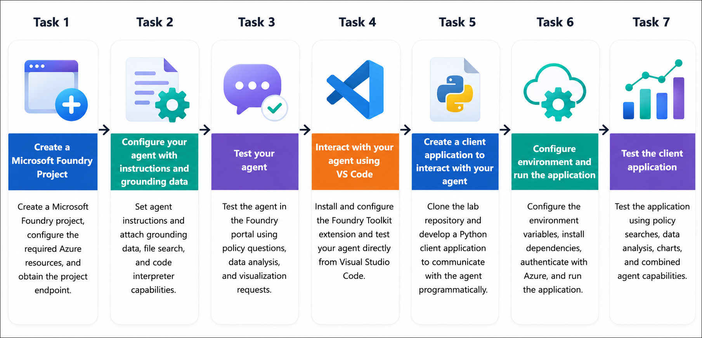

# Getting Started with your AI-103: Azure AI Apps and Agents Developer Associate Workshop

Welcome to your AI-103: Azure AI Apps and Agents Developer Associate workshop! We’re excited to guide you through hands-on learning with Azure AI services using Microsoft Foundry, the Azure portal, and tools like Document Intelligence, Custom Vision, the Language Service, etc., to create, deploy, and test intelligent solutions.

# Lab 06: Build AI Agents with Portal and VS Code

### Overall Estimated Timing: 45 Minutes

## Overview

In this hands-on lab, you will build and interact with an AI agent using Microsoft Foundry and the Foundry Toolkit for Visual Studio Code. You will create a Foundry project, configure an AI agent with custom instructions, grounding data, file search, and code interpreter capabilities, and validate its responses using the Foundry playground. You will then connect to the same agent from Visual Studio Code, develop a Python client application to communicate with the agent programmatically, configure the application environment, and test the agent's ability to answer policy questions, analyze datasets, and generate visualizations.

## Objectives

By the end of this lab, you will be able to:

1. **Create and configure a Microsoft Foundry project and AI agent:** Set up a Foundry project, create an AI agent, and configure it with custom instructions to support IT assistance scenarios.

2. **Enhance the agent with tools and grounding data:** Enable file search and code interpreter capabilities, attach reference documents and datasets, and configure the agent to provide context-aware responses and perform data analysis.

3. **Test the agent in Microsoft Foundry and Visual Studio Code:** Validate the agent's behavior using the Foundry playground and interact with the same agent through the Foundry Toolkit extension in Visual Studio Code.

4. **Develop a Python client application:** Create and configure a Python application that connects to the AI agent, manages conversations, processes responses, and handles generated files and visualizations.

5. **Analyze data and generate insights using the AI agent:** Use the agent to answer policy-based questions, analyze structured datasets, perform statistical analysis, and generate charts by combining file search and code interpreter capabilities.

## Pre-requisites

* Basic knowledge of the Azure portal and Azure resource management.
* Familiarity with generative AI concepts, including AI agents, prompts, and grounding data.
* Basic understanding of Microsoft Foundry and Azure AI services.
* Experience using Visual Studio Code, Python, and command-line tools for application development.

## Architecture

The lab architecture demonstrates how **Microsoft Foundry** and the **Foundry Toolkit for Visual Studio Code** work together to build, configure, test, and interact with AI agents across both the portal and a development environment:

1. **Microsoft Foundry Project:** A Foundry project provides the workspace where AI agents are created, configured, and managed using Azure-hosted AI resources.

2. **AI Agent Configuration:** An AI agent is configured with custom instructions, grounding data, and built-in tools such as **File Search** and **Code Interpreter**, enabling it to answer domain-specific questions, analyze data, and generate visualizations.

3. **Grounding Data and Tools:** Reference documents are attached to the agent using **File Search** to provide contextual knowledge, while structured datasets are made available to the **Code Interpreter** for performing data analysis, statistical calculations, and chart generation.

4. **Foundry Portal and Visual Studio Code:** The agent can be tested interactively in the Microsoft Foundry portal or accessed directly from Visual Studio Code through the **Foundry Toolkit**, allowing developers to configure, validate, and refine the agent without leaving their development environment.

5. **Python Client Application:** A Python application connects to the deployed AI agent using the **Azure AI Projects SDK**, enabling programmatic conversations, automated processing of responses, and retrieval of generated files and visualizations for integration into custom applications.

## Architecture Diagram

## Explanation of Components

1. **Microsoft Foundry Project:** The Foundry project serves as the central workspace where AI agents are created, configured, tested, and managed. It provides the Azure-hosted resources and development environment required to build intelligent agent-based solutions.

2. **AI Agent:** The AI agent is configured with custom instructions that define its role, behavior, and response style. It acts as an intelligent assistant capable of answering questions, following organizational guidelines, and leveraging connected tools to complete user requests.

3. **Grounding Data and Agent Tools:** The agent is enhanced with **File Search** and **Code Interpreter** capabilities. File Search enables the agent to retrieve accurate information from uploaded reference documents, while Code Interpreter allows it to analyze structured datasets, perform calculations, and generate charts and visualizations.

4. **Microsoft Foundry Portal and Foundry Toolkit for Visual Studio Code:** The Foundry portal provides an interactive environment for creating, configuring, and testing AI agents, while the Foundry Toolkit extension enables developers to access and interact with the same agents directly from Visual Studio Code, streamlining the development workflow.

5. **Python Client Application:** The Python application connects to the AI agent using the **Azure AI Projects SDK**, enabling programmatic conversations, automated request processing, and retrieval of generated files and visualizations. This demonstrates how AI agents can be integrated into custom applications and business workflows.

## Accessing Your Lab Environment
 
Once you're ready to dive in, your virtual machine and **Guide** will be right at your fingertips within your web browser.
 

## Virtual Machine & Lab Guide
 
Your virtual machine is your workhorse throughout the workshop. The lab guide is your roadmap to success.

## Lab Guide Zoom In/Zoom Out
 
To adjust the zoom level for the environment page, click the **A↕: 100%** icon located next to the timer in the lab environment.

## Exploring Your Lab Resources
 
To get a better understanding of your lab resources and credentials, navigate to the **Environment** tab.
 

## Utilizing the Split Window Feature
 
For convenience, you can open the lab guide in a separate window by selecting the **Split Window** button from the top right corner.
 

## Managing Your Virtual Machine
 
Feel free to **Start, Restart, or Stop (2)** your virtual machine as needed from the **Resources (1)** tab. Your experience is in your hands!
 

## Lab Progress

You can use the **Progress** tab to track your progress while working on the lab. A score will be provided after successful validation.

## Let's Get Started with Azure Portal
 
1. On your virtual machine, click on the Azure Portal icon as shown below:
 
    

1. In the sign-in window, kindly sign in using the provided Azure credentials

    - **Email/Username:** <inject key="AzureAdUserEmail"></inject>

        

    - **Password:** <inject key="AzureAdUserPassword"></inject>

        

1. If prompted to **Stay signed in?**, you can click **No**.

    

1. If a **Welcome to Microsoft Azure** pop-up window appears, simply click **Maybe later** to skip the tour.

    

## Support Contact
 
The CloudLabs support team is available 24/7, 365 days a year, via email and live chat to ensure seamless assistance at any time. We offer dedicated support channels explicitly tailored for both learners and instructors, ensuring that all your needs are promptly and efficiently addressed.
 
Learner Support Contacts:
 
- Email Support: cloudlabs-support@spektrasystems.com
- Live Chat Support: https://cloudlabs.ai/labs-support

Click on **Next** from the lower right corner to move on to the next page.

   

## Happy Learning !!

