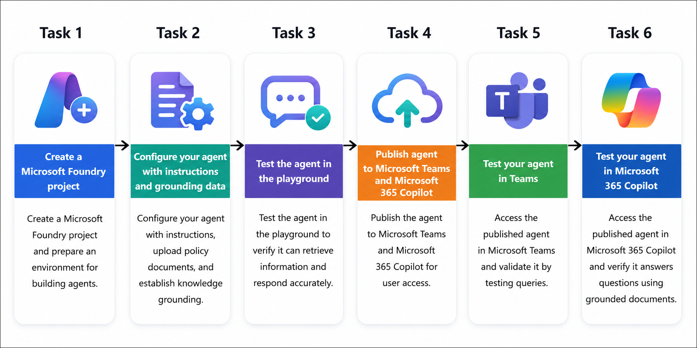
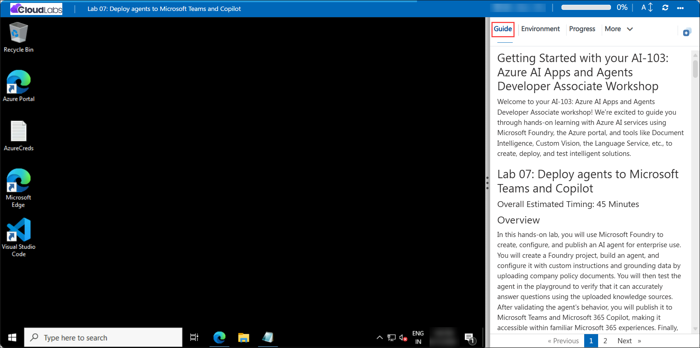

# Getting Started with your AI-103: Azure AI Apps and Agents Developer Associate Workshop

Welcome to your AI-103: Azure AI Apps and Agents Developer Associate workshop! We’re excited to guide you through hands-on learning with Azure AI services using Microsoft Foundry, the Azure portal, and tools like Document Intelligence, Custom Vision, the Language Service, etc., to create, deploy, and test intelligent solutions.

# Lab 07: Deploy agents to Microsoft Teams and Copilot

### Overall Estimated Timing: 45 Minutes

## Overview

In this hands-on lab, you will use Microsoft Foundry to create, configure, and publish an AI agent for enterprise use. You will create a Foundry project, build an agent, and configure it with custom instructions and grounding data by uploading company policy documents. You will then test the agent in the playground to verify that it can accurately answer questions using the uploaded knowledge sources. After validating the agent's behavior, you will publish it to Microsoft Teams and Microsoft 365 Copilot, making it accessible within familiar Microsoft 365 experiences. Finally, you will test the published agent in both Teams and Microsoft 365 Copilot to confirm that it can successfully retrieve and provide information grounded in the enterprise documents.

## Objectives

By the end of this lab, you will be able to:

1. **Create and configure a Microsoft Foundry project:** Set up a Foundry project and the required Azure resources to support the creation and publishing of AI agents.

2. **Build and ground an AI agent with enterprise knowledge:** Configure an agent with custom instructions and upload policy documents to provide knowledge grounding for accurate, document-based responses.

3. **Validate agent behavior in the Foundry playground:** Test the agent using natural language queries to verify that it can retrieve and respond with information from the uploaded knowledge sources.

4. **Publish an agent to Microsoft Teams and Microsoft 365 Copilot:** Configure publishing settings and deploy the agent so it can be accessed through Microsoft Teams and Microsoft 365 Copilot.

5. **Test and validate the agent in Microsoft Teams:** Interact with the published agent in Teams and confirm that it can answer user questions using grounded enterprise knowledge.

6. **Test and validate the agent in Microsoft 365 Copilot:** Access the published agent in Microsoft 365 Copilot and verify that it can successfully respond to queries using information from the uploaded policy documents.

## Pre-requisites

* Basic knowledge of Azure subscriptions, resource groups, and Azure resource management.
* Familiarity with Microsoft Foundry and the process of creating and managing AI agents.
* Understanding of generative AI concepts, including prompts, instructions, and knowledge grounding.
* Access to a Microsoft 365 account with Microsoft Teams enabled.
* A Microsoft 365 Copilot license (required only for the Microsoft 365 Copilot deployment and testing tasks).
* Experience navigating web-based portals such as Microsoft Foundry, Microsoft Teams, and Microsoft 365 Copilot.

## Architecture

The lab architecture demonstrates how Microsoft Foundry enables the creation, grounding, publishing, and consumption of AI agents across Microsoft 365 experiences:

1. **Microsoft Foundry Project:** A Foundry project provides the workspace where AI agents are created, configured, tested, and published using Azure-hosted resources.

2. **AI Agent Configuration:** The agent is configured with custom instructions that define its behavior, response style, and intended role as an enterprise knowledge assistant.

3. **Knowledge Grounding:** Enterprise policy documents are uploaded to the agent, enabling it to retrieve and use information from trusted sources when answering user questions.

4. **Agent Playground:** The playground provides an interactive environment for testing and validating the agent's responses before deployment, ensuring that knowledge grounding and instructions are working as expected.

5. **Publishing and Distribution:** The configured agent is published from Microsoft Foundry to Microsoft Teams and Microsoft 365 Copilot, making it accessible through familiar collaboration and productivity applications.

6. **Microsoft Teams and Microsoft 365 Copilot:** End users interact with the published agent directly within Teams and Copilot, where it can answer questions and provide information grounded in the uploaded enterprise documents.

## Architecture Diagram

## Explanation of Components

1. **Microsoft Foundry Project:** The project serves as the central workspace where AI agents are created, configured, tested, and published. It provides the Azure-backed resources and environment required for agent development and deployment.

2. **AI Agent:** The AI agent acts as an enterprise knowledge assistant and is configured with custom instructions that define its role, behavior, and response style when interacting with users.

3. **Knowledge Grounding Documents:** Policy and procedure documents are uploaded to the agent to provide trusted knowledge sources. These documents enable the agent to retrieve relevant information and generate accurate, context-aware responses.

4. **Agent Playground:** The playground provides an interactive testing environment where users can validate agent behavior, verify knowledge grounding, and ensure that responses align with the uploaded documents before publishing.

5. **Publishing Framework:** The publishing framework packages the agent and prepares it for deployment to Microsoft Teams and Microsoft 365 Copilot, enabling secure distribution through Microsoft 365 services.

6. **Microsoft Teams Integration:** Teams provides a collaboration environment where users can interact with the published agent through chat, allowing them to access enterprise knowledge without leaving their daily workflow.

7. **Microsoft 365 Copilot Integration:** Microsoft 365 Copilot enables users to access the published agent as a Copilot extension, allowing the agent's specialized knowledge to be used alongside Copilot's broader productivity capabilities.

## Accessing Your Lab Environment
 
Once you're ready to dive in, your virtual machine and **Guide** will be right at your fingertips within your web browser.
 

## Virtual Machine & Lab Guide
 
Your virtual machine is your workhorse throughout the workshop. The lab guide is your roadmap to success.

## Lab Guide Zoom In/Zoom Out
 
To adjust the zoom level for the environment page, click the **A↕: 100%** icon located next to the timer in the lab environment.

## Exploring Your Lab Resources
 
To get a better understanding of your lab resources and credentials, navigate to the **Environment** tab.
 

## Utilizing the Split Window Feature
 
For convenience, you can open the lab guide in a separate window by selecting the **Split Window** button from the top right corner.
 

## Managing Your Virtual Machine
 
Feel free to **Start, Restart, or Stop (2)** your virtual machine as needed from the **Resources (1)** tab. Your experience is in your hands!
 

## Lab Progress

You can use the **Progress** tab to track your progress while working on the lab. A score will be provided after successful validation.

## Let's Get Started with Azure Portal
 
1. On your virtual machine, click on the Azure Portal icon as shown below:
 
    

1. In the sign-in window, kindly sign in using the provided Azure credentials

    - **Email/Username:** <inject key="AzureAdUserEmail"></inject>

        

    - **Password:** <inject key="AzureAdUserPassword"></inject>

        

1. If prompted to **Stay signed in?**, you can click **No**.

    

1. If a **Welcome to Microsoft Azure** pop-up window appears, simply click **Maybe later** to skip the tour.

    

## Support Contact
 
The CloudLabs support team is available 24/7, 365 days a year, via email and live chat to ensure seamless assistance at any time. We offer dedicated support channels explicitly tailored for both learners and instructors, ensuring that all your needs are promptly and efficiently addressed.
 
Learner Support Contacts:
 
- Email Support: cloudlabs-support@spektrasystems.com
- Live Chat Support: https://cloudlabs.ai/labs-support

Click on **Next** from the lower right corner to move on to the next page.

   

## Happy Learning !!

