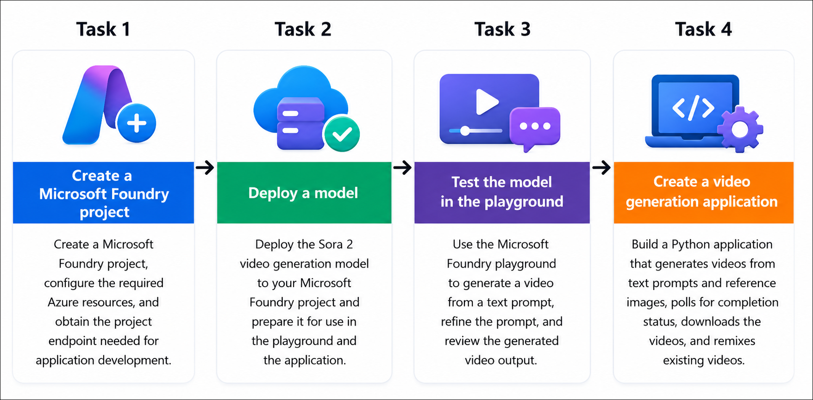

# Getting Started with your AI-103: Azure AI Apps and Agents Developer Associate Workshop

Welcome to your AI-103: Azure AI Apps and Agents Developer Associate workshop! We’re excited to guide you through hands-on learning with Azure AI services using Microsoft Foundry, the Azure portal, and tools like Document Intelligence, Custom Vision, the Language Service, etc., to create, deploy, and test intelligent solutions.

# Lab 08: Generate video with Sora in Microsoft Foundry

### Overall Estimated Timing: 60 Minutes

## Overview

In this hands-on lab, you will use Microsoft Foundry to deploy and explore the **Sora 2** video generation model. You will create a Foundry project, deploy the model, and use the Foundry playground to generate and refine videos from natural language prompts. You will then build a Python application that interacts with the Azure OpenAI video generation API to generate videos from text prompts and reference images, monitor the status of asynchronous video generation jobs, download completed videos, and remix existing videos with updated prompts. Finally, you will authenticate with Azure and run the application to validate the complete video generation workflow.

## Objectives

By the end of this lab, you will be able to:

1. **Create and configure a Microsoft Foundry project:** Set up a Microsoft Foundry project and the required Azure resources for deploying and using video generation models.

2. **Deploy and test the Sora 2 model:** Deploy the Sora 2 video generation model and use the Foundry playground to generate and refine videos from text prompts.

3. **Configure a Python development environment:** Clone the sample application, create a Python virtual environment, configure the application settings, and install the required dependencies.

4. **Develop a video generation application:** Implement a Python application that authenticates with Azure and uses the Azure OpenAI video generation API to generate videos from text prompts and reference images.

5. **Manage asynchronous video generation workflows:** Poll video generation jobs until completion, download generated videos, and remix existing videos by providing updated prompts.

6. **Authenticate and run the application:** Sign in to Azure, execute the application, and verify that videos are successfully generated, remixed, and downloaded.

## Pre-requisites

* Basic knowledge of Azure subscriptions, resource groups, and Azure resource management.
* Familiarity with Microsoft Foundry and Azure AI services.
* Basic knowledge of Python and creating virtual environments.
* Familiarity with using Visual Studio Code for Python development.
* Understanding of generative AI concepts, including prompts and multimodal AI models.
* Git installed and configured.
* Azure CLI installed.
* Visual Studio Code installed with the Python extension.
* An Azure subscription with access to the **Sora 2** video generation model.

## Architecture

The lab architecture demonstrates how Microsoft Foundry and the Azure OpenAI video generation API work together to create, process, and manage AI-generated videos:

1. **Microsoft Foundry Project:** A Microsoft Foundry project provides the workspace where Azure AI resources are created and managed, and where the Sora 2 model is deployed for video generation.

2. **Sora 2 Model Deployment:** The Sora 2 video generation model is deployed within the Foundry project and made available for both interactive testing in the playground and programmatic access through the Azure OpenAI API.

3. **Foundry Playground:** The playground provides an interactive environment for generating videos from text prompts, refining prompts, and reviewing generated content before integrating the model into an application.

4. **Python Video Generation Application:** A Python application authenticates with Azure using Microsoft Entra ID and interacts with the Azure OpenAI video generation API to submit video generation requests, including text prompts and reference images.

5. **Asynchronous Video Generation Workflow:** Video generation requests are processed asynchronously. The application polls the API to monitor job status until video generation is complete, ensuring reliable handling of long-running operations.

6. **Video Download and Remix:** After generation is complete, the application downloads the generated videos and demonstrates how existing videos can be remixed by submitting updated prompts to create new variations.

## Architecture Diagram

## Explanation of Components

1. **Microsoft Foundry Project:** The project serves as the central workspace where Azure AI resources are created and managed. It provides the environment for deploying the Sora 2 model and accessing the Azure OpenAI endpoints required by the application.

2. **Sora 2 Video Generation Model:** The Sora 2 model generates high-quality videos from natural language prompts and reference images. It supports configurable video duration, resolution, and editing capabilities such as video remixing.

3. **Foundry Playground:** The playground provides an interactive environment for testing video generation requests, refining prompts, and previewing generated videos before integrating the model into an application.

4. **Python Video Generation Application:** The Python application authenticates with Azure using Microsoft Entra ID and communicates with the Azure OpenAI video generation API to submit video generation requests, monitor processing status, download completed videos, and remix existing videos.

5. **Azure OpenAI Video Generation API:** The Azure OpenAI API exposes asynchronous operations for creating, retrieving, remixing, and downloading videos. It enables applications to interact programmatically with deployed video generation models.

6. **Reference Images:** Reference images can be supplied as input to guide the video generation process, enabling the model to create videos that preserve the visual characteristics of the provided image while applying the requested motion or scene changes.

7. **Generated Video Output:** The completed videos are downloaded and saved locally, allowing users to review the generated content, compare original and remixed versions, and use the outputs in downstream applications or workflows.

## Accessing Your Lab Environment
 
Once you're ready to dive in, your virtual machine and **Guide** will be right at your fingertips within your web browser.
 

## Virtual Machine & Lab Guide
 
Your virtual machine is your workhorse throughout the workshop. The lab guide is your roadmap to success.

## Lab Guide Zoom In/Zoom Out
 
To adjust the zoom level for the environment page, click the **A↕: 100%** icon located next to the timer in the lab environment.

## Exploring Your Lab Resources
 
To get a better understanding of your lab resources and credentials, navigate to the **Environment** tab.
 

## Utilizing the Split Window Feature
 
For convenience, you can open the lab guide in a separate window by selecting the **Split Window** button from the top right corner.
 

## Managing Your Virtual Machine
 
Feel free to **Start, Restart, or Stop (2)** your virtual machine as needed from the **Resources (1)** tab. Your experience is in your hands!
 

## Lab Progress

You can use the **Progress** tab to track your progress while working on the lab. A score will be provided after successful validation.

## Let's Get Started with Azure Portal
 
1. On your virtual machine, click on the Azure Portal icon as shown below:
 
    

1. In the sign-in window, kindly sign in using the provided Azure credentials

    - **Email/Username:** <inject key="AzureAdUserEmail"></inject>

        

    - **Password:** <inject key="AzureAdUserPassword"></inject>

        

1. If prompted to **Stay signed in?**, you can click **No**.

    

1. If a **Welcome to Microsoft Azure** pop-up window appears, simply click **Maybe later** to skip the tour.

    

## Support Contact
 
The CloudLabs support team is available 24/7, 365 days a year, via email and live chat to ensure seamless assistance at any time. We offer dedicated support channels explicitly tailored for both learners and instructors, ensuring that all your needs are promptly and efficiently addressed.
 
Learner Support Contacts:
 
- Email Support: cloudlabs-support@spektrasystems.com
- Live Chat Support: https://cloudlabs.ai/labs-support

Click on **Next** from the lower right corner to move on to the next page.

   

## Happy Learning !!

