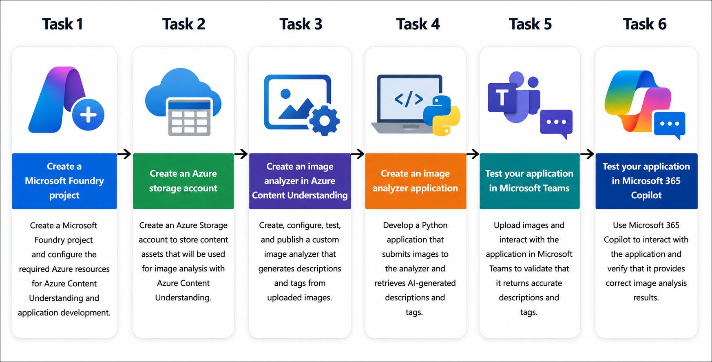
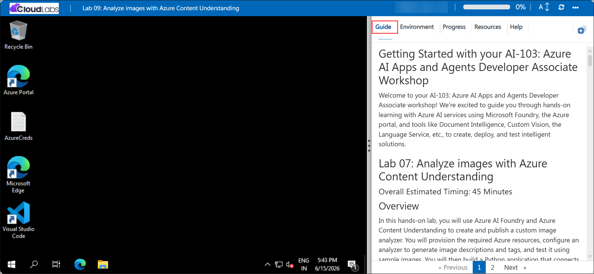
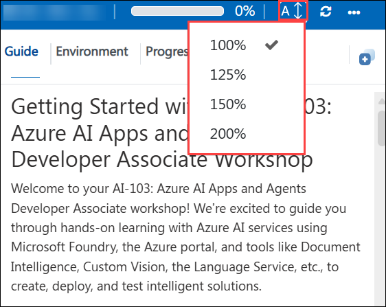
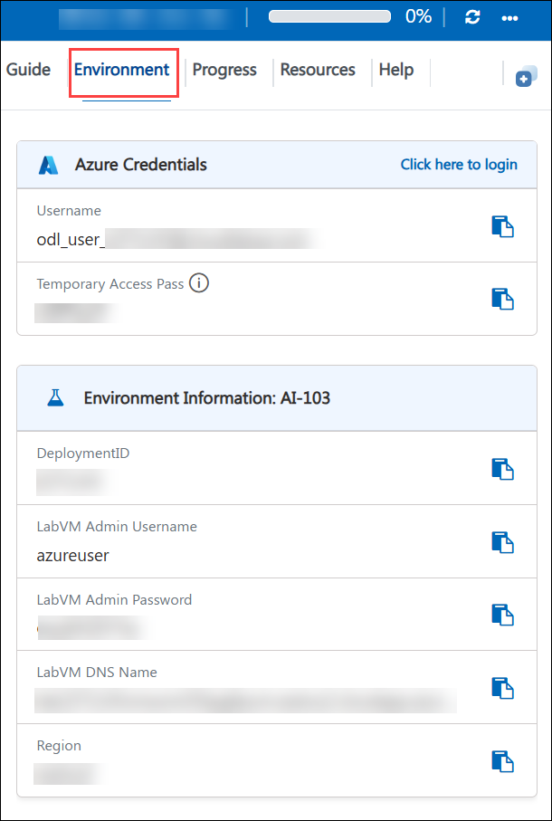
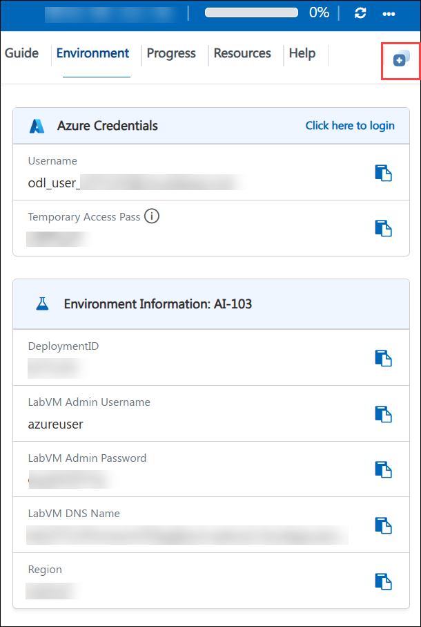

# Getting Started with your AI-103: Azure AI Apps and Agents Developer Associate Workshop

Welcome to your AI-103: Azure AI Apps and Agents Developer Associate workshop! We’re excited to guide you through hands-on learning with Azure AI services using Microsoft Foundry, the Azure portal, and tools like Document Intelligence, Custom Vision, the Language Service, etc., to create, deploy, and test intelligent solutions.

# Lab 09: Analyze images with Azure Content Understanding

### Overall Estimated Timing: 45 Minutes

## Overview

In this hands-on lab, you will use Azure AI Foundry and Azure Content Understanding to create and publish a custom image analyzer. You will provision the required Azure resources, configure an analyzer to generate image descriptions and tags, and test it using sample images. You will then build a Python application that connects to the published analyzer, submits images for processing, and displays AI-generated insights. By the end of the lab, you will have a complete solution for understanding and extracting information from images using Azure Content Understanding.

## Objectives

By the end of this lab, you will be able to:

1. **Create and configure Azure AI resources:** Provision an Azure AI Foundry project and the required Azure resources for Content Understanding.

2. **Create an Azure Storage account:** Configure storage to host and manage image content used for analysis.

3. **Build and publish an image analyzer:** Create, test, and publish a custom Azure Content Understanding analyzer that generates descriptions and tags from images.

4. **Develop an image analysis application:** Configure a Python development environment and integrate it with the published analyzer.

5. **Analyze images using Azure Content Understanding:** Submit images to the analyzer and retrieve AI-generated descriptions and tags through a Python application.

## Pre-requisites

- Familiarity with Azure AI Foundry and Azure AI services.
- Basic understanding of AI concepts such as image analysis and content extraction.
- Basic knowledge of Python programming

## Architecture

The lab architecture demonstrates how Azure Content Understanding processes images and provides AI-generated insights through a custom application:

1. **Azure AI Foundry Project:** Provides the workspace and resources required to create and manage Azure Content Understanding analyzers.

2. **Azure Storage Account:** Stores image content used for analysis and testing.

3. **Azure Content Understanding Analyzer:** Processes images and generates structured outputs such as descriptions and tags.

4. **Published Analyzer Endpoint:** Exposes the analyzer through a secure endpoint that applications can access.

5. **Python Application:** Sends image files to the analyzer endpoint and retrieves analysis results.

6. **Analysis Results:** Displays AI-generated descriptions and tags that help users understand image content.

## Architecture Diagram

## Explanation of Components

1. **Azure AI Foundry Project:** Serves as the central workspace for creating, managing, testing, and publishing Content Understanding analyzers.

2. **Azure Storage Account:** Provides storage for image assets used during analyzer testing and application integration.

3. **Azure Content Understanding Analyzer:** Uses AI models to identify image content and generate meaningful descriptions and tags.

4. **Published Analyzer Endpoint:** Allows external applications to securely submit images for analysis.

5. **Python Application:** Acts as the client application that interacts with the analyzer and processes returned results.

6. **Image Analysis Output:** Provides structured insights including descriptions and tags generated from analyzed images.

## Accessing Your Lab Environment
 
Once you're ready to dive in, your virtual machine and **Guide** will be right at your fingertips within your web browser.
 

## Virtual Machine & Lab Guide
 
Your virtual machine is your workhorse throughout the workshop. The lab guide is your roadmap to success.

## Lab Guide Zoom In/Zoom Out
 
To adjust the zoom level for the environment page, click the **A↕: 100%** icon located next to the timer in the lab environment.

## Exploring Your Lab Resources
 
To get a better understanding of your lab resources and credentials, navigate to the **Environment** tab.
 

## Utilizing the Split Window Feature
 
For convenience, you can open the lab guide in a separate window by selecting the **Split Window** button from the top right corner.
 

## Managing Your Virtual Machine
 
Feel free to **Start, Restart, or Stop (2)** your virtual machine as needed from the **Resources (1)** tab. Your experience is in your hands!
 

## Lab Progress

You can use the **Progress** tab to track your progress while working on the lab. A score will be provided after successful validation.

## Let's Get Started with Azure Portal
 
1. On your virtual machine, click on the Azure Portal icon as shown below:
 
    

1. In the sign-in window, kindly sign in using the provided Azure credentials

    - **Email/Username:** <inject key="AzureAdUserEmail"></inject>

        

    - **Password:** <inject key="AzureAdUserPassword"></inject>

        

1. If prompted to **Stay signed in?**, you can click **No**.

    

1. If a **Welcome to Microsoft Azure** pop-up window appears, simply click **Maybe later** to skip the tour.

    

## Support Contact
 
The CloudLabs support team is available 24/7, 365 days a year, via email and live chat to ensure seamless assistance at any time. We offer dedicated support channels explicitly tailored for both learners and instructors, ensuring that all your needs are promptly and efficiently addressed.
 
Learner Support Contacts:
 
- Email Support: cloudlabs-support@spektrasystems.com
- Live Chat Support: https://cloudlabs.ai/labs-support

Click on **Next** from the lower right corner to move on to the next page.

   

## Happy Learning !!
