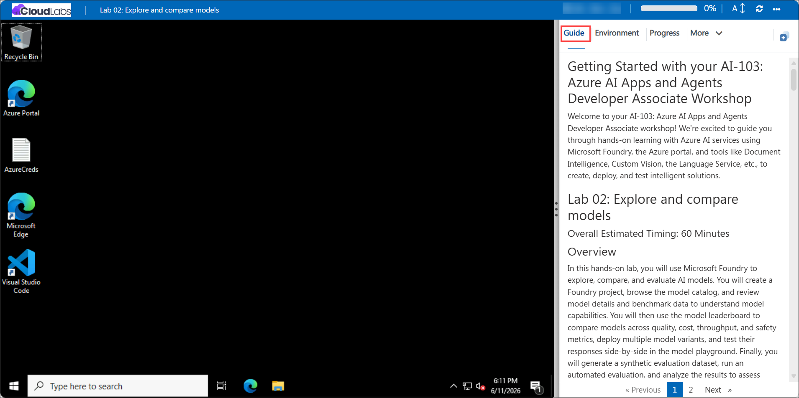

# AI-103: Azure AI Apps and Agents Developer Associate Workshop

Welcome to your AI-103: Azure AI Apps and Agents Developer Associate workshop! We've prepared a seamless environment for you to explore and build intelligent applications and agents with Microsoft Foundry. Let's begin by making the most of this experience.

# Getting Started with lab

Welcome to your AI-103: Azure AI Apps and Agents Developer Associate workshop! We're excited to guide you through hands-on learning with Microsoft Foundry, Azure AI Agents, and the broader Azure AI services portfolio to build, ground, secure, and integrate intelligent solutions. Let's begin by making the most of this experience:

## Overview

In these hands-on labs, you will develop the full range of skills required to build AI-powered applications and agents on **Microsoft Foundry**. You will start by preparing a Foundry development environment and exploring, comparing, and evaluating models in the model catalog, then build generative AI chat applications and ground them in your own data using Azure AI Search. You will apply default and custom content safety guardrails, and then move into agent development: building agents in the Foundry portal and Visual Studio Code, extending them with custom function tools, Model Context Protocol (MCP) tools, and Foundry IQ knowledge grounding, orchestrating multi-step workflows, and publishing agents to Microsoft Teams and Microsoft 365 Copilot. You will use the Microsoft Agent Framework SDK to build single- and multi-agent solutions, including remote agents that communicate over the Agent-to-Agent (A2A) protocol. From there, you will work across the Azure AI services portfolio: analyzing and summarizing text with Azure AI Language, recognizing, synthesizing, and translating speech with Azure Speech and Azure Translator, building real-time Voice Live agents, working with vision-enabled chat and image/video generation models such as Sora 2, extracting structured information from documents, images, audio, and video with Azure Content Understanding, extracting text and fields with Azure Document Intelligence, and building a knowledge mining solution with Azure AI Search. By completing these labs, you will gain practical, end-to-end experience designing, securing, and integrating generative AI applications and agents across the Microsoft Foundry and Azure AI ecosystem.

## Objectives

By the end of these labs, you will be able to:

1. **Prepare a Microsoft Foundry development environment:** Create a Microsoft Foundry project, deploy a GPT-4.1 model, view the project and Foundry endpoints, and install the Foundry extension for Visual Studio Code.

2. **Explore, compare, and evaluate AI models:** Explore models in the catalog, compare them using the model leaderboard, deploy multiple model variants, compare them in the model playground, and evaluate a model using a synthetic dataset.

3. **Build a generative AI chat application:** Deploy a model in a Foundry project and build a Python chat application using the ChatCompletions and Responses APIs, enhanced with conversation tracking, streaming, and asynchronous processing.

4. **Ground a generative AI app in your own data:** Create a Foundry hub and project, deploy embedding and generative models, add data, build a vector search index in Azure AI Search, test it in the playground, and build a RAG client application.

5. **Apply content safety guardrails:** Chat with a deployed model using its default content filters, then create and apply a custom guardrail with stricter thresholds for hate, violence, sexual, and self-harm content.

6. **Build AI agents with the Foundry portal and VS Code:** Create an agent with instructions, grounding data, file search, and code interpreter tools, test it in the portal and VS Code, and build a Python client to interact with it.

7. **Use a custom function in an AI agent:** Create a Foundry project, deploy a model, and extend an agent with a custom Python function tool that it can invoke to generate outputs.

8. **Develop an AI agent with MCP tools:** Connect an agent to a remote MCP server and to custom MCP tools for inventory and sales, then validate dynamic tool invocation with a client application.

9. **Integrate an AI agent with Foundry IQ:** Build an agent grounded in an Azure AI Search knowledge base populated from Blob Storage documents, and test it in the playground and through a Python client.

10. **Publish AI agents to Microsoft Teams and Copilot:** Ground an agent with enterprise policy documents, validate it in the playground, and publish it to Microsoft Teams and Microsoft 365 Copilot.

11. **Build a workflow in Microsoft Foundry:** Create a customer-support triage workflow that classifies tickets with an AI agent and applies conditional routing based on confidence and category.

12. **Develop a chat agent with the Microsoft Agent Framework SDK:** Build an AI chat agent with a custom tool that processes expense data and simulates expense claim submissions.

13. **Develop a multi-agent solution:** Create specialized agents and a sequential orchestration workflow using the Microsoft Agent Framework SDK that collaborate to produce structured outputs.

14. **Connect to remote agents with the A2A protocol:** Build a multi-agent application with a routing agent and remote agents that communicate using Agent-to-Agent messaging, agent skills, and agent cards.

15. **Analyze text with Azure AI Language:** Build a Python application that detects language, sentiment, key phrases, and entities from text using Azure AI Language in Foundry.

16. **Develop a text analysis agent:** Configure an agent with Azure Language capabilities such as summarization and entity recognition, and test it in the playground and via a client application.

17. **Use speech-capable generative AI models:** Deploy speech-capable models in Foundry and run applications that generate speech from text and transcribe spoken audio to text.

18. **Recognize and synthesize speech:** Build a voice-enabled application using Azure Speech to convert text to speech and transcribe audio recordings to text.

19. **Use Azure Speech in an agent:** Configure a Foundry agent with an Azure Speech tool connection to generate speech and transcribe audio, validated with a client application.

20. **Develop a Voice Live agent:** Build a real-time, voice-enabled agent using Azure Speech Voice Live for live conversational interaction with speech input and audio output.

21. **Translate text and speech:** Build applications for multilingual text translation with Azure Translator and real-time speech translation with Azure Speech.

22. **Develop a vision-enabled chat application:** Deploy a vision-enabled model, test it with image prompts in the playground, and build a client application that analyzes images from URLs and local files.

23. **Generate images with AI:** Deploy an image-generation model, test prompts in the playground, and build a client application that generates, decodes, and saves images.

24. **Generate video with the Sora 2 model:** Deploy the Sora 2 video generation model and build a Python application that generates, remixes, and downloads videos from text prompts and reference images.

25. **Analyze images with Azure Content Understanding:** Provision the required resources, build and publish a custom image analyzer that generates descriptions and tags, and access it from a Python application.

26. **Extract information from multimodal content:** Use Azure Content Understanding's prebuilt and custom analyzers to extract structured information from invoices, slides, voicemail recordings, and video conference recordings.

27. **Develop a Content Understanding client application:** Build a custom schema-based analyzer that extracts structured data such as names, titles, emails, and phone numbers from business card images using the Python SDK.

28. **Extract data with Azure Document Intelligence:** Use the prebuilt Read and invoice models to extract multilingual text and structured fields, then train and test a custom model for tailored document formats.

29. **Create a knowledge mining solution:** Build an Azure AI Search index over documents in Blob Storage, enrich it with built-in AI skills to extract phrases, entities, and locations, and query it from a client application.

## Pre-requisites

- Basic knowledge of the Azure portal, Azure subscriptions, and Azure resource management.
- Familiarity with generative AI concepts, including prompts, large language models, AI agents, and retrieval-augmented generation (RAG).
- Basic understanding of Microsoft Foundry, its model catalog, and the Azure AI services portfolio (Language, Speech, Translator, Vision, Content Understanding, Document Intelligence, and AI Search).
- Basic knowledge of Python, virtual environments, and command-line tools for application development.
- Experience using Visual Studio Code, including installing and using extensions for application development.
- Access to a Microsoft 365 account with Microsoft Teams enabled, and a Microsoft 365 Copilot license (required only for the Teams and Copilot publishing lab).
- Git and the Azure CLI installed (required for several application-development and video-generation labs).

## Architecture

The lab architecture demonstrates how each lab builds on a Microsoft Foundry project to progressively deploy, ground, secure, and integrate AI capabilities and agents:

1. **Environment setup and model exploration:** A Foundry project is created and a model is deployed and tested; models are then explored, benchmarked, and evaluated using the catalog, leaderboard, and a synthetic evaluation dataset.

2. **Generative AI chat and data grounding:** A generative AI model powers a Python chat application built with the OpenAI SDK, and is further grounded in custom data using an Azure AI Search vector index for retrieval-augmented generation.

3. **Content safety guardrails:** Default and custom content filter policies are evaluated against prompts and responses to manage harmful, offensive, or sensitive model outputs.

4. **Agent development and tooling:** AI agents are created in the Foundry portal and Visual Studio Code, then extended with file search, code interpreter, custom Python function tools, Model Context Protocol (MCP) tools, and Foundry IQ knowledge grounding backed by Azure AI Search.

5. **Agent publishing and orchestration:** Agents are grounded with enterprise documents and published to Microsoft Teams and Microsoft 365 Copilot, or composed into multi-step workflows with conditional routing logic.

6. **Agent Framework SDK, multi-agent, and A2A:** The Microsoft Agent Framework SDK is used to build single agents with custom tools, sequential multi-agent orchestrations, and remote agents that communicate using the Agent-to-Agent (A2A) protocol.

7. **Language and text analysis:** Azure AI Language, accessed directly and through an agent, detects language, sentiment, key phrases, entities, and summaries from text.

8. **Speech capabilities:** Azure Speech powers text-to-speech and speech-to-text applications, an agent-integrated speech tool, and a real-time Voice Live conversational agent.

9. **Translation:** Azure Translator and Azure Speech provide multilingual text translation and real-time speech translation.

10. **Vision and generative media:** Vision-enabled chat models analyze images, while image- and video-generation models, including Sora 2, create new images and videos from text prompts.

11. **Content Understanding:** Azure Content Understanding's prebuilt and custom analyzers extract structured information from images, documents, audio, and video, accessed through the playground and Python client applications.

12. **Document Intelligence and knowledge mining:** Azure Document Intelligence extracts text and structured fields from documents, and Azure AI Search indexes and enriches documents with built-in AI skills to power a searchable knowledge mining solution.

## Explanation of Components

1. **Microsoft Foundry Portal and Foundry Toolkit for Visual Studio Code:** The centralized platform and VS Code extension used across the labs to create projects, deploy models, and build and test agents.

2. **Microsoft Foundry Project and Azure Resources:** The workspace that links to underlying Azure resources, providing the infrastructure for model deployments, agents, and AI services used throughout the labs.

3. **Model Catalog, Leaderboard, and Evaluation Framework:** Used to explore, benchmark, compare, and evaluate AI models across quality, cost, throughput, and safety.

4. **Azure OpenAI Model Deployments and the OpenAI SDK:** Deployed generative, embedding, vision, and image/video models power chat, RAG, vision, and generation applications built with the OpenAI SDK.

5. **Azure AI Search:** Provides vector indexing for retrieval-augmented generation, knowledge grounding for Foundry IQ, and enrichment pipelines for the knowledge mining solution.

6. **Content Safety Guardrails and Content Filters:** Default and custom policies that evaluate prompts and responses for harmful content categories such as hate, violence, sexual content, and self-harm.

7. **AI Agents and Tools (File Search, Code Interpreter, Custom Functions, MCP, Foundry IQ):** Agents configured with instructions and tools that enable document-based question answering, data analysis, custom function calls, and dynamic tool invocation.

8. **Agent Workflows and Publishing (Microsoft Teams, Microsoft 365 Copilot):** Multi-step agent workflows with conditional routing, and a publishing framework that distributes agents into Microsoft 365 collaboration experiences.

9. **Microsoft Agent Framework SDK and A2A Protocol:** SDK-based single- and multi-agent orchestrations, and remote agents that communicate using Agent-to-Agent messaging, skills, and agent cards.

10. **Azure AI Language:** Provides language detection, sentiment analysis, key phrase extraction, entity recognition, and summarization, used directly and through a text analysis agent.

11. **Azure Speech:** Provides text-to-speech, speech-to-text, agent-integrated speech tools, and real-time Voice Live conversational interaction.

12. **Azure Translator:** Provides multilingual text and speech translation used in standalone and agent-integrated scenarios.

13. **Sora 2 and Image/Vision Generation Models:** Generate and remix videos and images from text prompts and reference images, and power vision-enabled chat applications.

14. **Azure Content Understanding:** Extracts structured descriptions, tags, and custom schema-based fields from images, documents, audio, and video using prebuilt and custom analyzers.

15. **Azure Document Intelligence:** Extracts text and structured fields from documents using prebuilt Read and invoice models, and supports training custom models.

16. **Python Client Applications:** Applications built throughout the labs that connect to deployed models, agents, and service endpoints to deliver chat, agentic, speech, vision, translation, and content-extraction capabilities.

## Accessing Your Lab Environment
 
Once you're ready to dive in, your virtual machine and **Guide** will be right at your fingertips within your web browser.
 

## Virtual Machine & Lab Guide
 
Your virtual machine is your workhorse throughout the workshop. The lab guide is your roadmap to success.

## Lab Guide Zoom In/Zoom Out
 
To adjust the zoom level for the environment page, click the **A↕: 100%** icon located next to the timer in the lab environment.

## Exploring Your Lab Resources
 
To get a better understanding of your lab resources and credentials, navigate to the **Environment** tab.
 

## Utilizing the Split Window Feature
 
For convenience, you can open the lab guide in a separate window by selecting the **Split Window** button from the top right corner.
 

## Managing Your Virtual Machine
 
Feel free to **Start, Restart, or Stop (2)** your virtual machine as needed from the **Resources (1)** tab. Your experience is in your hands!
 

## Lab Progress

You can use the **Progress** tab to track your progress while working on the lab. A score will be provided after successful validation.

## Let's Get Started with Azure Portal
 
1. On your virtual machine, click on the Azure Portal icon as shown below:
 
    

1. In the sign-in window, kindly sign in using the provided Azure credentials

    - **Email/Username:** <inject key="AzureAdUserEmail"></inject>

        

    - **Password:** <inject key="AzureAdUserPassword"></inject>

        

1. If prompted to **Stay signed in?**, you can click **No**.

    

1. If a **Welcome to Microsoft Azure** pop-up window appears, simply click **Maybe later** to skip the tour.

    

## Support Contact
 
The CloudLabs support team is available 24/7, 365 days a year, via email and live chat to ensure seamless assistance at any time. We offer dedicated support channels explicitly tailored for both learners and instructors, ensuring that all your needs are promptly and efficiently addressed.
 
Learner Support Contacts:
 
- Email Support: cloudlabs-support@spektrasystems.com
- Live Chat Support: https://cloudlabs.ai/labs-support

Click on **Next** from the lower right corner to move on to the next page.

   

## Happy Learning !!
