# Lab 01: Analyze images with Azure AI Computer Vision

### Estimated Duration: 60 Minutes

## Lab Overview

In this lab, you will provision an Azure AI Vision resource and configure it for image analysis tasks. You will work with a Python application in Azure Cloud Shell to integrate the Vision SDK and analyze sample images. The lab covers generating captions, extracting tags, detecting and locating objects, and identifying people in images. By the end, you will gain hands-on experience in building and testing computer vision solutions using Azure AI Vision.

## Lab Objectives

- Task 1: Provision an Azure AI Vision resource
- Task 2: Develop an image analysis app with the Azure AI Vision SDK


### Task 1: Provision an Azure AI Vision resource

In this task, you will provision an Azure AI Vision resource in the Azure portal, configure its settings, and retrieve the keys and endpoint required to connect your application to the service.

1. On the **Azure portal**, search for **Computer Vision (1)** then select **Computer Vision (2)** from the results.

    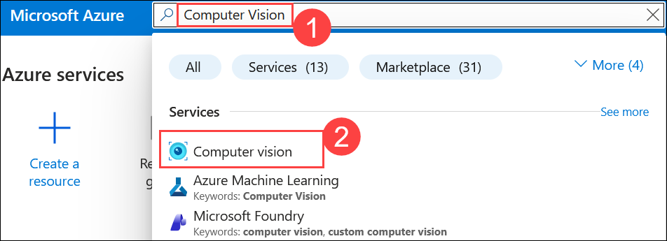

1. Select **+ Create**.

    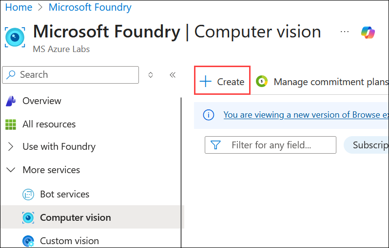

1. Create a resource with the following settings:

    - **Subscription**: Leave your default Azure subscription **(1)**
    - **Resource group**: Select **ai-service-<inject key="DeploymentID" enableCopy="false"/> (2)**
    - **Region**: Select **<inject key="Region" enableCopy="false"/> (3)**
    - **Name**: Enter **computervision<inject key="DeploymentID" enableCopy="false"/> (4)**
    - **Pricing tier**: Select **F0 (5)** (*free*), or **S** (*standard*) if F is not available.
    - Select the required checkboxes **(6)**
    - Select **Review + create (7)**

      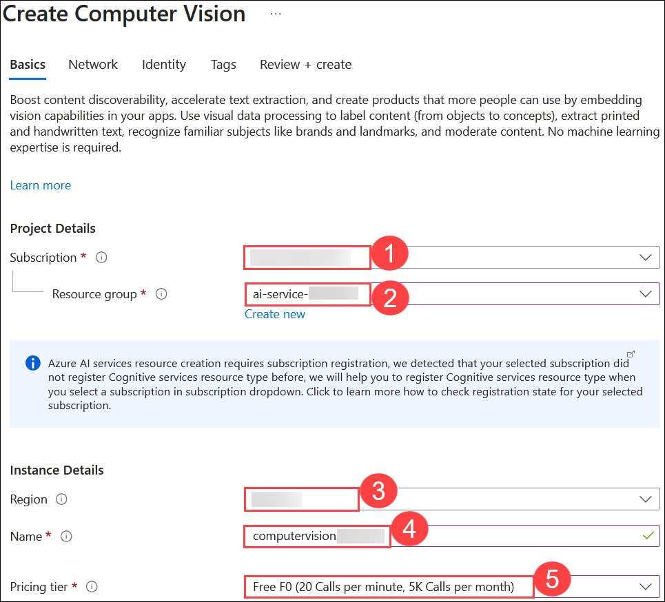       
      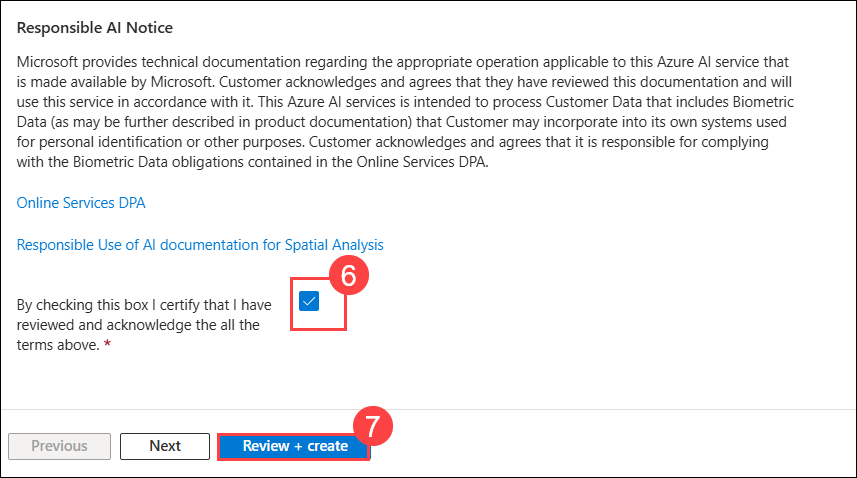     
    
1. Then select **Create** to provision the resource.

    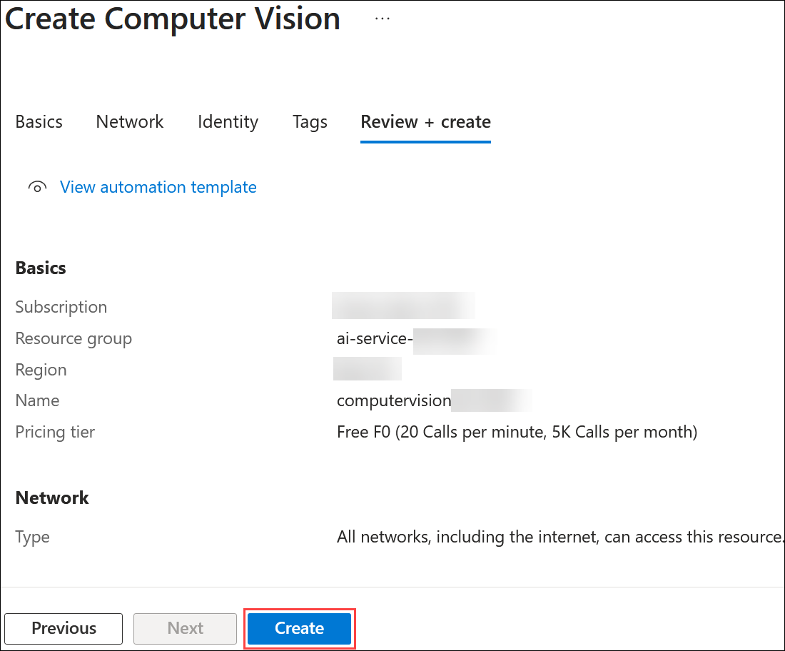

1. Wait for deployment to complete, and select **Go to resource** to go to the resource group.

    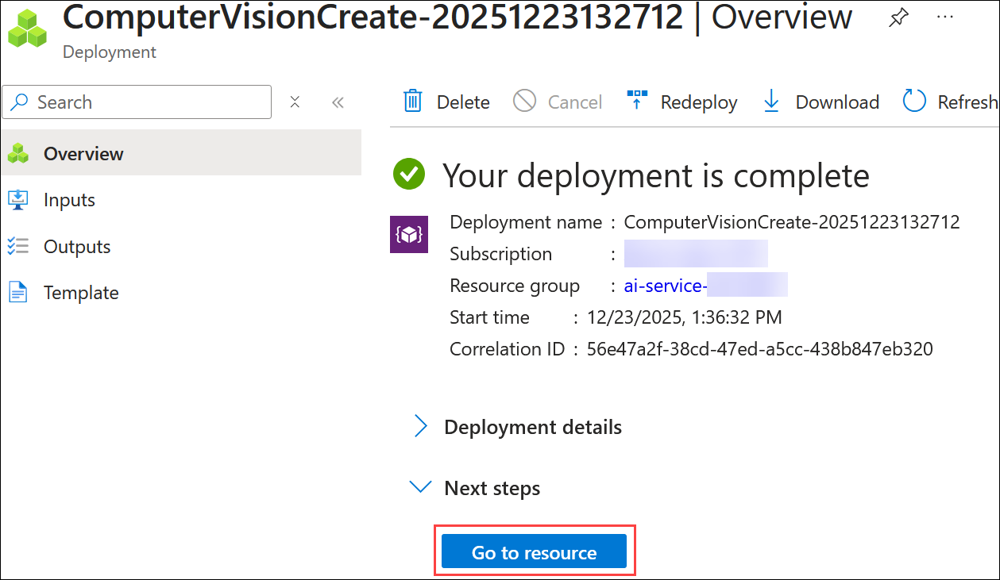

1. Select the Computer Vision resource **computervision<inject key="DeploymentID" enableCopy="false"/>**.

   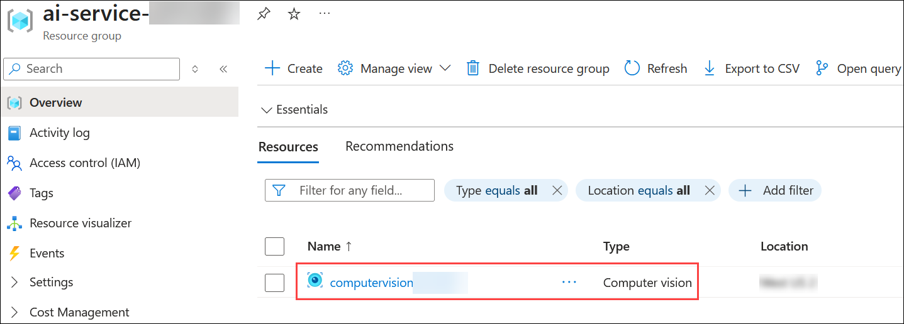

1. Navigate to the **Keys and Endpoint (1)** page. Copy and paste the **KEY 1 (2)** and **Endpoint(3)**. You will need the information on this page later in the lab.

   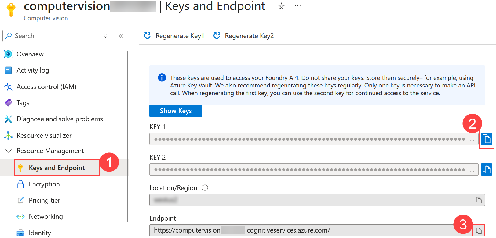

> **Congratulations** on completing the task! Now, it's time to validate it. Here are the steps:
>
> - Hit the Validate button for the corresponding task. If you receive a success message, you can proceed to the next task.
> - If not, carefully read the error message and retry the step, following the instructions in the lab guide.
> - If you need any assistance, please contact us at cloudlabs-support@spektrasystems.com. We are available 24/7 to help.
 
<validation step="e2c31f6e-21a8-4d12-a1dd-4484dbf76091" />
 
---     

### Task 2: Develop an image analysis app with the Azure AI Vision SDK

In this task, you'll complete a partially implemented client application that uses the Azure AI Vision SDK to analyze images.   

### Task 2.1: Prepare the application configuration

In this task, you will set up your development environment in Azure Cloud Shell by cloning the GitHub repository, installing required packages, and configuring the application with your Azure AI Vision resource endpoint and key.

1. Use the **[>_]** button located to the right of the **Copilot** tab at the top of the page, to create a new **Cloud Shell** in the Azure portal.

     

1. This opens a new Cloud Shell session. In the **Welcome to Azure Cloud Shell** window, choose **PowerShell**.

     

1. In the **Getting started** window, ensure **No storage account required (1)** is selected. From the **Subscription** drop-down, choose **Default subscription (2)**, then click **Apply (3)**.

       

1. In the cloud shell toolbar, in the **Settings (1)** menu, select **Go to Classic version (2)** (this is required to use the code editor).

    

     >**Note**: The cloud shell provides a command-line interface in a pane at the bottom of the Azure portal. You can resize or maximize this pane to make it easier to work in.

     >**Note**: Ensure you've switched to the classic version of the cloud shell before continuing.

1. In the cloud shell pane, enter the following commands to clone the GitHub repo containing the code files for this exercise (type the command, or copy it to the clipboard and then right-click in the command line and paste as plain text and click enter button):

    ```
    rm -r mslearn-ai-vision -f
    git clone https://github.com/MicrosoftLearning/mslearn-ai-vision
    ```

     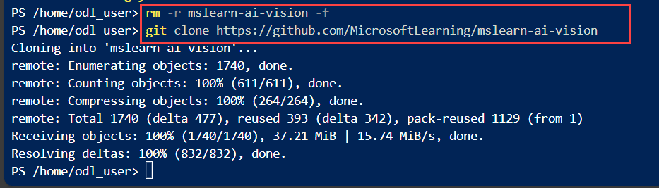

      >**Tip**: As you paste commands into the cloudshell, the output may take up a large amount of the screen buffer. You can clear the screen by entering the `cls` command to make it easier to focus on each task.

1. After the repo has been cloned, use the following command to navigate to and view the folder containing the application code files:   

    ```
   cd mslearn-ai-vision/Labfiles/analyze-images/python/image-analysis
   ls -a -l
    ```

      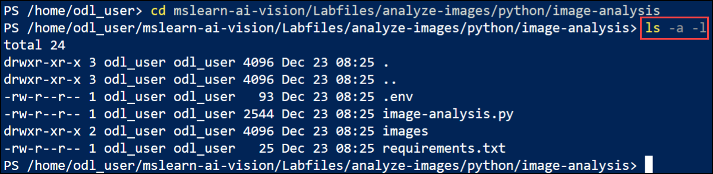   

     The folder contains application configuration and code files for your app. It also contains a **/images** subfolder, which contains some image files for your app to analyze.
    
1. Install the Azure AI Vision SDK package and other required packages by running the following commands:

    ```
   python -m venv labenv
   ./labenv/bin/Activate.ps1
   pip install -r requirements.txt azure-ai-vision-imageanalysis==1.0.0
    ```

1. Enter the following command to edit the configuration file for your app:

    ```
   code .env
    ```

     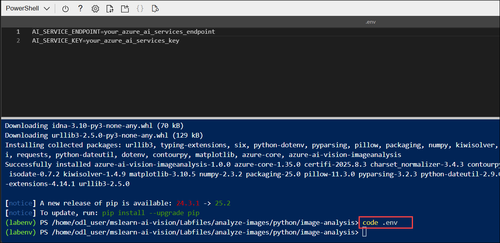      

    The file is opened in a code editor.

1. In the code file, update the configuration values it contains to reflect the **endpoint (1)** and an authentication **key (2)** for your Computer Vision resource (copied from its **Keys and Endpoint** page in the `Task 1`).

    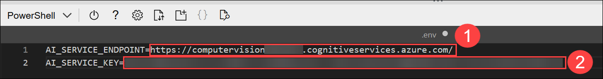   

1. After you've replaced the placeholders, use the **CTRL+S** command to save your changes and then use the **CTRL+Q** command to close the code editor while keeping the cloud shell command line open.

### Task 2.2: Add code to suggest a caption

In this task, you will update the Python application to use the Azure AI Vision SDK, authenticate the client, analyze images, and generate suggested captions along with dense captions for different sample images.

1. In the cloud shell command line, enter the following command to open the code file for the client application:

    ```
   code image-analysis.py
    ```

     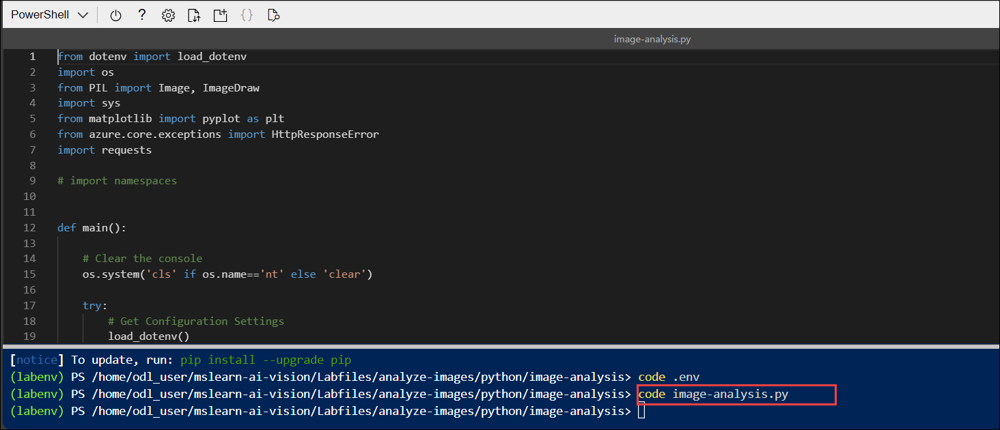       

      >**Tip**: You might want to maximize the cloud shell pane and move the split-bar between the command line cosole and the code editor so you can see the code more easily.

1. In the code file, find the comment **Import namespaces**, and add the following code to import the namespaces you will need to use the Azure AI Vision SDK:

    ```python
   # import namespaces
   from azure.ai.vision.imageanalysis import ImageAnalysisClient
   from azure.ai.vision.imageanalysis.models import VisualFeatures
   from azure.core.credentials import AzureKeyCredential
    ```

     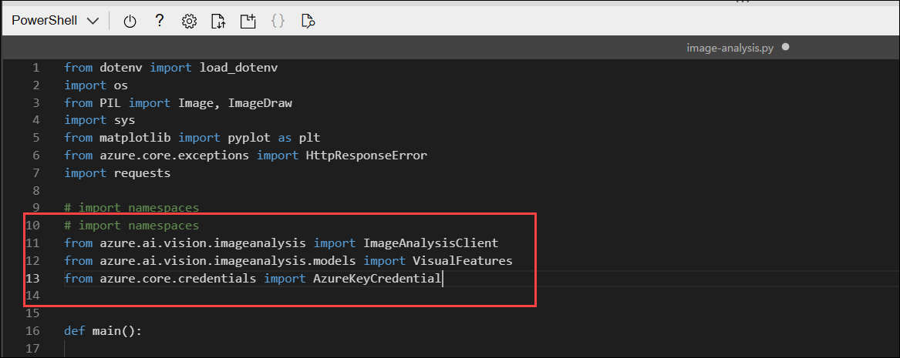       

1. In the **Main** function, note that the code to load the configuration settings and determine the image file to be analyzed has been provided. Then find the comment **Authenticate Azure AI Vision client** and add the following code to create and authenticate an Azure AI Vision client object (be sure to maintain the correct indentation levels):

    ```python
    # Authenticate Azure AI Vision client
    cv_client = ImageAnalysisClient(
        endpoint=ai_endpoint,
        credential=AzureKeyCredential(ai_key)
    )
    ```

    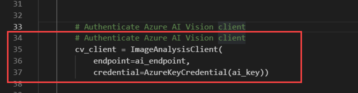    

1. In the **Main** function, under the code you just added, find the comment **Analyze image** and add the following code:

    ```python
    # Analyze image
    with open(image_file, "rb") as f:
        image_data = f.read()
    print(f'\nAnalyzing {image_file}\n')

    result = cv_client.analyze(
        image_data=image_data,
        visual_features=[
            VisualFeatures.CAPTION,
            VisualFeatures.DENSE_CAPTIONS,
            VisualFeatures.TAGS,
            VisualFeatures.OBJECTS,
            VisualFeatures.PEOPLE
        ],
    )
    ```

    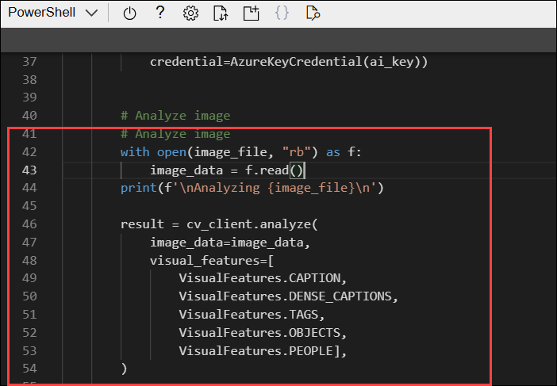   

1. Find the comment **Get image captions**, add the following code to display image captions and dense captions:

    ```python
    # Get image captions
    if result.caption is not None:
        print("\nCaption:")
        print(" Caption: '{}' (confidence: {:.2f}%)".format(result.caption.text, result.caption.confidence * 100))
    
    if result.dense_captions is not None:
        print("\nDense Captions:")
        for caption in result.dense_captions.list:
            print(" Caption: '{}' (confidence: {:.2f}%)".format(caption.text, caption.confidence * 100))
    ```

    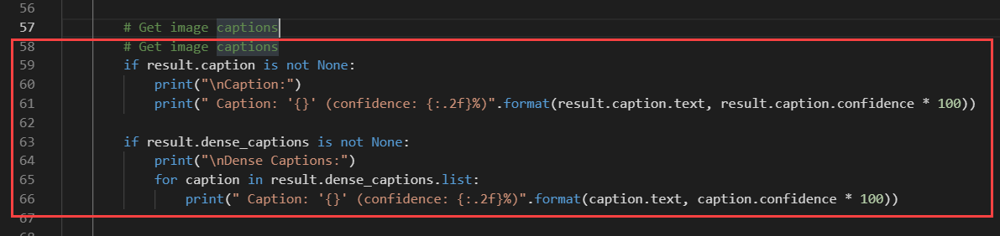       

1. Save your changes using **CTRL+S** and resize the panes so you can clearly see the command line console while keeping the code editor open.

1. Then enter the following command to run the program with the argument **images/street.jpg**:

    ```
   python image-analysis.py images/street.jpg
    ```

1. Observe the output, which should include a suggested caption for the **street.jpg** image, which looks like this:

     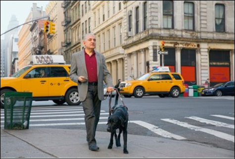 

     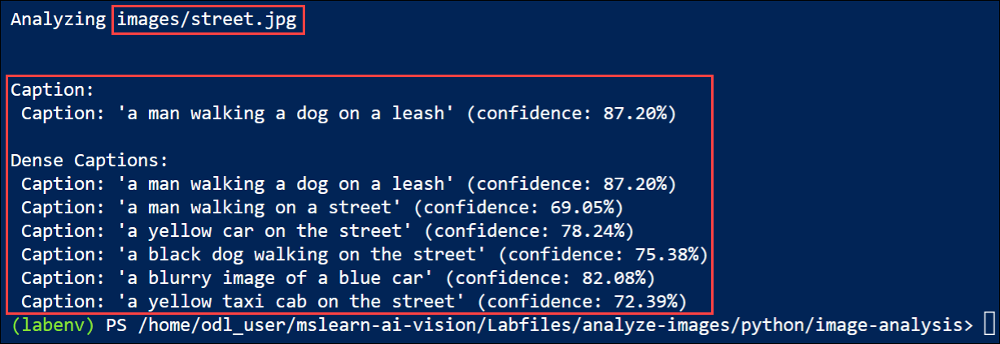      

1. Run the program again, this time with the argument **images/building.jpg** to see the caption that gets generated for the **building.jpg** image, which looks like this:

    ```
   python image-analysis.py images/building.jpg
    ```

    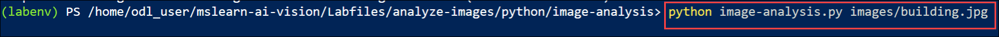

1. Observe the output, which should include a suggested caption for the **building.jpg** image, which looks like this:

    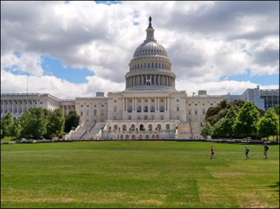

    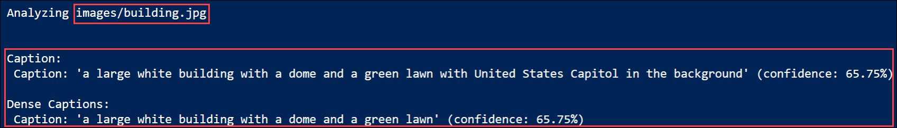     

1. Repeat the previous step to generate a caption for the **images/person.jpg** file, which looks like this:

    ```
   python image-analysis.py images/person.jpg
    ```

    

     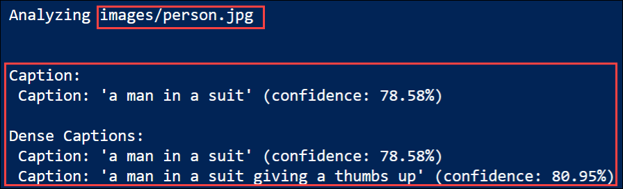 

### Task 2.3: Add code to generate suggested tags

In this task, you will enhance the Python application to extract and display suggested tags for analyzed images, providing additional context about their contents.

It can sometimes be useful to identify relevant *tags* that provide clues about the contents of an image.

1. In the code editor, in the **AnalyzeImage** function, find the comment **Get image tags** and add the following code:

    ```python
   # Get image tags
   if result.tags is not None:
        print("\nTags:")
        for tag in result.tags.list:
            print(" Tag: '{}' (confidence: {:.2f}%)".format(tag.name, tag.confidence * 100))
    ```

     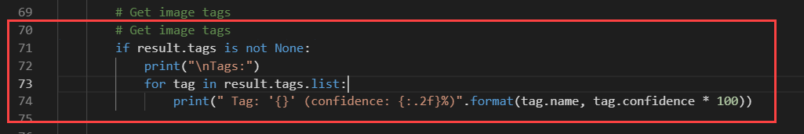    

1. Save your changes using **CTRL+S** and run the program with the argument **images/street.jpg**, observing that in addition to the image caption, a list of suggested tags is displayed.

    ```
   python image-analysis.py images/street.jpg
    ```

     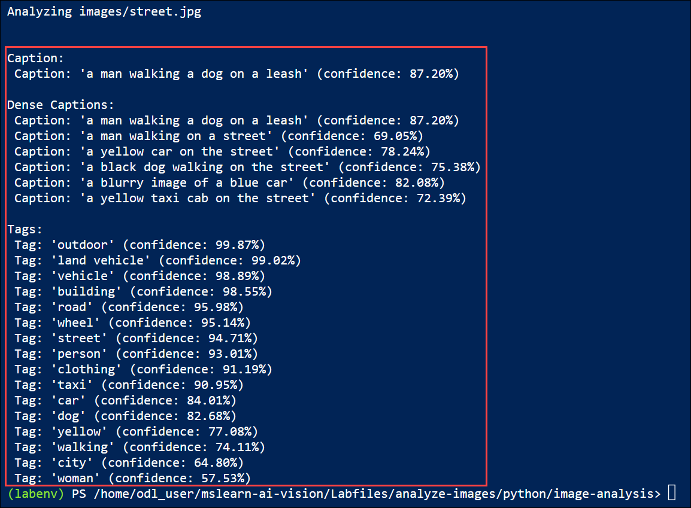  

1. Rerun the program for the **images/building.jpg** and **images/person.jpg** files.

    ```
   python image-analysis.py images/building.jpg
    ```

    ```
   python image-analysis.py images/person.jpg
    ```

### Task 2.4: Add code to detect and locate objects

In this task, you will extend the application to detect and locate objects within images, generate an annotated output file, and download it for review.

1. In the code editor, in the **AnalyzeImage** function, find the comment **Get objects in the image** and add the following code to list the objects detected in the image, and call the provided function to annotate an image with the detected objects:

    ```python
   # Get objects in the image
   if result.objects is not None:
        print("\nObjects in image:")
        for detected_object in result.objects.list:
            # Print object tag and confidence
            print(" {} (confidence: {:.2f}%)".format(detected_object.tags[0].name, detected_object.tags[0].confidence * 100))
        # Annotate objects in the image
        show_objects(image_file, result.objects.list)
    ```

     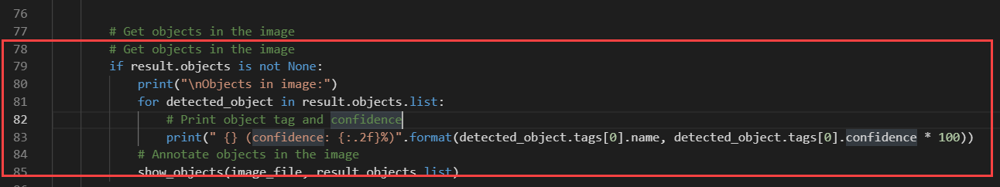      

1. Save your changes using **CTRL+S**.

1. Run the program with the argument **images/street.jpg**, observing that in addition to the image caption and suggested tags; a file named **objects.jpg** is generated.
   
    ```
   python image-analysis.py images/street.jpg
    ```

     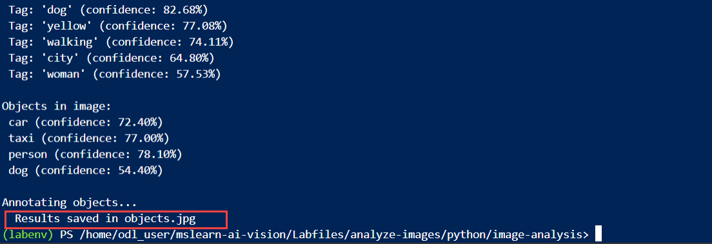  

1. Use the (Azure cloud shell-specific) **download** command to download the **objects.jpg** file **(1)**:

    ```
   download objects.jpg
    ```

    - The download command creates a popup link at the bottom right of your browser, which you can select to download 
    
      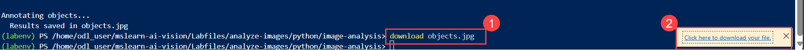    
    
1. Open the file.

    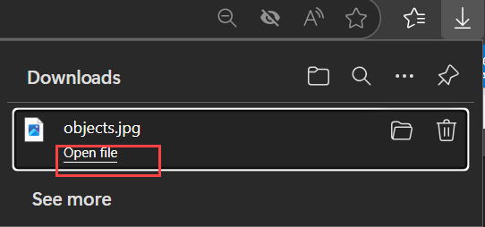  

1. The image should look similar to this:

    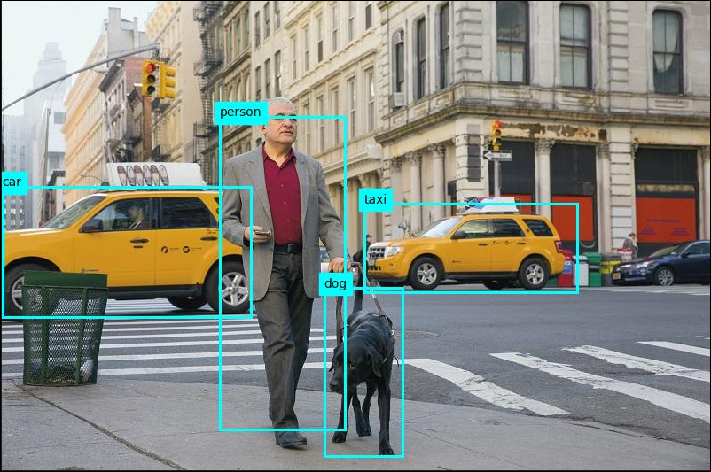

1. Rerun the program for the **images/building.jpg** and **images/person.jpg** files, downloading the generated objects.jpg file after each run.


### Task 2.5: Add code to detect and locate people

In this task, you will update the application to detect and locate people in images with a confidence threshold, generate annotated output files, and download them for review.

1. In the code editor, in the **AnalyzeImage** function, find the comment **Get people in the image** and add the following code to list any detected people with a confidence level of 20% or more, and call a provided function to annotate them in an image:

    ```Python
   # Get people in the image
   if result.people is not None:
        print("\nPeople in image:")

        for detected_person in result.people.list:
            if detected_person.confidence > 0.2:
                # Print location and confidence of each person detected
                print(" {} (confidence: {:.2f}%)".format(detected_person.bounding_box, detected_person.confidence * 100))
        # Annotate people in the image
        show_people(image_file, result.people.list)
    ```

     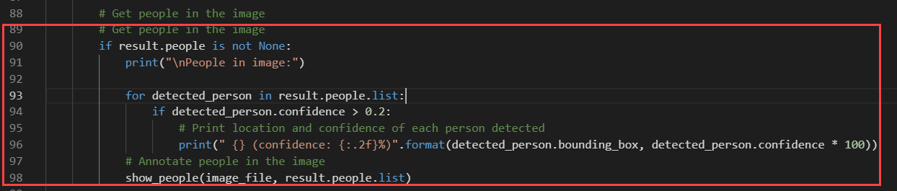      

1. Save your changes using **CTRL+S**.

1. Run the program with the argument **images/street.jpg**, observing that in addition to the image caption, suggested tags, and objects.jpg file; a list of person locations and file named **people.jpg** is generated.

    ```
   python image-analysis.py images/street.jpg
    ```

     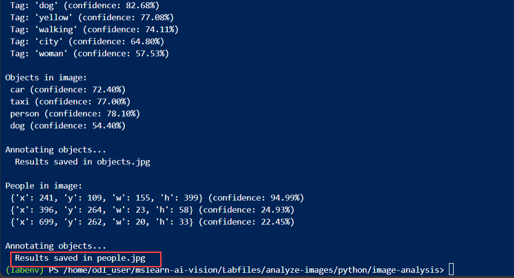  

1. Use the (Azure cloud shell-specific) **download** command to download the **objects.jpg** file **(1)**:

    ```
   download people.jpg
    ```

    - The download command creates a popup link at the bottom right of your browser, which you can select to download **(2)**

      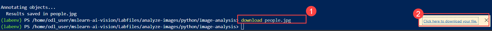     
    
1. Open the file.

    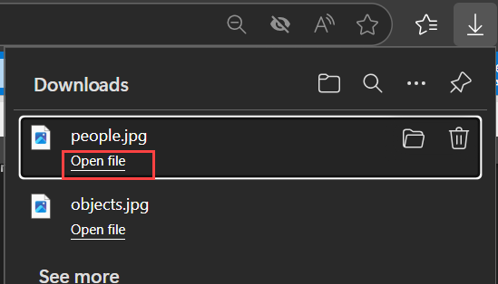  

1. The image should look similar to this:

    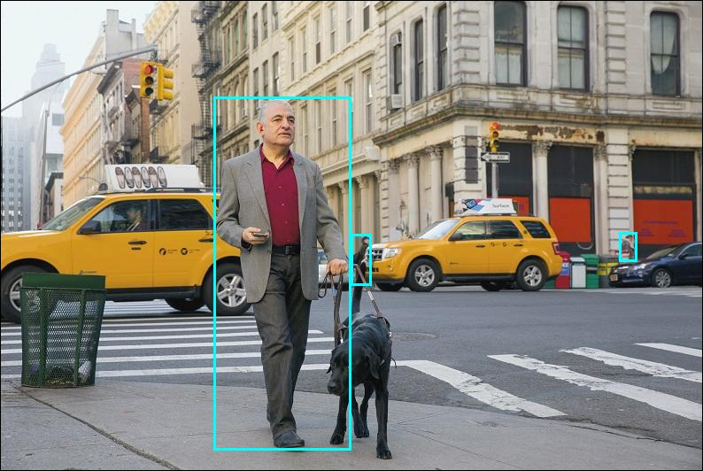 

1. Rerun the program for the **images/building.jpg** and **images/person.jpg** files, downloading the generated `people.jpg` file after each run.

   >**Tip:** If you see bounding boxes returned from the model that don't make sense, check the JSON confidence score and try increasing the confidence score filtering in your app.


### Summary

In this lab, you provisioned an Azure AI Vision resource and configured it in Azure Cloud Shell. You updated a Python application to integrate with the Vision SDK, enabling image analysis capabilities. You implemented features to generate captions, suggest tags, detect and locate objects, and identify people in images, gaining hands-on experience with building and testing a computer vision solution using Azure AI Vision.

## Click on **Next >>** from the lower right corner to move on to the next exercise.


