# Lab 02: Detect objects with Azure AI Custom Vision

### Estimated Duration : 60 Minutes

## Lab Overview

In this hands-on lab, you will build an end-to-end object detection solution with Azure AI Custom Vision. You’ll provision training and prediction resources in Azure, create an Object Detection project in the Custom Vision portal, and upload/tag images of fruit (apples, bananas, oranges). You’ll then use the Custom Vision training SDK from Azure Cloud Shell to programmatically upload tagged images, train a model, and review its precision/recall/mAP metrics. Next, you’ll validate results with Quick Test, publish the best iteration to your prediction resource, and configure a lightweight Python client to call the prediction endpoint and draw bounding boxes on sample images demonstrating how to operationalize your Custom Vision model in real applications.

## Lab Objectives 

- **Task 1:** Create Custom Vision resources

- **Task 2:** Create a Custom Vision project in the Custom Vision portal

- **Task 3:** Upload and tag images in the Custom Vision portal

- **Task 4:** Use the Custom Vision SDK to upload images

- **Task 5:** Train and test a model

- **Task 6:** Publish the object detection model

- **Task 7:** Use the image classifier from a client application

## Task 1: Create Custom Vision resources

In this task, you’ll create Custom Vision resources in Azure to support both training and prediction. You’ll provision two separate resources one for training and one for prediction so you can build the object detector and later use it from applications.

1. Open the Azure portal at `https://portal.azure.com`, and sign in using the Microsoft account.

1. Open the **Azure portal**, search for **Custom Vision (1)** and select **Custom Vision (2)** from the services.

    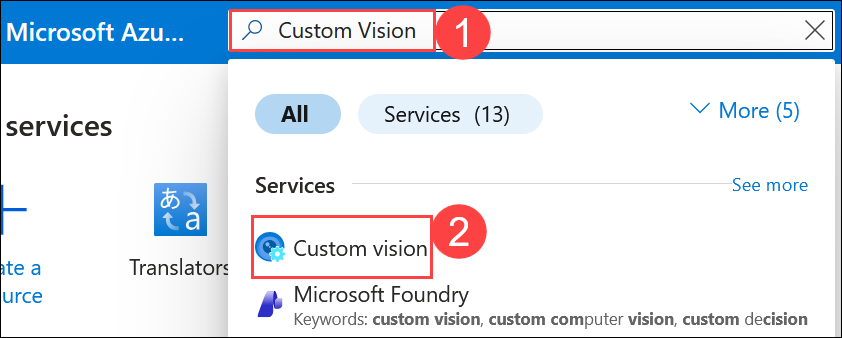

1. On **Microsoft Foundry | Custom Vision** blade, select **Custom Vision (1)** and click on **+ Create (2)**.

    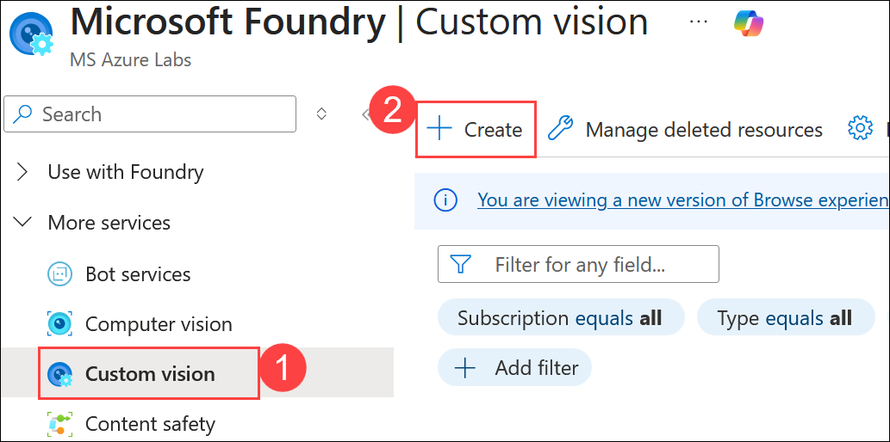

1. In the Basics tab of **Create Custom Vision**, follow these instructions to fill out the properties, then select **Review + create (8)**:

    - **Create options**: Opt for **Both (1)**
    - **Subscription**: Select **Default Subscription (2)**
     - **Resource group**: Select **ai-service-<inject key="DeploymentID" enableCopy="false"/> (2)**
    - **Region**: Select **<inject key="Region"></inject> (4)**
    - **Name**: **customvision<inject key="DeploymentID"></inject> (5)**
    - **Training pricing tier**: **Free (F0) (6)**
    - **Prediction pricing tier**: **Free (F0) (7)**

         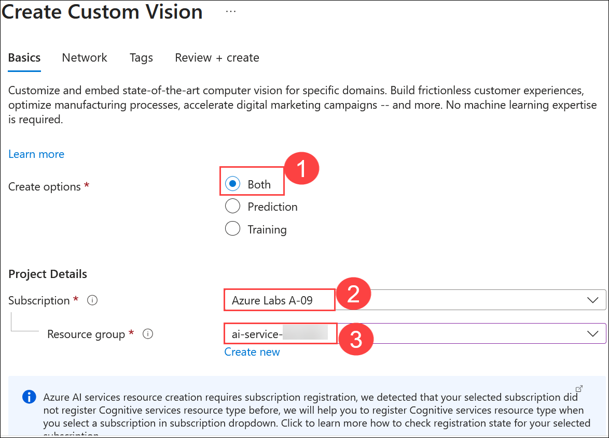

         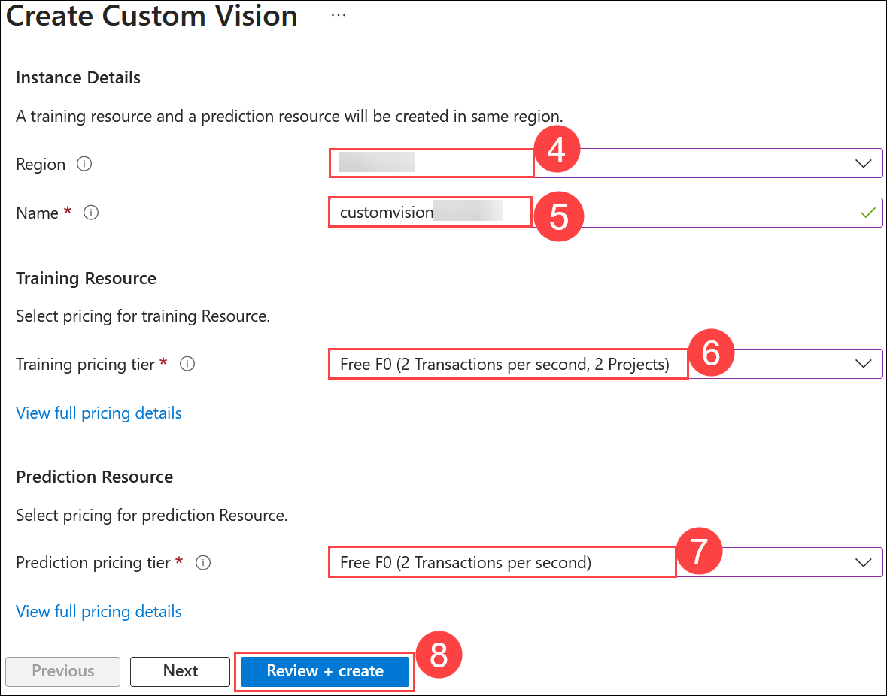


1. On the **Review + create** tab, click **Create** to provision the resource.

    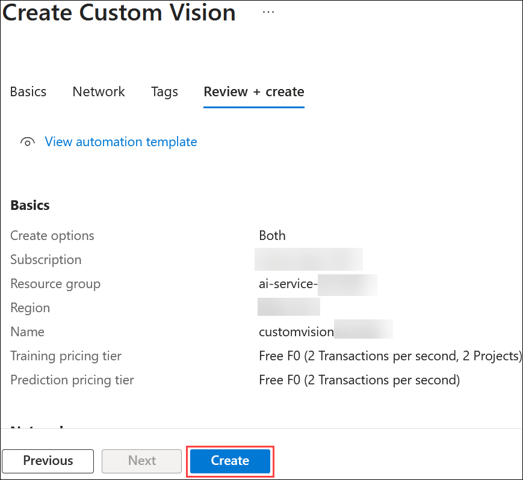
   
1. Wait for the deployment to finish, then check the deployment details and select **Go to resource group** to view them. You should see two custom vision resources, one for training, and another for prediction.

     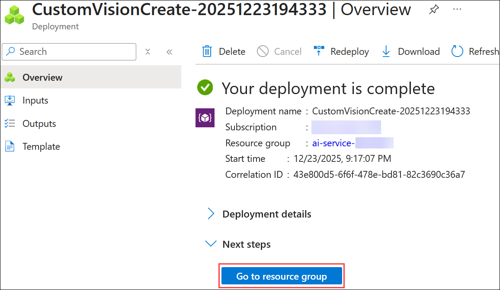

     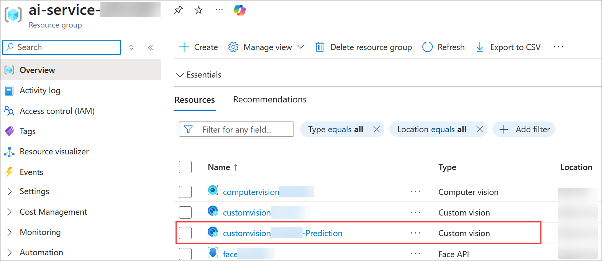

    > **Note**: Each resource has its own **endpoint** and **keys**, which are used to manage access from your code. To train an image classification model, your code must use the **training** resource (with its endpoint and key); and to use the trained model to predict image classes, your code must use the **prediction** resource (with its endpoint and key).

> **Congratulations** on completing the task! Now, it's time to validate it. Here are the steps:
>
> - Hit the Validate button for the corresponding task. If you receive a success message, you can proceed to the next task.
> - If not, carefully read the error message and retry the step, following the instructions in the lab guide.
> - If you need any assistance, please contact us at cloudlabs-support@spektrasystems.com. We are available 24/7 to help.
 
<validation step="3ee17fce-96a5-444e-8e5d-5e28cd8024a7" />
 
---      

## Task 2: Create a Custom Vision project in the Custom Vision portal

In this task, you’ll set up a new Object Detection project in the Custom Vision portal. You’ll connect it to your training resource, choose the Object Detection project type and General domain, and prepare the workspace for data ingestion and training.

1. Open a new browser tab (keeping the Azure portal tab open - you'll return to it later).

1. In the new browser tab, open the [Custom Vision portal](https://customvision.ai) at `https://customvision.ai`. Click **Sign in**.

    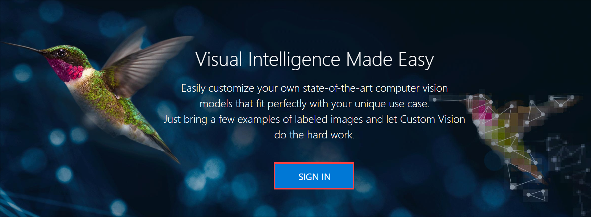

    > **Note:** If prompted, sign in using your Azure credentials and agree to the terms of service.

1. If prompted, provide the credentials below:

    - **Email/Username:** <inject key="AzureAdUserEmail"></inject>

    - **Password:** <inject key="AzureAdUserPassword"></inject>

1. If you're prompted pop-up **Terms of service** select the check box and click on **I agree**.

     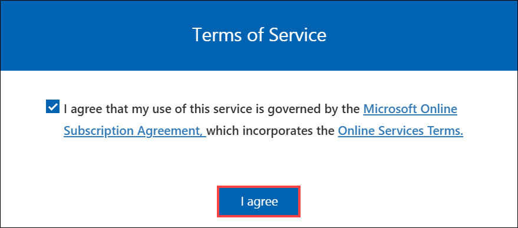

1. On the **Projects** page, click **+ New Project** to create your first project. 

     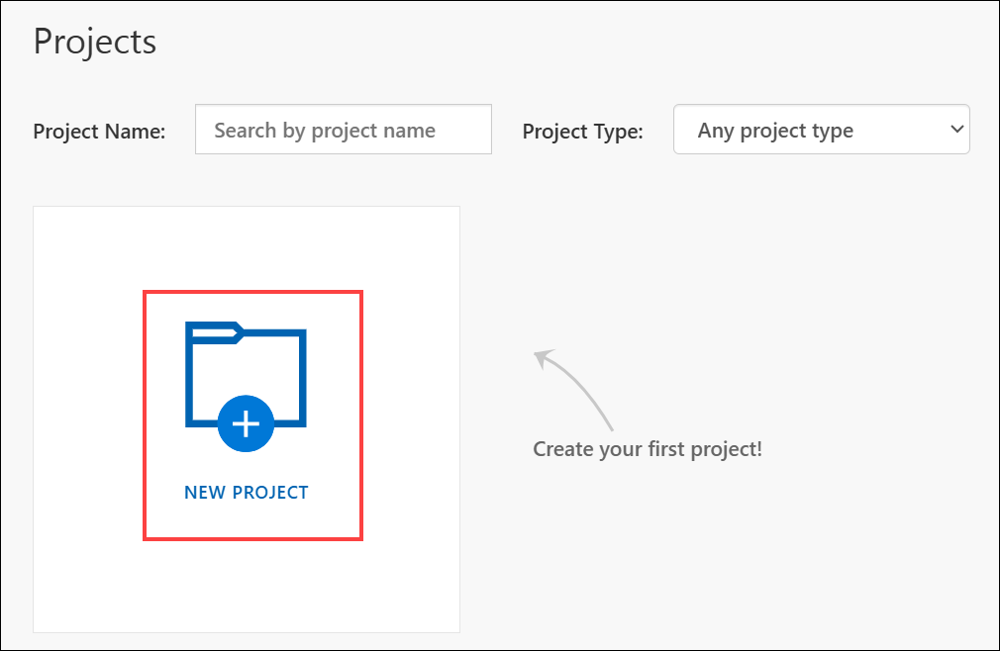

1. On **Create a new project** enter the following settings and click on **Create project (6)**
    - **Name**: `Detect Fruit` **(1)**
    - **Description**: `Object detection for fruit.` **(2)**
    - **Resource**: Select customvision<inject key="DeploymentID"></inject> **(3)**
    - **Project Types**: Object Detection **(4)**
    - **Domains**: General **(5)**

      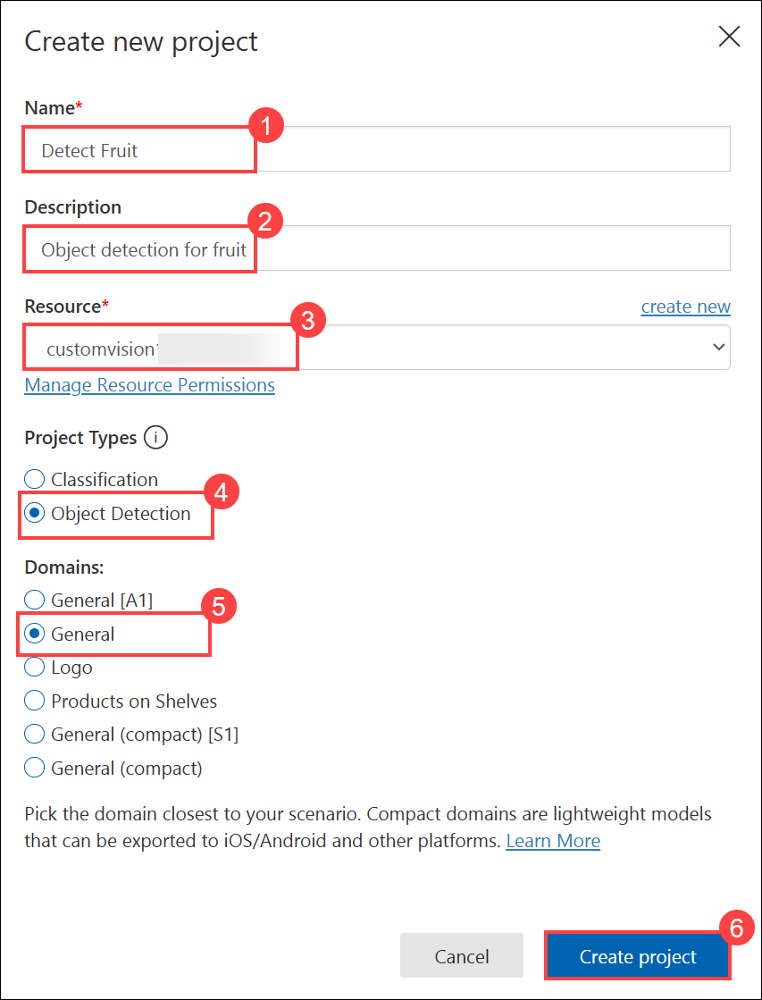

1. Wait for the project to be created and opened in the browser.

> **Congratulations** on completing the task! Now, it's time to validate it. Here are the steps:
>
> - Hit the Validate button for the corresponding task. If you receive a success message, you can proceed to the next task.
> - If not, carefully read the error message and retry the step, following the instructions in the lab guide.
> - If you need any assistance, please contact us at cloudlabs-support@spektrasystems.com. We are available 24/7 to help.
 
<validation step="0380cecc-5633-467a-97b1-0d12993e7228" />
 
---      

## Task 3: Upload and tag images in the Custom Vision portal

In this task, you’ll upload sample fruit images and draw bounding boxes around apples, bananas, and oranges. You’ll apply the correct tags to each region so the model learns where and what each object is.

1. In a new browser tab, download the [training images](https://github.com/MicrosoftLearning/mslearn-ai-vision/raw/main/Labfiles/object-detection/training-images.zip) from `https://github.com/MicrosoftLearning/mslearn-ai-vision/raw/main/Labfiles/object-detection/training-images.zip`

1. Click the **Downloads (1)** icon in the browser and then click the **Folder (2)** icon to open the downloaded file location.  
    
    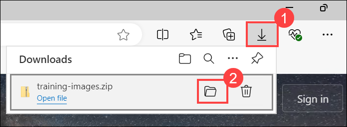

1. In the **Downloads** folder, right-click the **training-images (1)** file and select **Extract All (2)**.  

    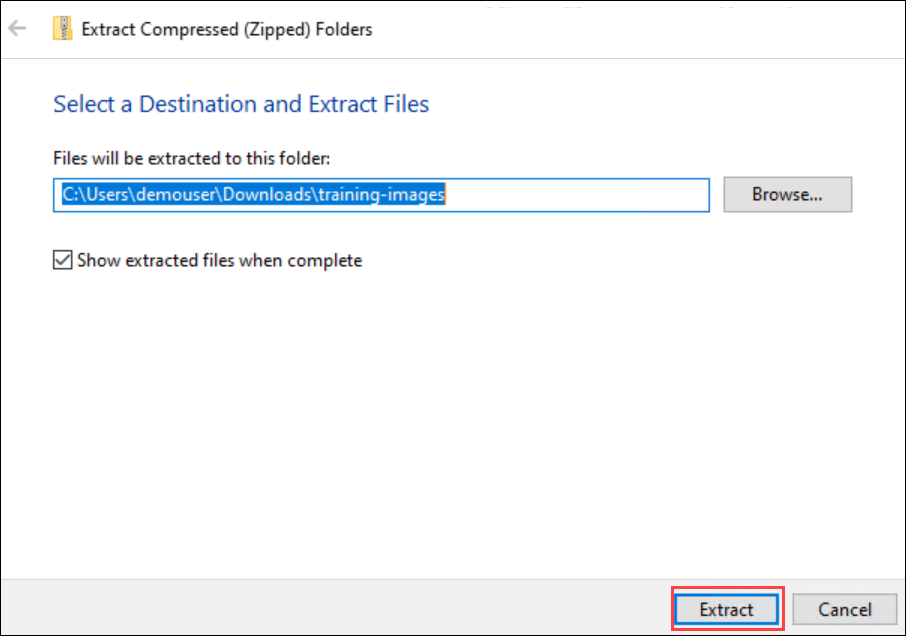

1. On the **Extract Compressed (Zipped) Folders** window, click **Extract** to unzip the files.  

    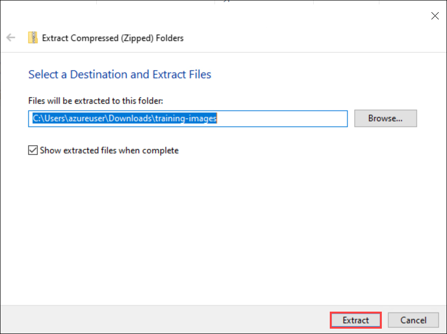
  
1. In the Custom Vision portal, in your object detection project, select **Add images**.

    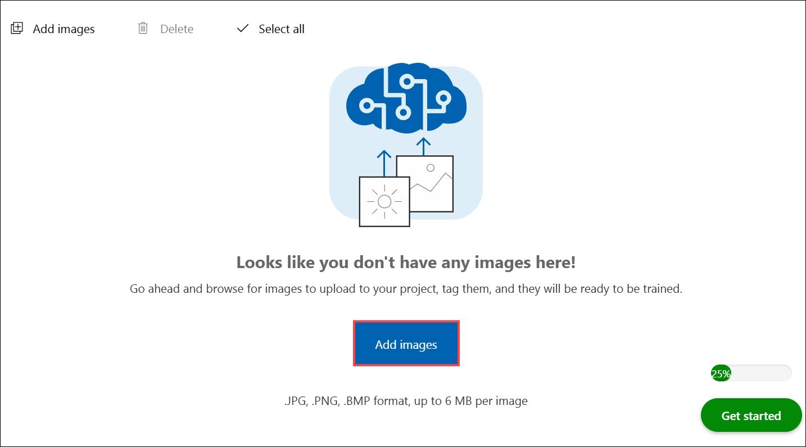

1. In the **Open** window, navigate to **Downloads\training-images**, press **CTRL+A** to select all the images **(1)** and click **Open (2)**.  

    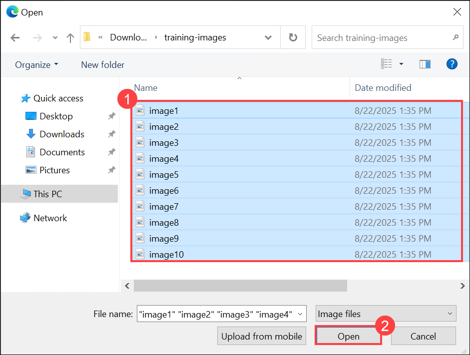

1. On the **Image upload** preview screen, review the selected images and click **Upload 10 files**.  

    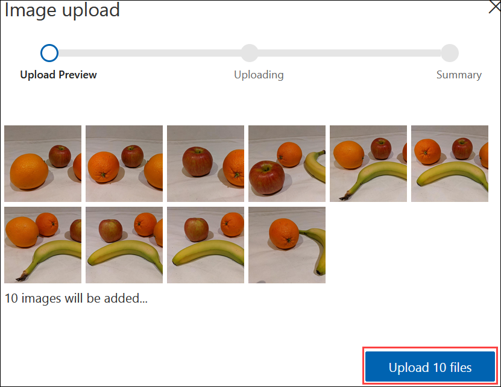

1. Once the upload is complete, a confirmation message appears. Click **Done** to finish.  

    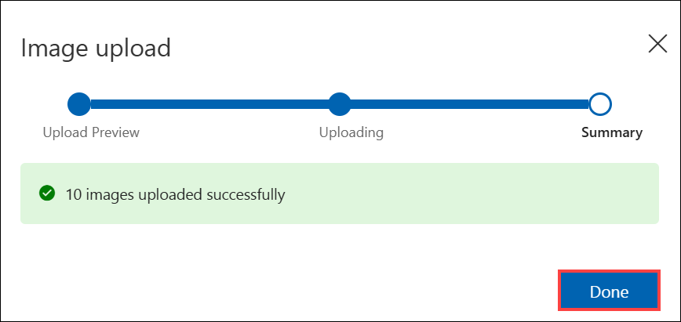

1. After the images have been uploaded, select the first one to open it.

1. Hold the mouse over any object in the image until an automatically detected region is displayed like the image below. Then select the object, and if necessary resize the region to surround it.

    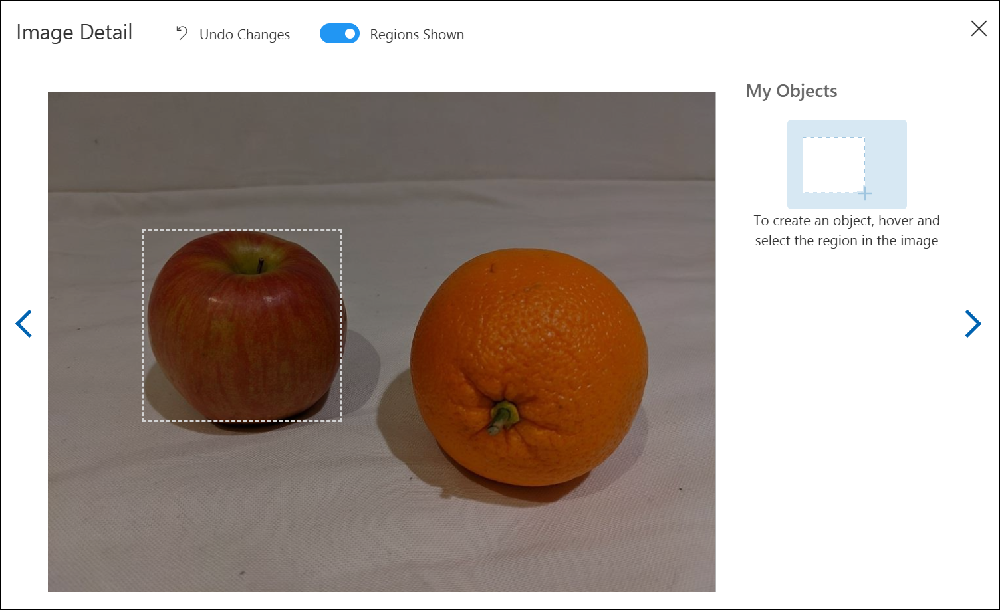

1. Alternatively, On the **Image Detail** page, drag around the object to create a region **(1)** and then add a tag with the object name, such as **apple (2)**.  

    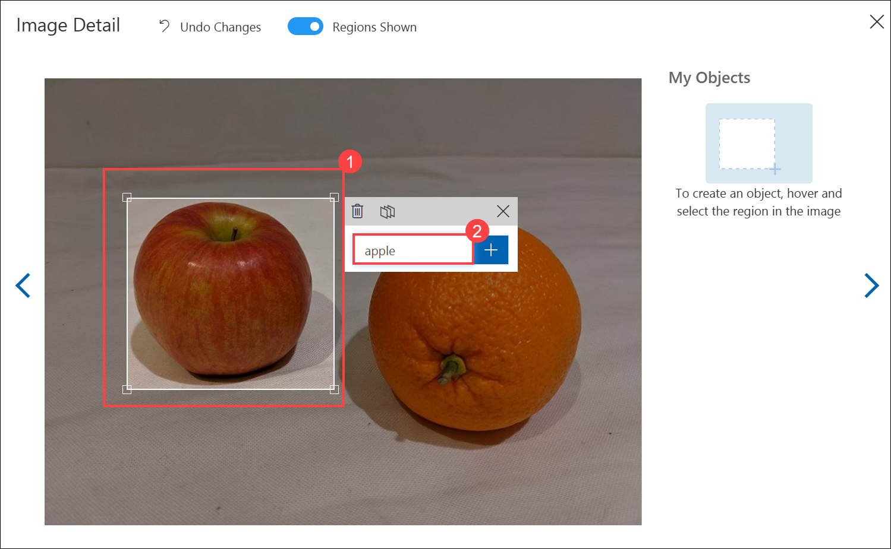

1. When the region surrounds the object, add a new tag with the appropriate object type (**apple**, **banana**, or **orange**) as shown here:

    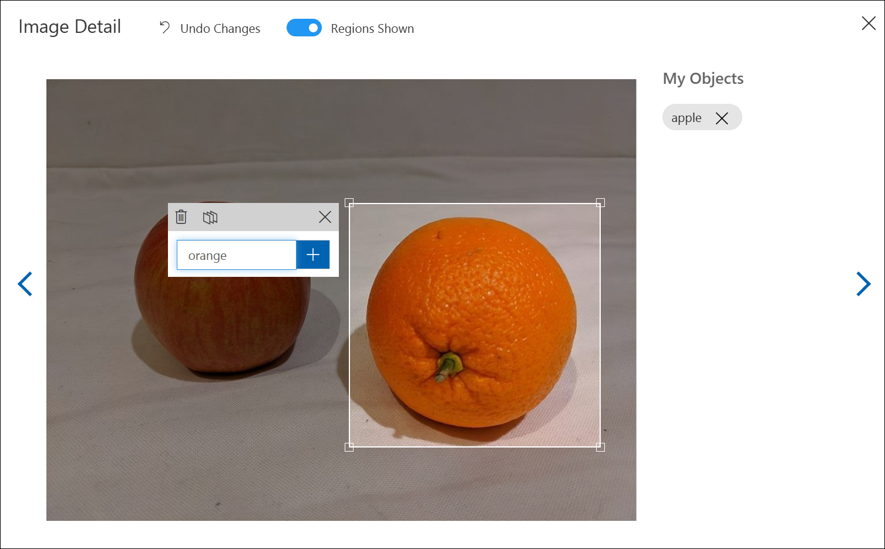

1. On the **Image Detail** page, select and tag each object by resizing the regions and adding tags, then click the **>** icon to move through and do this for all the images, tagging apple, banana, and orange.  

    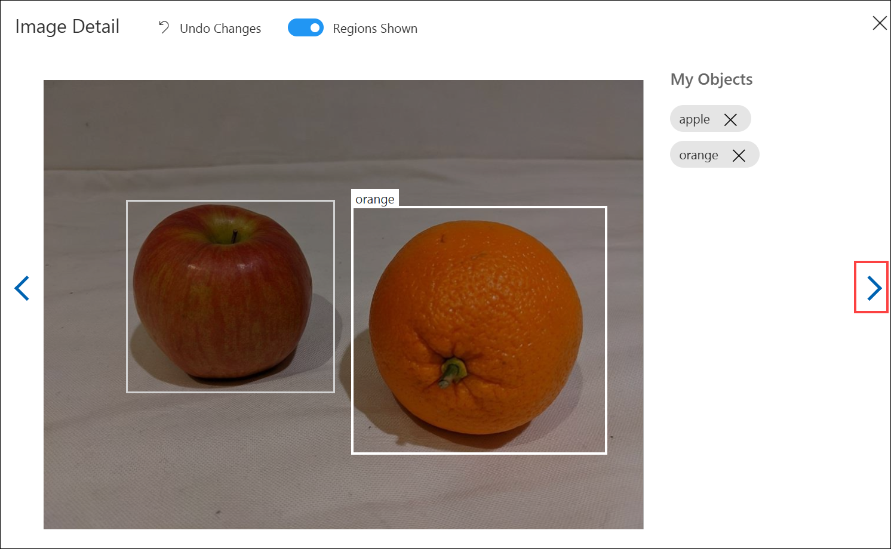
   
1. When you have finished tagging the last image, close the **Image Detail** editor. On the **Training Images** page, under **Tags**, select **Tagged** to see all of your tagged images:

    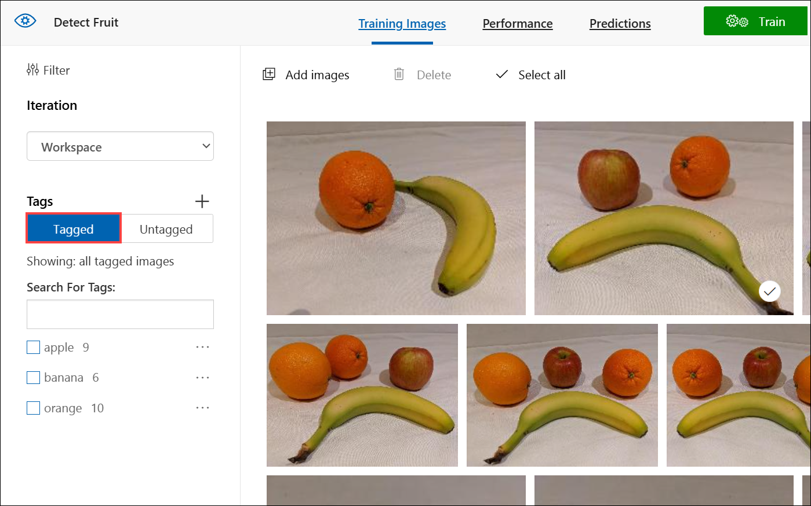

## Task 4: Use the Custom Vision SDK to upload images

In this task, you’ll switch to Azure Cloud Shell and use the Custom Vision Training SDK to programmatically upload images and region annotations from a JSON file. You’ll configure the SDK with your training endpoint, key, and project ID to automate data ingestion.

1. On the **Training Images** page in the Custom Vision portal, click the **settings** (&#9881;) icon at the top right to view the project settings.  

     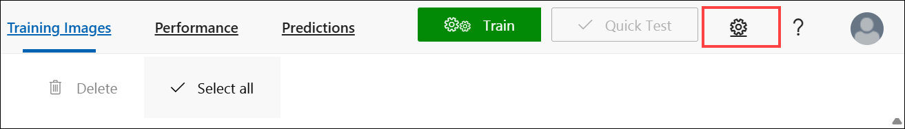

1. Under **General** (on the left), note the **Project Id (1)** that uniquely identifies this project (Copy to Notepad for later use).
 
1. On the right, under **Resources**, copy the **Key** and **Endpoint (2)** values to a Notepad file for later use. These are the details for the **training** resource.  

    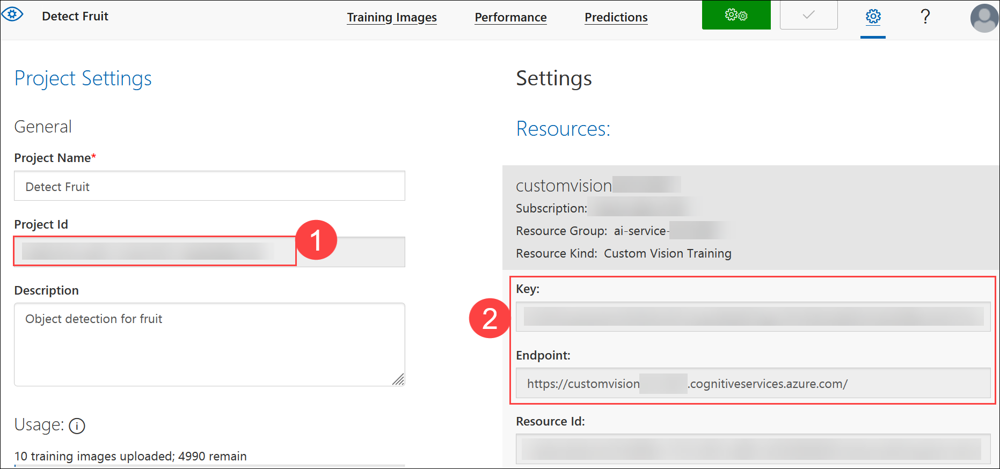

      > **Note:** You can also obtain this information in the Azure portal by navigating to **Keys and Endpoint (1)**, where you will find **Key 1 (2)**, and the **Endpoint (4)**.  

      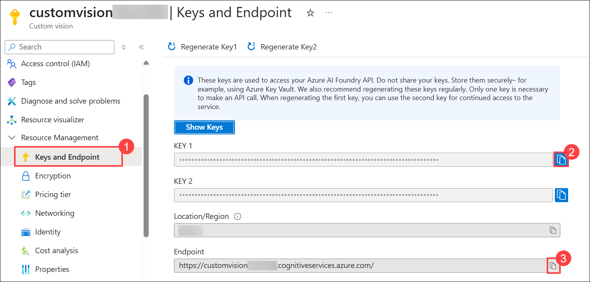

1. Return to the browser tab containing the Azure portal (keeping the Custom Vision portal tab open you'll return to it later).

1. Use the **[>_]** button located to the right of the **Copilot** tab at the top of the page, to create a new **Cloud Shell** in the Azure portal.

     

1. This opens a new Cloud Shell session. In the **Welcome to Azure Cloud Shell** window, choose **PowerShell**.

    

    > **Note**: If you have previously created a cloud shell that uses a **Bash** environment, switch it to **PowerShell**.

1. In the **Getting started** window, ensure **No storage account required (1)** is selected. From the **Subscription** drop-down, choose **Default subscription (2)**, then click **Apply (3)**.

    

1. In the Cloud Shell toolbar, open the **Settings (1)** menu and choose **Go to Classic version (2)** from the drop-down.

    

    >**Note:** **<font color="black">Ensure you've switched to the classic version of the cloud shell before continuing.</font>**

1. In the cloud shell pane, enter the following commands to clone the GitHub repo containing the code files for this exercise (type the command, or copy it to the clipboard and then right-click in the command line and paste as plain text):

    ```
    rm -r mslearn-ai-vision -f
    git clone https://github.com/MicrosoftLearning/mslearn-ai-vision
    ```

    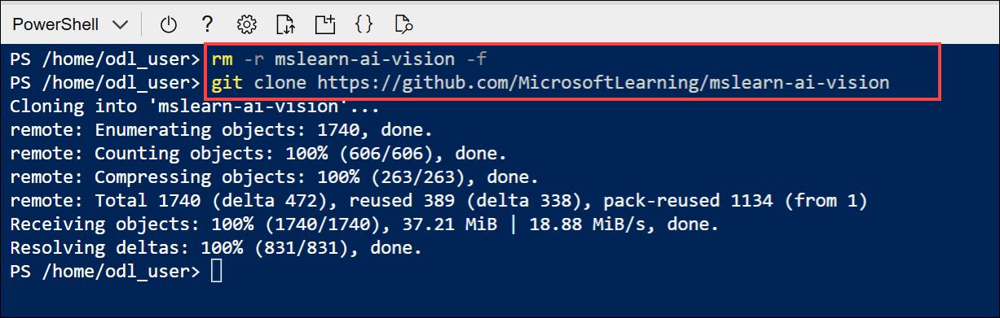

    > **Tip**: As you paste commands into the cloudshell, the ouput may take up a large amount of the screen buffer. You can clear the screen by entering the `cls` command to make it easier to focus on each task.

1. After the repo has been cloned, use the following command to navigate to the application code files:

    ```
   cd mslearn-ai-vision/Labfiles/object-detection/python/train-detector
   ls -a -l
    ```
    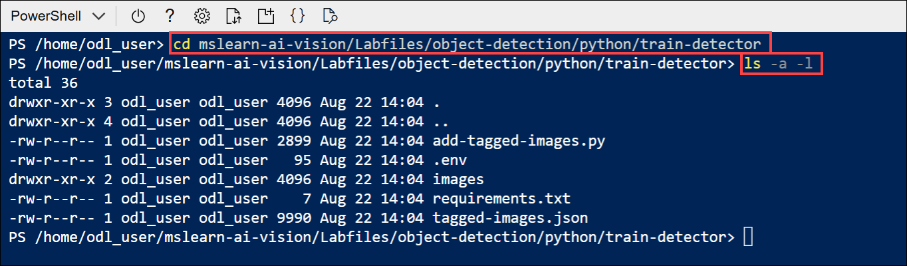

    > **Note:** The folder contains application configuration and code files for your app. It also contains a **tagged-images.json** file which contains bounding box coordinates for objects in multiple images, and an **/images** subfolder, which contains the images.

1. Install the Azure AI Custom Vision SDK package for training and any other required packages by running the following commands:

    ```
   python -m venv labenv
   ./labenv/bin/Activate.ps1
   pip install -r requirements.txt azure-cognitiveservices-vision-customvision
    ```

1. Enter the following command to edit the configuration file for your app. The file is opened in a code editor.

    ```
   code .env
    ```

    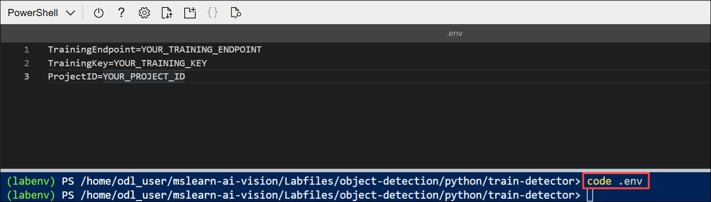

1. In the code file, update the configuration values it contains to reflect the **Endpoint** and an authentication **Key** for your Custom Vision **training** resource, and the **Project ID** for the custom vision project you created previously.

    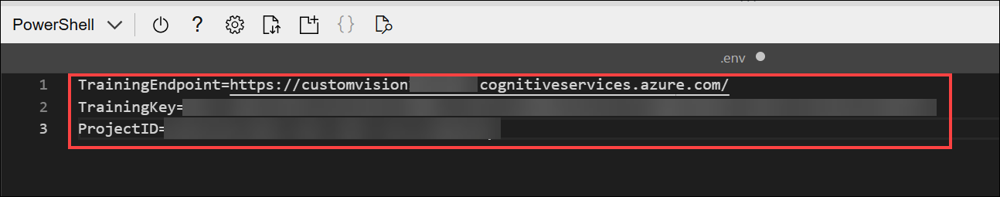

1. After you've replaced the placeholders, within the code editor, use the **CTRL+S** command to save your changes and then use the **CTRL+Q** command to close the code editor while keeping the cloud shell command line open.

1. In the cloud shell command line, enter the following command to open the **tagged-images.json** file to see the tagging information for the image files in the **/images** subfolder:

    ```
   code tagged-images.json
    ```

    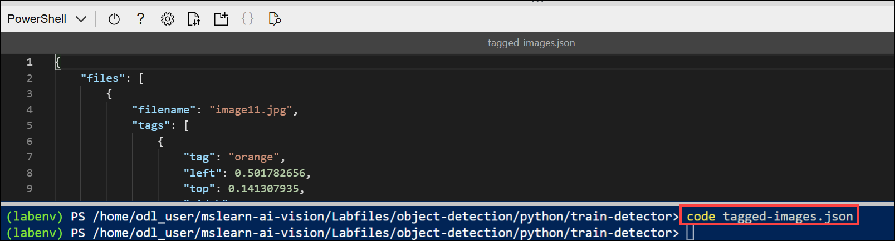

    JSON defines a list of images, each containing one or more tagged regions. Each tagged region includes a tag name, and the top and left coordinates and width and height dimensions of the bounding box containing the tagged object.

    > **Note**: The coordinates and dimensions in this file indicate relative points on the image. For example, a **height** value of 0.7 indicates a box that is 70% of the height of the image. Some tagging tools generate other formats of file in which the coordinate and dimension values represent pixels, inches, or other units of measurements.

1. Close the JSON file without saving any changes (**CTRL_Q**).

1. In the cloud shell command line, enter the following command to open the code file for the client application:

    ```
   code add-tagged-images.py
    ```

     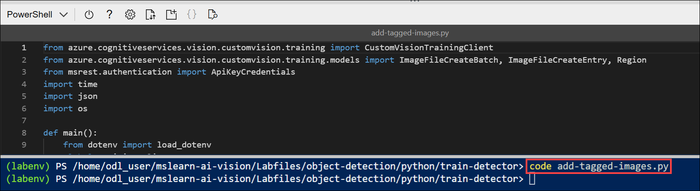

1. Note the following details in the code file:
    - The namespaces for the Azure AI Custom Vision SDK are imported.
    - The **Main** function retrieves the configuration settings, and uses the key and endpoint to create an authenticated **CustomVisionTrainingClient**, which is then used with the project ID to create a **Project** reference to your project.
    - The **Upload_Images** function extracts the tagged region information from the JSON file and uses it to create a batch of images with regions, which it then uploads to the project.

1. Close the code editor (**CTRL+Q**) and enter the following command to run the program:

    ```
   python add-tagged-images.py
    ```

1. Wait for the program to end.

    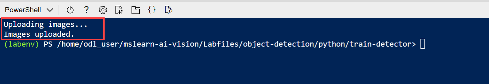

1. Switch back to the browser tab containing the Custom Vision portal (keeping the Azure portal cloud shell tab open), and view the **Training Images** page for your project (refreshing the browser if necessary). Verify that some new tagged images have been added to the project.

    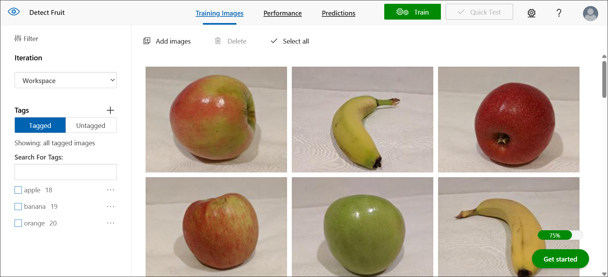

    > **Note:** Make sure You are in **Training Images** page

## Task 5: Train and test a model

In this task, you’ll run a Quick Training to create a new iteration of your object detection model and then review performance metrics (Precision, Recall, mAP). You’ll validate the model with Quick Test to see predicted boxes and labels on a sample image.

1. In the Custom Vision project, click **Train** (&#9881;<sub>&#9881;</sub>) to train an object detection model using the tagged images. Select the **Quick Training** option and then wait for the training iteration to complete (this may take a minute or so).

     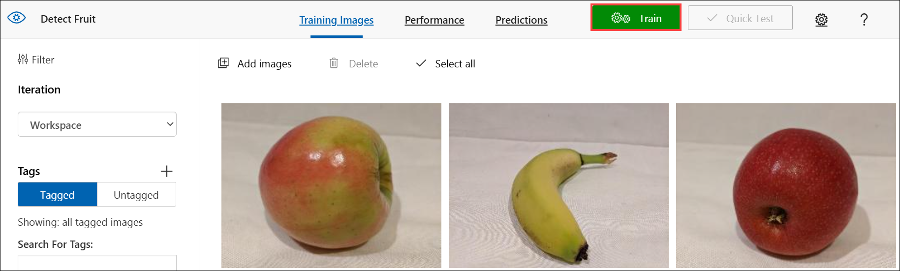

     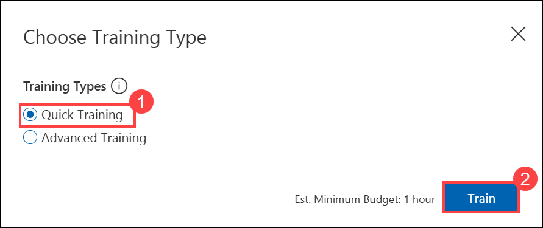

     > **Tip**: The Azure cloud shell has a 20-minute inactivity timeout, after which the session is abandoned. While you wait for training to finish, occassionally return to the cloud shell and enter a colland like `ls` to keep the session active.

1. In the Custom Vision portal, when training has finished, review the *Precision*, *Recall*, and *mAP* performance metrics - these measure the prediction accuracy of the object detection model, and should all be high.

     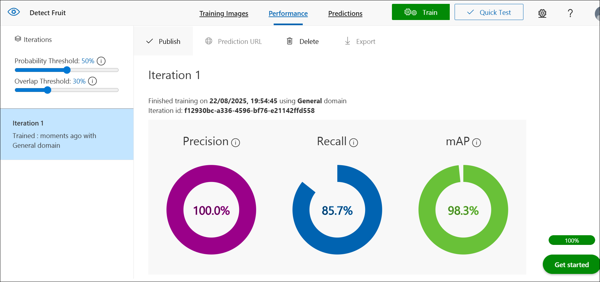

1. At the top right of the page, click **Quick Test**, and then in the **Image URL** box, type `https://aka.ms/test-fruit` **(1)** and click the **quick test image** (&#10132;) **(2)** button.

     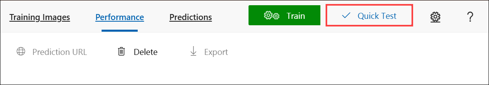

     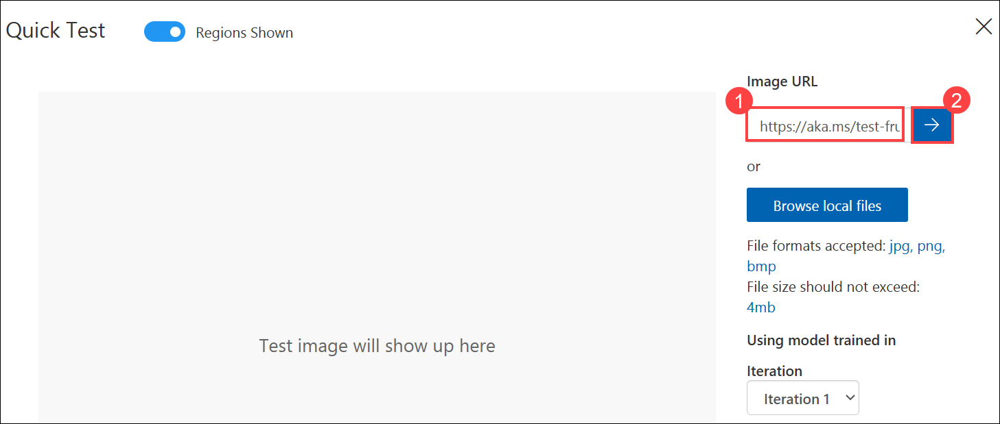

1. View the prediction that is generated.

    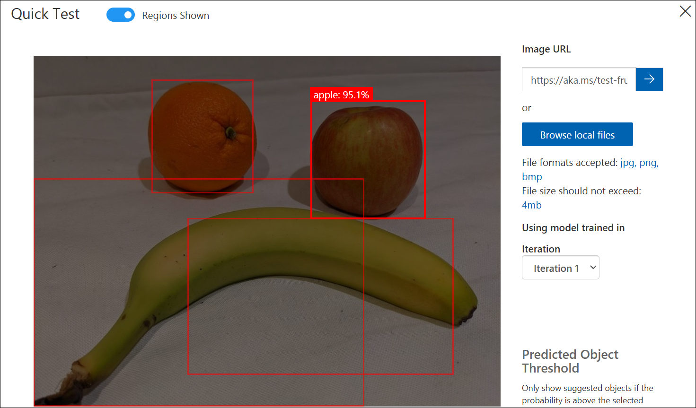

1. Close the **Quick Test** window.

## Task 6: Publish the object detection model

In this task, you’ll publish the best-trained iteration (e.g., fruit-detector) to your Prediction resource. You’ll capture the prediction endpoint and key so external apps can call the hosted model.

1. In the Custom Vision portal, on the **Performance** page,  click **&#128504; Publish** to publish the trained model.
 
    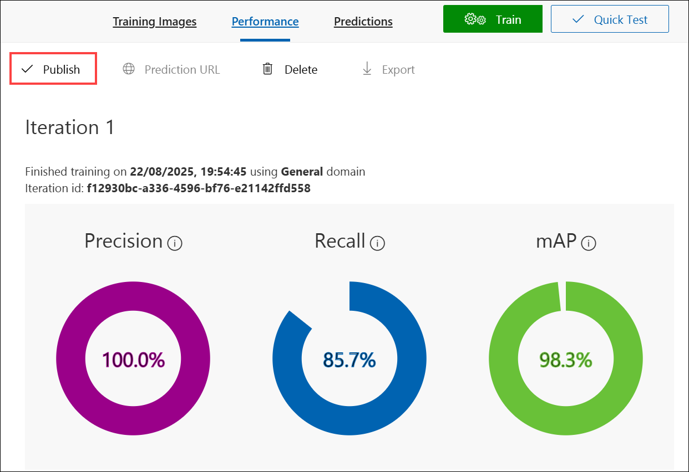
    
1. On the **Publish Model** window, enter the following details:     
    - **Model name**: `fruit-detector` **(1)**
    - **Prediction Resource**: Select **customvision<inject key="DeploymentID"></inject>-Prediction (2)**
    - Click **Publish (3)**

       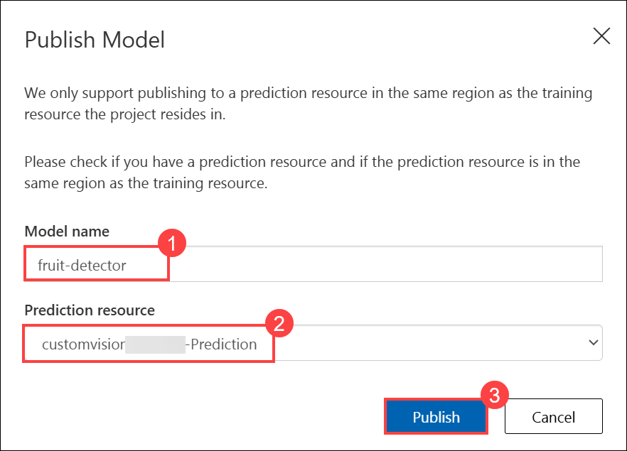

1. At the top left of the **Project Settings** page, click the **Projects Gallery** (&#128065;) icon to return to the Custom Vision portal home page, where your project is now listed.

    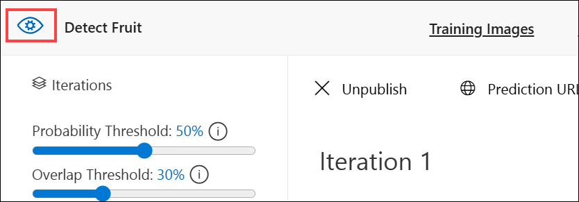

1. On the Custom Vision portal home page, at the top right, click the **settings** (&#9881;) icon to view the settings for your Custom Vision service.  

    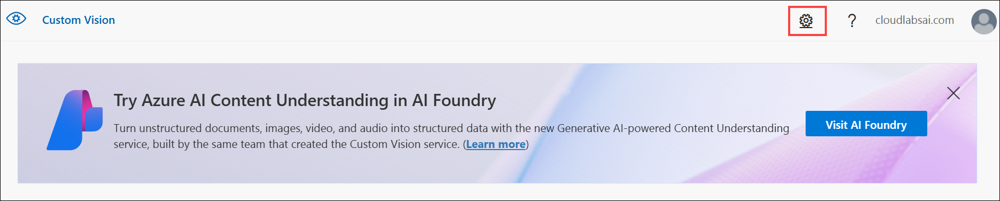

1. Under **Resources**, click on **customvision<inject key="DeploymentID"></inject>-Prediction (1)**, then copy the **Key (2)** and **Endpoint (3)** values to a Notepad file for later use.  

     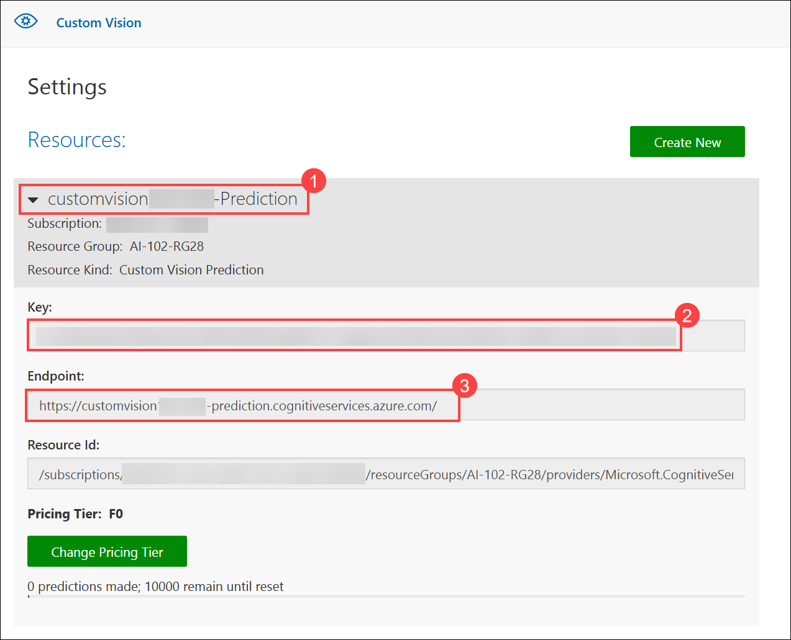

     > **Note:** You can also obtain this information by viewing the resource in the Azure portal. Navigate to **Keys and Endpoint (1)**, then copy **Key 1 (2)**, and the **Endpoint (3)**.  

     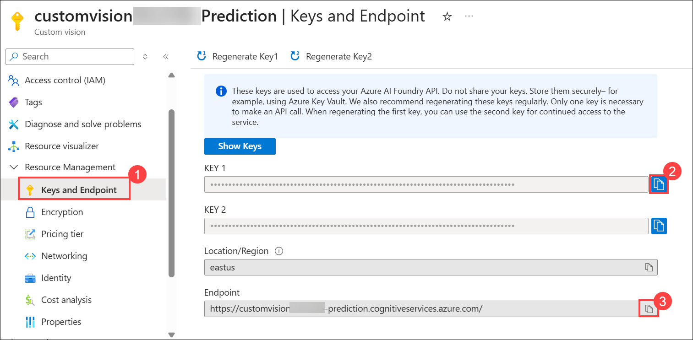

## Task 7: Use the image classifier from a client application

In this task, you’ll configure a lightweight Python client to call the prediction endpoint with a test image. You’ll parse predictions, draw bounding boxes with labels and confidence scores, and save an annotated output image to demonstrate end-to-end inference.

1. Return to the browser tab containing the Azure portal and the cloud shell pane.

1. In cloud shell, run the following commands to switch to the folder for you client application and view the files it contains:

    ```
   cd ../test-detector
   ls -a -l
    ```

    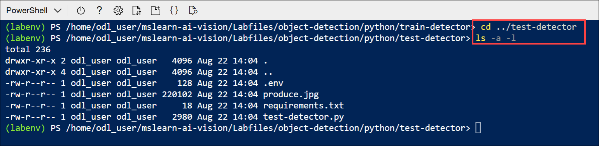

    > **Note:** The folder contains application configuration and code files for your app. It also contains the following **produce.jpg** image file, which you'll use to test your model.

     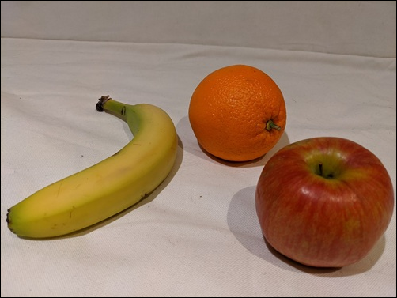

1. Install the Azure AI Custom Vision SDK package for prediction and any other required packages by running the following commands:

    ```
   python -m venv labenv
   ./labenv/bin/Activate.ps1
   pip install -r requirements.txt azure-cognitiveservices-vision-customvision
    ```

1. Enter the following command to edit the configuration file for your app. The file is opened in a code editor.

    ```
   code .env
    ```
 
    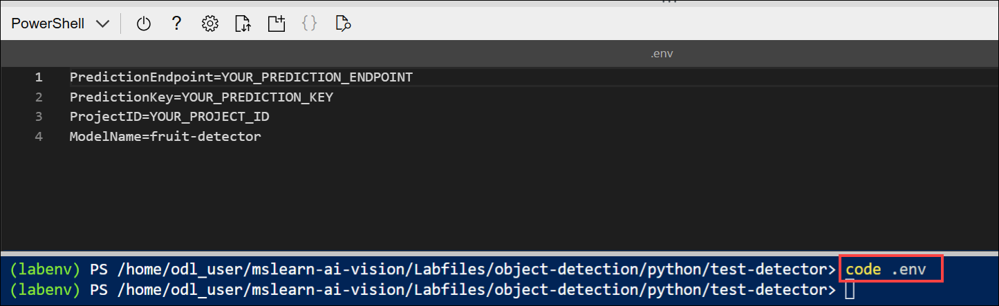

1. Update the configuration values with the **Endpoint** and **Key** you recently copied for your Custom Vision **prediction** resource, along with the **Project ID** for the object detection project and the name of your published model (which should be **fruit-detector**)  

     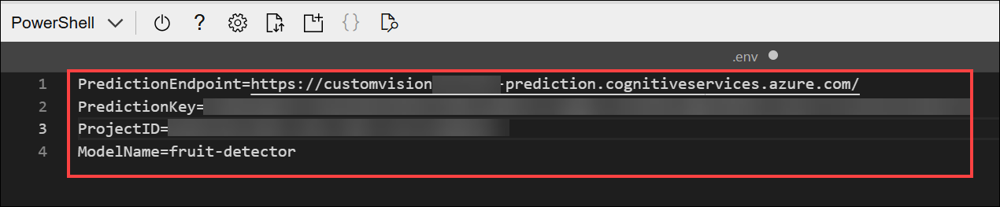

1. Save your changes using **CTRL+S** and close the code editor using **CTRL+Q**.  

1. In the cloud shell command line, enter the following command to open the code file for the client application:

    ```
   code test-detector.py
    ```

    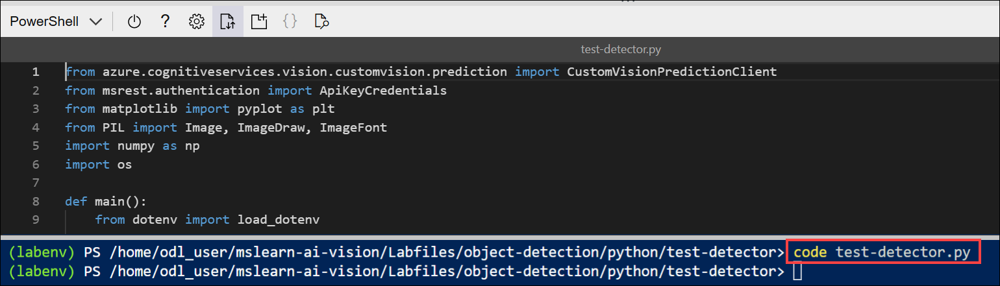

1. Review the code, noting the following details:
    - The namespaces for the Azure AI Custom Vision SDK are imported.
    - The **Main** function retrieves the configuration settings, and uses the key and endpoint to create an authenticated **CustomVisionPredictionClient**.
    - The prediction client object is used to get object detection predictions for the **produce.jpg** image, specifying the project ID and model name in the request. The predicted tagged regions are then drawn on the image, and the result is saved as **output.jpg**.

1. Close the code editor and enter the following command to run the program:

    ```
   python test-detector.py
    ```
    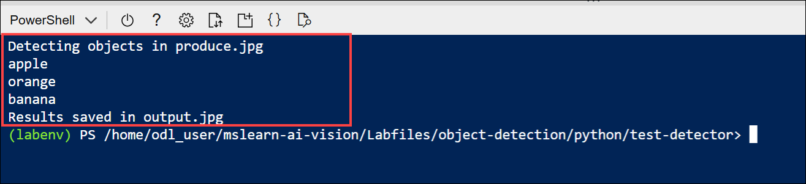
  
1. Review the program output, which lists each object detected in the image.

1. Note that an image file named **output.jpg** is generated. Use the (Azure cloud shell-specific) **download** command to download it:

    ```
   download output.jpg
    ```
1. The download command creates a popup link at the bottom right of your browser, click **Click here to download your file (2)** to download and open it. 

    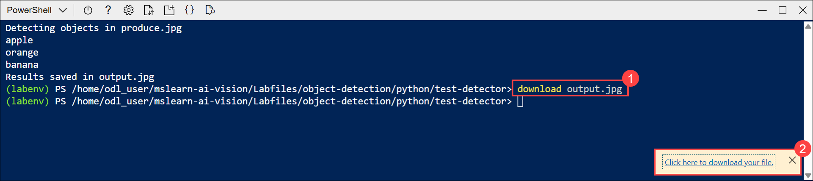

1. The downloaded image should display the detected objects, similar to the example shown below: 

     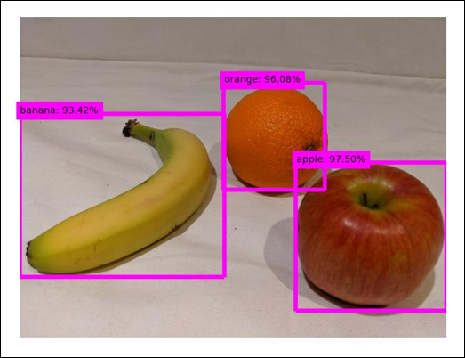

## Summary

In this lab, you built an end-to-end object detection workflow with Azure AI Custom Vision. You provisioned dedicated Training and Prediction resources, created an Object Detection project, prepared data by uploading and tagging images, trained/evaluated a model, published the best iteration, and invoked it from a lightweight Python client to draw bounding boxes on a test image.

## Click on **Next >>** from the lower right corner to move on to the next exercise.

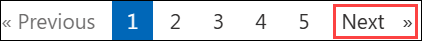