# Lab 04: Translate Text with Azure AI Translator

### Estimated Duration: 60 Minutes

## Lab Overview

In this lab, you will explore Azure AI Translator, a cloud-based service for real-time language translation. You’ll provision an Azure AI Translator resource, configure a Python application in Cloud Shell, and connect it with your Translator resource using keys and region. You will then enhance the app by adding code to detect source languages, select a target language, and translate text interactively. By the end of the lab, you will gain hands-on experience in building multilingual applications using Azure AI Translator.

## Lab Objectives

- Task 1: Provision an Azure AI Translator resource
- Task 2: Prepare to develop an app in Cloud Shell
- Task 3: Configure your application
- Task 4: Add code to translate text

### Task 1: Provision an Azure AI Translator resource

In this task, you will create an Azure AI Translator resource in the Azure portal, configure its basic settings, and retrieve the key and location details required for later steps in the lab.

1. On the Azure portal, search for **Translators (1)** then select **Translators (2)** from the results.

   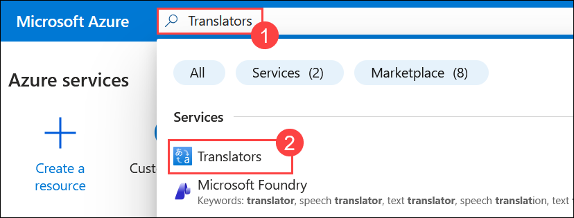  

1. On **Microsoft Foundry | Translator** page, Select **+ Create (2)**.

   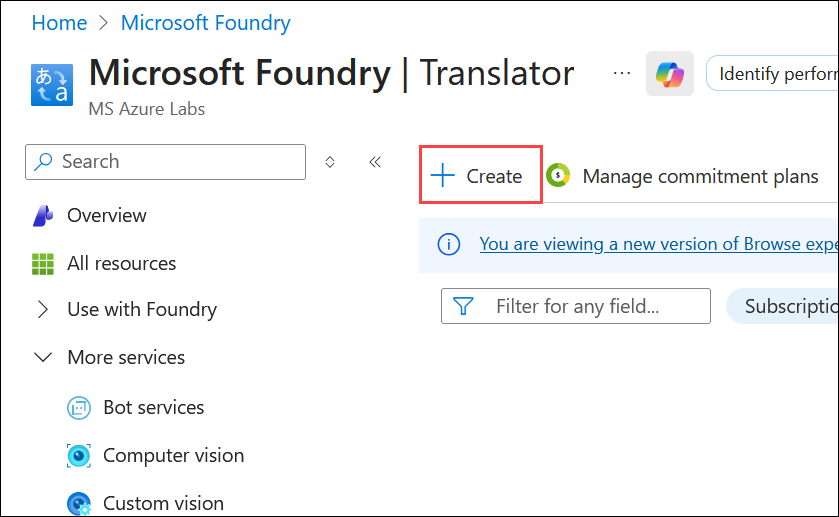 

1. Create a resource with the following settings:

    - **Subscription**: Leave your default Azure subscription **(1)**
    - **Resource group**: Select **ai-service-<inject key="DeploymentID" enableCopy="false"/> (2)**
    - Region: Select **<inject key="Region" enableCopy="false" /> (3)**
    - Name: Enter **Translator<inject key="DeploymentID" enableCopy="false"/> (4)**
    - **Pricing tier**: Select **F0 (5)** (*free*), or **S** (*standard*) if F is not available.
    - Select **Review + create (6)**

      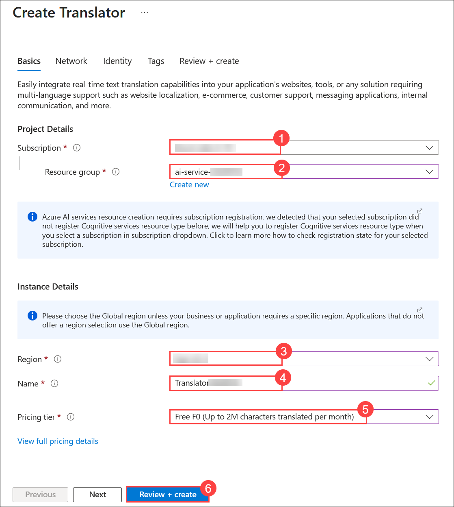      
    
1. Then select **Create** to provision the resource.

    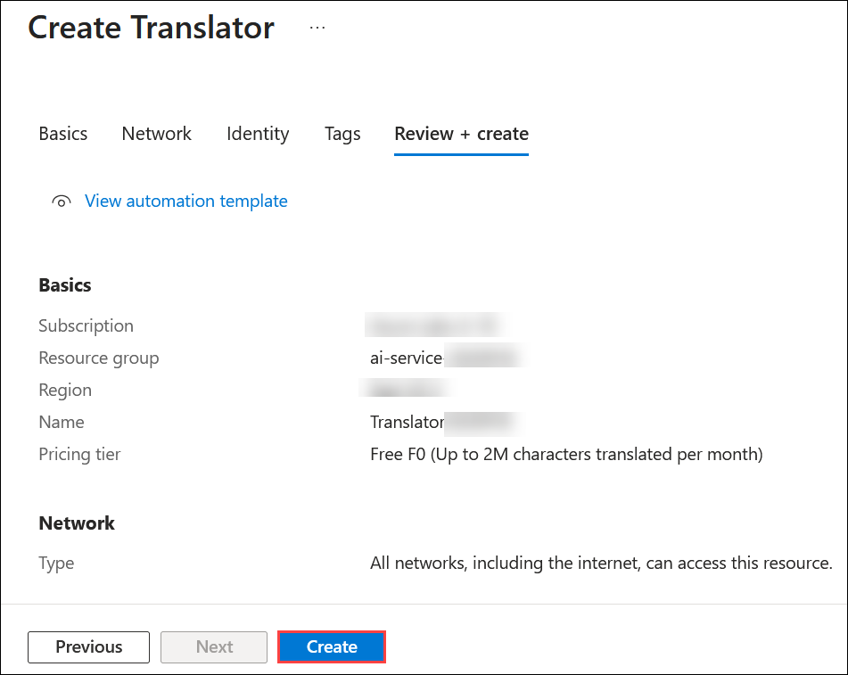 

1. Wait for deployment to complete and select **Go to resource** to go to the resource group.

   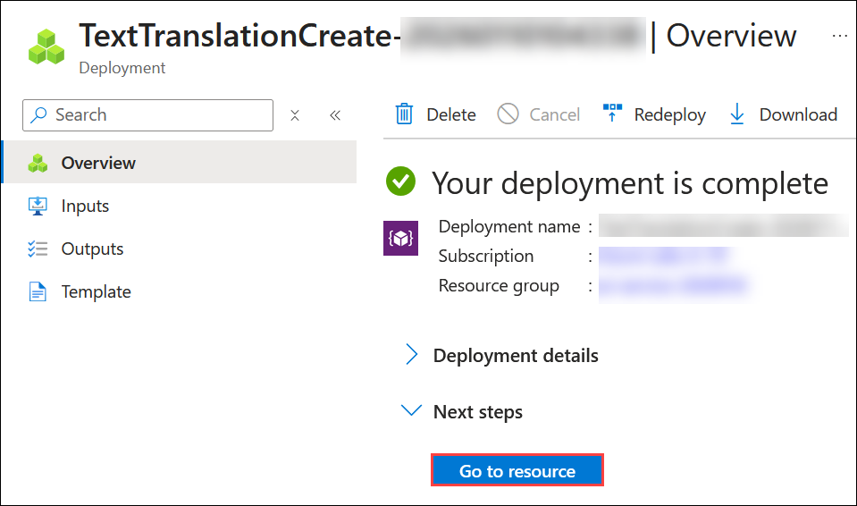  

1. Select the Translator that you have created: **Translator<inject key="DeploymentID" enableCopy="false"/>**.

   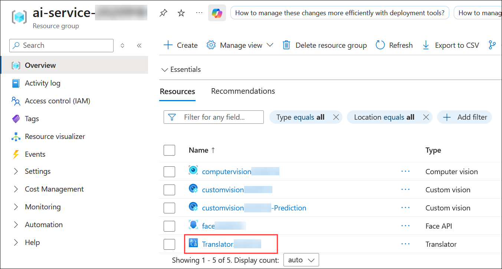   

1. Navigate to the **Keys and Endpoint (1)** page. Copy and paste the **KEY 1 (2)** and **Location (3)**. You will need the information on this page later in the lab.

   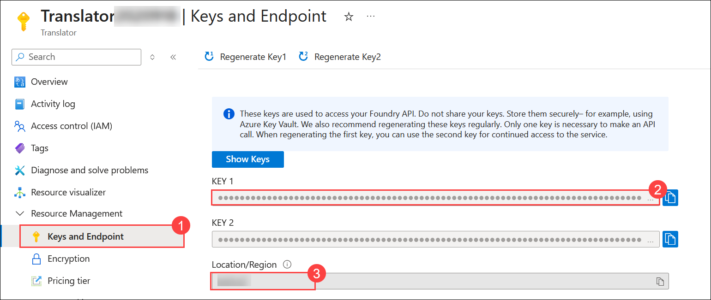 

> **Congratulations** on completing the task! Now, it's time to validate it. Here are the steps:
>
> - Hit the Validate button for the corresponding task. If you receive a success message, you can proceed to the next task.
> - If not, carefully read the error message and retry the step, following the instructions in the lab guide.
> - If you need any assistance, please contact us at cloudlabs-support@spektrasystems.com. We are available 24/7 to help.
 
<validation step="08c05541-8a05-48d1-941a-3236c903629a" />
 
---   


### Task 2: Prepare to develop an app in Cloud Shell

In this task, you will set up Azure Cloud Shell, configure the environment, and clone the GitHub repository that contains the sample code needed to build your text translation application.

1. Use the **[>_]** button located to the right of the **Copilot** tab at the top of the page, to create a new **Cloud Shell** in the Azure portal.

     

    >**Note:** If Cloud Shell is already provisioned (from Lab 01 setup) and shows **Switch to Bash** at the top left of the Cloud Shell pane, you're currently in a **PowerShell** environment. Proceed directly to **Step 4** to switch to the classic version.

    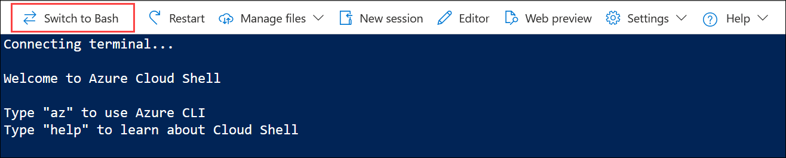

1. This opens a new Cloud Shell session. In the **Welcome to Azure Cloud Shell** window, choose **PowerShell**.

     

1. In the **Getting started** window, ensure **No storage account required (1)** is selected. From the **Subscription** drop-down, choose **Default subscription (2)**, then click **Apply (3)**.

       

1. In the cloud shell toolbar, in the **Settings (1)** menu, select **Go to Classic version (2)** (this is required to use the code editor).

    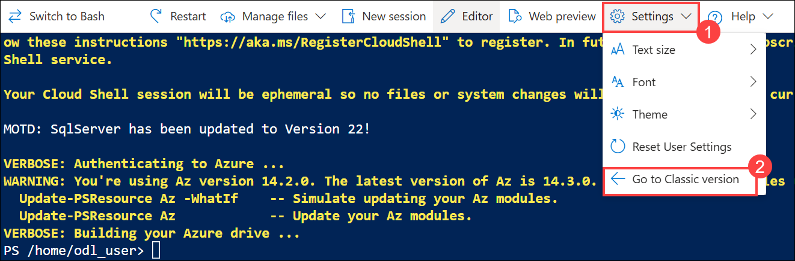

     >**Note**: The cloud shell provides a command-line interface in a pane at the bottom of the Azure portal. You can resize or maximize this pane to make it easier to work in.

     >**Note**: Ensure you've switched to the classic version of the cloud shell before continuing.

1. In the PowerShell pane, enter the following commands to clone the GitHub repo for this exercise:

    ```
   rm -r mslearn-ai-language -f
   git clone https://github.com/microsoftlearning/mslearn-ai-language
    ```

     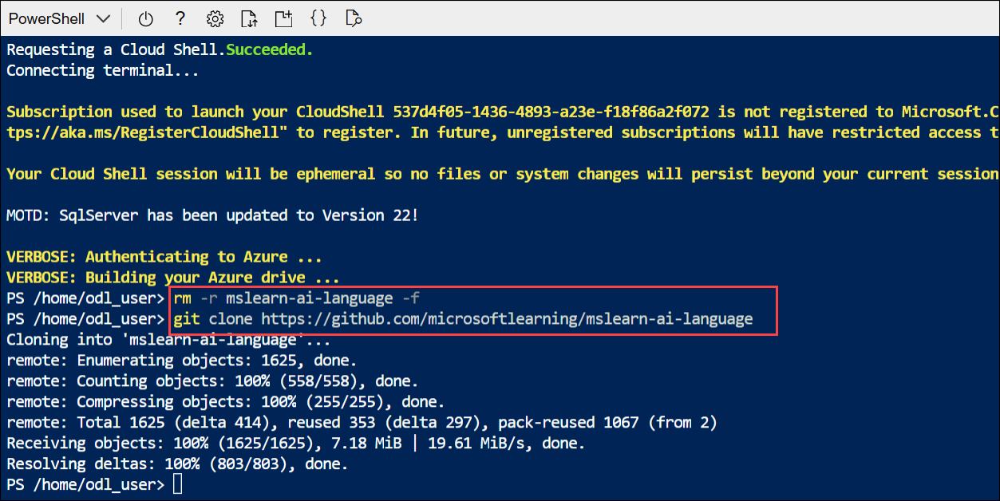

      >**Tip**: As you enter commands into the cloudshell, the output may take up a large amount of the screen buffer. You can clear the screen by entering the `cls` command to make it easier to focus on each task.

1. After the repo has been cloned, navigate to the folder containing the application code files:  

    ```
   cd mslearn-ai-language/Labfiles/06-translator-sdk/Python/translate-text
    ```

### Task 3: Configure your application

In this task, you will set up a Python virtual environment, install the required SDK packages, and update the configuration file with your Translator resource key and region to enable secure connection.

1. In the command line pane, run the following command to view the code files in the **translate-text** folder:

    ```
   ls -a -l
    ```

     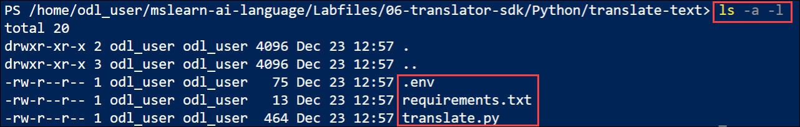 

     The files include a configuration file (**.env**) and a code file (**translate.py**).

1. Create a Python virtual environment and install the Azure AI Translation SDK package and other required packages by running the following command:

    ```
   python -m venv labenv
   ./labenv/bin/Activate.ps1
   pip install -r requirements.txt azure-ai-translation-text==1.0.1
    ```
1. Enter the following command to edit the application configuration file:

    ```
   code .env
    ```

     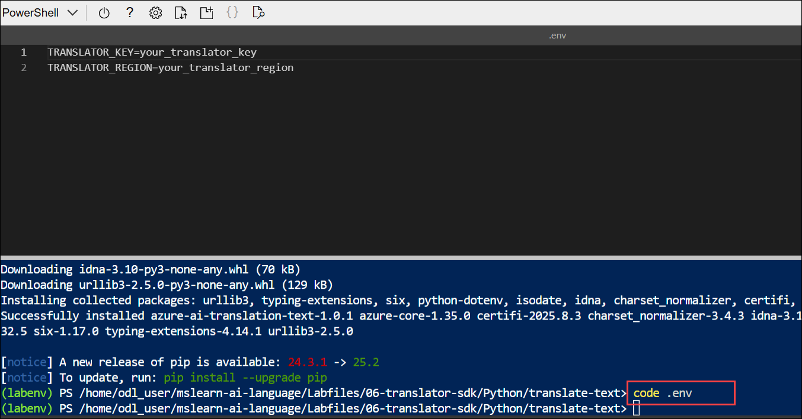

     The file is opened in a code editor.

1. Update the configuration values to include the **key (1)** and a **region (2)** from the Azure AI Translator resource you created (available on the **Keys and Endpoint** page for your Azure AI Translator resource in the Azure portal that you have copied in **Task 1**).

     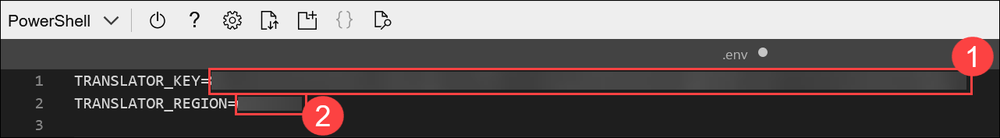 

      > **NOTE**: Be sure to add the *region* for your resource, <u>not</u> the endpoint!

1. After you've replaced the placeholders, within the code editor, use the **CTRL+S** command or **Right-click > Save** to save your changes and then use the **CTRL+Q** command or **Right-click > Quit** to close the code editor while keeping the cloud shell command line open.

### Task 4: Add code to translate text

In this task, you will update the Python application to use the Azure AI Translator SDK, allowing users to select a target language and translate text interactively.

1. Enter the following command to edit the application code file:

    ```
   code translate.py
    ```

1. Review the existing code. You will add code to work with the Azure AI Translation SDK.

    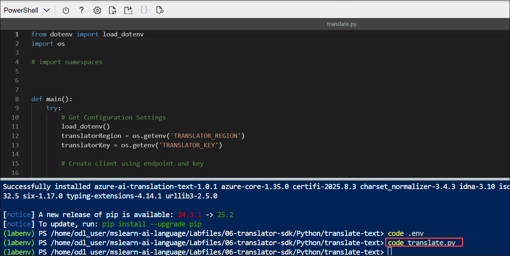

     >**Tip**: As you add code to the code file, be sure to maintain the correct indentation.

1. At the top of the code file, under the existing namespace references, find the comment **Import namespaces** and add the following code to import the namespaces you will need to use the Translation SDK:

    ```python
   # import namespaces
   from azure.core.credentials import AzureKeyCredential
   from azure.ai.translation.text import *
   from azure.ai.translation.text.models import InputTextItem
    ```

     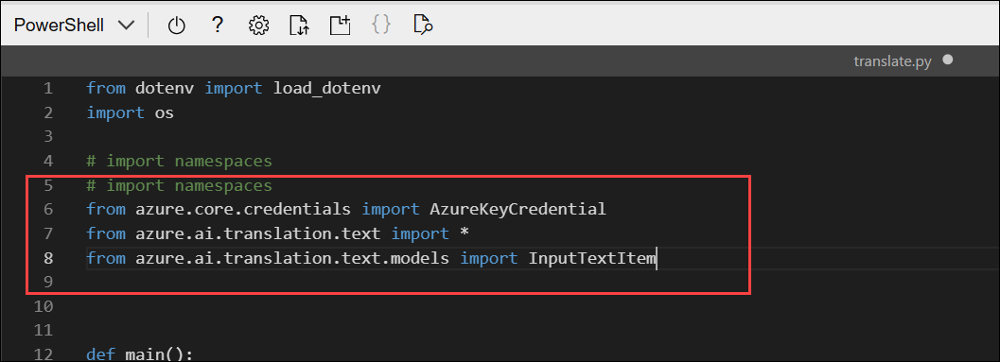  

      >**Tip**: As you add code to the code file, be sure to maintain the correct indentation.       

1. In the **main** function, note that the existing code reads the configuration settings.
1. Find the comment **Create client using endpoint and key** and add the following code:

    ```python
   # Create client using endpoint and key
   credential = AzureKeyCredential(translatorKey)
   client = TextTranslationClient(credential=credential, region=translatorRegion)
    ```

     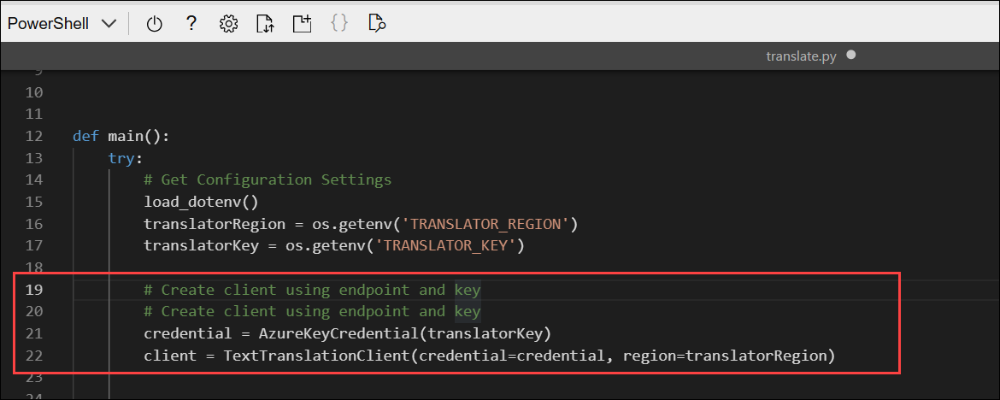    

      >**Tip**: As you add code to the code file, be sure to maintain the correct indentation.        

1. Find the comment **Choose target language** and add the following code, which uses the Text Translator service to return list of supported languages for translation, and prompts the user to select a language code for the target language:

    ```python
   # Choose target language
   languagesResponse = client.get_supported_languages(scope="translation")
   print("{} languages supported.".format(len(languagesResponse.translation)))
   print("(See https://learn.microsoft.com/azure/ai-services/translator/language-support#translation)")
   print("Enter a target language code for translation (for example, 'en'):")
   targetLanguage = "xx"
   supportedLanguage = False
   while supportedLanguage == False:
        targetLanguage = input()
        if  targetLanguage in languagesResponse.translation.keys():
            supportedLanguage = True
        else:
            print("{} is not a supported language.".format(targetLanguage))
    ```

     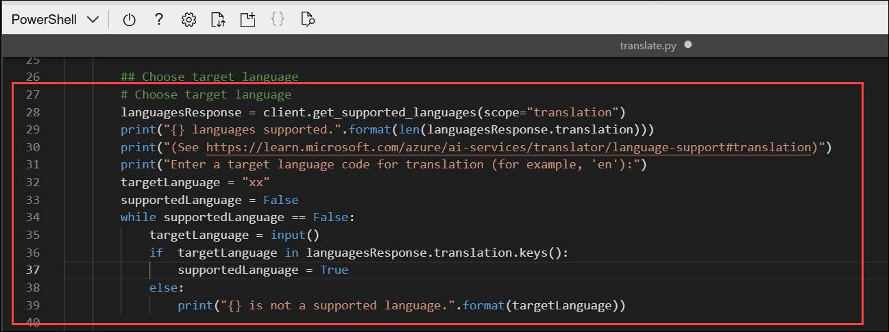 

      >**Tip**: As you add code to the code file, be sure to maintain the correct indentation.       

1. Find the comment **Translate text** and add the following code, which repeatedly prompts the user for text to be translated, uses the Azure AI Translator service to translate it to the target language (detecting the source language automatically), and displays the results until the user enters *quit*:

    ```python
   # Translate text
   inputText = ""
   while inputText.lower() != "quit":
        inputText = input("Enter text to translate ('quit' to exit):")
        if inputText != "quit":
            input_text_elements = [InputTextItem(text=inputText)]
            translationResponse = client.translate(body=input_text_elements, to_language=[targetLanguage])
            translation = translationResponse[0] if translationResponse else None
            if translation:
                sourceLanguage = translation.detected_language
                for translated_text in translation.translations:
                    print(f"'{inputText}' was translated from {sourceLanguage.language} to {translated_text.to} as '{translated_text.text}'.")
    ```

     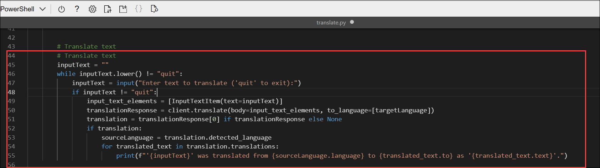 

      >**Tip**: As you add code to the code file, be sure to maintain the correct indentation. 

1. Save your changes using **CTRL+S**.

1. Then enter the following command to run the program (you maximize the cloud shell pane and resize the panels to see more text in the command line pane):

    ```
   python translate.py
    ```

     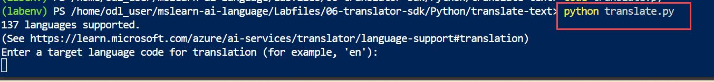     

1. When prompted, enter a valid target language from the list displayed (for example `en`, `fr`).

    - Let's provide `en` as a target language **(1)**
    - Enter `C'est un test` as a phrase to be translated **(2)**
    - View the results, which should detect the source language and translate the text to the target language **(3)**

      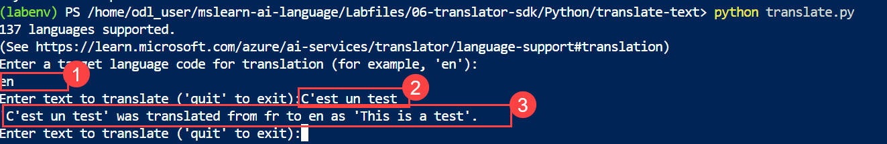 

      **Here source language is French and it translated the text to the target language English**.

1. Press **Ctrl+C** to navigate back to the directory.

1. Enter the following command to run the program again **(1)**

    ```
   python translate.py
    ```

    - Lets provide `fr` as a target language **(2)**
    - Enter `This is a test` as a phrase to be translated **(3)**
    - View the results, which should detect the source language and translate the text to the target language **(4)**

      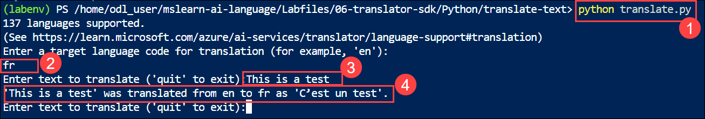 

      **Here source language is English and it translated the text to the target language French**.
    
1. When you're done, enter `quit`. You can run the application again and choose a different target language.    

### Summary

In this lab, you provisioned an Azure AI Translator resource and configured it for use. You prepared a development environment in Azure Cloud Shell, set up configuration files, and updated a Python application with the Azure AI Translator SDK. You then ran the app to translate text between multiple languages, gaining hands-on experience with building and testing a translation solution using Azure AI Translator.

### You have successfully completed the Hands-on Lab!

### Conclusion


This lab provided hands-on experience with key **Azure AI services**, enabling participants to integrate **image analysis, object detection, face recognition, and text translation** into applications. By leveraging these services, you have learned how to quickly build scalable, AI-powered solutions to solve real-world problems with minimal complexity.
